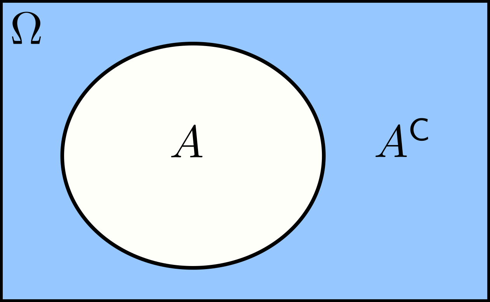
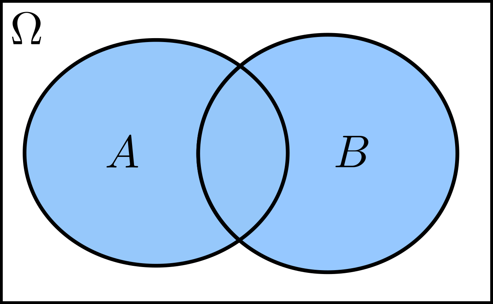
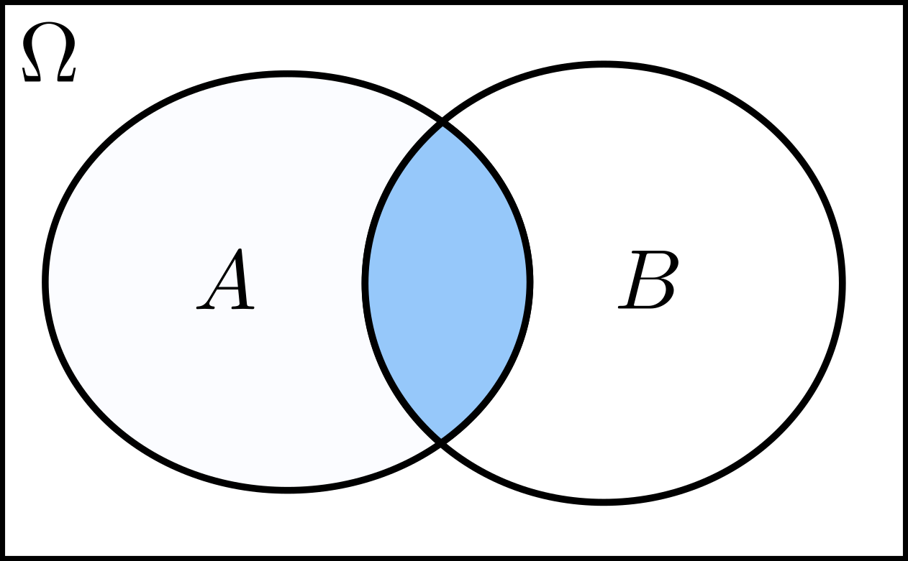

# Sets and Functions

## Basic Set Theory

A **set** is simply a collection of ***distinct*** elements. We usually denote a set by parentheses, $\{\cdots\}$. It can have a ***finite*** number of elements or it can be ***infinite***. It can also be ***countable*** or ***uncountable***.

### Empty and Universal Sets
A set that has *no elements* is called an **empty set** and we will denote it by $\varnothing$. On the other hand, a set that contains *everything* is called **universal set** which we will denote by $\Omega$.

### Complement Set
The **complement** of a set $A$, denoted by $A^\mathsf{C}$, is the set of elements *not belonging to* $A$ but are *in the universal set*. Mathematically,

$$A^\mathsf{C}=\{a\in\Omega: a\notin A\}.$$

The complement of the universal set $\Omega$ is the empty set $\varnothing$, i.e., $\Omega^\mathsf{C}=\varnothing$. Moreover, the complement of the complement of a set $A$ is the set itself, i.e., $(A^\mathsf{C})^\mathsf{C}=A$. The figure below shows the complement of $A$ as the shaded region.

  { width="250" .center }

### Union

The **union** of two sets, $A$ and $B$, is the set of elements that are in $A$ **or** $B$. We denote this by $\cup$, i.e.,

$$A\cup B=\{c\in\Omega:c\in A\;\text{or}\;c\in B\}.$$

The shaded region in the figure below shows the union of $A$ and $B$. Note that it includes elements that are in ***both*** $A$ and $B$.

  { width="250" .center }

### Intersection

The **intersection** of $A$ and $B$ is the set of elements that are in $A$ **and** $B$. We denote this with $\cap$, i.e.,

$$A\cap B=\{c\in\Omega:c\in A\;\text{and}\;c\in B\}.$$

The shaded region in the following figure shows the intersection of $A$ and $B$.

  { width="250" .center }

We say that two sets, $A$ and $B$, are **disjoint** or **mutually exclusive** whenever their intersection is the empty set, i.e., $A\cap B=\varnothing$.

### Set Properties

Here are a few interesting properties of sets.

|------|------|------|
| $A\cup B=B\cup A$ | | $A\cap A^\mathsf{C}=\varnothing$ |
| $A\cup\Omega=\Omega$ | | $A\cap\Omega=A$ |
| $A\cap (B\cup C)=(A\cap B)\cup (A\cup C)$ | | $A\cup (B\cup C)=(A\cup B)\cup C$ |

### de Morgan's Laws

The first of de Morgan's laws states that the complement of the union of sets is equal to the intersection of their complements:

$$\left(\bigcup_{n}S_n\right)^{\!\mathsf{C}}=\bigcap_{n}\left(S_n\right)^{\mathsf{C}}.$$

The symbol $\bigcup$ means we have to take the union of all the sets $S_n$ while $\bigcap$ means we have to take the intersection of all the sets.

The second law states that the complement of the intersection of sets is equal to the union of their complements:

$$\left(\bigcap_{n}S_n\right)^{\!\mathsf{C}}=\bigcup_{n}\,(S_n)^\mathsf{C}.$$

!!! warning "Draft"
    A section on functions — mappings between sets, images, and inverses — is planned but not yet written.
