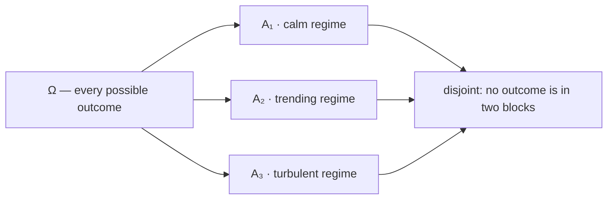
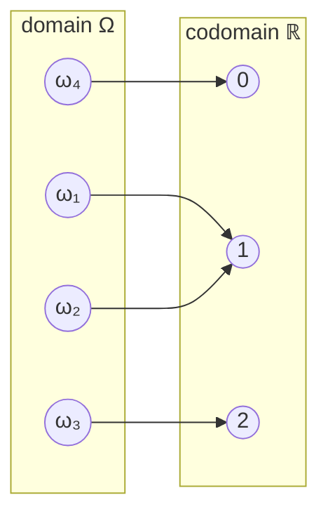

# Sets and Functions

Probability is set theory with a measure attached. An *event* — "the market closed up", "the strategy lost more than 5%", "at least one of these three signals fired" — is a subset of the space of possible outcomes, and the words joining events together are set operations wearing English clothing: **or** is union, **and** is intersection, **not** is complement. Every rule in [Probability Axioms](../part-02-probability-foundations/02-probability-axioms.md) is a statement about how a measure behaves under those three operations, so the algebra has to come first.

The second half of this page is about functions, for a reason that is easy to miss. A random variable is not a variable at all; it is a *function* from outcomes to numbers, and the notation $\mathbf{P}(X\le x)$ is shorthand for the probability of a set that the function pulls back from the real line. Once that is clear, [Random Variables](../part-03-random-variables/01-random-variables.md) and [CDFs](../part-03-random-variables/02-cumulative-distribution-functions.md) stop looking like new machinery and start looking like the same machinery, addressed differently.

## Sets

A **set** is a collection of *distinct* elements, with no notion of order or multiplicity. Sets are written with braces, either by listing elements

$$A = \{1, 2, 3, 4, 5, 6\}$$

or by stating the condition that defines them, in **set-builder notation**:

$$A = \{x \in \mathbb{N} : x \le 6\},$$

read "the set of natural numbers $x$ such that $x$ is at most 6". The two descriptions denote the same object, which is the first useful fact about sets: a set is determined entirely by *which* elements it contains, not by how you happened to describe it. $\{1,2,2,3\}$ and $\{3,1,2\}$ are the same set.

Membership is written $x\in A$ and its negation $x\notin A$. A set $A$ is a **subset** of $B$, written $A\subset B$, when every element of $A$ is also an element of $B$. Two sets are equal exactly when each is a subset of the other — which is not a technicality but the standard proof recipe: to show $A = B$, show $A\subset B$ and $B\subset A$ separately. Every de Morgan proof below is that recipe applied twice.

### Empty and Universal Sets

A set with no elements is the **empty set**, $\varnothing$. It is a subset of every set, vacuously — there is no element of $\varnothing$ available to violate the condition.

At the other extreme, every discussion happens inside some fixed **universal set** $\Omega$ containing all elements under consideration. In probability, $\Omega$ is the **sample space**: the set of all outcomes the experiment can produce. Choosing it is a modeling act, not a mathematical one. For a single coin flip, $\Omega = \{H, T\}$. For tomorrow's close, $\Omega$ might be $[0,\infty)$ — every non-negative price. For a trading day's tick sequence, $\Omega$ is enormous and never written down explicitly; what matters is that it exists and that events are subsets of it.

### Finite, Countable, Uncountable

Sets come in three sizes, and probability treats them differently enough that the distinction is worth stating.

- **Finite**: $\lvert A\rvert = n$ for some natural number $n$. The six faces of a die.
- **Countably infinite**: infinite, but its elements can be listed in a sequence indexed by $\mathbb{N}$ — $\mathbb{Z}$ and $\mathbb{Q}$ are countable, surprisingly. "The number of trades until the first loss" ranges over a countably infinite set.
- **Uncountable**: infinite and not listable. $\mathbb{R}$ and every interval $[a,b]$ with $a<b$.

??? note "Why the reals are uncountable"
    Suppose the numbers in $[0,1]$ *could* be listed as $x_1, x_2, x_3, \ldots$, each written in decimal form. Build a new number $y$ whose $k$-th decimal digit differs from the $k$-th digit of $x_k$ (say, digit 5 unless that digit is already 5, in which case 6 — avoiding 0s and 9s sidesteps the $0.4999\ldots = 0.5$ ambiguity). Then $y\in[0,1]$, but $y \neq x_k$ for every $k$, because it differs from $x_k$ in the $k$-th place. So no list can be complete.

    This is Cantor's diagonal argument, and its consequence for probability is concrete: on an uncountable sample space, probability cannot be assigned by summing over individual outcomes, because there is no way to enumerate them. Each individual real number gets probability zero, and positive probability attaches only to sets of them — which is exactly why continuous distributions are described by densities over intervals rather than by point masses. See [Probability Density Functions](../part-03-random-variables/04-probability-density-functions.md).

The **power set** of $A$, written $2^A$, is the set of all subsets of $A$ — including $\varnothing$ and $A$ itself. The notation is a promise about its size: a finite set with $n$ elements has exactly $2^n$ subsets, proved by counting in [Counting Principles](02-counting-principles.md). For a sample space with 10 outcomes there are 1,024 events; each of them is something a probability can be assigned to.

## Set Operations

Fix a universal set $\Omega$ and let $A, B\subset\Omega$.

**Union.** The set of elements in $A$ **or** $B$, where "or" is always inclusive:

$$A\cup B = \{x\in\Omega : x\in A \ \text{ or } \ x\in B\}.$$

**Intersection.** The set of elements in $A$ **and** $B$:

$$A\cap B = \{x\in\Omega : x\in A \ \text{ and } \ x\in B\}.$$

**Complement.** The set of elements of $\Omega$ **not** in $A$:

$$A^\mathsf{C} = \{x\in\Omega : x\notin A\}.$$

Complement is always relative to $\Omega$, which is why the universal set must be fixed before the operation means anything. Immediately, $\Omega^\mathsf{C} = \varnothing$, $\varnothing^\mathsf{C} = \Omega$, and $(A^\mathsf{C})^\mathsf{C} = A$.

**Difference and symmetric difference.** $A\setminus B = A\cap B^\mathsf{C}$ holds the elements of $A$ that are not in $B$; the symmetric difference $A\,\triangle\,B = (A\setminus B)\cup(B\setminus A)$ holds the elements in exactly one of the two — the set-theoretic exclusive or.

Two sets are **disjoint**, or **mutually exclusive**, when $A\cap B=\varnothing$. This is the condition under which probabilities simply add, and it is the hinge of the additivity axiom.

!!! note "Disjoint and independent are unrelated ideas that sound alike"
    Disjointness is about *sets*: $A$ and $B$ share no outcomes. Independence is about a *measure*: $\mathbf{P}(A\cap B) = \mathbf{P}(A)\mathbf{P}(B)$. Far from being versions of the same thing, they are in tension — two disjoint events with positive probability are maximally *dependent*, since observing one tells you the other did not happen. [Independence](../part-02-probability-foundations/05-independence.md) develops the point.

### Partitions

A collection of sets $\{A_1, A_2, \ldots, A_n\}$ is a **partition** of $\Omega$ when the sets are pairwise disjoint and their union is everything:

$$A_i\cap A_j = \varnothing \ \text{ for } i\neq j, \qquad \bigcup_{i=1}^{n} A_i = \Omega.$$

Every outcome lands in exactly one block — no gaps, no overlaps.



The simplest partition is $\{A, A^\mathsf{C}\}$, and the most useful ones in practice are exactly like the diagram: a set of mutually exclusive, collectively exhaustive states. Partitions are what make conditioning work — the [Law of Total Probability](../part-02-probability-foundations/06-law-of-total-probability.md) decomposes any event by intersecting it with each block, and the hidden states of a regime model ([Hidden Markov Models](../part-08-stochastic-processes/07-hidden-markov-models.md), [Market Regimes](../../part-01-foundations/06-market-regimes.md)) are a partition of the sample space that we cannot directly observe.

### Laws of Set Algebra

| Law | Statement |
|---|---|
| Commutativity | $A\cup B = B\cup A$, $\quad A\cap B = B\cap A$ |
| Associativity | $A\cup(B\cup C) = (A\cup B)\cup C$, $\quad A\cap(B\cap C) = (A\cap B)\cap C$ |
| Distributivity | $A\cap(B\cup C) = (A\cap B)\cup(A\cap C)$, $\quad A\cup(B\cap C) = (A\cup B)\cap(A\cup C)$ |
| Identity | $A\cup\varnothing = A$, $\quad A\cap\Omega = A$ |
| Domination | $A\cup\Omega = \Omega$, $\quad A\cap\varnothing = \varnothing$ |
| Idempotence | $A\cup A = A$, $\quad A\cap A = A$ |
| Complementation | $A\cup A^\mathsf{C} = \Omega$, $\quad A\cap A^\mathsf{C} = \varnothing$ |
| Absorption | $A\cup(A\cap B) = A$, $\quad A\cap(A\cup B) = A$ |

Distributivity is the one people misremember, and it runs *both* ways — unlike arithmetic, where multiplication distributes over addition but addition does not distribute over multiplication.

??? note "Proof of distributivity"
    Show $A\cap(B\cup C) = (A\cap B)\cup(A\cap C)$ by double inclusion.

    ($\subset$) Let $x\in A\cap(B\cup C)$. Then $x\in A$, and $x\in B$ or $x\in C$. In the first case $x\in A\cap B$; in the second $x\in A\cap C$. Either way $x$ lies in the union on the right.

    ($\supset$) Let $x\in(A\cap B)\cup(A\cap C)$. Then $x\in A\cap B$ or $x\in A\cap C$. In both cases $x\in A$, and in both cases $x$ belongs to $B$ or to $C$, so $x\in B\cup C$. Hence $x\in A\cap(B\cup C)$.

    Both inclusions hold, so the sets are equal.

### de Morgan's Laws

The two laws that convert between "and" and "or" by passing through complements:

$$\left(\bigcup_{n} A_n\right)^{\!\mathsf{C}} = \bigcap_{n} A_n^\mathsf{C}, \qquad \left(\bigcap_{n} A_n\right)^{\!\mathsf{C}} = \bigcup_{n} A_n^\mathsf{C}.$$

In the two-set case: not (A or B) is (not A) and (not B); not (A and B) is (not A) or (not B).

??? note "Proof"
    Take the first law; the second follows by applying the first to the complements $A_n^\mathsf{C}$ and complementing both sides.

    ($\subset$) Let $x\in\left(\bigcup_n A_n\right)^\mathsf{C}$. Then $x$ is in none of the $A_n$ — because being in even one would place it in the union. So $x\in A_n^\mathsf{C}$ for every $n$, hence $x\in\bigcap_n A_n^\mathsf{C}$.

    ($\supset$) Let $x\in\bigcap_n A_n^\mathsf{C}$. Then $x\notin A_n$ for every $n$, so $x$ is in no $A_n$, so $x\notin\bigcup_n A_n$, so $x$ lies in the complement of the union.

    Nothing in the argument assumed the index set was finite, so the laws hold for arbitrary families — countable or not. That generality is what makes them usable in the limit arguments that countable additivity requires.

The laws earn their keep as a computational trick. The probability of "at least one" is almost always computed as one minus the probability of "none":

$$\mathbf{P}\!\left(\bigcup_{i=1}^{n} A_i\right) = 1 - \mathbf{P}\!\left(\bigcap_{i=1}^{n} A_i^\mathsf{C}\right),$$

and when the $A_i$ are independent the right-hand intersection factorizes into a product while the left-hand union does not factorize into anything. That asymmetry is why "the probability that at least one of my 200 backtested strategies looks significant by chance" is computed as $1 - (1-\alpha)^{200}$ — a calculation that is one de Morgan step away from being intractable, and the entry point to [Multiple Comparisons](../part-15-multiple-testing/01-multiple-comparisons.md).

### Sequences of Sets

Set operations extend to infinite families, and probability needs them to. A sequence $A_1, A_2, \ldots$ is **increasing** if $A_1\subset A_2\subset\cdots$, in which case its limit is $\bigcup_{n=1}^{\infty} A_n$; it is **decreasing** if $A_1\supset A_2\supset\cdots$, with limit $\bigcap_{n=1}^{\infty} A_n$.

These limits are what the third probability axiom is stated in terms of. **Countable additivity** — that $\mathbf{P}\left(\bigcup_{i=1}^{\infty} A_i\right) = \sum_{i=1}^{\infty}\mathbf{P}(A_i)$ for pairwise disjoint $A_i$ — is exactly the assumption that probability is continuous along such sequences, and without it results like "a fair coin flipped forever produces a head with probability one" cannot be stated, let alone proved. The strengthening is made explicit in [Probability Axioms](../part-02-probability-foundations/02-probability-axioms.md).

### Sets in Code

Python's built-in `set` implements the operations directly, which makes the laws checkable rather than merely believable:

```python
omega = set(range(1, 11))          # Ω = {1, ..., 10}
A = {1, 2, 3, 4, 5}                # "at most 5"
B = {4, 5, 6, 7, 8}                # "between 4 and 8"

print(A | B)                       # => {1, 2, 3, 4, 5, 6, 7, 8}
print(A & B)                       # => {4, 5}
print(omega - A)                   # => {6, 7, 8, 9, 10}
print(A ^ B)                       # => {1, 2, 3, 6, 7, 8}

# de Morgan, both directions, on a concrete Ω
print((omega - (A | B)) == (omega - A) & (omega - B))   # => True
print((omega - (A & B)) == (omega - A) | (omega - B))   # => True
```

## Functions

A **function** $f: A\to B$ assigns to each element of the **domain** $A$ exactly one element of the **codomain** $B$. Two words in that sentence do the work: *each* (nothing in the domain is left unmapped) and *exactly one* (nothing maps to two places). The **range**, or image of the whole domain, is $f(A) = \{f(a) : a\in A\}$ — a subset of the codomain, and often a proper one.

| Property | Definition | Reading |
|---|---|---|
| **Injective** (one-to-one) | $f(a_1)=f(a_2)\implies a_1=a_2$ | distinct inputs give distinct outputs |
| **Surjective** (onto) | $f(A) = B$ | every element of the codomain is hit |
| **Bijective** | both | a perfect pairing; $f^{-1}$ exists as a function |

Composition $(g\circ f)(x) = g(f(x))$ chains functions when the codomain of the first is the domain of the second. Only a bijection has an **inverse function** $f^{-1}: B\to A$ with $f^{-1}(f(a)) = a$.

### Images and Preimages

Given $S\subset B$, the **preimage** of $S$ is the set of inputs that land in it:

$$f^{-1}(S) = \{a\in A : f(a)\in S\}.$$

The notation is unfortunate — $f^{-1}$ here does *not* require $f$ to be invertible. It is defined for every function, and it maps *sets* to *sets*.



In the diagram, the image of the whole domain is $\{0,1,2\}$, and the preimage of $\{1\}$ is $\{\omega_1,\omega_2\}$ — two outcomes sharing a value, which is the normal case, not a pathology. The preimage of $\{0,1\}$ is $\{\omega_1,\omega_2,\omega_4\}$; the preimage of any set containing no attained value is $\varnothing$.

Preimages are exceptionally well behaved: they commute with every set operation.

$$f^{-1}(S\cup T) = f^{-1}(S)\cup f^{-1}(T), \quad f^{-1}(S\cap T) = f^{-1}(S)\cap f^{-1}(T), \quad f^{-1}(S^\mathsf{C}) = \left(f^{-1}(S)\right)^{\!\mathsf{C}}.$$

Images are not. $f(S\cup T) = f(S)\cup f(T)$ holds, but intersections only satisfy $f(S\cap T)\subset f(S)\cap f(T)$, and the inclusion can be strict: in the diagram above, take $S = \{\omega_1\}$ and $T=\{\omega_2\}$. Then $S\cap T=\varnothing$ so $f(S\cap T)=\varnothing$, while $f(S)\cap f(T) = \{1\}\cap\{1\} = \{1\}$. The asymmetry is not a curiosity — it is the reason the entire theory is built on preimages.

!!! note "Why a random variable is a function, and why it matters"
    A **random variable** is a function $X:\Omega\to\mathbb{R}$ mapping outcomes to numbers. The expression $\{X\le x\}$, which looks like an inequality, is really the preimage $X^{-1}\big((-\infty,x]\big)$ — a *subset of $\Omega$*, and therefore an event, and therefore something $\mathbf{P}$ can be applied to. That is the whole trick behind

    $$F_X(x) = \mathbf{P}(X\le x) = \mathbf{P}\big(X^{-1}((-\infty,x])\big).$$

    And because preimages commute with unions, intersections, and complements, the events generated this way are closed under exactly the operations the probability axioms need. Had the theory been built on images instead, nothing would work. See [Random Variables](../part-03-random-variables/01-random-variables.md) and [Functions of Random Variables](../part-03-random-variables/08-functions-of-random-variables.md), where transforming $X$ by another function $g$ is handled by pulling sets back through $g\circ X$.

### Indicator Functions

The **indicator** of a set $A\subset\Omega$ is the function

$$\mathbf{1}_A(\omega) = \begin{cases} 1 & \omega\in A,\\ 0 & \omega\notin A.\end{cases}$$

It converts set algebra into ordinary arithmetic, which is why it appears everywhere from Bernoulli variables to the E-step of the EM algorithm:

$$\mathbf{1}_{A\cap B} = \mathbf{1}_A\,\mathbf{1}_B, \qquad \mathbf{1}_{A^\mathsf{C}} = 1 - \mathbf{1}_A, \qquad \mathbf{1}_{A\cup B} = \mathbf{1}_A + \mathbf{1}_B - \mathbf{1}_A\mathbf{1}_B.$$

The third identity is inclusion–exclusion in disguise, and it generalizes by way of de Morgan. Since $\bigcup_i A_i$ fails exactly when every $A_i$ fails,

$$\mathbf{1}_{\bigcup_i A_i} = 1 - \prod_{i}\left(1 - \mathbf{1}_{A_i}\right),$$

and expanding the product term by term produces the alternating sum that [Counting Principles](02-counting-principles.md) states as the inclusion–exclusion principle. Taking expectations of both sides converts it into the probability version at no extra cost, because $\mathbb{E}[\mathbf{1}_A] = \mathbf{P}(A)$ — the bridge that makes indicators the most efficient device in elementary probability. [Bernoulli Distribution](../part-05-common-distributions/01-bernoulli-distribution.md) is that identity given a name.

### Sets in NumPy: Masks Are Indicators

The connection is not an analogy. A NumPy boolean mask *is* an indicator function evaluated over every element at once, and the operators `&`, `|`, `~` *are* intersection, union, and complement:

```python
import numpy as np

rng = np.random.default_rng(0)
r = rng.normal(0.0005, 0.01, 1000)      # 1000 daily returns
v = np.abs(r)                            # crude volatility proxy

A = r > 0                                # event: "up day"
B = v > np.median(v)                     # event: "high-volatility day"

print(int(A.sum()), int(B.sum()), int((A & B).sum()))   # => 491 500 254

# Union counted two ways: directly, and by inclusion-exclusion
print(int((A | B).sum()),
      int(A.sum() + B.sum() - (A & B).sum()))           # => 737 737

# de Morgan on 1000 outcomes at once
print(np.array_equal(~(A | B), (~A) & (~B)))            # => True

# The indicator identity 1_{A∩B} = 1_A · 1_B, elementwise
print(np.array_equal((A & B).astype(int),
                     A.astype(int) * B.astype(int)))    # => True
```

The mean of a boolean mask is the empirical probability of the event — `A.mean()` estimates $\mathbf{P}(\text{up day})$ — which is the computational form of $\mathbb{E}[\mathbf{1}_A] = \mathbf{P}(A)$ and the reason so much of the course's analysis is one line of masking followed by one reduction. [NumPy and Vectorization](../../part-02-python/01-numpy-and-vectorization.md) treats the mechanics; the algebra justifying it is on this page.

## From Sets to Probability

Everything above is preparation for a single move: assign to each event $A\subset\Omega$ a number $\mathbf{P}(A)$ obeying three rules, and the dictionary between English and set algebra becomes a dictionary between English and computable probabilities.

| English | Set operation | Probability |
|---|---|---|
| $A$ or $B$ | $A\cup B$ | $\mathbf{P}(A)+\mathbf{P}(B)-\mathbf{P}(A\cap B)$ |
| $A$ and $B$ | $A\cap B$ | $\mathbf{P}(A\cap B)$, which factorizes only under independence |
| not $A$ | $A^\mathsf{C}$ | $1-\mathbf{P}(A)$ |
| at least one $A_i$ | $\bigcup_i A_i$ | $1-\mathbf{P}\big(\bigcap_i A_i^\mathsf{C}\big)$ |
| $A$ but not $B$ | $A\setminus B$ | $\mathbf{P}(A)-\mathbf{P}(A\cap B)$ |
| exactly one of $A$, $B$ | $A\,\triangle\,B$ | $\mathbf{P}(A)+\mathbf{P}(B)-2\mathbf{P}(A\cap B)$ |

The right-hand column is derived, not assumed — each line follows from the axioms in [Probability Axioms](../part-02-probability-foundations/02-probability-axioms.md), which is where the story continues. What this page supplies is the guarantee that the middle column is closed and well behaved: unions, intersections, and complements of events are events, preimages of intervals under a random variable are events, and the whole edifice has somewhere to stand.
