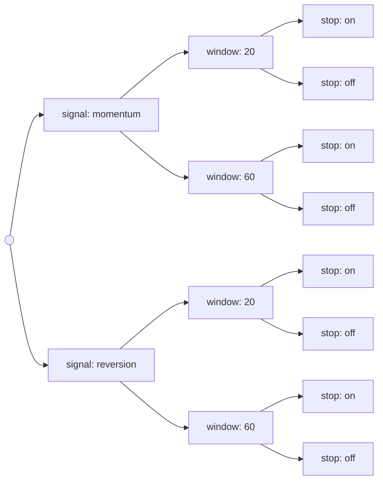

# Counting Principles

When every outcome in a finite sample space is equally likely, probability *is* counting:

$$\mathbf{P}(A) = \frac{\lvert A\rvert}{\lvert\Omega\rvert},$$

and the entire problem reduces to counting the elements of two sets without listing them. That is the classical motivation, and it is enough to build the binomial, hypergeometric, and multinomial distributions in [Part V](../part-05-common-distributions/index.md).

The modern motivation is less innocent. Combinatorics is also what tells you how many things you *tried* — how many parameter settings a grid search visited, how many pairs a cointegration screen tested, how many variants of a signal were considered before one looked good. Those counts grow explosively, and they are the denominators that decide whether a backtest result means anything at all. The last section of this page makes that concrete; everything before it builds the tools.

## The Multiplication Principle

If a procedure has $r$ stages and stage $i$ can be completed in $n_i$ ways *regardless of how the earlier stages turned out*, the whole procedure can be completed in

$$n_1\cdot n_2\cdots n_r$$

ways. The proof is the picture: a tree whose first level has $n_1$ branches, each of which splits into $n_2$, and so on, so the number of leaves is the product.



Two signals × two windows × two stop settings gives $2\cdot2\cdot2 = 8$ leaves. The qualifier in the statement matters: the *number* of options at each stage must not depend on earlier choices, though the options themselves may. Five shirts, four jackets, and three pairs of trousers give $5\cdot4\cdot3 = 60$ outfits; if one jacket only worked with two of the shirts, the principle would not apply as stated and the count would have to be broken into cases.

## Permutations

A **permutation** of a set $A = \{a_1,\ldots,a_n\}$ is an ordered arrangement of all its elements. Fill $n$ positions in turn: the first position has $n$ candidates, the second $n-1$ once the first is used, and so on down to a single candidate for the last. By the multiplication principle there are

$$n\cdot(n-1)\cdots 2\cdot 1 = n!$$

arrangements, read "$n$ factorial". With five items, $5! = 120$.

!!! note "The empty product convention"
    $0! = 1$. This is not a special case invented for convenience — it is the empty product, and it is what makes formulas like $\binom{n}{0}=1$ and the binomial theorem hold at their boundaries without a separate clause. There is exactly one way to arrange nothing.

Selecting and ordering only $k$ of the $n$ items stops the product early, giving the **$k$-permutation** count:

$${}_nP_k = n(n-1)\cdots(n-k+1) = \frac{n!}{(n-k)!}.$$

## The Four Sampling Schemes

Choosing $k$ items from $n$ splits along two independent questions: does order matter, and are items replaced after being drawn? The four answers are the four formulas worth memorizing.

| | **Ordered** | **Unordered** |
|---|---|---|
| **With replacement** | $n^k$ | $\dbinom{n+k-1}{k}$ |
| **Without replacement** | $\dfrac{n!}{(n-k)!}$ | $\dbinom{n}{k}$ |

- **Ordered, with replacement.** Each of the $k$ draws has all $n$ options: $n^k$. This is the count behind a $k$-length sequence of independent trials — every possible path of $k$ coin flips, all $2^k$ of them.
- **Ordered, without replacement.** The $k$-permutation count above.
- **Unordered, without replacement.** The **combination** count, derived next.
- **Unordered, with replacement.** The multiset count $\binom{n+k-1}{k}$ — the number of ways to choose $k$ items from $n$ types when repeats are allowed and only the tally matters.

??? note "Where $\binom{n+k-1}{k}$ comes from"
    An unordered draw with replacement is determined entirely by how many of each type were drawn: a vector $(k_1,\ldots,k_n)$ of non-negative integers summing to $k$. Encode such a vector as a row of $k$ stars separated into $n$ groups by $n-1$ bars — three of type 1 and two of type 3, with $n=3$, becomes $\star\star\star\mid\mid\star\star$. Every arrangement of $k$ stars and $n-1$ bars encodes exactly one draw, and every draw one arrangement. There are $k + n - 1$ symbol positions and the arrangement is fixed once you choose which $k$ of them hold stars, giving $\binom{n+k-1}{k}$.

## Combinations

Suppose order does not matter. Count in two steps: there are $n!/(n-k)!$ ways to select $k$ items *in order*, and each unordered selection has been counted once for each of the $k!$ orderings of its members. Dividing out the overcount,

$$\binom{n}{k} = \frac{n!}{k!\,(n-k)!},$$

the **binomial coefficient**, read "$n$ choose $k$" and also written ${}_nC_k$. It is the number of $k$-element subsets of an $n$-element set.

Three identities carry most of the weight.

**Symmetry.** $\binom{n}{k} = \binom{n}{n-k}$: choosing which $k$ items to take is the same act as choosing which $n-k$ to leave. The proof is the bijection itself — no algebra required.

**Pascal's rule.** $\displaystyle\binom{n}{k} = \binom{n-1}{k-1} + \binom{n-1}{k}$.

??? note "Combinatorial proof of Pascal's rule"
    Single out one element, say $a_n$. Every $k$-subset either contains it or does not, and the two cases cannot overlap. Subsets containing $a_n$ are formed by choosing the remaining $k-1$ members from the other $n-1$ elements: $\binom{n-1}{k-1}$ of them. Subsets avoiding $a_n$ take all $k$ members from the other $n-1$: $\binom{n-1}{k}$. Adding the two disjoint cases gives the total.

    The algebraic proof — putting both fractions over a common denominator — is shorter and tells you nothing. The combinatorial one explains *why* Pascal's triangle is built by adding neighbours, and it is the template for every identity in this section: count one set two ways.

**The binomial theorem.**

$$(x + y)^n = \sum_{k=0}^{n}\binom{n}{k}x^k y^{n-k}.$$

Expanding the product $(x+y)(x+y)\cdots(x+y)$ means choosing $x$ or $y$ from each of the $n$ factors; the coefficient of $x^k y^{n-k}$ counts the ways to choose $x$ from exactly $k$ of them, which is $\binom{n}{k}$. Setting $y=1$ gives $(1+x)^n = \sum_k\binom{n}{k}x^k$, and setting $x=y=1$ gives

$$\sum_{k=0}^{n}\binom{n}{k} = 2^n,$$

which is the promised count of subsets: every subset of an $n$-element set has some size $k$, the sizes partition the collection of subsets, and independently each of the $n$ elements is either in or out — two ways each, $2^n$ in total. Counting the same collection two ways proves the identity. This is the $\lvert 2^A\rvert = 2^{\lvert A\rvert}$ result promised in [Sets and Functions](01-sets-and-functions.md).

When the binomial theorem is applied with $x = p$ and $y = 1-p$, the left side is $1$ and the terms on the right are exactly the probabilities of getting $k$ successes in $n$ independent trials — the [binomial distribution](../part-05-common-distributions/02-binomial-distribution.md), whose probabilities sum to one for combinatorial rather than analytic reasons.

### Multinomial Coefficients

Splitting $n$ items into $r$ labelled groups of sizes $k_1,\ldots,k_r$ with $\sum_i k_i = n$ generalizes the same overcounting argument:

$$\binom{n}{k_1, k_2, \ldots, k_r} = \frac{n!}{k_1!\,k_2!\cdots k_r!}.$$

Arrange all $n$ items in a row ($n!$ ways), then declare the first $k_1$ to be group one, the next $k_2$ group two, and so on; each grouping arises from $k_1!\,k_2!\cdots k_r!$ different arrangements, so divide. With $r=2$ this is the ordinary binomial coefficient. It is the counting factor in the [multinomial distribution](../part-05-common-distributions/07-multinomial-distribution.md), and it is the same combinatorial object as the number of distinct anagrams of a word with repeated letters.

## Inclusion–Exclusion

Adding the sizes of overlapping sets double-counts the overlap. For two and three sets:

$$\lvert A\cup B\rvert = \lvert A\rvert + \lvert B\rvert - \lvert A\cap B\rvert,$$

$$\lvert A\cup B\cup C\rvert = \lvert A\rvert+\lvert B\rvert+\lvert C\rvert-\lvert A\cap B\rvert-\lvert A\cap C\rvert-\lvert B\cap C\rvert+\lvert A\cap B\cap C\rvert.$$

In general,

$$\left\lvert\bigcup_{i=1}^{n} A_i\right\rvert = \sum_{i}\lvert A_i\rvert - \sum_{i<j}\lvert A_i\cap A_j\rvert + \sum_{i<j<k}\lvert A_i\cap A_j\cap A_k\rvert - \cdots + (-1)^{n+1}\left\lvert\bigcap_{i=1}^{n} A_i\right\rvert.$$

??? note "Proof via indicators"
    [Sets and Functions](01-sets-and-functions.md) established that $\mathbf{1}_{\bigcup_i A_i} = 1 - \prod_{i}(1-\mathbf{1}_{A_i})$, since the union fails exactly when every set fails. Expand the product:

    $$\prod_{i=1}^{n}\left(1-\mathbf{1}_{A_i}\right) = \sum_{S\subset\{1,\ldots,n\}}(-1)^{\lvert S\rvert}\prod_{i\in S}\mathbf{1}_{A_i} = \sum_{S}(-1)^{\lvert S\rvert}\,\mathbf{1}_{\bigcap_{i\in S}A_i},$$

    using $\mathbf{1}_A\mathbf{1}_B = \mathbf{1}_{A\cap B}$. Substituting and summing over all elements of $\Omega$ — which turns each indicator into the size of its set — gives the stated identity, with the $S=\varnothing$ term cancelling the leading 1. Taking expectations instead of sums gives the probability version verbatim, with $\lvert\cdot\rvert$ replaced by $\mathbf{P}(\cdot)$.

The alternating sum has $2^n - 1$ terms, so inclusion–exclusion is a theoretical tool rather than a computational one for large $n$. Its practical use is the truncation: stopping after the first sum gives the **union bound** $\lvert\bigcup_i A_i\rvert \le \sum_i \lvert A_i\rvert$, which in probability form is the inequality [Bonferroni's correction](../part-15-multiple-testing/02-bonferroni-correction.md) is built on — crude, always valid, and never far off when the events are rare.

## Factorials at Scale

Factorials outgrow everything. $20!$ already exceeds $10^{18}$; $171!$ overflows a 64-bit float. Since the useful quantities are usually *ratios* of factorials, the fix is to never form the pieces:

```python
import math

n, k = 1000, 10

exact = math.comb(n, k)                        # exact integer arithmetic
print(exact)                                   # => 263409560461970212832400

# The naive route: form both factorials, then divide.
naive = math.factorial(n) // (math.factorial(k) * math.factorial(n - k))
print(naive == exact)                          # => True

# Correct in Python's unbounded integers -- and immediately fatal in floats.
try:
    float(math.factorial(n))
except OverflowError as e:
    print(f"OverflowError: {e}")               # => OverflowError: int too large to convert to float

# Log space works at any size: log C(n,k) via log-gamma.
def log_comb(n, k):
    return math.lgamma(n + 1) - math.lgamma(k + 1) - math.lgamma(n - k + 1)

print(round(log_comb(n, k), 6), round(math.log(exact), 6))
# => 53.927997 53.927997
```

Two lessons generalize well beyond combinatorics. First, Python's integers are unbounded, so exact combinatorial arithmetic is free and `math.comb` should always be preferred to a hand-rolled ratio. Second, once floats are unavoidable — inside a likelihood, a Poisson PMF, a hypergeometric tail — the computation belongs in log space, where products become sums and nothing overflows. That is the same discipline argued for likelihoods in [Exponentials, Logarithms, and Growth](07-exponentials-logarithms-growth.md).

**Stirling's approximation** describes the growth analytically:

$$n! \sim \sqrt{2\pi n}\left(\frac{n}{e}\right)^{n},$$

where $\sim$ means the ratio tends to 1 (see [Mathematical Notation](03-mathematical-notation.md)). It is accurate to about 1% at $n=10$ and improves like $1/(12n)$:

| $n$ | $n!$ | Stirling | Relative error |
|---|---|---|---|
| 5 | 120 | 118.02 | 1.65% |
| 10 | 3,628,800 | 3,598,696 | 0.83% |
| 20 | $2.433\times10^{18}$ | $2.423\times10^{18}$ | 0.42% |
| 100 | $9.333\times10^{157}$ | $9.325\times10^{157}$ | 0.08% |

Its role here is analytic rather than numerical: it is how one shows that $\binom{2n}{n}\sim 4^n/\sqrt{\pi n}$, which is the growth rate governing random-walk return probabilities in [Random Walks](../part-08-stochastic-processes/11-random-walks.md).

## The Count That Decides Whether a Backtest Means Anything

Counting stops being an exercise the moment it is applied to research effort. Three counts, all of them larger than intuition suggests:

```python
import math

# 1. A modest parameter grid, by the multiplication principle.
grid = {"lookback": 12, "holding": 8, "z_entry": 10, "stop": 6}
configs = math.prod(grid.values())
print(configs)                                  # => 5760

# 2. Pairs in a universe -- unordered, without replacement.
for n in (30, 157, 500):
    print(n, math.comb(n, 2))
# => 30 435
#    157 12246
#    500 124750

# 3. P(at least one false positive) at alpha = 0.05, via de Morgan.
alpha = 0.05
for m in (1, 20, 100, 5760):
    print(f"{m:5d} tests -> {1 - (1 - alpha) ** m:.4f}")
# =>     1 tests -> 0.0500
#       20 tests -> 0.6415
#      100 tests -> 0.9941
#     5760 tests -> 1.0000
```

Each line is a counting principle doing real damage. The grid is the multiplication principle: four parameters with a dozen settings each is not an unusual search, and it is 5,760 strategies. The pair counts are $\binom{n}{2}$, and a mid-cap universe of 157 tickers offers 12,246 candidate spreads — which is why a cointegration screen finds "significant" relationships whether or not any exist. The third block is the de Morgan computation from [Sets and Functions](01-sets-and-functions.md): the probability of at least one false positive is one minus the probability of none, and at 100 independent tests it is 99.4%.

!!! note "The number that belongs in every backtest report"
    The multiple-testing corrections in [Part XV](../part-15-multiple-testing/index.md) all take the number of hypotheses tested as an input. That number is a *counting* problem, and it is nearly always underreported — the grid you finally ran is not the grid you searched, and the strategies you abandoned still consumed degrees of freedom. [Data Snooping Bias](../part-15-multiple-testing/04-data-snooping-bias.md) and [Validation and Overfitting](../../part-04-strategy-development/08-validation-and-overfitting.md) are about what to do with the count; this page is about being honest when computing it.

The counting principles also settle the question the classical urn problems were asking all along. Drawing 10 items from a bowl of 1,000 without regard to order can be done in $\binom{1000}{10}\approx 2.6\times10^{23}$ ways — the number computed above. If 300 of the items are red and 700 blue, the number of all-blue draws is $\binom{700}{10}$, and the probability of drawing ten blue items is the ratio $\binom{700}{10}\big/\binom{1000}{10}$. That ratio is the [hypergeometric distribution](../part-05-common-distributions/05-hypergeometric-distribution.md) evaluated at its extreme, and every distribution in Part V that counts arrangements — binomial, hypergeometric, multinomial, negative binomial — is a combinatorial coefficient from this page multiplied by a probability from the next.
