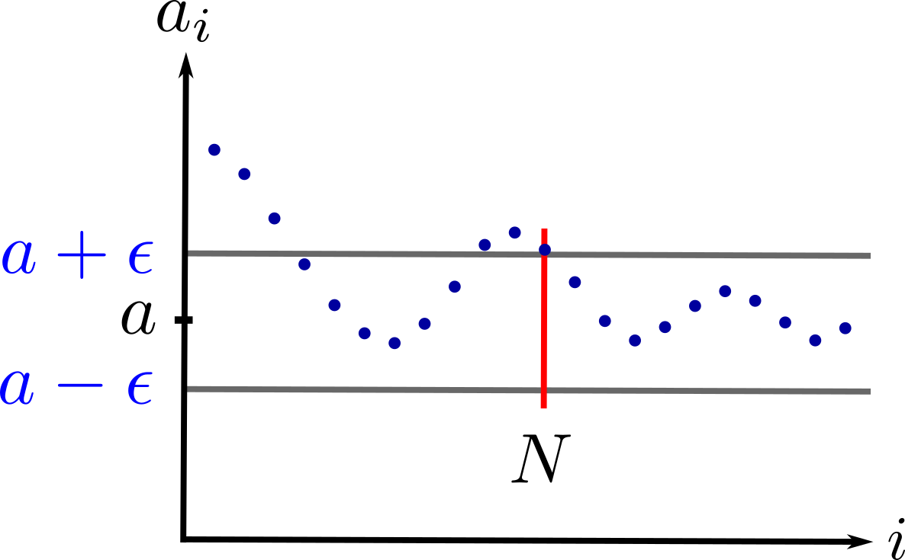

# Sequences and Infinite Series

## Sequences and their Limits

A **sequence** is an *ordered* collection of elements from a set $S$. We can denote a sequence with $a_i$ or $\{a_i\}$ where $i$ is a natural number, i.e., $i\in\mathbb{N}$. We can also list the first few elements, e.g., $a_1, a_2, a_3, \ldots$ The elements of a sequence does not have to be single numbers. They can be vectors, in which case we have a sequence of vectors. Formally, a sequence is a function $f$ that takes an element from the set of natural numbers and associates with it an element of another set $S$, i.e., $f:\mathbb{N}\rightarrow S$.

### Convergence of Sequences

We say that a sequence $\{a_i\}$ **converges** if it approaches some limit $a$. Formally,

$$\lim_{i\rightarrow\infty}a_i=a$$

if, for any $\epsilon>0$, there exists $N$, such that if $i>N$, then $\lvert a_i-a\rvert<\epsilon$. To get an intuition about this statement, we visualize a convergent sequence in the plot below.

  { width="300" .center }

Notice how, after $N$ terms, subsequent terms are confined inside the upper and lower bounds (gray lines). A sequence is convergent if this happens for any $\epsilon$, no matter how small it is.

If the sequence does not converge, we say that it is **divergent**.

### Properties

* If two sequences, $a_i$ and $b_i$, converge to $a$ and $b$, respectively, then:

$$a_i+b_i\rightarrow a+b$$

$$a_ib_i\rightarrow ab$$

* If $g$ is a continuous function, then

$$g(a_i)\rightarrow g(a).$$

## Infinite Series

Given an infinite sequence $\{a_i\}$, we add the first $n$ terms to get a **series**. An **infinite series** is then the limit of this sum as $n$ goes to infinity, i.e.,

$$\lim_{n\rightarrow\infty}\sum_{i=1}^{n}a_i=\sum_{i=1}^{\infty}a_i$$

provided this limit exists.

### Geometric Series

The geometric series is given by

$$S=\sum_{i=0}^{\infty}\alpha^i=1+\alpha+\alpha^2+\ldots$$

This series will converge if $\lvert\alpha\rvert<1$, in which case we have

$$S=\dfrac{1}{1-\alpha}.$$
