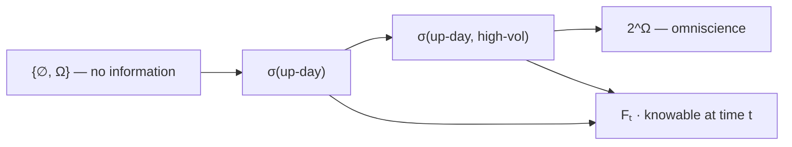

# Probability Spaces

A probability model is three objects, not one. The sample space $\Omega$ says what can happen, a collection $\mathcal{F}$ of subsets says which questions are askable, and a measure $\mathbf{P}$ assigns each askable question a number. Written together, the triple $(\Omega,\mathcal{F},\mathbf{P})$ is a **probability space**, and the middle object — the one most introductions skip — is what makes continuous outcomes possible at all.

The set vocabulary this page runs on is [Sets and Functions](../part-01-mathematical-foundations/01-sets-and-functions.md): membership, subsets, unions, complements, partitions, and preimages. What that page supplies is the guarantee that events are closed under the operations probability needs; what this page supplies is the object that guarantee is a statement about. The measure itself is [Probability Axioms](02-probability-axioms.md)'s job, and the preimage machinery in the last section is picked up again in [Random Variables](../part-03-random-variables/01-random-variables.md).

The scope is deliberately narrow. There is no construction of Lebesgue measure and no proof that one exists; $\mathcal{F}$ is presented as an interface — a list of operations a collection of events must be closed under — rather than as something built from the ground up. That is enough to read every probability statement in this book and to know which of them are saying something non-trivial.

## Sample Spaces

For a given experiment, the **sample space** $\Omega$ is the set of every outcome it can produce. Rolling a die gives $\Omega = \{1,2,3,4,5,6\}$. A single trading day's direction gives $\Omega = \{\text{up},\text{down},\text{unchanged}\}$. Tomorrow's closing price gives $\Omega = [0,\infty)$.

Choosing $\Omega$ is a modeling act, not a mathematical one, and it is the first place a probability model can be wrong in a way no later algebra will detect.

### Three Requirements: Exclusive, Exhaustive, Right-Grained

A list of outcomes is a valid sample space when it is

- **mutually exclusive** — no two outcomes can occur together, so exactly one element of $\Omega$ is realized;
- **collectively exhaustive** — every possibility appears, so at least one element of $\Omega$ is realized;
- **at the right granularity** — fine enough to express every question that will be asked of it.

The first two are formal and easy to check. The third has no formal statement, and it is the one that matters. Granularity is a one-way door: information discarded when $\Omega$ is chosen cannot be recovered by any subsequent calculation, because it was never in the model.

| Experiment | $\Omega$ | What the granularity discards |
|---|---|---|
| One coin flip | $\{H, T\}$ | nothing — the experiment has no finer structure |
| A trading day's direction | $\{\text{up},\text{down},\text{unchanged}\}$ | magnitude; "up 0.1%" and "up 7%" are the same outcome |
| A day's OHLC bar | $\mathbb{R}^4$ with $L\le O,C\le H$ | path; two bars with identical corners are reachable by wildly different routes |
| A day's full tick sequence | sequences of time, price, and size | almost nothing, and the space is far too large to write down |

The third row is the expensive one. A bar-level $\Omega$ can answer "did the strategy lose money", because that is a function of the corners. It cannot answer "did the stop get hit before the target", because two paths with the same corners disagree on that and the model cannot tell them apart — which is exactly the ambiguity [Architecture and Event-Driven Design](../../part-05-backtesting-engine/01-architecture-and-event-driven-design.md) has to legislate away by fiat.

### Sequential Description and the Product Space

When an experiment has stages, the sample space is the product of the stage spaces. Rolling a four-sided die twice gives

$$\Omega = \Omega_1\times\Omega_2 = \{(x,y) : x,y\in\{1,2,3,4\}\},\qquad \lvert\Omega\rvert = 4^2 = 16,$$

by the multiplication principle of [Counting Principles](../part-01-mathematical-foundations/02-counting-principles.md). Nothing about the product construction assumes the stages are related or unrelated — that is a question about the measure, not about the space, and it is answered in [Independence](05-independence.md).

Because $\Omega$ here is finite and small, every event is a subset that can be listed, and every probability is a count:

```python
from itertools import product

omega = set(product(range(1, 5), repeat=2))    # roll a 4-sided die twice
B = {(x, y) for x, y in omega if min(x, y) == 2}
Y_even = {(x, y) for x, y in omega if y % 2 == 0}

print(f"|omega| = {len(omega)}, |B| = {len(B)}, P(B) = {len(B) / len(omega):.4f}")
print(f"P(Y even | B) = {len(Y_even & B) / len(B):.4f}")
print(f"P(Y = 1 | B)  = {len({w for w in B if w[1] == 1}) / len(B):.4f}")
# => |omega| = 16, |B| = 5, P(B) = 0.3125
#    P(Y even | B) = 0.8000
#    P(Y = 1 | B)  = 0.0000
```

Five of the sixteen pairs have minimum exactly 2; four of those five have an even second coordinate, and none has a second coordinate of 1. The last line is a probability of zero arrived at honestly — the event $\{Y=1\}$ and the event $B$ share no outcomes, so their intersection is empty. Conditioning is developed properly in [Conditional Probability](03-conditional-probability.md); it appears here only to make the point that on a finite space nothing is required beyond counting the right subsets.

## Events

An **event** is a subset of the sample space. That is the entire definition, and it converts the English of trading into set algebra: "the market closed up" is a subset, "the strategy lost more than 5%" is a subset, "at least one of these three signals fired" is a union of three subsets.

The dictionary between English and set operations was built in [Sets and Functions](../part-01-mathematical-foundations/01-sets-and-functions.md) — **or** is union, **and** is intersection, **not** is complement — and it is the event algebra without modification.

!!! note "An outcome is an element; an event is a subset"
    Probabilities attach to events, never to outcomes. On a die, $3$ is an outcome and $\{3\}$ is the event that the outcome is a 3; the notation $\mathbf{P}(3)$ is an abbreviation for $\mathbf{P}(\{3\})$ and nothing more. The distinction looks pedantic on a finite space, where every singleton is an event with a sensible probability. It stops being pedantic the moment $\Omega$ is uncountable, because there every singleton has probability zero while the sets built from them do not — which is the whole content of the fifth section below.

A trading rule, read at this level, is a map from events to positions: a partition of $\Omega$ into the cases the rule distinguishes, with an action attached to each block. Whether the partition is worth conditioning on is the empirical question of [Feature and Signal Engineering](../../part-04-strategy-development/05-feature-and-signal-engineering.md); that it *is* a partition is what makes the rule a probability statement rather than a story.

## Sigma-Algebras: Which Subsets Are Questions

On a finite $\Omega$ the collection of events can simply be the power set $2^\Omega$ — every subset is an event, and nothing goes wrong. On an uncountable $\Omega$ that choice is not available: there is no way to assign a probability to *every* subset of $[0,1]$ while keeping the axioms and the natural invariance under shifts. Some subsets have to be excluded, and the collection of the ones that survive is what $\mathcal{F}$ names.

### The Three Closure Conditions

A collection $\mathcal{F}$ of subsets of $\Omega$ is a **σ-algebra** when

$$\Omega\in\mathcal{F},\qquad A\in\mathcal{F}\implies A^\mathsf{C}\in\mathcal{F},\qquad A_1,A_2,\ldots\in\mathcal{F}\implies\bigcup_{n=1}^{\infty}A_n\in\mathcal{F}.$$

The whole space is askable; the negation of an askable question is askable; and a countable run of askable questions can be combined with "at least one of them". Everything else follows.

??? note "Why intersections come free"
    Nothing in the three conditions mentions intersection, and yet $\mathcal{F}$ is closed under countable intersections. By de Morgan's laws,

    $$\bigcap_{n=1}^{\infty}A_n = \left(\bigcup_{n=1}^{\infty}A_n^\mathsf{C}\right)^{\!\mathsf{C}},$$

    and the right-hand side is built from complements and a countable union — the second and third closure conditions applied in sequence. Taking $A_1 = \Omega$ and $A_n = \Omega$ throughout gives $\varnothing = \Omega^\mathsf{C}\in\mathcal{F}$, and set difference follows from $A\setminus B = A\cap B^\mathsf{C}$.

    So the three conditions are not a minimal-looking list that happens to be convenient; they are minimal. The reason the laws in [Sets and Functions](../part-01-mathematical-foundations/01-sets-and-functions.md) were stated for arbitrary families rather than just for pairs is precisely so that this argument runs for countable ones.

**Countable, not arbitrary.** The third condition asks for closure under *countable* unions only. That restriction is not fastidiousness — an arbitrary union of events need not be an event, and if it were, the theory would collapse, as [Probability Axioms](02-probability-axioms.md) shows by writing $[0,1]$ as an uncountable union of singletons.

### Generated Sigma-Algebras and Information

Given any collection $\mathcal{C}$ of subsets, $\sigma(\mathcal{C})$ denotes the smallest σ-algebra containing $\mathcal{C}$ — the closure of $\mathcal{C}$ under the three operations. The canonical case on the real line is the **Borel σ-algebra**

$$\mathcal{B}(\mathbb{R}) = \sigma\big(\{(-\infty,x] : x\in\mathbb{R}\}\big),$$

which contains every interval, every open and closed set, and every set that will ever be needed — while stopping short of the pathological subsets that cannot carry a measure.

The second reading of $\mathcal{F}$ is the one that earns its keep in this book. A σ-algebra is a description of **information**: $A\in\mathcal{F}$ means "whether $A$ occurred is knowable". A coarse σ-algebra knows little, a fine one knows much, and an increasing family $\mathcal{F}_1\subset\mathcal{F}_2\subset\cdots$ — a **filtration** — is a formal statement of what is knowable as time passes.



At the left end, the only askable questions are "did anything happen" and "did nothing happen", both with known answers. Each step right refines the partition of $\Omega$ and adds questions. The rung labelled $\mathcal{F}_t$ is the only one a live system stands on.

**Point-in-time discipline is a σ-algebra statement.** A backtest that computes a signal from tomorrow's close is conditioning on a set that is not in $\mathcal{F}_t$ — the arithmetic is fine, the measure is fine, and the answer is meaningless because the question was not askable when the trade was placed. That is the formal content of the lookahead bugs catalogued in [Validation and Overfitting](../../part-04-strategy-development/08-validation-and-overfitting.md), the reason [Scheduling and Data Plumbing](../../part-06-live-infrastructure/02-scheduling-and-data-plumbing.md) treats timestamps as a correctness concern rather than a convenience, and the hypothesis every result about [Martingales](../part-08-stochastic-processes/10-martingales.md) is stated relative to.

## The Triple $(\Omega,\mathcal{F},\mathbf{P})$

Assembling the three parts: $\Omega$ is a set, $\mathcal{F}$ is a σ-algebra of subsets of $\Omega$, and $\mathbf{P}:\mathcal{F}\to[0,1]$ is a function on events satisfying the axioms of the next page. The domain of $\mathbf{P}$ is $\mathcal{F}$ and not $\Omega$ — probability eats sets, which is the formal restatement of the note above.

| Object | Symbol | What it fixes | Developed in |
|---|---|---|---|
| Sample space | $\Omega$ | what can happen | this page |
| Event σ-algebra | $\mathcal{F}$ | which questions are askable, and what is knowable | this page |
| Probability measure | $\mathbf{P}$ | how likely each askable question is | [Probability Axioms](02-probability-axioms.md) |

!!! note "The measure is the only object that is not combinatorics"
    $\Omega$ and $\mathcal{F}$ are pure set theory — they can be written down by anyone who has agreed what the experiment is, and two modellers who agree on the experiment will agree on them. $\mathbf{P}$ is the object that carries an empirical claim, and it is the only one that can be wrong about the world rather than merely inconvenient. Every dispute about a strategy's expected return is a dispute about $\mathbf{P}$; every dispute about whether a backtest is even well posed is a dispute about $\mathcal{F}$.

## Continuous Sample Spaces and Why Singletons Have Probability Zero

When $\Omega$ is uncountable, probability cannot be assigned by summing over individual outcomes, because there is no way to enumerate them — the uncountability of $\mathbb{R}$ is proved by Cantor's diagonal argument in [Sets and Functions](../part-01-mathematical-foundations/01-sets-and-functions.md). Something else has to carry the measure, and on $[0,1]$ the natural candidate is length.

### Area as Probability

Take $\Omega = [0,1]$ with $\mathbf{P}([a,b]) = b-a$ for $0\le a\le b\le 1$. Normalization holds because $\mathbf{P}(\Omega) = 1-0 = 1$, and the measure extends from intervals to every Borel subset of $[0,1]$ — a construction taken on faith here.

In two dimensions the same idea is area. Take $\Omega = [0,1]^2$ with $\mathbf{P}(A) = \mathrm{area}(A)$, and ask for the probability that $x+y\le\tfrac{1}{2}$. That event is the triangle with vertices $(0,0)$, $(\tfrac12,0)$, and $(0,\tfrac12)$ — two legs of length $\tfrac12$ — so

$$\mathbf{P}\big(\{(x,y) : x+y\le\tfrac{1}{2}\}\big) = \frac{1}{2}\cdot\frac{1}{2}\cdot\frac{1}{2} = \frac{1}{8}.$$

No integration is needed because the region is a triangle; the general case is an integral, and the function appearing under it is a density — [Probability Density Functions](../part-03-random-variables/04-probability-density-functions.md).

### Zero Probability Is Not Impossibility

Under a length measure, a single point is an interval of length zero. That is not a quirk of the construction — it is forced.

??? note "Proof that every singleton in $[0,1]$ has probability zero"
    The argument uses monotonicity and finite additivity, both derived on the next page from the axioms; the forward reference is unavoidable and harmless, since neither result uses anything from this section.

    Suppose $\mathbf{P}(\{x\}) = c > 0$ for some $x\in[0,1]$, and suppose the measure assigns that same value to every singleton — which length does. Choose an integer $n$ with $nc > 1$, and pick $n$ distinct points $x_1,\ldots,x_n$ in $[0,1]$. The singletons $\{x_1\},\ldots,\{x_n\}$ are pairwise disjoint, so finite additivity gives

    $$\mathbf{P}\big(\{x_1,\ldots,x_n\}\big) = nc > 1.$$

    But $\{x_1,\ldots,x_n\}\subset\Omega$, so monotonicity forces $\mathbf{P}(\{x_1,\ldots,x_n\})\le\mathbf{P}(\Omega) = 1$ — a contradiction. Hence $c=0$.

    The argument turns on the uniformity, and that is what a countable space escapes. A countable $\Omega$ can carry positive mass on every point, as $\mathbf{P}(n) = 2^{-n}$ does, but the masses must then be unequal and summable, and no uncountable set admits such an assignment.

Equivalently, the probability of a point is the limit of the probabilities of shrinking windows around it:

$$\mathbf{P}(\{x\}) = \lim_{\epsilon\downarrow 0}\mathbf{P}\big([x-\epsilon,\,x+\epsilon]\big) = \lim_{\epsilon\downarrow 0} 2\epsilon = 0.$$

The limit is visible in a million draws:

```python
import numpy as np

rng = np.random.default_rng(0)
u = rng.random(1_000_000)                       # uniform on [0, 1]

print(f"exact hits of 0.5 in {u.size:,} draws: {(u == 0.5).sum()}")
for eps in (1e-1, 1e-3, 1e-6):
    print(f"|u - 0.5| < {eps:.0e} : {(np.abs(u - 0.5) < eps).mean():.6f}")
# => exact hits of 0.5 in 1,000,000 draws: 0
#    |u - 0.5| < 1e-01 : 0.200428
#    |u - 0.5| < 1e-03 : 0.002017
#    |u - 0.5| < 1e-06 : 0.000000
```

The window of half-width $0.1$ catches 20% of the draws, the window of half-width $0.001$ catches 0.2%, and the window of half-width $10^{-6}$ caught nothing at all in a million tries. Each empirical frequency tracks $2\epsilon$, and the exact value catches nothing ever — not in a million draws, not in any number of them.

!!! note "Probability zero is not impossibility"
    Every one of those million draws *was* some particular real number, and each of those numbers had probability zero before it appeared. An event of probability zero is not one that cannot occur; it is one that occurs no more often than a vanishing fraction of the time, and on an uncountable space something of probability zero happens on every single trial. This is why continuous laws are described by densities over intervals rather than by point masses, and why [Probability Density Functions](../part-03-random-variables/04-probability-density-functions.md) has to define $f$ as something other than a probability.

**A limit order resting at exactly the mid never fills**, under any model that treats price as continuous, because the event "price equals $p$" has probability zero. Real fill logic therefore has to be stated as an interval event — price trades at or through a level — and that translation, rather than any subtlety about queue position, is the first thing [Order Management and Fill Simulation](../../part-05-backtesting-engine/03-order-management-and-fill-simulation.md) has to get right.

## Random Variables as Measurable Functions

A **random variable** is a function $X:\Omega\to\mathbb{R}$. It is not a variable, and it is not random; it is a rule assigning a number to each outcome. What makes it usable is that the sets it generates are events.

The expression $\{X\le x\}$ looks like an inequality and is really a preimage:

$$\{X\le x\} = X^{-1}\big((-\infty,x]\big) = \{\omega\in\Omega : X(\omega)\le x\}.$$

$X$ is **measurable** when that preimage lies in $\mathcal{F}$ for every $x$ — which is exactly the condition under which

$$F_X(x) = \mathbf{P}(X\le x)$$

is a statement about something $\mathbf{P}$ can be applied to, and therefore the condition under which [Cumulative Distribution Functions](../part-03-random-variables/02-cumulative-distribution-functions.md) has a subject at all.

??? note "Why measurability is a condition on preimages and not on images"
    Preimages commute with every set operation: $f^{-1}(S\cup T) = f^{-1}(S)\cup f^{-1}(T)$, $f^{-1}(S\cap T) = f^{-1}(S)\cap f^{-1}(T)$, and $f^{-1}(S^\mathsf{C}) = \left(f^{-1}(S)\right)^{\!\mathsf{C}}$. Images do not: unions survive, but intersections satisfy only $f(S\cap T)\subset f(S)\cap f(T)$, and the inclusion is strict as soon as two outcomes share a value — the counterexample is worked in [Sets and Functions](../part-01-mathematical-foundations/01-sets-and-functions.md), where two disjoint singletons have overlapping images.

    The consequence is structural. Pulling sets back through $X$ turns the three closure conditions on $\mathcal{B}(\mathbb{R})$ into the three closure conditions on $\mathcal{F}$, so the collection

    $$\sigma(X) = \{X^{-1}(B) : B\in\mathcal{B}(\mathbb{R})\}$$

    is itself a σ-algebra — "the information carried by $X$", and a sub-σ-algebra of $\mathcal{F}$ exactly when $X$ is measurable. Pushing sets forward through $X$ preserves nothing, so an image-based theory would have no algebra to work in. Had probability been built on images, none of it would function.

On a finite space the whole apparatus is visible at once:

```python
from itertools import product

omega = list(product([0, 1], repeat=3))         # three flips, 1 = head
X = lambda w: sum(w)                            # X counts the heads

preimage_2 = [w for w in omega if X(w) == 2]
print(f"|omega| = {len(omega)}")
print(f"X^-1({{2}}) = {preimage_2}")
print(f"P(X <= 1) = {len([w for w in omega if X(w) <= 1]) / len(omega):.4f}")
# => |omega| = 8
#    X^-1({2}) = [(0, 1, 1), (1, 0, 1), (1, 1, 0)]
#    P(X <= 1) = 0.5000
```

Eight outcomes map onto four values, so $X$ is not injective and cannot be inverted as a function — and none of that matters, because $X^{-1}$ is being applied to *sets*. Three outcomes pull back from $\{2\}$; four pull back from $(-\infty,1]$, giving $\mathbf{P}(X\le 1) = 0.5$. The σ-algebra $\sigma(X)$ generated this way has $2^4 = 16$ members against the $2^8 = 256$ subsets of $\Omega$: $X$ knows how many heads appeared and is blind to their order, and that blindness is precisely what makes it a coarser description than $\Omega$ itself.

Every object downstream is a statement about preimages. A CDF is the measure of the preimage of a ray, a density is what differentiating it produces, and transforming $X$ by another function $g$ is handled by pulling sets back through $g\circ X$ — which is why [Functions of Random Variables](../part-03-random-variables/08-functions-of-random-variables.md) needs no new probability theory, and why [Random Variables](../part-03-random-variables/01-random-variables.md) can open with "$X$ is a function" and lose nothing at all.
