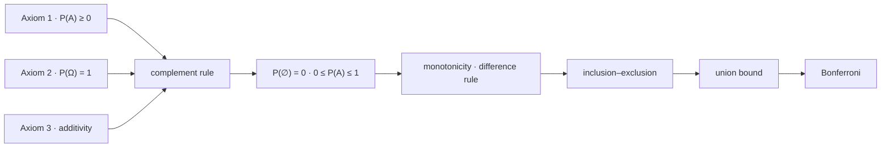

# Probability Axioms

Three axioms, and everything else on this page is a theorem. That the complement rule holds, that the empty event has probability zero, that probabilities lie in $[0,1]$, that a subset cannot be likelier than its superset — none of these is a definition or a convention. Each is derived, in a few lines, from three statements short enough to fit on one screen.

The closing table of [Sets and Functions](../part-01-mathematical-foundations/01-sets-and-functions.md) claimed exactly that: its right-hand column "is derived, not assumed". This page is where the derivations happen. The measure being axiomatized lives on the σ-algebra $\mathcal{F}$ of [Probability Spaces](01-probability-spaces.md), and every rule below is a statement about how $\mathbf{P}$ behaves under union, intersection, and complement — which is why the set algebra had to come first.

Two of the results here are inequalities rather than identities, and they are the ones the course spends most heavily. The union bound and Bonferroni's inequality are crude, never wrong, and hold with no assumption whatsoever about how events relate to one another — which is precisely what makes them the load-bearing tools of [Multiple Comparisons](../part-15-multiple-testing/01-multiple-comparisons.md).

## The Three Axioms

Let $(\Omega,\mathcal{F},\mathbf{P})$ be a probability space. For $\mathbf{P}$ to be a **probability measure** it must satisfy:

**Non-negativity.** For every event $A\in\mathcal{F}$,

$$\mathbf{P}(A)\ge 0.$$

**Normalization.** The whole space carries all the mass,

$$\mathbf{P}(\Omega) = 1.$$

**Additivity.** If $A\cap B = \varnothing$, then

$$\mathbf{P}(A\cup B) = \mathbf{P}(A)+\mathbf{P}(B).$$

That is the entire list. Note what is absent: no upper bound on $\mathbf{P}(A)$, no rule for $\mathbf{P}(\varnothing)$, no statement about subsets, and no mention of intersection at all. Those are consequences, and the third axiom will be strengthened before the page is done.

!!! note "The axioms say nothing about what probability means"
    A long-run frequency satisfies these three rules. So does a degree of belief, so does a share of a physical volume, and so does the fraction of historical days on which something happened. The axioms are silent on which reading is intended, and every theorem below holds identically under all of them. The interpretive choice is a modelling stance rather than a mathematical one, and it is the subject of [The Bayesian Framework](../part-16-bayesian-statistics/01-bayesian-framework.md) — where the disagreement turns out to be about which quantities may be given a distribution, not about the arithmetic of the ones that are.

## What Follows From Them

The elementary consequences, in the order they are proved:

$$\mathbf{P}(A^\mathsf{C}) = 1-\mathbf{P}(A),\qquad \mathbf{P}(\varnothing) = 0,\qquad 0\le\mathbf{P}(A)\le 1,$$

$$A\subset B\implies\mathbf{P}(A)\le\mathbf{P}(B),\qquad \mathbf{P}(B\setminus A) = \mathbf{P}(B)-\mathbf{P}(A\cap B).$$

??? note "Proof of the elementary consequences"
    **Complement rule.** $\Omega = A\cup A^\mathsf{C}$ and the two pieces are disjoint, so additivity gives $\mathbf{P}(A)+\mathbf{P}(A^\mathsf{C}) = \mathbf{P}(\Omega) = 1$ by normalization.

    **The empty event.** Apply the complement rule with $A = \Omega$: $\mathbf{P}(\varnothing) = 1-\mathbf{P}(\Omega) = 0$.

    **Range.** Non-negativity applied to $A^\mathsf{C}$ gives $\mathbf{P}(A^\mathsf{C})\ge 0$, so $\mathbf{P}(A) = 1-\mathbf{P}(A^\mathsf{C})\le 1$. Combined with non-negativity on $A$ itself, $0\le\mathbf{P}(A)\le 1$. The upper bound is a theorem, not an axiom — it is bought entirely with normalization.

    **Monotonicity.** If $A\subset B$ then $B = A\cup(B\setminus A)$, a disjoint union, so $\mathbf{P}(B) = \mathbf{P}(A)+\mathbf{P}(B\setminus A)\ge\mathbf{P}(A)$ by non-negativity of the second term.

    **Difference rule.** In general $B = (A\cap B)\cup(B\setminus A)$, again disjoint, so $\mathbf{P}(B\setminus A) = \mathbf{P}(B)-\mathbf{P}(A\cap B)$. The chain is worth noticing: every step is the same move — write a set as a disjoint union, apply additivity, and rearrange.

The one identity that reaches beyond disjointness is **inclusion–exclusion** for two events, which corrects the double-count of the overlap:

$$\mathbf{P}(A\cup B) = \mathbf{P}(A)+\mathbf{P}(B)-\mathbf{P}(A\cap B).$$

??? note "Proof of inclusion–exclusion for two events"
    Write $A\cup B = A\cup(B\setminus A)$, which is a disjoint union because $B\setminus A$ removes exactly the part of $B$ that $A$ already covers. Additivity gives

    $$\mathbf{P}(A\cup B) = \mathbf{P}(A)+\mathbf{P}(B\setminus A),$$

    and the difference rule replaces the second term with $\mathbf{P}(B)-\mathbf{P}(A\cap B)$.

    The $n$-event version — the alternating sum over all $2^n-1$ non-empty subsets of indices — is already proved in [Counting Principles](../part-01-mathematical-foundations/02-counting-principles.md) by expanding the indicator identity $\mathbf{1}_{\bigcup_i A_i} = 1-\prod_i(1-\mathbf{1}_{A_i})$ and taking expectations, and is not reproved here. That route is shorter than induction and explains where the alternating signs come from.

### The English–Set–Probability Dictionary

With those results in hand, the table that [Sets and Functions](../part-01-mathematical-foundations/01-sets-and-functions.md) closes on can be completed. Its first two columns are set algebra; the third is now derived, and the fourth names what derives it.

| English | Set operation | Probability | Follows from |
|---|---|---|---|
| $A$ or $B$ | $A\cup B$ | $\mathbf{P}(A)+\mathbf{P}(B)-\mathbf{P}(A\cap B)$ | inclusion–exclusion |
| $A$ and $B$ | $A\cap B$ | $\mathbf{P}(A\cap B)$, which factorizes only under independence | nothing — it is a primitive |
| not $A$ | $A^\mathsf{C}$ | $1-\mathbf{P}(A)$ | complement rule |
| at least one $A_i$ | $\bigcup_i A_i$ | $1-\mathbf{P}\big(\bigcap_i A_i^\mathsf{C}\big)$ | complement rule and de Morgan |
| $A$ but not $B$ | $A\setminus B$ | $\mathbf{P}(A)-\mathbf{P}(A\cap B)$ | difference rule |
| exactly one of $A$, $B$ | $A\,\triangle\,B$ | $\mathbf{P}(A)+\mathbf{P}(B)-2\mathbf{P}(A\cap B)$ | difference rule, twice |

The second row is the interesting one, because it is the only entry with nothing in the fourth column. Intersection is where the axioms run out: they constrain how $\mathbf{P}$ behaves under union and complement completely, and say nothing whatever about $\mathbf{P}(A\cap B)$. Filling that gap takes an extra input — either a measured conditional, which is [Conditional Probability](03-conditional-probability.md), or an assumption that the events factorize, which is [Independence](05-independence.md). Everything difficult in applied probability lives in that one blank cell.



## Countable Additivity

The third axiom covers two disjoint events, and by induction any finite number of them. It does not cover infinitely many, and the gap is not academic.

### Why Finite Additivity Is Not Enough

Take $\Omega = \{1,2,3,\ldots\}$ with $\mathbf{P}(n) = 2^{-n}$. The outcomes are not equally likely, and there are infinitely many of them. Non-negativity is immediate. Normalization needs the geometric series of [Sequences and Infinite Series](../part-01-mathematical-foundations/04-sequences-and-series.md):

$$\mathbf{P}(\Omega) = \sum_{n=1}^{\infty}\frac{1}{2^n} = \frac{1/2}{1-1/2} = 1.$$

Now ask for the probability of drawing an even integer. The event decomposes as

$$\mathbf{P}(\text{even}) = \mathbf{P}\big(\{2\}\cup\{4\}\cup\{6\}\cup\cdots\big),$$

a union of infinitely many pairwise disjoint singletons. The third axiom as stated does not reach it. Finite additivity gives the probability of any finite sub-collection and stops; there is no licence to pass to the limit, and without one the model cannot answer a question as ordinary as "is the draw even". Granting the step anyway would give

$$\sum_{k=1}^{\infty}\frac{1}{2^{2k}} = \frac{1/4}{1-1/4} = \frac{1}{3},$$

which is the right answer for a reason the axioms do not yet supply. The fix is to assume the step:

$$\mathbf{P}\!\left(\bigcup_{i=1}^{\infty}A_i\right) = \sum_{i=1}^{\infty}\mathbf{P}(A_i)\qquad\text{for pairwise disjoint }A_i.$$

This is **countable additivity**, and it replaces the third axiom rather than supplementing it — taking all but finitely many $A_i$ empty recovers the finite case.

```python
n = 60
all_terms = sum(2.0 ** -k for k in range(1, n + 1))
even_terms = sum(2.0 ** -(2 * k) for k in range(1, n + 1))

print(f"sum of 2^-n  over n = 1..{n}: {all_terms:.10f}")
print(f"sum of 2^-2k over k = 1..{n}: {even_terms:.10f}")
print(f"geometric series (1/4)/(1 - 1/4): {0.25 / (1 - 0.25):.10f}")
# => sum of 2^-n  over n = 1..60: 1.0000000000
#    sum of 2^-2k over k = 1..60: 0.3333333333
#    geometric series (1/4)/(1 - 1/4): 0.3333333333
```

Sixty terms already exhaust double precision — the partial sums have converged to the last displayed digit — but no finite truncation is a proof, and the axiom is what licenses the infinite sum the truncation is approximating.

!!! note "Countable, not arbitrary"
    Additivity is granted for countable families and refused for larger ones, and the refusal is essential. The interval $[0,1]$ is a union of its singletons, each of probability zero by the argument in [Probability Spaces](01-probability-spaces.md). If additivity extended to arbitrary families, that union would have probability $0$ rather than $1$, and the theory would be inconsistent on its most basic example. This is also why $\mathcal{F}$ is closed only under countable unions: closure and additivity are granted over exactly the same class of families, and the class is the largest one on which nothing breaks.

## Continuity of Measure

Countable additivity has an equivalent phrasing that looks nothing like it: probability is continuous along monotone sequences of events. For increasing and decreasing sequences respectively,

$$A_1\subset A_2\subset\cdots \implies \mathbf{P}\!\left(\bigcup_{n=1}^{\infty}A_n\right) = \lim_{n\to\infty}\mathbf{P}(A_n),$$

$$A_1\supset A_2\supset\cdots \implies \mathbf{P}\!\left(\bigcap_{n=1}^{\infty}A_n\right) = \lim_{n\to\infty}\mathbf{P}(A_n).$$

??? note "Proof of continuity from below"
    Disjointify the increasing sequence. Set $B_1 = A_1$ and $B_n = A_n\setminus A_{n-1}$ for $n\ge 2$. The $B_n$ are pairwise disjoint by construction, and because the $A_n$ increase,

    $$\bigcup_{k=1}^{n}B_k = A_n,\qquad \bigcup_{k=1}^{\infty}B_k = \bigcup_{n=1}^{\infty}A_n.$$

    Countable additivity applied to the right-hand union turns it into the series $\sum_{k=1}^{\infty}\mathbf{P}(B_k)$, whose $n$-th partial sum is $\sum_{k\le n}\mathbf{P}(B_k) = \mathbf{P}(A_n)$ by finite additivity. A series is by definition the limit of its partial sums, so the union's probability is $\lim_n\mathbf{P}(A_n)$. The telescoping is exactly the device named in [Mathematical Notation](../part-01-mathematical-foundations/03-mathematical-notation.md).

    Continuity from above follows by complementation: if $A_n$ decreases then $A_n^\mathsf{C}$ increases, and de Morgan converts the intersection into a union.

This is the machinery that makes limiting statements sayable. Let $H_n$ be the event "at least one head in the first $n$ flips" of a fair coin. The sequence increases, and $\mathbf{P}(H_n) = 1-2^{-n}$, so

$$\mathbf{P}\!\left(\bigcup_{n=1}^{\infty}H_n\right) = \lim_{n\to\infty}\big(1-2^{-n}\big) = 1.$$

!!! note "A fair coin flipped forever produces a head with probability one"
    The event on the left is "a head appears eventually", and it has probability exactly one — not approximately one, and not one in the limit of a long experiment. Its complement, "the coin comes up tails forever", is a perfectly legitimate outcome sequence that has probability zero, which is the [Probability Spaces](01-probability-spaces.md) point about zero not meaning impossible, arriving from the other direction. Without countable additivity the sentence cannot be stated, let alone proved: "eventually" is a countable union, and finite additivity says nothing about it. Every almost-sure statement in the appendix, including the [Strong Law of Large Numbers](../part-07-asymptotic-theory/02-strong-law-of-large-numbers.md) and everything about [Bernoulli Processes](../part-08-stochastic-processes/02-bernoulli-processes.md), rests on this axiom.

```python
import numpy as np

rng = np.random.default_rng(1)
wait = rng.geometric(0.5, 20_000)               # flips until the first head

for n in (1, 5, 10, 20):
    print(f"n={n:<3d} empirical {(wait <= n).mean():.5f}   1 - 2^-n {1 - 2.0 ** -n:.6f}")
print(f"longest wait for a head: {wait.max()}")
# => n=1   empirical 0.50155   1 - 2^-n 0.500000
#    n=5   empirical 0.96930   1 - 2^-n 0.968750
#    n=10  empirical 0.99890   1 - 2^-n 0.999023
#    n=20  empirical 1.00000   1 - 2^-n 0.999999
#    longest wait for a head: 13
```

The empirical frequencies track $1-2^{-n}$ to three decimals at every $n$, and by twenty flips every one of the twenty thousand paths had produced a head — the longest wait in the whole sample was thirteen. Twenty thousand paths is not infinity, and the row reading $1.00000$ against a theoretical $0.999999$ is a rounding coincidence rather than a proof. What the simulation shows is the shape of the convergence; what the axiom supplies is the right to name its limit.

## The Union Bound

Additivity requires disjointness. Dropping that requirement costs an equality and leaves an inequality:

$$\mathbf{P}\!\left(\bigcup_{i=1}^{n}A_i\right)\le\sum_{i=1}^{n}\mathbf{P}(A_i).$$

??? note "Proof of the union bound, and of Bonferroni's inequality as its complement"
    Disjointify again, this time by stripping off what earlier sets already cover: $B_1 = A_1$ and $B_i = A_i\setminus\bigcup_{j<i}A_j$. The $B_i$ are pairwise disjoint, their union is $\bigcup_i A_i$, and $B_i\subset A_i$. Additivity on the $B_i$ followed by monotonicity term by term gives

    $$\mathbf{P}\!\left(\bigcup_{i}A_i\right) = \sum_{i}\mathbf{P}(B_i)\le\sum_{i}\mathbf{P}(A_i).$$

    Nothing in the construction is finite, so the bound holds for countably infinite families under countable additivity.

    **Bonferroni's inequality** is the same statement read through complements. Apply the union bound to the $A_i^\mathsf{C}$ and use de Morgan:

    $$\mathbf{P}\!\left(\bigcap_{i}A_i\right) = 1-\mathbf{P}\!\left(\bigcup_{i}A_i^\mathsf{C}\right)\ \ge\ 1-\sum_{i}\big(1-\mathbf{P}(A_i)\big) = \sum_{i}\mathbf{P}(A_i)-(n-1).$$

    The two are one result. The union bound caps the chance that *something* goes wrong; Bonferroni floors the chance that *everything* goes right.

The bound is crude — it double-counts every overlap — and it is tight exactly when the events are nearly disjoint, which is the regime of rare events. It is also assumption-free, and that is what makes it usable: bounding the probability that at least one of 200 backtested strategies looks significant by chance requires knowing nothing about how the 200 tests are correlated. That is the entire basis of the [Bonferroni Correction](../part-15-multiple-testing/02-bonferroni-correction.md) and the reason familywise error can be controlled at all in the messy dependence structures of [Hypothesis Testing and Multiple Testing](../../part-03-statistics/04-hypothesis-testing-and-multiple-testing.md).

## Bonferroni's Inequality

Stated for its own sake, since it is the form that appears when the question is about simultaneous success:

$$\mathbf{P}\!\left(\bigcap_{i=1}^{n}A_i\right)\ \ge\ \sum_{i=1}^{n}\mathbf{P}(A_i)-(n-1).$$

For $k$ pre-trade risk checks, each passing with probability $1-q$, the floor is $1-kq$ regardless of how the failures are related:

```python
for k, q in ((5, 0.001), (5, 0.010), (10, 0.001), (50, 0.001)):
    print(f"k={k:<3d} q={q:.4f}  floor {1 - k * q:.6f}  if independent {(1 - q) ** k:.6f}")
# => k=5   q=0.0010  floor 0.995000  if independent 0.995010
#    k=5   q=0.0100  floor 0.950000  if independent 0.950990
#    k=10  q=0.0010  floor 0.990000  if independent 0.990045
#    k=50  q=0.0010  floor 0.950000  if independent 0.951206
```

The floor tracks the independent-case truth closely while $kq$ stays small — one part in $10^{5}$ at five checks failing one time in a thousand — and loosens as the expected number of failures grows, reaching $0.0012$ at fifty such checks. The gap is the price of the double-counting, and it is the entire price: the floor holds when the checks share a common failure cause, and the independent-case number does not. A stale market-data feed fails the price sanity check, the position-limit check, and the fill-plausibility check at the same instant, and no independence assumption survives that. Bounds that hold without assumptions are the only ones a risk system can rely on, which is why [Resilience and Risk Controls](../../part-06-live-infrastructure/05-resilience-and-risk-controls.md) budgets failure probabilities additively.

## The Uniform Probability Law and Where It Stops Applying

When $\Omega$ is finite with $n$ equally likely outcomes and $A$ contains $k$ of them, additivity over the singletons collapses probability into counting:

$$\mathbf{P}(A) = \frac{\lvert A\rvert}{\lvert\Omega\rvert} = \frac{k}{n}.$$

Every result in [Counting Principles](../part-01-mathematical-foundations/02-counting-principles.md) becomes a probability statement under this law, which is why permutations and combinations belong in a probability appendix at all. The continuous analogue replaces cardinality with area — the $1/8$ triangle computed in [Probability Spaces](01-probability-spaces.md) is the same law with a different measure of size.

The equal-likelihood hypothesis is an assumption, and in markets it is false. Nothing in the axioms hints at it, and importing it silently is one of the more common ways to be wrong with correct arithmetic.

| Setting | $\Omega$ | Is the uniform law right? | What replaces it |
|---|---|---|---|
| A fair die | six faces | yes, by physical symmetry | — |
| A permutation test's relabelings | $n!$ orderings | yes, **by construction** under the null | — |
| A bootstrap resample | $n^n$ index draws | yes, **by construction** | — |
| A daily return | $\mathbb{R}$ | no, and not remotely | a density, [Probability Density Functions](../part-03-random-variables/04-probability-density-functions.md) |

The middle two rows are the point. The uniform law is not a naive assumption to sneer at — it is what [Permutation Tests](../part-12-hypothesis-testing/09-permutation-tests.md) and [Bootstrap Methods](../part-09-monte-carlo-methods/07-bootstrap-methods.md) *impose on purpose*, by generating the sample space themselves rather than inheriting it from the world. When the analyst controls the randomization, equal likelihood is a fact about the procedure instead of a hope about the market, and that is exactly what makes those p-values exact under the null rather than asymptotic — exact enough that enumerating all $12{,}870$ splits of sixteen observations holds the size at $0.0498$, $0.0503$, $0.0503$ and $0.0483$ across a normal, a Cauchy mixture, a lognormal and an exponential, while the $t$-test built for the first of them wanders to $0.0260$.
