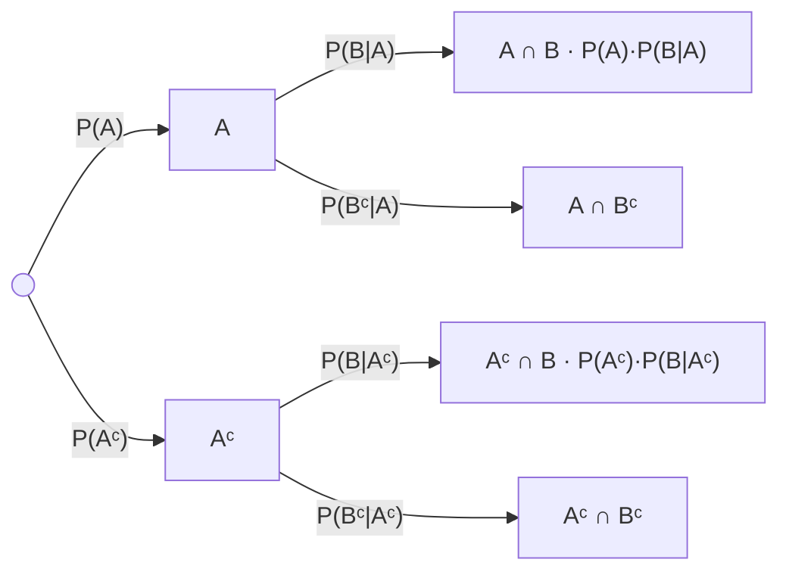

# Conditional Probability

Conditioning is not a new operation. It is the original measure restricted to a smaller sample space and renormalized so that the restriction still sums to one — the same $\mathbf{P}$, asked a narrower question. Everything on this page follows from that one sentence and the axioms of [Probability Axioms](02-probability-axioms.md).

What the page covers: the definition, the fact that $\mathbf{P}(\cdot\mid B)$ is itself a probability measure and therefore inherits every theorem already proved, the multiplication and chain rules, the asymmetry that [Bayes' Rule](04-bayes-rule.md) exists to exploit, and the two-block decomposition that Bayes needs as a denominator. One boundary is worth stating up front: this page conditions on *events*. Conditioning on the value of a random variable — $p_{X\mid Y}$ and $f_{X\mid Y}$ — is [Conditional Distributions](../part-03-random-variables/07-conditional-distributions.md), and the reason it needs separate machinery appears below.

The stake is direct. An edge is a conditional probability that differs from its base rate, and nothing else; whether any real signal moves a real base rate far enough to trade is measured on data in [Probability and Random Variables](../../part-03-statistics/01-probability-and-random-variables.md). This page is the object that sentence is about.

## Conditioning as Renormalization

The **conditional probability** of $A$ given that $B$ occurred is

$$\mathbf{P}(A\mid B) = \frac{\mathbf{P}(A\cap B)}{\mathbf{P}(B)},\qquad\mathbf{P}(B)>0.$$

Read the two halves separately. The numerator keeps only the part of $A$ that lies inside $B$, because outcomes outside $B$ are no longer available. The denominator divides by the mass that remains, because a measure on $B$ must still assign $B$ probability one. Conditioning shrinks the universe and rescales what is left.

### The Restricted Sample Space

Concretely, drawing an integer uniformly from 1 to 100 gives 25 primes, so $\mathbf{P}(\text{prime}) = 0.25$. Restricting to odd numbers removes 50 outcomes from the denominator and exactly one prime — the number 2 — from the numerator:

```python
omega = set(range(1, 101))
prime = {n for n in omega if n > 1 and all(n % d for d in range(2, int(n ** 0.5) + 1))}
odd = {n for n in omega if n % 2 == 1}

print(f"|prime| = {len(prime)}, |odd| = {len(odd)}, |prime & odd| = {len(prime & odd)}")
print(f"P(prime)       = {len(prime) / len(omega):.4f}")
print(f"P(prime | odd) = {len(prime & odd) / len(odd):.4f}")
# => |prime| = 25, |odd| = 50, |prime & odd| = 24
#    P(prime)       = 0.2500
#    P(prime | odd) = 0.4800
```

The probability nearly doubled, from 0.25 to 0.48, and the mechanism is fully visible: 4% of the numerator was discarded and 50% of the denominator was, so the ratio rose by a factor of $0.96/0.5$. Conditioning is worth something exactly when it removes outcomes unevenly — when the event being conditioned on overlaps $A$ at a different rate than it overlaps $\Omega$.

That is what a signal is. A rule whose firing set intersects "tomorrow is an up day" at the base rate carries no information; a rule whose firing set intersects it at a different rate does. Whether any candidate rule clears that bar on market data is the whole content of [Probability and Random Variables](../../part-03-statistics/01-probability-and-random-variables.md).

!!! warning "The condition $\mathbf{P}(B)>0$ is not a formality"
    The definition divides by $\mathbf{P}(B)$, so it says nothing at all when $\mathbf{P}(B)=0$ — and on a continuous space that is the normal case, not an edge case. Every event of the form $\{Y=y\}$ for a continuous $Y$ has probability zero, as [Probability Spaces](01-probability-spaces.md) proves, so "the return given that volatility was exactly 14%" is not defined by this formula. It is definable, by a limiting argument that produces a conditional density rather than a conditional probability, and that construction is [Conditional Distributions](../part-03-random-variables/07-conditional-distributions.md). The boundary matters: everything on this page conditions on events of positive probability, and stops there.

## Conditional Probability Is a Probability

$\mathbf{P}(\cdot\mid B)$ is a probability measure on the same σ-algebra. That is a theorem, and it is the most economical result in elementary probability, because it means nothing already proved has to be proved again.

### The Three Axioms, Restricted

??? note "Proof"
    **Non-negativity.** $\mathbf{P}(A\cap B)\ge0$ and $\mathbf{P}(B)>0$, so the quotient is non-negative.

    **Normalization.** $\Omega\cap B = B$, so $\mathbf{P}(\Omega\mid B) = \mathbf{P}(B)/\mathbf{P}(B) = 1$.

    **Countable additivity.** Let $A_1,A_2,\ldots$ be pairwise disjoint. Distributivity gives $\left(\bigcup_i A_i\right)\cap B = \bigcup_i(A_i\cap B)$, and the pieces $A_i\cap B$ are still pairwise disjoint because they are subsets of the original disjoint sets. Countable additivity applies to the numerator:

    $$\mathbf{P}\!\left(\bigcup_i A_i \,\Big\vert\, B\right) = \frac{1}{\mathbf{P}(B)}\sum_{i}\mathbf{P}(A_i\cap B),$$

    and dividing each term by the constant $\mathbf{P}(B)$ distributes across the series, which gives $\sum_i\mathbf{P}(A_i\mid B)$.

!!! note "Everything proved from the axioms survives conditioning"
    Because $\mathbf{P}(\cdot\mid B)$ satisfies the three axioms, every consequence derived from them holds with $\mid B$ appended throughout: $\mathbf{P}(A^\mathsf{C}\mid B) = 1-\mathbf{P}(A\mid B)$, monotonicity, inclusion–exclusion, the union bound, and Bonferroni's inequality. None of them needs reproving, and the theorem is what licenses the substitution.

    The practical reading is that a strategy evaluated only on high-volatility days is still a legitimate probability model, with all the usual machinery available inside the restricted universe. The condition is that the conditioning set was fixed *before* the data was examined — conditioning on a set chosen after the fact is a different and much worse operation, catalogued in [Validation and Overfitting](../../part-04-strategy-development/08-validation-and-overfitting.md).

## The Multiplication Rule

Rearranging the definition turns a quotient into a product, and gives the only general handle on the intersection that the axioms leave undetermined:

$$\mathbf{P}(A\cap B) = \mathbf{P}(A\mid B)\,\mathbf{P}(B) = \mathbf{P}(B\mid A)\,\mathbf{P}(A).$$

Both factorizations are valid, since $A\cap B = B\cap A$; which one is useful depends on which conditional is known. For three events, apply the two-event rule to $A\cap B$ as a single set and then expand it:

$$\mathbf{P}(A\cap B\cap C) = \mathbf{P}(A)\,\mathbf{P}(B\mid A)\,\mathbf{P}(C\mid A\cap B).$$

### The Chain Rule for $n$ Events

$$\mathbf{P}\!\left(\bigcap_{i=1}^{n}A_i\right) = \mathbf{P}(A_1)\prod_{i=2}^{n}\mathbf{P}\big(A_i\mid A_1\cap\cdots\cap A_{i-1}\big).$$

??? note "Proof by induction on $n$"
    The base case $n=2$ is the definition rearranged. Suppose the formula holds for $n-1$ sets. Write $\bigcap_{i\le n}A_i = \left(\bigcap_{i\le n-1}A_i\right)\cap A_n$ and apply the two-event rule with the prefix intersection in the role of $B$:

    $$\mathbf{P}\!\left(\bigcap_{i\le n}A_i\right) = \mathbf{P}\!\left(\bigcap_{i\le n-1}A_i\right)\mathbf{P}\big(A_n\mid A_1\cap\cdots\cap A_{n-1}\big),$$

    and the induction hypothesis expands the first factor. Every prefix intersection must have positive probability for the conditionals to be defined, which is implied by $\mathbf{P}\left(\bigcap_{i\le n-1}A_i\right)>0$ and monotonicity.

    Nothing privileges the index order: all $n!$ orderings give valid factorizations of the same number. The useful one is whichever makes the conditionals computable — which in practice means whichever ordering follows the arrow of time.



Each leaf of the tree is an intersection, and its probability is the product of the edge labels on the path to it — that is the multiplication rule read as a picture. The four leaves are disjoint and exhaust $\Omega$, which is the fact the last two sections of this page and all of [Bayes' Rule](04-bayes-rule.md) run on.

The birthday problem is the chain rule with $n$ factors and nothing else:

```python
import numpy as np

def shared(k):                                  # 1 - prod (365 - i)/365
    return 1 - np.prod([(365 - i) / 365 for i in range(k)])

for k in (10, 23, 50):
    print(f"k={k:<3d} P(shared birthday) {shared(k):.4f}")

rng = np.random.default_rng(23)
rooms = rng.integers(0, 365, (100_000, 23))
collide = (np.diff(np.sort(rooms, axis=1), axis=1) == 0).any(axis=1)
print(f"k=23, simulated over {rooms.shape[0]:,} rooms: {collide.mean():.4f}")
# => k=10  P(shared birthday) 0.1169
#    k=23  P(shared birthday) 0.5073
#    k=50  P(shared birthday) 0.9704
#    k=23, simulated over 100,000 rooms: 0.5096
```

Twenty-three people are enough for a coin flip, and fifty make a collision near-certain at 97%; the simulation lands at 0.5096 against the exact 0.5073. Each factor $(365-i)/365$ is the conditional probability that person $i+1$ misses every birthday already taken, and the product is the chain rule applied to $k$ events in sequence — the counting version of the same statement is in [Counting Principles](../part-01-mathematical-foundations/02-counting-principles.md).

The same factorization is how the probability of an entire trajectory is computed one step at a time. That is literally the trajectory formula of [Markov Chains](../part-08-stochastic-processes/05-markov-chains.md) — with the extra assumption that each conditional depends only on the previous state rather than the whole prefix — and the forward recursion of [Hidden Markov Models](../part-08-stochastic-processes/07-hidden-markov-models.md) is the same product accumulated left to right.

## Conditioning Is Not Symmetric

Dividing the two factorizations of $\mathbf{P}(A\cap B)$ by each other gives a single identity:

$$\frac{\mathbf{P}(A\mid B)}{\mathbf{P}(B\mid A)} = \frac{\mathbf{P}(A)}{\mathbf{P}(B)}.$$

The two conditionals are equal only when the two base rates are. Everything else — an order of magnitude between them, or three — is the ratio on the right.

### The Transposed Conditional

| Statement | Symbol | Reads as |
|---|---|---|
| The strategy is significant, given that it has no edge | $\mathbf{P}(\text{significant}\mid\text{no edge})$ | a p-value; small by construction of the test |
| The strategy has no edge, given that it is significant | $\mathbf{P}(\text{no edge}\mid\text{significant})$ | what the researcher wanted; needs a base rate |
| The stop was hit, given the day was turbulent | $\mathbf{P}(\text{stop}\mid\text{turbulent})$ | a property of the stop placement |
| The day was turbulent, given the stop was hit | $\mathbf{P}(\text{turbulent}\mid\text{stop})$ | a property of how often turbulence happens |

!!! note "The transposed conditional is the most expensive error in applied statistics"
    A [p-value](../part-12-hypothesis-testing/03-p-values.md) is $\mathbf{P}(\text{data}\mid\text{no edge})$. What a researcher acts on is $\mathbf{P}(\text{no edge}\mid\text{data})$. The identity above says these differ by the ratio of two base rates — the prevalence of real edges among the ideas screened, against the frequency with which significant results appear at all — and when real edges are rare that ratio is large enough to invert the conclusion entirely. The arithmetic is worked in [Bayes' Rule](04-bayes-rule.md), the reason the first quantity cannot be converted into the second without it is that no prior and no alternative enter a p-value's computation at all, and the consequences for research process are the subject of [Hypothesis Testing and Multiple Testing](../../part-03-statistics/04-hypothesis-testing-and-multiple-testing.md).

## Decomposing an Event Over $B$ and $B^\mathsf{C}$

Any event $A$ can be split by whether $B$ occurred, because $\{B, B^\mathsf{C}\}$ is a partition of $\Omega$ — the simplest one there is, in the sense of [Sets and Functions](../part-01-mathematical-foundations/01-sets-and-functions.md):

$$\mathbf{P}(A) = \mathbf{P}(A\cap B)+\mathbf{P}(A\cap B^\mathsf{C}),$$

and applying the multiplication rule to each term,

$$\mathbf{P}(A) = \mathbf{P}(A\mid B)\,\mathbf{P}(B) + \mathbf{P}(A\mid B^\mathsf{C})\,\mathbf{P}(B^\mathsf{C}).$$

??? note "Proof"
    $A = A\cap\Omega = A\cap(B\cup B^\mathsf{C}) = (A\cap B)\cup(A\cap B^\mathsf{C})$ by distributivity. The two pieces are disjoint, since one lies inside $B$ and the other inside $B^\mathsf{C}$, so additivity gives the first display. The multiplication rule applied to each term separately gives the second, and requires $\mathbf{P}(B)$ and $\mathbf{P}(B^\mathsf{C})$ to be positive — if either vanishes the corresponding term is zero and the identity holds trivially.

This is the two-block case of the [Law of Total Probability](06-law-of-total-probability.md), and it appears here rather than there because [Bayes' Rule](04-bayes-rule.md) needs exactly this denominator and nothing more. The general version, over an arbitrary or countably infinite partition, is developed on its own page along with the mixture models and latent regimes it makes possible.

The value of the decomposition is that the unconditional number is often the one nobody can measure directly, while the conditional ones are:

```python
import numpy as np

rng = np.random.default_rng(3)
n = 200_000
turbulent = rng.random(n) < 0.15
r = np.where(turbulent,
             rng.normal(-0.0015, 0.025, n),     # turbulent regime
             rng.normal(0.0006, 0.008, n))      # calm regime
B = r < -0.02                                   # a 2% down day

p_turb, p_calm = turbulent.mean(), (~turbulent).mean()
b_turb, b_calm = B[turbulent].mean(), B[~turbulent].mean()
print(f"P(B)                        {B.mean():.4f}")
print(f"P(B | calm)  {b_calm:.4f}   P(calm)  {p_calm:.4f}")
print(f"P(B | turb)  {b_turb:.4f}   P(turb)  {p_turb:.4f}")
print(f"recombined                  {b_calm * p_calm + b_turb * p_turb:.4f}")
# => P(B)                        0.0384
#    P(B | calm)  0.0049   P(calm)  0.8497
#    P(B | turb)  0.2281   P(turb)  0.1503
#    recombined                  0.0384
```

A 2% down day arrives on 0.49% of calm days and on 22.81% of turbulent ones — a factor of forty-six — and the unconditional rate of 3.84% is neither of those numbers. It is a weighted average of two regimes, and it describes no actual day. A risk limit calibrated to 3.84% is roughly eight times too loose for the fifteen percent of days that matter and seven times too tight for the rest, which is the formal reason [Risk Measurement](../../part-08-portfolio-management/01-risk-measurement.md) reports conditional numbers and why [Market Regimes](../../part-01-foundations/06-market-regimes.md) is a topic at all rather than a detail.

## Conditioning as the Definition of an Edge

Everything above assembles into one quantity. The **lift** of a signal $S$ on an event $A$ is the ratio of the conditional probability to the base rate:

$$\mathrm{lift}(S) = \frac{\mathbf{P}(A\mid S)}{\mathbf{P}(A)} = \frac{\mathbf{P}(A\cap S)}{\mathbf{P}(A)\,\mathbf{P}(S)}.$$

The right-hand form is symmetric in $A$ and $S$, which is worth noticing: a signal informs about an outcome exactly as much as the outcome informs about the signal. It equals one precisely when $\mathbf{P}(A\cap S) = \mathbf{P}(A)\mathbf{P}(S)$ — the definition of [Independence](05-independence.md), reached from the other direction. A lift of one is a signal that is not a signal.

### Lift, and When It Is a Mirage

The failure mode is specific and has a name. A conditioning event chosen *after* looking at the data is not a signal; it is a description of the sample. Any finite dataset contains subsets on which any event is over-represented, and finding one is a search, not a discovery. How many such subsets exist is a counting problem — the answer is the exponential explosion of [Counting Principles](../part-01-mathematical-foundations/02-counting-principles.md) — and the correction for having searched is [Multiple Comparisons](../part-15-multiple-testing/01-multiple-comparisons.md).

What honest lift looks like is worth calibrating against. The daily base rates measured on twenty-five years of index data in [Probability and Random Variables](../../part-03-statistics/01-probability-and-random-variables.md) are:

| Conditioning event $S$ | $\mathbf{P}(\text{down}\mid S)$ | Lift |
|---|---|---|
| none — the base rate | 0.452 | 1.00 |
| yesterday was a down day | 0.439 | 0.97 |
| yesterday was an up day | 0.462 | 1.02 |
| currently in a drawdown deeper than 5% | 0.454 | 1.00 |

Every lift is within three percent of one. That is what a real conditional-probability table looks like when the conditioning events were chosen in advance, and it is why the course spends its effort on error bars rather than on signals: at these magnitudes, the question of whether a lift of 1.02 is distinguishable from 1.00 is entirely a question about the width of its confidence interval.
