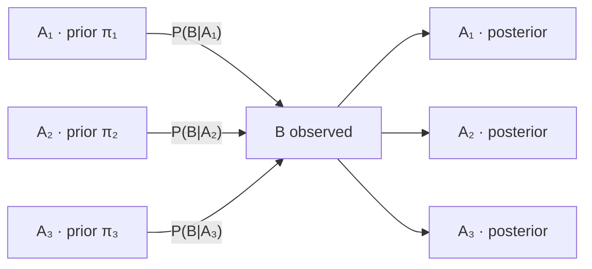

# Bayes' Rule

Bayes' rule is the multiplication rule solved for the other conditional. One line of algebra, no new axiom, and nothing on this page that [Conditional Probability](03-conditional-probability.md) has not already supplied. It is also the line most quantitative research gets wrong, because the input it demands — the base rate of the thing being tested for — is the one input nobody measures.

The page covers the two-event form, the partition form, the odds form and its logarithm, sequential updating, and the screening arithmetic that is the rule's whole reason to exist in a book about trading. The denominators come from the two-block decomposition at the end of [Conditional Probability](03-conditional-probability.md) and, in general, from the [Law of Total Probability](06-law-of-total-probability.md). Where the rule is applied to a parameter rather than an event, it becomes [Posterior Distributions](../part-16-bayesian-statistics/03-posterior-distributions.md); where it is applied repeatedly to a running signal, it becomes [Bayesian Signal Updating](../part-18-quant-finance-applications/07-bayesian-signal-updating.md).

## Inverting a Conditional

The multiplication rule factors $\mathbf{P}(A\cap B)$ two ways, and the two must agree:

$$\mathbf{P}(A\mid B)\,\mathbf{P}(B) = \mathbf{P}(A\cap B) = \mathbf{P}(B\mid A)\,\mathbf{P}(A).$$

Dividing through by $\mathbf{P}(B)>0$,

$$\mathbf{P}(A\mid B) = \frac{\mathbf{P}(B\mid A)\,\mathbf{P}(A)}{\mathbf{P}(B)}.$$

That is the whole derivation. Its importance is entirely about which of the four quantities are knowable: the conditional on the right is usually a property of a *procedure* and can be computed, while the conditional on the left is a statement about the *world* and is what the decision requires.

| Name | Symbol | Function of what | Where it comes from |
|---|---|---|---|
| Prior | $\mathbf{P}(A)$ | the hypothesis, before seeing $B$ | a base rate — measured, assumed, or ignored |
| Likelihood | $\mathbf{P}(B\mid A)$ | the data, given the hypothesis | the model or the test's design |
| Evidence | $\mathbf{P}(B)$ | the data, unconditionally | the [Law of Total Probability](06-law-of-total-probability.md) |
| Posterior | $\mathbf{P}(A\mid B)$ | the hypothesis, after seeing $B$ | the rule |

!!! note "The likelihood is not a probability of the hypothesis"
    $\mathbf{P}(B\mid A)$ is a probability over $B$ for each fixed $A$, so it sums to one across the possible data. Read the other way — as a function of $A$ for fixed observed $B$ — it is a **likelihood**, and it does not sum to one across hypotheses. That is exactly why the denominator exists: it is the constant that turns a likelihood back into a probability distribution over hypotheses. Maximizing the likelihood over $A$ ignores that constant entirely, which is legitimate and is [Maximum Likelihood Estimation](../part-11-parameter-estimation/03-maximum-likelihood-estimation.md); it is also why maximum likelihood answers a different question than Bayes does.

## The Two-Hypothesis Form

Substituting the two-block decomposition of [Conditional Probability](03-conditional-probability.md) for the denominator gives the form that gets used:

$$\mathbf{P}(A\mid B) = \frac{\mathbf{P}(B\mid A)\,\mathbf{P}(A)}{\mathbf{P}(B\mid A)\,\mathbf{P}(A)+\mathbf{P}(B\mid A^\mathsf{C})\,\mathbf{P}(A^\mathsf{C})}.$$

Take the canonical use in quantitative research. A researcher screens strategy ideas; let $A$ be "this idea has a real edge" and $B$ be "the backtest is significant at the 5% level". Suppose one screened idea in twenty has an edge, so $\mathbf{P}(A) = 0.05$; suppose the test has 80% power, so $\mathbf{P}(B\mid A) = 0.80$; and by construction the test rejects a true null 5% of the time, so $\mathbf{P}(B\mid A^\mathsf{C}) = 0.05$. Then

$$\mathbf{P}(A\mid B) = \frac{(0.05)(0.80)}{(0.05)(0.80)+(0.95)(0.05)} = 0.4571.$$

!!! note "A test with 80% power at 5% significance is wrong more often than not on a 5% prior"
    The significant result did move the belief — from 5% to 46%, a factor of nine. It did not move it past a coin flip. The reason is arithmetic rather than statistical: 95% of ideas are worthless, and 5% of those still pass, so the 4.75% of the screen that consists of false positives outnumbers the 4% that consists of true ones. Nothing about the test is defective; it is doing exactly what a 5% test does. The defect is in reading $\mathbf{P}(B\mid A^\mathsf{C})$ as if it were $\mathbf{P}(A^\mathsf{C}\mid B)$ — the transposed conditional, whose price is set by exactly this base rate.

### Reading the Screen as Counts

The same calculation is often clearer as a tally. Run ten thousand ideas through the screen under the assumptions above:

| | **Significant** | **Not significant** | Total |
|---|---|---|---|
| **Has an edge** | 400 | 100 | 500 |
| **No edge** | 475 | 9,025 | 9,500 |
| Total | 875 | 9,125 | 10,000 |

The first column is what reaches a research meeting: 875 candidates, of which 400 are real, giving the same $400/875 = 0.4571$. The 475 false positives are not a failure of the test — a 5% test applied to 9,500 dead ideas is *supposed* to return about 475 of them — and they outnumber the 400 real finds because there are nineteen times as many dead ideas to draw from. The bottom-right cell, the 9,025 ideas correctly discarded, is the only large number in the table and the only one nobody ever looks at.

Two levers change the first column, and neither is statistical. Raising power moves ideas from the second column into the first along the top row, and at 80% there are only 100 left to recover. Shrinking the pool of screened ideas shrinks the 475 proportionally, and that lever has no ceiling. This is why "test fewer things" outperforms "test more carefully" in almost every research process.

The posterior is a function of the prior, and the function is steep where it matters:

```python
power, alpha = 0.80, 0.05                       # sensitivity, false-positive rate

for prior in (0.500, 0.200, 0.050, 0.010):
    post = power * prior / (power * prior + alpha * (1 - prior))
    print(f"prior {prior:.3f} -> posterior {post:.4f}")
# => prior 0.500 -> posterior 0.9412
#    prior 0.200 -> posterior 0.8000
#    prior 0.050 -> posterior 0.4571
#    prior 0.010 -> posterior 0.1391
```

At a prior of one half — a researcher testing a single well-motivated idea — a significant result is 94% likely to be real. At a prior of one in a hundred, which is a fair description of an automated parameter sweep, the same result is 13.9% likely to be real, and the researcher who acts on it is wrong six times out of seven. The p-value is identical in both rows. The only thing that changed is how many ideas were in the pool, which is why [Hypothesis Testing and Multiple Testing](../../part-03-statistics/04-hypothesis-testing-and-multiple-testing.md) treats the number of ideas screened as a first-class input and why controlling the [False Discovery Rate](../part-15-multiple-testing/03-false-discovery-rate.md) — the expected share of claimed discoveries that are false — is a more honest target than controlling the p-value alone.

## The Partition Form

When the hypotheses are more than two, let $A_1,A_2,\ldots$ partition $\Omega$. The denominator becomes the full sum of the [Law of Total Probability](06-law-of-total-probability.md):

$$\mathbf{P}(A_i\mid B) = \frac{\mathbf{P}(B\mid A_i)\,\mathbf{P}(A_i)}{\sum_{j}\mathbf{P}(B\mid A_j)\,\mathbf{P}(A_j)}.$$

??? note "Why the denominator is exactly the normalizing constant"
    Sum both sides over $i$. The denominator does not depend on $i$, so it factors out, and the numerators sum to precisely the same expression:

    $$\sum_i\mathbf{P}(A_i\mid B) = \frac{\sum_i\mathbf{P}(B\mid A_i)\,\mathbf{P}(A_i)}{\sum_j\mathbf{P}(B\mid A_j)\,\mathbf{P}(A_j)} = 1.$$

    So the denominator is not an independent quantity to be computed — it is whatever makes the posteriors sum to one, and it can always be recovered at the end from the unnormalized numerators.

    That observation is the entire content of the proportionality convention $p(\theta\mid x)\propto p(x\mid\theta)\,p(\theta)$, in the $\propto$ notation of [Mathematical Notation](../part-01-mathematical-foundations/03-mathematical-notation.md), and it is why [Posterior Distributions](../part-16-bayesian-statistics/03-posterior-distributions.md) can work with unnormalized densities throughout. It is also why sampling methods that only ever evaluate ratios of the posterior never need the constant at all.



Evidence reweights the blocks; it does not replace them. A block with prior zero has posterior zero no matter what is observed, and a block the model never listed cannot be inferred at all — which is the structural reason a misspecified hypothesis set produces confident wrong answers rather than uncertain ones.

## The Odds Form

Dividing the partition form for $A$ by the same expression for $A^\mathsf{C}$ cancels the denominator entirely and leaves a product of two ratios:

$$\underbrace{\frac{\mathbf{P}(A\mid B)}{\mathbf{P}(A^\mathsf{C}\mid B)}}_{\text{posterior odds}} = \underbrace{\frac{\mathbf{P}(B\mid A)}{\mathbf{P}(B\mid A^\mathsf{C})}}_{\text{likelihood ratio}}\cdot\underbrace{\frac{\mathbf{P}(A)}{\mathbf{P}(A^\mathsf{C})}}_{\text{prior odds}}.$$

This is the form to use when only the relative plausibility of two hypotheses matters, which is most of the time. The likelihood ratio is the entire contribution of the evidence, and it is a property of the test alone: a 5% test with 80% power has $\Lambda = 0.80/0.05 = 16$ whatever the base rate.

### Log-Odds and Additive Evidence

Taking logarithms turns the product into a sum,

$$\log\frac{\mathbf{P}(A\mid B)}{\mathbf{P}(A^\mathsf{C}\mid B)} = \log\Lambda + \log\frac{\mathbf{P}(A)}{\mathbf{P}(A^\mathsf{C})},$$

which is the same products-to-sums move that motivates log returns in [Exponentials, Logarithms, and Growth](../part-01-mathematical-foundations/07-exponentials-logarithms-growth.md). Independent pieces of evidence contribute additively on this scale.

```python
prior_odds = 0.05 / 0.95
lr = 0.80 / 0.05                                # likelihood ratio of one test

for k in range(4):
    odds = prior_odds * lr ** k
    print(f"k={k} confirmations: odds {odds:8.4f}  posterior {odds / (1 + odds):.4f}")
# => k=0 confirmations: odds   0.0526  posterior 0.0500
#    k=1 confirmations: odds   0.8421  posterior 0.4571
#    k=2 confirmations: odds  13.4737  posterior 0.9309
#    k=3 confirmations: odds 215.5789  posterior 0.9954
```

One confirming test moves a 5% prior to 46%; two move it to 93%; three to 99.5%. The multiplication is what makes replication so much more powerful than a single stronger test — and it is valid only if the tests are independent given the hypothesis, which is a substantive assumption and usually a false one. Two backtests of the same idea on overlapping data are not two confirmations. What conditional independence requires, and how badly it fails when signals share inputs, is [Independence](05-independence.md).

!!! note "Evidence accumulates additively in log-odds"
    Because the update is additive in $\log\Lambda$, a model that predicts a binary outcome by summing weighted features is doing Bayesian updating with one term per feature — which is precisely what the linear predictor of a [Logistic Regression](../part-13-regression/04-logistic-regression.md) is, and why its coefficients are read as log-odds contributions rather than probabilities. The same structure explains why signal ensembles are usually built by summing standardized scores: on the log-odds scale, summing is the correct combination rule, and [Feature and Signal Engineering](../../part-04-strategy-development/05-feature-and-signal-engineering.md) is largely the practice of making the terms independent enough for the sum to mean something.

## Sequential Updating

Evidence rarely arrives at once. Suppose $B_1$ is observed and then $B_2$. Applying Bayes' rule inside the measure $\mathbf{P}(\cdot\mid B_1)$ gives

$$\mathbf{P}(A\mid B_1\cap B_2) = \frac{\mathbf{P}(B_2\mid A\cap B_1)\,\mathbf{P}(A\mid B_1)}{\mathbf{P}(B_2\mid B_1)}.$$

??? note "Proof"
    [Conditional Probability](03-conditional-probability.md) established that $\mathbf{Q}(\cdot) = \mathbf{P}(\cdot\mid B_1)$ satisfies all three axioms and is therefore a probability measure. Bayes' rule is a theorem about any probability measure, so it applies to $\mathbf{Q}$ verbatim:

    $$\mathbf{Q}(A\mid B_2) = \frac{\mathbf{Q}(B_2\mid A)\,\mathbf{Q}(A)}{\mathbf{Q}(B_2)}.$$

    Expanding each $\mathbf{Q}$ back into $\mathbf{P}$ gives the display above, since $\mathbf{Q}(A\mid B_2) = \mathbf{P}(A\mid B_1\cap B_2)$ and $\mathbf{Q}(B_2\mid A) = \mathbf{P}(B_2\mid A\cap B_1)$ by the definition of conditional probability applied twice.

    Nothing here is a new result. That the whole of sequential inference falls out of "a conditional probability is a probability" is the cleanest possible payoff for proving that theorem.

### Yesterday's Posterior Is Today's Prior

The structural reading is that the posterior after $B_1$ appears in the numerator exactly where a prior appears in the ordinary rule, so the recursion never needs to revisit the older data — only the running belief and the new observation. A system that maintains a regime probability does not store twenty-five years of returns; it stores one number and updates it once per bar.

That property is not automatic, and it is worth being precise about what buys it. The recursion above is exact with no assumptions at all, but its middle factor $\mathbf{P}(B_2\mid A\cap B_1)$ still mentions $B_1$, so in general the history has to be kept after all. The recursion becomes tractable when the new evidence is conditionally independent of the old given the hypothesis, so that $\mathbf{P}(B_2\mid A\cap B_1) = \mathbf{P}(B_2\mid A)$ and the likelihood does not have to be re-derived at each step. Whether that simplification is legitimate is exactly the question [Independence](05-independence.md) answers, and it is the assumption that fails most often in practice.

Granted, the recursion is the filter: it is the forward pass of [Bayesian Methods and Hidden Markov Models](../../part-03-statistics/06-bayesian-methods-and-hmms.md), the update step of [Bayesian Updating](../part-16-bayesian-statistics/05-bayesian-updating.md), and the reason a regime probability can be maintained online without storing history.

## What Bayes' Rule Costs You

The rule is exact. Its inputs are not, and each of the three is a distinct way to be confidently wrong.

**The base rate you did not measure.** The prior is the input with no natural default, and assuming it away means assuming it is one half. The posterior after an identical significant result, across plausible priors:

| Assumed prior | Posterior after a 5%-significant, 80%-power result |
|---|---|
| 0.05 — a curated shortlist of ideas | 0.4571 |
| 0.01 — a broad automated screen | 0.1391 |
| 0.002 — an exhaustive parameter sweep | 0.0311 |

The bottom row is the situation a grid search actually creates, and its posterior is *lower* than the 5% significance level the result was celebrated for. No amount of statistical rigour in the test recovers it; the only fix is to screen fewer things or to demand a much larger likelihood ratio.

**The likelihood you assumed.** $\mathbf{P}(B\mid A)$ is a model, not a measurement. A likelihood computed under a Gaussian assumption assigns an absurdly small probability to a six-sigma move, so observing one produces an enormous likelihood ratio in favour of whatever hypothesis was allowed to have fat tails — an artefact of the tail model rather than evidence about the world. Since returns are not Gaussian, as [Heavy-Tailed Returns](../part-18-quant-finance-applications/12-heavy-tailed-returns.md) documents, likelihood ratios computed on extreme observations are the least trustworthy numbers in the whole calculation, and they are the ones that move posteriors most.

**The independence you borrowed.** Multiplying likelihood ratios requires conditional independence. When the same signal is counted several times under different names, the multiplication proceeds anyway and the posterior climbs on no new information at all:

```python
prior_odds, lam = 0.05 / 0.95, 3.0              # m signals, each with LR = 3

for m in (1, 3, 5):
    naive = prior_odds * lam ** m               # treated as independent
    honest = prior_odds * lam                   # they are one signal, copied
    print(f"m={m}  naive posterior {naive / (1 + naive):.4f}   "
          f"honest {honest / (1 + honest):.4f}")
# => m=1  naive posterior 0.1364   honest 0.1364
#    m=3  naive posterior 0.5870   honest 0.1364
#    m=5  naive posterior 0.9275   honest 0.1364
```

Five copies of one signal produce a posterior of 92.75% where the truth is 13.64% — the belief is wrong by a factor of seven, and every step of the arithmetic was correct. Five momentum signals over 20, 40, 60, 90, and 120 days are much closer to this picture than to five independent tests.

The rule is exact and its inputs are estimates, so the posterior inherits every error in all three. That is why [Bayesian Signal Updating](../part-18-quant-finance-applications/07-bayesian-signal-updating.md) is a page about where the inputs come from, and not a page about algebra.
