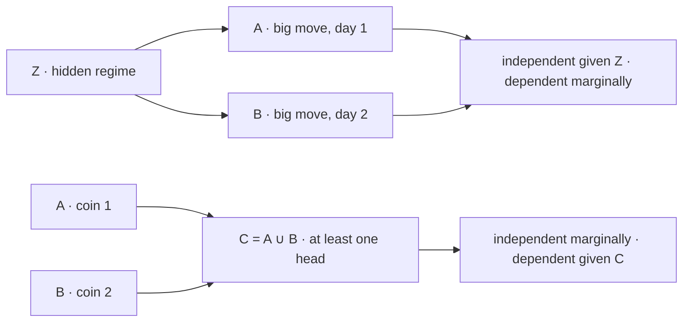

# Independence

Independence is a statement about a measure, not about a set. Two events are independent when $\mathbf{P}(A\cap B)$ happens to equal $\mathbf{P}(A)\mathbf{P}(B)$ — an arithmetic coincidence between three numbers, invisible to the sets themselves, and one that can be destroyed by changing the measure while leaving $A$ and $B$ untouched. Disjointness, which sounds like the same idea, is a property of the sets alone and is very nearly its opposite.

This page covers the definition and its symmetry, the disjointness confusion, independence of complements, the gap between pairwise and mutual independence, conditional independence in *both* directions, and the abbreviation "iid" that [Mathematical Notation](../part-01-mathematical-foundations/03-mathematical-notation.md) routes here. The failure modes get as much space as the definitions, because independence is the assumption that quietly underwrites nearly every result in the rest of the appendix, and it is the one most often false in markets.

## The Definition, and Why It Is Symmetric

Events $A$ and $B$ are **independent** when

$$\mathbf{P}(A\cap B) = \mathbf{P}(A)\,\mathbf{P}(B).$$

The intuition that knowing one tells nothing about the other is recovered by dividing. Provided both probabilities are positive, the three statements

$$\mathbf{P}(A\mid B) = \mathbf{P}(A)\quad\Longleftrightarrow\quad \mathbf{P}(A\cap B)=\mathbf{P}(A)\mathbf{P}(B)\quad\Longleftrightarrow\quad \mathbf{P}(B\mid A)=\mathbf{P}(B)$$

are equivalent, each obtained from the middle one by the definition of conditional probability in [Conditional Probability](03-conditional-probability.md). The product form is taken as primary for two reasons: it is visibly symmetric in $A$ and $B$, so "$A$ is independent of $B$" needs no ordering; and it remains meaningful when $\mathbf{P}(B) = 0$, where the conditional form is undefined.

Independence is not a property that can be read off a diagram, and there is no notation for it in this book — the assertion is always written in words, because it is always an assumption being made rather than a structure being observed.

## Disjoint Is Not Independent

Disjointness says $A\cap B = \varnothing$: the sets share no outcomes. Independence says the measure factorizes. The two conditions coincide only in degenerate cases, and where they disagree they disagree maximally.

Suppose $A$ and $B$ are disjoint with $\mathbf{P}(A)>0$ and $\mathbf{P}(B)>0$. Then $\mathbf{P}(A\cap B) = 0$ while $\mathbf{P}(A)\mathbf{P}(B)>0$, so

$$A\cap B=\varnothing,\ \ \mathbf{P}(A)\,\mathbf{P}(B)>0 \implies \mathbf{P}(A\mid B) = 0 \neq \mathbf{P}(A).$$

They are not merely dependent — they are *maximally* dependent. Observing $B$ does not shade the probability of $A$ downward; it resolves $A$ completely, in the negative. There is no stronger informational relationship two events can have.

??? note "The only events independent of themselves"
    Take $B = A$ in the definition. Then $A$ is independent of itself exactly when

    $$\mathbf{P}(A) = \mathbf{P}(A\cap A) = \mathbf{P}(A)^2,$$

    which forces $\mathbf{P}(A)\in\{0,1\}$.

    The corollary sharpens the disjointness point. If $A$ is both disjoint from $B$ and independent of it, then $\mathbf{P}(A)\mathbf{P}(B) = 0$, so one of them is null. Only events of probability zero or one can be disjoint from something *and* independent of it, and those are precisely the events that carry no information in the first place. So the two notions are not merely different concepts that happen to overlap rarely — outside the trivial cases they are mutually exclusive, which is the precise sense in which they are in tension.

| Relation | Condition | $\mathbf{P}(A\mid B)$ | Reads as |
|---|---|---|---|
| Disjoint | $\mathbf{P}(A\cap B) = 0$ | $0$ | $B$ rules $A$ out entirely |
| Independent | $\mathbf{P}(A\cap B) = \mathbf{P}(A)\mathbf{P}(B)$ | $\mathbf{P}(A)$ | $B$ says nothing about $A$ |
| Positively dependent | $\mathbf{P}(A\cap B) > \mathbf{P}(A)\mathbf{P}(B)$ | $>\mathbf{P}(A)$ | $B$ makes $A$ likelier |
| $A\subset B$ | $\mathbf{P}(A\cap B) = \mathbf{P}(A)$ | $\mathbf{P}(A)/\mathbf{P}(B)$ | $B$ is implied by $A$ |

The distinction has a direct portfolio reading. Two strategies whose holding periods never overlap are disjoint in time and therefore not diversified — they are anti-scheduled, and the fact that they are never in the market together is a scheduling artefact rather than a risk property. Diversification is a statement about how their returns co-move *when both are live*, which is a covariance question and belongs to [Risk Parity, Diversification, and Factors](../../part-08-portfolio-management/03-risk-parity-diversification-factors.md). Non-overlap answers a different question than the one that was asked.

## Independence of Complements

If $A$ and $B$ are independent, so are $A$ and $B^\mathsf{C}$, and by symmetry so are $A^\mathsf{C}$ and $B$, and $A^\mathsf{C}$ and $B^\mathsf{C}$.

??? note "Proof"
    The difference rule of [Probability Axioms](02-probability-axioms.md) splits $A$ by whether $B$ occurred:

    $$\mathbf{P}(A\cap B^\mathsf{C}) = \mathbf{P}(A)-\mathbf{P}(A\cap B) = \mathbf{P}(A)-\mathbf{P}(A)\,\mathbf{P}(B) = \mathbf{P}(A)\big(1-\mathbf{P}(B)\big) = \mathbf{P}(A)\,\mathbf{P}(B^\mathsf{C}),$$

    where the second equality is the independence hypothesis. Swapping the roles of $A$ and $B$ gives the $A^\mathsf{C},B$ case, and applying the result twice gives $A^\mathsf{C},B^\mathsf{C}$.

The result is used far more often than it is stated. The probability that none of $m$ independent tests produces a false positive is

$$\mathbf{P}\!\left(\bigcap_{i=1}^{m}A_i^\mathsf{C}\right) = \prod_{i=1}^{m}\big(1-\alpha\big) = (1-\alpha)^m,$$

and that computation factorizes the intersection of *complements*, which the definition of independence does not directly license. It is this lemma that supplies the step. The familywise error rate $1-(1-\alpha)^m$ that [Multiple Comparisons](../part-15-multiple-testing/01-multiple-comparisons.md) is built around is one de Morgan move away from it, and the whole calculation is invalid the moment the tests are dependent — which is why the assumption-free [Bonferroni Correction](../part-15-multiple-testing/02-bonferroni-correction.md) exists as an alternative.

## Mutual Independence and Why Pairwise Is Not Enough

For a collection $A_1,\ldots,A_n$, **mutual independence** requires the product rule to hold for *every* sub-collection:

$$\mathbf{P}\!\left(\bigcap_{i\in S}A_i\right) = \prod_{i\in S}\mathbf{P}(A_i)\qquad\text{for every }S\subset\{1,\ldots,n\}\text{ with }\lvert S\rvert\ge 2.$$

That is $2^n - n - 1$ separate conditions, counted by subtracting the $n$ singletons and the empty set from the $2^n$ subsets in [Counting Principles](../part-01-mathematical-foundations/02-counting-principles.md). Checking pairs verifies only $\binom{n}{2}$ of them — for ten events, 45 conditions out of 1,013.

**Pairwise independence does not imply mutual independence**, and the smallest counterexample fits on two coins:

```python
from itertools import product

omega = list(product([0, 1], repeat=2))         # two fair flips, 1 = head
P = lambda S: len(S) / len(omega)

A = [w for w in omega if w[0] == 1]             # first flip is a head
B = [w for w in omega if w[1] == 1]             # second flip is a head
C = [w for w in omega if w[0] != w[1]]          # the two flips differ
inter = lambda *S: [w for w in omega if all(w in s for s in S)]

print(f"marginals: P(A) {P(A):.3f}  P(B) {P(B):.3f}  P(C) {P(C):.3f}")
print(f"pairwise:  P(A&B) {P(inter(A, B)):.3f} = {P(A) * P(B):.3f}, "
      f"P(A&C) {P(inter(A, C)):.3f} = {P(A) * P(C):.3f}, "
      f"P(B&C) {P(inter(B, C)):.3f} = {P(B) * P(C):.3f}")
print(f"triple:    P(A&B&C) {P(inter(A, B, C)):.3f}  vs  "
      f"P(A)P(B)P(C) {P(A) * P(B) * P(C):.3f}")
# => marginals: P(A) 0.500  P(B) 0.500  P(C) 0.500
#    pairwise:  P(A&B) 0.250 = 0.250, P(A&C) 0.250 = 0.250, P(B&C) 0.250 = 0.250
#    triple:    P(A&B&C) 0.000  vs  P(A)P(B)P(C) 0.125
```

Every pair factorizes exactly. The triple does not, and it fails as badly as it can: knowing any two of the three events determines the third, so $A\cap B\cap C$ is empty. No amount of pairwise checking would ever have found it, because there is nothing wrong with any pair.

The portfolio reading is immediate and uncomfortable. A correlation matrix is a table of *pairwise* statements — it has $\binom{n}{2}$ entries and says nothing about any triple. A book of assets whose pairwise correlations are all near zero can still have a joint tail event in which everything moves together, and the gap between "pairwise independent" and "jointly independent" is exactly where diversification stops working. That gap is what [Drawdowns, Tail Risk, and Stress Testing](../../part-08-portfolio-management/05-drawdowns-tail-risk-stress-testing.md) is measuring and what [Copulas](../part-18-quant-finance-applications/15-copulas.md) exists to model, because the joint structure is not recoverable from the margins and the pairwise correlations.

## Conditional Independence Runs in Both Directions

Events $A$ and $B$ are **conditionally independent given $C$** when

$$\mathbf{P}(A\cap B\mid C) = \mathbf{P}(A\mid C)\,\mathbf{P}(B\mid C),\qquad\mathbf{P}(C)>0.$$

Neither implication between independence and conditional independence holds. Both failures matter, and they fail in opposite directions.

### Independent, Then Conditionally Dependent

Let $A$ and $B$ be independent fair coins and let $C = A\cup B$ be "at least one head". Then $\mathbf{P}(C) = 3/4$, and conditioning on $C$ removes only the outcome where both are tails. Within that restricted universe, learning that the first coin was tails forces the second to have been heads — the coins have become perfectly informative about each other.

This is **explaining away**: conditioning on a common consequence induces dependence between causes that were independent to begin with. It is also the mechanism by which conditioning on a selected sample manufactures relationships that do not exist in the population.

### Dependent, Then Conditionally Independent

Now the reverse. Let $Z$ be a hidden regime, calm or turbulent with probability $1/2$ each, and let $A$ and $B$ be "a big move on day one" and "a big move on day two". Suppose the daily big-move rate is 5% in the calm regime and 40% in the turbulent one, and that the two days are independent *given* the regime. Marginally the two days are then strongly dependent, because a big move on day one is evidence that the regime is turbulent, which makes a big move on day two likelier.

```python
# explaining away: A, B independent fair coins, C = "at least one head"
pA = pB = 0.5
pC = 1 - 0.5 * 0.5
print(f"explaining away:  P(A|C) {pA / pC:.4f}   P(A&B|C) {0.25 / pC:.4f}   "
      f"P(A|C)P(B|C) {(pA / pC) * (pB / pC):.4f}")

# hidden state: calm or turbulent with probability 1/2, big-move rates 0.05 / 0.40
p_calm, p_turb = 0.05, 0.40
pA = 0.5 * p_calm + 0.5 * p_turb
pAB = 0.5 * p_calm ** 2 + 0.5 * p_turb ** 2
print(f"hidden state:     P(A) {pA:.4f}     P(A&B) {pAB:.4f}     "
      f"P(A)P(B) {pA * pA:.4f}")
print(f"dependence ratio: {pAB / pA ** 2:.3f}")
# => explaining away:  P(A|C) 0.6667   P(A&B|C) 0.3333   P(A|C)P(B|C) 0.4444
#    hidden state:     P(A) 0.2250     P(A&B) 0.0813     P(A)P(B) 0.0506
#    dependence ratio: 1.605
```

In the first line, $1/3$ against $4/9$: two independent coins are dependent once a consequence of both is observed. In the second, two conditionally independent days show a joint big-move rate of 8.13% against the 5.06% independence would predict — a dependence ratio of 1.605 arising from a mechanism in which nothing depends on anything, once the regime is known.



The two shapes are the whole content of the section. An arrow *out* of a common node makes its children marginally dependent and conditionally independent; two arrows *into* a common node make its parents marginally independent and conditionally dependent. Which of the two a modeller is looking at determines whether conditioning helps or hurts, and the shapes are indistinguishable from correlations alone.

!!! note "Volatility clustering is conditional independence seen from outside"
    The second example is the entire emission structure of a [Hidden Markov Model](../part-08-stochastic-processes/07-hidden-markov-models.md): observations independent given the hidden state, dependent once the state is marginalized away. That is why return *magnitudes* look strongly autocorrelated while *signs* look patternless — the regime persists and drives the scale of the moves, but it says nothing about their direction. A model that sees only the dependence and posits a direct day-to-day mechanism is fitting the marginal shadow of a latent variable, which is what [Market Regimes](../../part-01-foundations/06-market-regimes.md) is about and what makes the volatility models of [Time Series](../../part-03-statistics/03-time-series.md) work as well as they do.

## Independent and Identically Distributed

The abbreviation **iid** bundles two claims that fail separately and for different reasons. A sequence $X_1,\ldots,X_n$ is iid when the variables are mutually independent and share a common distribution $F$, so that for every choice of thresholds

$$\mathbf{P}(X_1\le x_1,\ldots,X_n\le x_n) = \prod_{i=1}^{n}\mathbf{P}(X_i\le x_i) = \prod_{i=1}^{n}F(x_i).$$

The statement is legitimate at this level because each $\{X_i\le x_i\}$ is an event, as [Probability Spaces](01-probability-spaces.md) establishes; what $F$ is and how it is manipulated belongs to [Random Variables](../part-03-random-variables/01-random-variables.md) and [Cumulative Distribution Functions](../part-03-random-variables/02-cumulative-distribution-functions.md).

| Independent? | Identically distributed? | Example | What breaks |
|---|---|---|---|
| yes | yes | a fair coin | nothing |
| yes | no | returns spanning a volatility regime change | the common $F$; sample variance estimates a blend of two regimes |
| no | yes | a stationary AR(1) series | the product; effective sample size falls below $n$ |
| no | no | real daily returns | both |

The two failures have different signatures. Non-identical distribution corrupts what is being estimated — a sample standard deviation across a regime change is a number that describes no period. Dependence corrupts the *precision* of the estimate while often leaving it unbiased, which is more dangerous, because the point estimate looks fine and only the error bar is wrong.

```python
import numpy as np

n = 100_000
rng = np.random.default_rng(5)
A = rng.random(n) < 0.30                        # two genuinely independent events
B = rng.random(n) < 0.30

rng = np.random.default_rng(6)
turb = rng.random(n) < 0.25                     # a shared hidden regime
A2 = rng.random(n) < np.where(turb, 0.60, 0.20)
B2 = rng.random(n) < np.where(turb, 0.60, 0.20)

for name, x, y in (("independent", A, B), ("shared regime", A2, B2)):
    print(f"{name:<14s} P(A) {x.mean():.4f}  P(B) {y.mean():.4f}  "
          f"P(A&B) {(x & y).mean():.4f}  product {x.mean() * y.mean():.4f}")
# => independent    P(A) 0.2994  P(B) 0.3012  P(A&B) 0.0907  product 0.0902
#    shared regime  P(A) 0.3000  P(B) 0.2997  P(A&B) 0.1192  product 0.0899
```

Both rows have the same marginals — 30% for each event, by construction — and only the joint behaviour differs. The independent pair co-occurs 9.07% of the time against a predicted 9.02%; the regime-driven pair co-occurs 11.92% against a predicted 8.99%, a third more often than the product rule allows. Any procedure that inspects the margins alone cannot tell the two rows apart, and every diagnostic that reports marginal frequencies is such a procedure.

!!! note "Nearly every theorem in the appendix assumes iid, and markets are not"
    The list is long and load-bearing: [Bernoulli Processes](../part-08-stochastic-processes/02-bernoulli-processes.md) are iid by definition, the [Weak Law of Large Numbers](../part-07-asymptotic-theory/01-weak-law-of-large-numbers.md) and the [Central Limit Theorem](../part-07-asymptotic-theory/03-central-limit-theorem.md) assume it, [Bootstrap Methods](../part-09-monte-carlo-methods/07-bootstrap-methods.md) resample as if it held, and the $\sqrt{252}$ annualization of [Exponentials, Logarithms, and Growth](../part-01-mathematical-foundations/07-exponentials-logarithms-growth.md) is a direct consequence of it. None of these results is wrong; each simply computes the answer to a question about an iid world. How far the market's answer is from that one is an empirical matter, and the honest practice is to write the assumption down at the point where it enters rather than to discover it later in a drawdown.

The empirical counterpart to this page is already in the course. [Probability and Random Variables](../../part-03-statistics/01-probability-and-random-variables.md) tests the iid-coin model against twenty-five years of index data and finds monthly extreme-day counts *tamer* than iid predicts — eight observed against roughly thirteen expected — which is a failure of the assumption in the less-expected direction. This page supplies the null that finding is measured against; that page supplies the data.

## Why the Independence Assumption Is the Expensive One

Three consequences, all computed elsewhere in the book, all resting on the same hypothesis.

| Result | What it assumes | What breaks when it fails | Where |
|---|---|---|---|
| Familywise error $1-(1-\alpha)^m$ | the $m$ tests are mutually independent | overstated at 0.6415 for $m=20$ and 0.9941 for $m=100$ when tests overlap; the [Bonferroni Correction](../part-15-multiple-testing/02-bonferroni-correction.md) bounds it without the assumption | [Multiple Comparisons](../part-15-multiple-testing/01-multiple-comparisons.md) |
| $\sqrt{T}$ volatility scaling | zero autocorrelation, so covariance cross-terms vanish | monthly volatility understated by 21% at an AR(1) coefficient of just $0.2$ | [Exponentials, Logarithms, and Growth](../part-01-mathematical-foundations/07-exponentials-logarithms-growth.md) |
| Sharpe ratio standard error | iid returns, so the effective sample size is $n$ | confidence intervals too narrow; a strategy looks distinguishable from zero when it is not | [Performance Metrics and Reporting](../../part-05-backtesting-engine/04-performance-metrics-and-reporting.md) |

The middle row is the one worth sitting with. An autocorrelation of $0.2$ at lag one is small enough that most tests would not reject zero on a few years of data, and it inflates the true monthly volatility 21% above what $\sqrt{21}$ scaling reports. Every risk number computed downstream — position size, drawdown expectation, capital requirement — is scaled by that same understated figure.

Independence is never observed, only assumed. The discipline is to write the assumption down where it enters, because when it fails it does not gently degrade the answer — it changes its order of magnitude.
