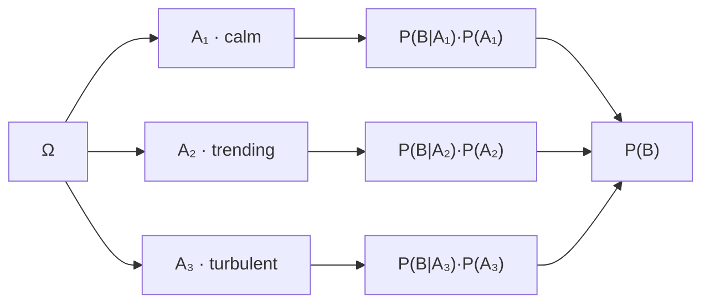

# Law of Total Probability

A partition turns an unanswerable question into a weighted average of answerable ones. The probability of a market event, unconditionally, is usually a quantity nobody can estimate; the same probability within a calm regime and within a turbulent one, together with how often each occurs, usually is. The law says those three numbers determine the first exactly.

The weighting is exact, not an approximation. That distinction is the reason the law is used in both directions: forwards, to assemble an unconditional probability from conditional pieces; and backwards, as a *generative* recipe in which nature picks a block and then draws from the corresponding conditional law. Read backwards it is a mixture model, and mixture models are where fat tails come from.

The page covers the general and countable forms, first-step analysis, mixtures, partitions that cannot be observed, the boundary at continuous conditioning, and the extension from probability to expectation. It builds directly on the two-block case at the end of [Conditional Probability](03-conditional-probability.md) and supplies the denominator that [Bayes' Rule](04-bayes-rule.md) inverts.

## Partitions and the Decomposition

Let $\{A_1, A_2, \ldots\}$ be a partition of $\Omega$ — pairwise disjoint, with union everything, in the sense of [Sets and Functions](../part-01-mathematical-foundations/01-sets-and-functions.md). Any event $B$ is then carved into the pieces it shares with each block:

$$B = \bigcup_{i}(B\cap A_i),\qquad (B\cap A_i)\cap(B\cap A_j)=\varnothing\ \text{ for }i\neq j,$$

and additivity followed by the multiplication rule gives the law:

$$\mathbf{P}(B) = \sum_{i}\mathbf{P}(B\cap A_i) = \sum_{i}\mathbf{P}(B\mid A_i)\,\mathbf{P}(A_i).$$

??? note "Proof"
    **The blocks carve $B$.** $B = B\cap\Omega = B\cap\bigcup_i A_i = \bigcup_i(B\cap A_i)$, the last step by distributivity.

    **The pieces are disjoint.** If $i\neq j$ then $(B\cap A_i)\cap(B\cap A_j) = B\cap(A_i\cap A_j) = B\cap\varnothing = \varnothing$, because the blocks are pairwise disjoint.

    **Additivity applies.** For a finite partition this needs only the third axiom; for a countably infinite one it needs the countable strengthening of [Probability Axioms](02-probability-axioms.md), which is the only place the two versions of the law differ. Then $\mathbf{P}(B) = \sum_i\mathbf{P}(B\cap A_i)$, and the multiplication rule replaces each term with $\mathbf{P}(B\mid A_i)\mathbf{P}(A_i)$.

    A block with $\mathbf{P}(A_i)=0$ makes its conditional undefined, and the convention is to drop the term — legitimate because $\mathbf{P}(B\cap A_i)\le\mathbf{P}(A_i) = 0$ by monotonicity, so the term contributes nothing whatever value is assigned to the conditional.



The two-block form on [Conditional Probability](03-conditional-probability.md) is the case $\{B, B^\mathsf{C}\}$, and it is the version [Bayes' Rule](04-bayes-rule.md) uses for its denominator. Nothing else about the general case is different in kind — only in how many terms the sum has.

## The Countable Case

$$\mathbf{P}(B) = \sum_{i=1}^{\infty}\mathbf{P}(B\mid A_i)\,\mathbf{P}(A_i).$$

The most valuable countable partition is not a list of scenarios but a decomposition by *what happens first*. Conditioning on the first step of a process partitions the sample space by the outcome of one trial and expresses the answer in terms of the same question asked from a new starting point.

### First-Step Analysis

Let a gambler start with $k$ units, win one unit with probability $p$ and lose one with probability $1-p$ on each bet, and stop on reaching $N$ or $0$. Write $u_k$ for the probability of reaching $N$ before $0$. Partitioning on the first bet's outcome — a two-block partition, applied at every interior $k$ — gives

$$u_k = p\,u_{k+1} + (1-p)\,u_{k-1},\qquad u_0=0,\ u_N=1.$$

For a fair game the solution is $u_k = k/N$, and for $p\neq\tfrac12$ it is a ratio of geometric terms; the general derivation belongs to [Random Walks](../part-08-stochastic-processes/11-random-walks.md) and is not repeated here. What matters at this level is that the recursion *is* the law of total probability, and that solving it is linear algebra rather than probability:

```python
import numpy as np

def ruin(N, p):                                 # solve u_k = p*u_{k+1} + q*u_{k-1}
    q = 1 - p
    M = np.zeros((N - 1, N - 1))
    np.fill_diagonal(M, 1.0)
    np.fill_diagonal(M[1:, :], -q)              # the u_{k-1} coefficient
    np.fill_diagonal(M[:, 1:], -p)              # the u_{k+1} coefficient
    b = np.zeros(N - 1)
    b[-1] = p                                   # boundary condition u_N = 1
    return np.linalg.solve(M, b)

N, k, ratio = 100, 50, 0.51 / 0.49
print(f"N={N}, p=0.49, k={k}: closed form {(1 - ratio ** k) / (1 - ratio ** N):.6f}"
      f"   linear solve {ruin(N, 0.49)[k - 1]:.6f}")
for p in (0.50, 0.49, 0.45):
    print(f"p={p:.2f} -> {ruin(N, p)[k - 1]:.6f}")
# => N=100, p=0.49, k=50: closed form 0.119175   linear solve 0.119175
#    p=0.50 -> 0.500000
#    p=0.49 -> 0.119175
#    p=0.45 -> 0.000044
```

A fair coin doubles a fifty-unit bankroll half the time. A 49% coin — a one-percent disadvantage, invisible in any short sample — doubles it 11.9% of the time. A 45% coin does it four times in a hundred thousand. The edge moved by five percentage points and the survival probability moved by four orders of magnitude, because the recursion compounds the disadvantage once per bet rather than once per experiment.

That is the arithmetic of ruin, and it is why [Position Sizing and Risk Budgeting](../../part-04-strategy-development/06-position-sizing-and-risk-budgeting.md) is a statement about the number of bets and the size of each rather than about the edge alone — the same computation, run on a strategy's bet size instead of a gambler's unit, is [Probability of Ruin](../part-18-quant-finance-applications/02-probability-of-ruin.md).

## Mixtures: The Law as a Model

Read the law backwards and it stops being a computation and becomes a generative recipe: choose a block $A_i$ with probability $\mathbf{P}(A_i)$, then draw from the conditional law $\mathbf{P}(\cdot\mid A_i)$. The result is a **mixture**, and mixtures manufacture fat tails out of components that have none.

For a return $R$ drawn from a calm regime with probability $1-\pi$ and a turbulent one with probability $\pi$,

$$\mathbf{P}\big(\lvert R\rvert>c\big) = (1-\pi)\,\mathbf{P}\big(\lvert R\rvert>c\mid\text{calm}\big) + \pi\,\mathbf{P}\big(\lvert R\rvert>c\mid\text{turbulent}\big).$$

Both components below are Gaussian, and the comparison is against a *single* Gaussian with the same total variance — so any difference is attributable to the mixing alone and not to a heavier ingredient:

```python
import numpy as np
from scipy.stats import norm

pi, s_calm, s_turb = 0.15, 0.008, 0.025
s_matched = np.sqrt((1 - pi) * s_calm ** 2 + pi * s_turb ** 2)
print(f"variance-matched single normal: sigma = {s_matched:.6f}")

for c in (0.02, 0.03, 0.04):
    mix = 2 * ((1 - pi) * norm.sf(c / s_calm) + pi * norm.sf(c / s_turb))
    one = 2 * norm.sf(c / s_matched)
    print(f"threshold {c:.0%}: mixture {mix:.6f}  matched normal {one:.6f}  ratio {mix / one:5.2f}")
# => variance-matched single normal: sigma = 0.012172
#    threshold 2%: mixture 0.074113  matched normal 0.100350  ratio  0.74
#    threshold 3%: mixture 0.034671  matched normal 0.013711  ratio  2.53
#    threshold 4%: mixture 0.016440  matched normal 0.001015  ratio 16.20
```

The first row is the one to read deliberately, because it looks like an error and is not: at a 2% threshold the mixture is **thinner** than the matched normal, at 7.4% against 10.0%. That is the correct behaviour. Eighty-five percent of the mass sits in a distribution with a 0.8% standard deviation, for which 2% is already two and a half sigma, so the shoulders are underpopulated relative to a single wider bell. The compensation arrives further out: at 3% the mixture is 2.5 times fatter, and at 4% it is 16 times fatter, because in that region essentially all the probability comes from the turbulent component and the matched normal has run out of tail.

Thin shoulders and a fat tail, with the same variance — that is the shape of every real return histogram, and it is what an excess kurtosis above eleven, as measured on index data in [Probability and Random Variables](../../part-03-statistics/01-probability-and-random-variables.md), looks like from outside the model.

!!! note "A fat tail is often a thin tail with a hidden partition"
    Nothing in the calculation above required a heavy-tailed ingredient; both components were Gaussian. The heaviness was manufactured entirely by mixing over a partition, which means that observing fat tails is not by itself evidence for a heavy-tailed data-generating process. It is equally consistent with a light-tailed process whose parameters change. The two explanations imply completely different risk management — one says extreme moves are irreducible, the other says they are predictable given the regime — and telling them apart is the subject of [Heavy-Tailed Returns](../part-18-quant-finance-applications/13-heavy-tailed-returns.md) and [Returns and Distributions](../../part-03-statistics/02-returns-and-distributions.md).

## Partitions You Cannot Observe

The law requires only that the blocks partition $\Omega$. It does not require that anyone can tell which block occurred — a formal point with large practical consequences, because the most useful partitions in finance are exactly the unobservable ones.

### Regimes as a Latent Partition

Two consequences follow immediately. First, the unconditional risk number is a weighted average of numbers that describe no actual day, as the two-regime computation on [Conditional Probability](03-conditional-probability.md) makes concrete. Second, and more usefully, the weights $\mathbf{P}(A_i)$ are themselves objects to be inferred, and inferring them from an observation is [Bayes' Rule](04-bayes-rule.md) applied to a partition:

$$\mathbf{P}(A_i\mid B) = \frac{\mathbf{P}(B\mid A_i)\,\mathbf{P}(A_i)}{\sum_j\mathbf{P}(B\mid A_j)\,\mathbf{P}(A_j)}.$$

When the partition also evolves, the weights need a transition rule. Take a two-state regime with these one-day transition probabilities:

| From \ To | Calm | Turbulent |
|---|---|---|
| **Calm** | 0.97 | 0.03 |
| **Turbulent** | 0.10 | 0.90 |

Propagating the weights forward is the law of total probability applied once per step: the probability of being calm tomorrow is the probability of being calm today times the chance of staying, plus the probability of being turbulent today times the chance of switching.

```python
import numpy as np

P = np.array([[0.97, 0.03],                     # calm -> calm, calm -> turbulent
              [0.10, 0.90]])                    # turbulent -> calm, -> turbulent
pi0 = np.array([1.0, 0.0])                      # today is calm

for n in (1, 5, 20, 100):
    pi_n = pi0 @ np.linalg.matrix_power(P, n)
    print(f"n={n:>3d}  P(calm) {pi_n[0]:.4f}  P(turbulent) {pi_n[1]:.4f}")
print(f"stationary (10/13, 3/13) = ({10 / 13:.4f}, {3 / 13:.4f})")
# => n=  1  P(calm) 0.9700  P(turbulent) 0.0300
#    n=  5  P(calm) 0.8843  P(turbulent) 0.1157
#    n= 20  P(calm) 0.7835  P(turbulent) 0.2165
#    n=100  P(calm) 0.7692  P(turbulent) 0.2308
#    stationary (10/13, 3/13) = (0.7692, 0.2308)
```

Certainty about today decays into the long-run mix of $(10/13, 3/13)$, reached to four decimals by a hundred days and to two by twenty. Knowing today's regime is worth a great deal about tomorrow and almost nothing about next quarter, which is why regime-conditioned position sizing has a horizon beyond which it stops paying.

The recursion needed no new probability theory — it is the law applied once per step, which is exactly why [Markov Chains](../part-08-stochastic-processes/05-markov-chains.md) can be developed with the tools already on this page. The version in which the state is never directly observed, and must be inferred from emissions by the Bayes step above, is [Hidden Markov Models](../part-08-stochastic-processes/07-hidden-markov-models.md), and it is the formal object underneath the discussion in [Market Regimes](../../part-01-foundations/06-market-regimes.md).

## Conditioning on a Random Variable's Value

When the partition is generated by a discrete random variable $Y$, the blocks are the events $\{Y=y\}$ and the law reads

$$\mathbf{P}(B) = \sum_{y}\mathbf{P}(B\mid Y=y)\,\mathbf{P}(Y=y).$$

Nothing new is required: each $\{Y=y\}$ is an event by the measurability argument of [Probability Spaces](01-probability-spaces.md), and the blocks partition $\Omega$ because $Y$ takes exactly one value on each outcome.

!!! warning "Conditioning on a probability-zero event is a different object"
    For continuous $Y$ this construction fails at the first step. Every block $\{Y=y\}$ has probability zero, so every conditional in the sum is undefined and the sum itself has uncountably many terms. The repair is real but structural: the sum becomes an integral against a density, and the conditional probability becomes a conditional density defined as a limit rather than a ratio. That construction is [Conditional Distributions](../part-03-random-variables/07-conditional-distributions.md), and the object it produces is built on [Probability Density Functions](../part-03-random-variables/04-probability-density-functions.md). Part II stops here, at partitions of positive probability.

## From Total Probability to Total Expectation

The law extends from probabilities to averages with no new machinery. Apply it to each event $\{X=x\}$ for a discrete random variable $X$:

$$\mathbf{P}(X=x) = \sum_{i}\mathbf{P}(X=x\mid A_i)\,\mathbf{P}(A_i),$$

then multiply by $x$, sum over $x$, and exchange the order of summation to obtain the **law of total expectation**:

$$\mathbb{E}[X] = \sum_{i}\mathbb{E}[X\mid A_i]\,\mathbf{P}(A_i).$$

??? note "Proof"
    Expectation of a discrete $X$ is $\mathbb{E}[X] = \sum_x x\,\mathbf{P}(X=x)$. Substituting the display above and multiplying through by $x$ gives a double sum over $x$ and $i$. Exchanging the two sums collects, for each block $i$, the quantity $\sum_x x\,\mathbf{P}(X=x\mid A_i)$, which is the expectation of $X$ under the measure $\mathbf{P}(\cdot\mid A_i)$ — legitimate because [Conditional Probability](03-conditional-probability.md) established that this is a probability measure, so expectation under it is defined in the ordinary way. Factoring $\mathbf{P}(A_i)$ out of the inner sum gives the result.

    For a finite partition and a finite-valued $X$ the exchange is a rearrangement of finitely many terms and needs no justification. For infinite sums it requires absolute convergence, which is exactly the condition [Sequences and Infinite Series](../part-01-mathematical-foundations/04-sequences-and-series.md) attaches to rearrangement, and which is why $\mathbb{E}[X]$ is defined only when $\mathbb{E}[\lvert X\rvert]<\infty$.

The trading reading uses numbers already on this page. Suppose calm days occur 85% of the time with a mean return of $+0.06\%$, and turbulent days 15% of the time with a mean of $-0.15\%$. Then

$$\mathbb{E}[R] = (0.85)(0.0006)+(0.15)(-0.0015) = 0.000285,$$

which is $0.0285\%$ per day, or about $7.18\%$ over 252 trading days. That number is the headline annual return a backtest would print, and it describes neither regime: on 85% of days the strategy earns more than it, and on 15% of days it loses money outright. Reporting it alone is not wrong — it is the correct expectation — but it is a weighted average of two facts, and the weights are exactly the thing that changes when the market does.

The same construction applied to the second moment splits variance into a within-block piece and a between-block piece, which is the [Law of Total Variance](../part-04-expectation-and-moments/08-law-of-total-variance.md). Conditioning on a random variable rather than a partition turns $\mathbb{E}[X\mid A_i]$ into a random variable in its own right, which is [Conditional Expectation](../part-04-expectation-and-moments/06-conditional-expectation.md), and the identity above restated at that level is the [Law of Total Expectation](../part-04-expectation-and-moments/07-law-of-total-expectation.md).
