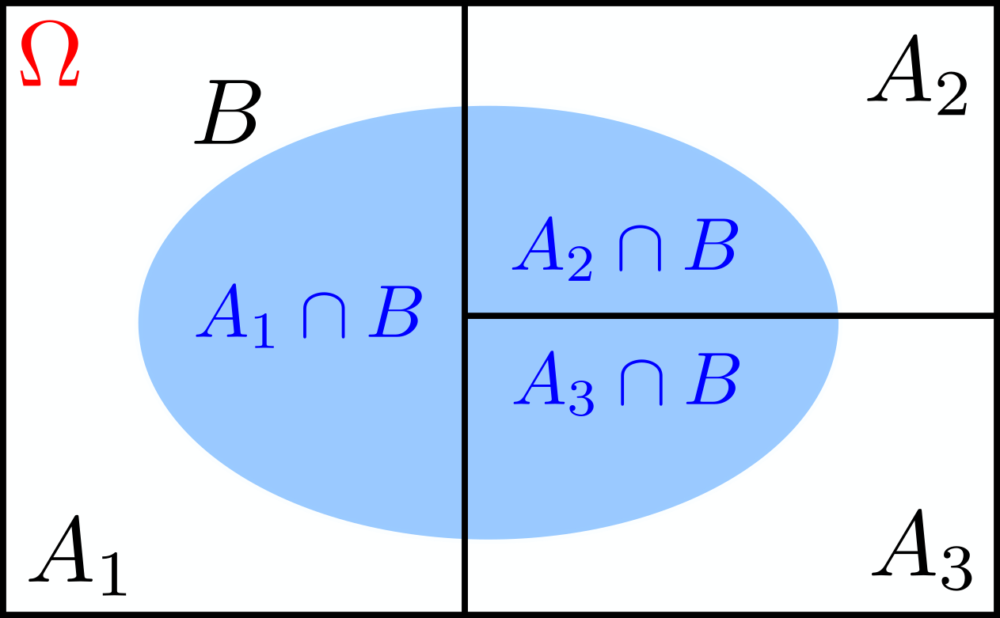

# Law of Total Probability

## Total Probability Theorem

Let's partition our sample space $\Omega$ into $A_1, A_2$ and $A_3$, as shown in the figure below.

  { width="250" .center }

Then, for any set $B$, we have

$$\begin{align}
\mathbf{P}(B)&=\mathbf{P}(A_1\cap B)+\mathbf{P}(A_2\cap B)+\mathbf{P}(A_3\cap B)\\
&=\mathbf{P}(A_1)\,\mathbf{P}(B\lvert A_1)+\mathbf{P}(A_2)\,\mathbf{P}(B\lvert A_2)+\mathbf{P}(A_3)\,\mathbf{P}(B\lvert A_3).
\end{align}$$

In general,

$$\mathbf{P}(B)=\sum_{i}\mathbf{P}(A_i)\,\mathbf{P}(B\lvert A_i).$$
