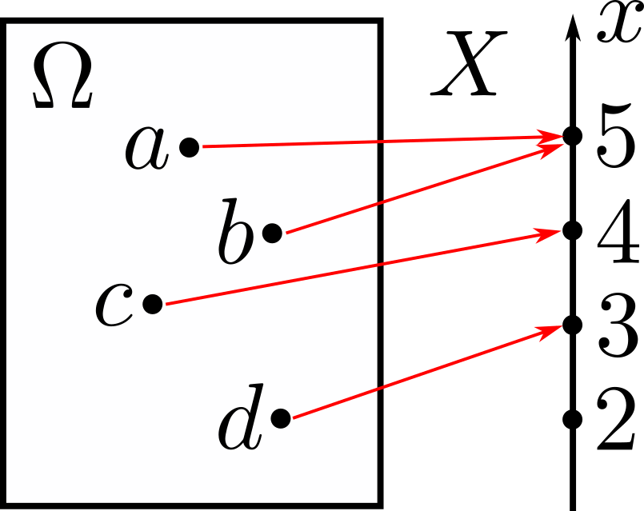

# Random Variables

## Introduction to Random Variables

  { width="150" .center }

A **random variable** $X$ is a function or a mapping from the sample space $\Omega$ to the real numbers, i.e., it associates a real number to every possible outcome. Mathematically, we say that

$$X:\Omega\rightarrow\mathbb{R}.$$

We denote a random variable by a capital letter, e.g., $X$, and its numerical values by a small letter, e.g., $x$. A function of one or several random variables is also a random variable. For example, $X+Y$ is a random variable whose value is $x+y$ when $X=x$ and $Y=y$. There can be several random variables defined on a single sample space.

A random variable can be discrete or continuous. Consider tossing a coin 5 times. We can define a random variable as the number of heads that come up. In this case, we have a discrete random variable. We might also consider the height of students in a university, in which case we have a continuous random variable.

## Discrete Random Variables

A **discrete random variable** takes ***countably*** many values. We say that a set is **countable** if we can put the elements into a one-to-one correspondence with the set of integers.

The probability law of a discrete random variable is its [probability mass function](03-probability-mass-functions.md); a continuous random variable is instead described by its [probability density function](04-probability-density-functions.md).
