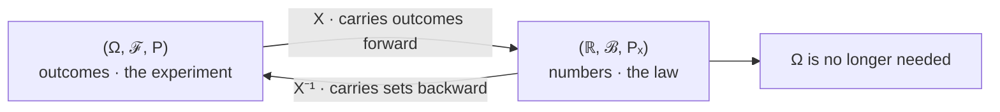

# Random Variables

A random variable is neither random nor a variable. It is a function $X:\Omega\to\mathbb{R}$, fixed and deterministic, and the only randomness anywhere in the construction is in which $\omega$ the experiment produces. What the function buys is the ability to stop talking about $\Omega$ at all: it pushes the probability measure forward onto the real line, and from that point the original sample space can be discarded without losing anything that $X$ could ever have told you.

This page covers the map and its notation, measurability restated as a condition that can actually be checked, the induced law and the sense in which two unrelated experiments can be the same random variable, the discrete–continuous–mixed trichotomy, and the information $X$ destroys. It does not develop $F$, $p$, or $f$; those are named in a table at the end and handed to [Cumulative Distribution Functions](02-cumulative-distribution-functions.md), [Probability Mass Functions](03-probability-mass-functions.md), and [Probability Density Functions](04-probability-density-functions.md). Nothing here is averaged — expectation is [Part IV](../part-04-expectation-and-moments/index.md).

Choosing $X$ is the second one-way door, after choosing $\Omega$. A quantity that is not a function of the random variables you recorded is not merely unmeasured — it is unmodelled, permanently, and no amount of later analysis recovers it. Every backtest that stores a daily return series has made this choice, usually without noticing, and [Probability and Random Variables](../../part-03-statistics/01-probability-and-random-variables.md) works with the resulting object throughout.

## A Function From Outcomes to Numbers

Given a probability space $(\Omega,\mathcal{F},\mathbf{P})$ from [Probability Spaces](../part-02-probability-foundations/01-probability-spaces.md), a **random variable** is a map

$$X:\Omega\longrightarrow\mathbb{R}$$

assigning one real number to each outcome. The convention is rigid and worth respecting: capital letters $X,Y,Z$ for the function, lowercase $x,y,z$ for a value it might take. The expression $\{X\le x\}$ is not a comparison of two numbers but shorthand for the *set* $\{\omega\in\Omega:X(\omega)\le x\}$, and keeping that in view is most of what makes the notation of [Mathematical Notation](../part-01-mathematical-foundations/03-mathematical-notation.md) readable.

Three examples, all on sample spaces the course actually uses:

| Experiment | $\Omega$ | $X(\omega)$ |
|---|---|---|
| Five coin tosses | the $2^5$ sequences of H and T | the number of heads |
| One trading day | the day's full tick sequence | the close-to-close log return |
| One trading day | the day's full tick sequence | the session's running maximum drawdown |

The last two share a sample space and are different random variables, which is the normal situation: many functions live on one $\Omega$, and choosing which to record is a modelling decision rather than a mathematical one. A function of random variables is again a random variable — $X+Y$, $X^2$, and $\max(X,Y)$ are all maps from the same $\Omega$ to $\mathbb{R}$ — and the machinery for working out their laws is [Functions of Random Variables](08-functions-of-random-variables.md).

## Measurability, Restated as a Working Condition

Not every function on $\Omega$ deserves the name. For $\mathbf{P}(X\le x)$ to mean anything, the set $\{X\le x\}$ has to be an event — an element of $\mathcal{F}$ — and the requirement is that this holds for every $x$:

$$X^{-1}\big((-\infty,x]\big)\in\mathcal{F}\qquad\text{for all }x\in\mathbb{R}.$$

This looks like a restriction on which sets you may ask about, and it is really a restriction on which functions may be called random variables. It is also far weaker than it first appears, because checking the rays is enough to get every Borel set for free.

??? note "Why checking the rays is enough"
    Let $\mathcal{G}=\{B\subseteq\mathbb{R}:X^{-1}(B)\in\mathcal{F}\}$, the collection of subsets of the line whose preimages are events. The claim is that $\mathcal{G}$ is a σ-algebra.

    Preimages commute with all the set operations, as [Sets and Functions](../part-01-mathematical-foundations/01-sets-and-functions.md) establishes: $X^{-1}(B^\mathsf{C})=\big(X^{-1}(B)\big)^\mathsf{C}$ and $X^{-1}\big(\bigcup_n B_n\big)=\bigcup_n X^{-1}(B_n)$. So if $B\in\mathcal{G}$ then $X^{-1}(B)\in\mathcal{F}$, hence its complement is in $\mathcal{F}$ because $\mathcal{F}$ is a σ-algebra, hence $B^\mathsf{C}\in\mathcal{G}$; and the same argument runs for countable unions. Also $X^{-1}(\mathbb{R})=\Omega\in\mathcal{F}$. So $\mathcal{G}$ is closed under complement and countable union and contains the whole line: it is a σ-algebra.

    Now suppose $\mathcal{G}$ contains every ray $(-\infty,x]$. A σ-algebra containing a collection contains the σ-algebra that collection generates, and the rays generate the Borel sets $\mathcal{B}(\mathbb{R})$. Therefore $\mathcal{B}(\mathbb{R})\subseteq\mathcal{G}$: the preimage of *every* Borel set is an event.

    This is the theorem that makes the distribution function a complete description rather than a partial one. Knowing $\mathbf{P}(X\le x)$ for all $x$ pins down $\mathbf{P}_X$ on all of $\mathcal{B}(\mathbb{R})$, which is why the next page can define one function of one real variable and claim to have specified the entire law.

Had probability been built on images rather than preimages, none of this would work — images do not commute with complements, and the collection of sets they produce is closed under nothing in particular. The direction of the arrow is the whole design.

## The Induced Law, and Why $\Omega$ Can Be Discarded

Measurability lets the measure be transported. Define, for each Borel set $B$,

$$\mathbf{P}_X(B)=\mathbf{P}\big(X^{-1}(B)\big)=\mathbf{P}(X\in B).$$

$\mathbf{P}_X$ is called the **law** or **distribution** of $X$, and it lives on $(\mathbb{R},\mathcal{B}(\mathbb{R}))$ rather than on $\Omega$.

??? note "Proof that the law is a probability measure"
    Non-negativity is inherited, since $\mathbf{P}_X(B)=\mathbf{P}(X^{-1}(B))\ge 0$. Normalization holds because $X^{-1}(\mathbb{R})=\Omega$, so $\mathbf{P}_X(\mathbb{R})=\mathbf{P}(\Omega)=1$.

    For countable additivity, let $B_1,B_2,\ldots$ be pairwise disjoint Borel sets. Their preimages are pairwise disjoint too: if $\omega\in X^{-1}(B_i)\cap X^{-1}(B_j)$ then the single number $X(\omega)$ lies in both $B_i$ and $B_j$, contradicting disjointness. (This step is where preimages earn their keep — images of disjoint sets need not be disjoint.) Since preimages also commute with countable unions,

    $$\mathbf{P}_X\Big(\bigcup_i B_i\Big)=\mathbf{P}\Big(\bigcup_i X^{-1}(B_i)\Big)=\sum_i\mathbf{P}\big(X^{-1}(B_i)\big)=\sum_i\mathbf{P}_X(B_i),$$

    the middle equality being countable additivity of $\mathbf{P}$ from [Probability Axioms](../part-02-probability-foundations/02-probability-axioms.md). So $\mathbf{P}_X$ satisfies all three axioms.



Two arrows, and only one of them is ever used in a calculation. The forward arrow carries individual outcomes to numbers and is how the model is *specified*. The backward arrow carries *sets* — never points — from the line to $\Omega$, and it is how every probability is actually *computed*: to find $\mathbf{P}(X\in B)$, pull $B$ back and measure the event you land on. Once $\mathbf{P}_X$ has been worked out for all $B$, the backward arrow has done its job and $\Omega$ can be dropped, which is the third node.

```python
import numpy as np
from itertools import product

law = {}
for f in product([0, 1], repeat=3):                     # 8 equally likely coin outcomes
    law[sum(f)] = law.get(sum(f), 0) + 1 / 8
keys = sorted(law)
print("three coins      " + "  ".join(f"{k}: {law[k]:.4f}" for k in keys))

rng = np.random.default_rng(3)
edges = np.cumsum([law[k] for k in keys])               # bucket uniforms by that same law
idx = np.searchsorted(edges, rng.random(2_000_000), side="left")
print("one uniform draw " + "  ".join(f"{k}: {(idx == k).mean():.4f}" for k in keys))
# => three coins      0: 0.1250  1: 0.3750  2: 0.3750  3: 0.1250
#    one uniform draw 0: 0.1247  1: 0.3753  2: 0.3749  3: 0.1251
```

The first line counts heads on a space of eight coin sequences. The second slices the unit interval — an uncountable space with no coins anywhere in it — and reports which piece a uniform draw landed in. The two experiments have nothing in common at the level of outcomes, and they are the same random variable, because they induce the same law.

!!! note "Two experiments with nothing in common can have identical laws, and the law is all that survives"
    This is what makes simulation legitimate: reproducing a law is enough, and the mechanism that produces it is free. It is also the precise sense in which a backtest is lossy. Storing a daily return series keeps $\mathbf{P}_X$ and throws away $\Omega$ — the order book, the queue position, the reason the number was what it was — and every question that was a function of those and not of the return is now unanswerable from the stored data. That is usually the right trade. It is never a free one, and the next section makes the cost concrete.

## Discrete, Continuous, and Mixed

The trichotomy is a statement about where the law puts its mass, which is to say about the atoms of $\mathbf{P}_X$.

| Kind | Support | Atoms | Described by | Market example |
|---|---|---|---|---|
| Discrete | countable | carries all the mass | a mass function | trade count, fill sign, tick increments |
| Continuous | uncountable | none | a density | an idealized log return |
| Mixed | uncountable | some, but not all | neither alone | a stopped return, a sometimes-flat strategy |

Discrete means the support is **countable** — in one-to-one correspondence with a subset of the integers, in the sense of [Sets and Functions](../part-01-mathematical-foundations/01-sets-and-functions.md). Continuous in the sense used here means no single point carries positive probability, so $\mathbf{P}(X=a)=0$ for every $a$, and the mass has to be described by how it spreads over intervals instead. The third row is the one textbooks skip and markets produce constantly.

```python
import numpy as np

rng = np.random.default_rng(2)
live = rng.random(500_000) < 0.40                       # in the market 40% of days
X = np.where(live, rng.normal(0.0004, 0.011, 500_000), 0.0)
print(f"P(X = 0) exactly            {(X == 0).mean():.4f}")
for w in (1e-2, 1e-4, 1e-6):
    print(f"P(0 < |X| < {w:.0e})          {((X != 0) & (np.abs(X) < w)).mean():.6f}")
# => P(X = 0) exactly            0.6003
#    P(0 < |X| < 1e-02)          0.254594
#    P(0 < |X| < 1e-04)          0.002848
#    P(0 < |X| < 1e-06)          0.000024
```

Shrink the window by a factor of a hundred and the probability of landing in it falls by about a hundred, twice over: $0.2546$, then $0.002848$, then $0.000024$. That is the continuous part behaving as a continuous part must, its mass vanishing with the width of the interval. Meanwhile the mass exactly at zero does not move at all, because it is not spread over anything — $60.03\%$ of the days sit on a single point.

!!! note "A strategy that is sometimes flat is neither discrete nor continuous"
    No mass function describes this law, because the flat days are a countable support carrying only $60\%$ of the mass. No density describes it either, because a density integrates to zero over a single point and would have to account for that $60\%$. The law is perfectly well defined and simply has no representation of either kind. What does describe it, completely and with no caveats, is its distribution function — a curve with a step in the middle of it. That is the concrete reason the next page is about $F$ rather than about $p$ or $f$, and it is a common shape: any strategy with a flat state, any position with a hard cap, any payoff with a stop.

## What $X$ Cannot Answer

The map is many-to-one, and everything it collapses is gone. The formal name for what survives is the σ-algebra generated by $X$, written $\sigma(X)$ — the collection of events of the form $\{X\in B\}$, which is strictly coarser than $\mathcal{F}$ whenever $X$ is not injective. An event outside $\sigma(X)$ has no probability assigned to it by the law, not because the probability is unknown but because the question is not expressible.

The three-coin example makes the coarsening countable. The full $\mathcal{F}$ on eight sequences has $2^8=256$ events, and it can answer *did the second toss come up heads*. The head-count map sends HTT, THT, and TTH to the same number, so $\sigma(X)$ is built from only four atoms — the level sets $\{X=0\},\ldots,\{X=3\}$ — and contains $2^4=16$ events. The question about the second toss is not among them. It has not become uncertain; it has stopped being a question about $X$, and if the sequences were never recorded there is nothing left to ask it of.

This is the same picture as the information-granularity discussion in [Probability Spaces](../part-02-probability-foundations/01-probability-spaces.md), read in the other direction: that page starts from a σ-algebra and asks what it can describe, and this one starts from a measurement and asks what σ-algebra it leaves behind. The trading version is not a toy.

```python
import numpy as np

rng = np.random.default_rng(1)
paths, steps = 200_000, 78                              # 78 five-minute bars in a session
inc = rng.normal(0, 0.01 / np.sqrt(steps), (paths, steps))
cum = inc.cumsum(axis=1)
X = cum[:, -1]                                          # the close-to-close return
touched = cum.min(axis=1) <= -0.01                      # was it ever down a full percent?

flat = np.abs(X) < 0.001
print(f"P(touched -1% intraday)            {touched.mean():.4f}")
print(f"P(touched -1% | closed within 0.1%) {touched[flat].mean():.4f}   n={flat.sum()}")
# => P(touched -1% intraday)            0.2853
#    P(touched -1% | closed within 0.1%) 0.1034   n=15954
```

Better than one day in ten that closed within a tenth of a percent of unchanged had been down a full percent at some point during the session. Those days and the genuinely quiet ones are indistinguishable in $X$: they map to the same numbers, so no function of the closing return — no volatility estimate, no drawdown statistic, nothing — separates them. The information is not noisy or hard to extract. It is absent, because the map removed it.

!!! warning "A quantity that is not a function of your random variable is not merely unmeasured — it is unmodelled"
    The distinction matters because the two failures have different remedies and only one of them is available after the fact. Unmeasured means the data exist and you did not look; unmodelled means the map you chose cannot express the question, and the only repair is a different map, applied to data you may no longer have. A backtest run on daily closes cannot be interrogated about intraday path risk at any later date, which is why the sizing rules in [Position Sizing and Risk Budgeting](../../part-04-strategy-development/06-position-sizing-and-risk-budgeting.md) that depend on path behaviour need the path recorded up front — and why the choice of $X$ deserves the same scrutiny as the choice of model.

## Naming the Law: $F$, $p$, and $f$

The law $\mathbf{P}_X$ is a function on Borel sets, which is unwieldy. In practice it is described by one function of one real variable, and there are three candidates:

| Description | Defined as | Exists for | Determines the law? | Developed in |
|---|---|---|---|---|
| $F_X(x)$ | $\mathbf{P}(X\le x)$ | every random variable | yes, always | [Cumulative Distribution Functions](02-cumulative-distribution-functions.md) |
| $p_X(x)$ | $\mathbf{P}(X=x)$ | discrete laws only | yes, when it exists | [Probability Mass Functions](03-probability-mass-functions.md) |
| $f_X(x)$ | $\tfrac{d}{dx}F_X(x)$ | laws with no atoms and enough smoothness | yes, when it exists | [Probability Density Functions](04-probability-density-functions.md) |

Only the first row has no precondition, which is the reason it comes first and the reason the other two are written as answers to the question of what $F$ looks like in a particular case. The joint versions for several variables at once are [Joint Distributions](05-joint-distributions.md).

The law is everything you keep and $\Omega$ is everything you discard, and the discarding is not a step in the analysis — it happens the moment the map is chosen, silently, before any data arrives. Choosing $X$ is therefore choosing which questions remain answerable forever. No later modelling recovers a distinction the map has already erased, and the ones most often erased are the path-dependent ones, which are also the ones that determine whether a position survives long enough to collect its expected return.
