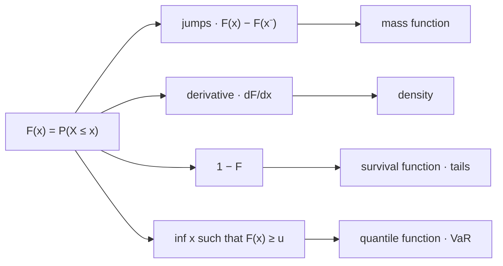

# Cumulative Distribution Functions

The distribution function is the only description of a law that always exists. A mass function requires a countable support and a density requires smoothness, and plenty of laws — including every empirical one, and every strategy that is sometimes flat — have neither. $F$ has no such precondition, it determines the law completely, and everything the next two pages construct is an answer to the question of what $F$ happens to look like in a particular case.

This page covers $F$ as the measure of a ray, the four properties that characterize it, jumps as atoms, interval probabilities computed from $F$ alone, the survival function, and the quantile function as a generalized inverse. Densities are [Probability Density Functions](04-probability-density-functions.md) and what happens to $F$ under a transformation is [Functions of Random Variables](08-functions-of-random-variables.md); the concern here is the object itself, before it is specialized to any particular shape.

Value at Risk is a value of $F^{-1}$ and nothing else. That identification is the whole trading stake of the page, and it explains a fact practitioners meet early and rarely have a name for: a 99% historical VaR is ambiguous in its first significant figure, for exactly the same reason a discrete distribution function is a step function rather than a curve. [Risk Measurement](../../part-08-portfolio-management/01-risk-measurement.md) computes these numbers on real books; this page is about what kind of object is being computed.

## $F$ as the Measure of a Ray

For a random variable $X$ on a probability space, the **cumulative distribution function** is

$$F_X(x)=\mathbf{P}(X\le x)=\mathbf{P}_X\big((-\infty,x]\big),$$

the induced law of [Random Variables](01-random-variables.md) evaluated on the ray running left from $x$. The second equality is the useful one: $F$ is not a new construction but the pushforward measure restricted to a particularly simple family of sets, and the reason that family suffices is the ray argument on the previous page — the rays generate the Borel σ-algebra, so a measure agreeing with $\mathbf{P}_X$ on all of them agrees with it everywhere.

The choice of $\le$ rather than $<$ is a convention, and it is not cosmetic. It is what makes $F$ right-continuous rather than left-continuous, and every downstream definition — where the jumps sit, which endpoint a quantile picks, whether $F^{-1}$ uses an infimum or a supremum — inherits it.

## The Four Properties

$F_X$ is non-decreasing, tends to $0$ at $-\infty$ and to $1$ at $+\infty$, and is right-continuous at every point:

$$x\le y\implies F_X(x)\le F_X(y),\qquad \lim_{x\to-\infty}F_X(x)=0,\qquad \lim_{x\to+\infty}F_X(x)=1,\qquad \lim_{h\downarrow 0}F_X(x+h)=F_X(x).$$

??? note "Proof of all four"
    **Monotone.** If $x\le y$ then $(-\infty,x]\subseteq(-\infty,y]$, so the claim is monotonicity of measure, proved from the axioms in [Probability Axioms](../part-02-probability-foundations/02-probability-axioms.md).

    **The two limits.** Take any sequence $x_n\downarrow-\infty$. The events $\{X\le x_n\}$ decrease with empty intersection, since no real number is below every $x_n$, so continuity from above gives $F_X(x_n)\to\mathbf{P}(\varnothing)=0$. For $x_n\uparrow+\infty$ the events increase with union $\Omega$ — every outcome maps to some real number, because $X$ is a function into $\mathbb{R}$ — so continuity from below gives $F_X(x_n)\to 1$. Both continuity properties are consequences of countable additivity, which is why an only finitely additive measure need not have a distribution function at all.

    **Right-continuous.** This is the property the $\le$ convention buys, and it is worth doing slowly. Fix $x$ and take $h_n\downarrow 0$. The events $\{X\le x+h_n\}$ decrease, and their intersection is

    $$\bigcap_{n}\{X\le x+h_n\}=\{X\le x\},$$

    because $X(\omega)\le x+h_n$ for every $n$ forces $X(\omega)\le\inf_n(x+h_n)=x$. Continuity from above then gives $F_X(x+h_n)\to F_X(x)$. Note where the argument would fail with $<$: the intersection of $\{X<x+h_n\}$ is $\{X\le x\}$ as well, which is strictly larger than $\{X<x\}$ whenever $x$ is an atom — so the left-continuous convention produces a function that jumps *before* reaching its argument.

These four properties do not merely follow from being a distribution function; they characterize it. Any function with them is the distribution function of some random variable, and the construction proving it is inverse-transform sampling on [Change of Variables](09-change-of-variables.md).

!!! note "Right-continuity is a convention, and it is the convention every quantile inherits"
    Defining $F(x)=\mathbf{P}(X<x)$ instead would produce a left-continuous function satisfying the other three properties, and every theorem on this page would survive with the inequalities reflected. The choice is arbitrary and it is universal, which is the only thing that matters: it fixes $F(x)$ to include the mass *at* $x$, and that is why the quantile function below is defined with an infimum and a $\ge$ rather than a supremum and a $>$. Mixing the two conventions in one codebase produces off-by-one-atom errors that are invisible on continuous data and wrong on any series with repeated values.

## Jumps Are Atoms

Write $F_X(x^-)=\lim_{h\downarrow 0}F_X(x-h)$ for the left limit, which exists everywhere because $F$ is monotone and bounded. The gap between the two one-sided values is exactly the mass sitting at the point:

$$\mathbf{P}(X=x)=F_X(x)-F_X(x^-).$$

??? note "Proof"
    The events $\{X\le x-1/n\}$ increase with union $\{X<x\}$, so continuity from below gives $F_X(x^-)=\mathbf{P}(X<x)$. Since $\{X\le x\}$ is the disjoint union of $\{X<x\}$ and $\{X=x\}$, finite additivity gives $F_X(x)=F_X(x^-)+\mathbf{P}(X=x)$, which rearranges to the claim.

So $F$ is continuous at $x$ exactly when $x$ carries no mass, and the jump height *is* the probability. A distribution function that is a pure step function describes a discrete law; one that is continuous everywhere describes a law with no atoms; and one with both features describes the mixed laws that [Random Variables](01-random-variables.md) introduced and that neither a mass function nor a density can represent on its own.

??? note "Proof that a distribution function has at most countably many jumps"
    For each $n$, at most $n$ points can carry a jump exceeding $1/n$: the jumps are disjoint increments of a function that rises by a total of $1$, so $k$ jumps each larger than $1/n$ would force a total rise above $k/n$, which is impossible for $k>n$. The set of all jump points is therefore the union over $n$ of finite sets, and a countable union of finite sets is countable by [Sets and Functions](../part-01-mathematical-foundations/01-sets-and-functions.md).

    The consequence is worth stating on its own: **no law can have uncountably many atoms.** This is the singleton result of [Probability Spaces](../part-02-probability-foundations/01-probability-spaces.md) seen from the other side. That page argues from uncountability that individual outcomes must have probability zero; this one argues from boundedness that only countably many can fail to.

```python
import numpy as np

rng = np.random.default_rng(7)
x = np.sort(np.round(rng.normal(0, 0.01, 10), 3))       # ten returns, rounded to 0.1%
print("sample", x)
for a in (-0.006, -0.005, -0.004):
    lo, hi = (x < a).mean(), (x <= a).mean()            # F(a-) and F(a)
    print(f"a {a:+.3f}   F(a-) {lo:.1f}   F(a) {hi:.1f}   jump {hi - lo:.1f}")
print(f"{len(np.unique(x))} distinct values in {len(x)} draws - rounding tied two of them")
# => sample [-0.01  -0.009 -0.006 -0.005 -0.005 -0.003  0.     0.001  0.003  0.013]
#    a -0.006   F(a-) 0.2   F(a) 0.3   jump 0.1
#    a -0.005   F(a-) 0.3   F(a) 0.5   jump 0.2
#    a -0.004   F(a-) 0.5   F(a) 0.5   jump 0.0
#    9 distinct values in 10 draws - rounding tied two of them
```

Three rows, three cases. At $-0.006$ the jump is $0.1$, one observation out of ten. At $-0.005$ it is $0.2$, because rounding to a tenth of a percent tied two draws onto the same value. At $-0.004$ it is zero — no observation sits there, $F$ is locally flat, and the point is not an atom. The empirical distribution function of any finite sample is a step function of exactly this kind, which means the only law anybody ever *observes* is discrete, whatever the law being sampled from is.

!!! note "The estimator is always the wrong shape, and it converges anyway"
    The sample above is drawn from a law with a density, and its empirical distribution function has ten atoms and no density at all. The estimator is not a slightly noisy version of the truth; it is a different kind of object. What rescues the enterprise is that the difference vanishes uniformly — $\sup_x|\hat F_n(x)-F(x)|\to 0$ with probability one, at a rate governed by $1/\sqrt{n}$ and not by how smooth $F$ is. This is why a step function is an acceptable stand-in for a curve, why resampling from it works at all ([Bootstrap Methods](../part-09-monte-carlo-methods/07-bootstrap-methods.md)), and why the convergence is stated for $F$ rather than for a density: the corresponding claim for densities is false without extra assumptions, as [Probability Density Functions](04-probability-density-functions.md) shows.

## Interval Probabilities From $F$ Alone

Every probability of an interval is a difference of two values of $F$, adjusted at the endpoints by their atoms:

| Statement | In terms of $F$ | Coincides with the row above when |
|---|---|---|
| $\mathbf{P}(X\le b)$ | $F(b)$ | — |
| $\mathbf{P}(X<b)$ | $F(b^-)$ | $F$ is continuous at $b$ |
| $\mathbf{P}(a<X\le b)$ | $F(b)-F(a)$ | — |
| $\mathbf{P}(a\le X\le b)$ | $F(b)-F(a^-)$ | $F$ is continuous at $a$ |
| $\mathbf{P}(X>b)$ | $1-F(b)$ | — |

The right-hand column is the practical content. On a law with a density all four interval forms agree and the distinction is pedantry; on a law with atoms they differ by exactly the mass at the endpoint, and a risk threshold defined as "loss of 2% or worse" differs from "loss worse than 2%" by however much probability sits precisely at $-2\%$. That is normally nothing, and it is emphatically not nothing when a stop-loss has placed an atom there — the construction in [Functions of Random Variables](08-functions-of-random-variables.md).

## The Survival Function

The complement of $F$ gets its own name because tail questions are the ones risk work asks:

$$S_X(x)=1-F_X(x)=\mathbf{P}(X>x).$$

Nothing new is defined, but the arithmetic is better conditioned. Deep in the tail $F$ is a number like $0.9999$ and $S$ is $10^{-4}$, and subtracting the first from one destroys the precision the second retains. Every heavy-tail description is a statement about $S$ — a power law is $S(x)\sim cx^{-\alpha}$, and comparing that decay against an exponential one is how [Heavy-Tailed Returns](../part-18-quant-finance-applications/13-heavy-tailed-returns.md) and [Extreme Value Theory](../part-18-quant-finance-applications/14-extreme-value-theory.md) distinguish tail regimes.



Read it as four questions asked of one object. Taking jumps gives the discrete description, differentiating gives the continuous one, complementing gives the tail view, and inverting gives the quantile view. Only the first two are conditional — a law with no atoms has nothing to read off the jump arrow, and a law with no density has nothing to read off the derivative arrow. The other two arrows always work, which is why the survival and quantile functions are safe to define for every law and the mass and density functions are not.

## The Quantile Function as a Generalized Inverse

$F$ need not be invertible. It is flat wherever the law puts no mass and it jumps wherever the law puts an atom, so the equation $F(x)=u$ can have infinitely many solutions or none. The repair is to take the leftmost point at which $F$ has reached $u$:

$$F_X^{-1}(u)=\inf\{x:F_X(x)\ge u\},\qquad 0<u<1.$$

This agrees with the ordinary inverse whenever one exists, and it satisfies the property that makes it usable in proofs:

$$F_X^{-1}(u)\le x\iff u\le F_X(x).$$

That equivalence is what turns statements about $u$ into statements about $x$ and back, and it is the entire engine of the inverse-transform argument on [Change of Variables](09-change-of-variables.md). It also explains the asymmetry of the definition: the infimum and the $\ge$ are forced by right-continuity, which guarantees the infimum is attained.

```python
import numpy as np

xs = np.array([-0.03, -0.01, 0.00, 0.02, 0.05])         # a law with an atom of 0.50 at zero
ps = np.array([0.10, 0.15, 0.50, 0.15, 0.10])
F = np.cumsum(ps)
print("F", np.round(F, 2))
for u in (0.05, 0.10, 0.25, 0.50, 0.75, 0.90, 0.99):
    print(f"  Finv({u:.2f}) = {xs[np.searchsorted(F, u, side='left')]:+.2f}")
# => F [0.1  0.25 0.75 0.9  1.  ]
#      Finv(0.05) = -0.03
#      Finv(0.10) = -0.03
#      Finv(0.25) = -0.01
#      Finv(0.50) = +0.00
#      Finv(0.75) = +0.00
#      Finv(0.90) = +0.02
#      Finv(0.99) = +0.05
```

The interesting rows are the middle three. Every $u$ in $(0.25,\,0.75]$ maps to the single value $0$, because the atom of size $0.50$ there makes $F$ jump straight across that whole interval. Read as risk numbers: this strategy has the same VaR at the 30% confidence level as at the 70% one. That is not a defect in the estimator — it is the correct answer for a strategy that is flat half the time, and it is what a quantile does at an atom.

## Value at Risk Is a Quantile, and the Quantile Is Not Unique

On a finite sample $F$ is a step function with $n$ steps, so $F^{-1}$ is piecewise constant and the $u$-quantile is an order statistic. Which order statistic depends on a convention, and the conventions do not agree.

```python
import numpy as np

rng = np.random.default_rng(48)
s = rng.standard_t(4, 250) * 0.008                      # one year of fat-tailed daily returns
print("five worst days", np.round(np.sort(s)[:5], 5))
q = {m: np.quantile(s, 0.01, method=m) for m in ("lower", "linear", "higher")}
for m, v in q.items():
    print(f"  1% quantile, {m:6s} {v:+.5f}")
print(f"  the same year, three conventions, ratio {q['lower'] / q['higher']:.2f}x")

rng = np.random.default_rng(99)
spread = np.empty(20_000)
for i in range(spread.size):                            # 20,000 independent 250-day years
    z = rng.standard_t(4, 250) * 0.008
    lo = np.quantile(z, 0.01, method="lower")
    spread[i] = abs(np.quantile(z, 0.01, method="higher") - lo) / abs(lo)
print(f"  relative spread across years: median {np.median(spread):.3f}"
      f"   90th pct {np.quantile(spread, 0.90):.3f}")
# => five worst days [-0.08094 -0.07561 -0.06286 -0.03373 -0.02384]
#      1% quantile, lower  -0.06286
#      1% quantile, linear -0.04859
#      1% quantile, higher -0.03373
#      the same year, three conventions, ratio 1.86x
#      relative spread across years: median 0.071   90th pct 0.212
```

One year of data, one definition of "the 1% quantile", three answers spanning $-6.3\%$ to $-3.4\%$ — a factor of $1.86$ between the extremes, decided entirely by which of the third and fourth worst days the interpolation rule reaches for. The second run confirms the first was not a cherry-picked sample: across twenty thousand independent years, the two extreme conventions differ by more than 7% of the estimate half the time, and by more than 21% one year in ten.

!!! warning "A 99% VaR estimated from 250 observations is pinned only to an interval"
    At $u=0.01$ and $n=250$ the answer is determined by two or three data points near the second-worst day. Everything about the estimate — its value, its stability, its response to one more year of history — is a property of that handful of observations, and the smooth-looking number reported to four decimal places conceals it. Two desks running the same model on the same data and disagreeing in the second significant figure have not made an error; they have chosen different conventions. The repair is not a better interpolation rule but a different functional: averaging the tail instead of indexing into it, which is [Expected Shortfall](../part-18-quant-finance-applications/12-expected-shortfall.md).

A VaR number is not a model output. It is a coordinate read off an estimated distribution function — its first digit an order statistic, its third an interpolation convention. Both digits are usually reported with the same confidence, and only one of them is a statement about the market. A risk limit specified to the basis point is asserting a precision the object does not possess, and the honest version of the number carries the convention that produced it.
