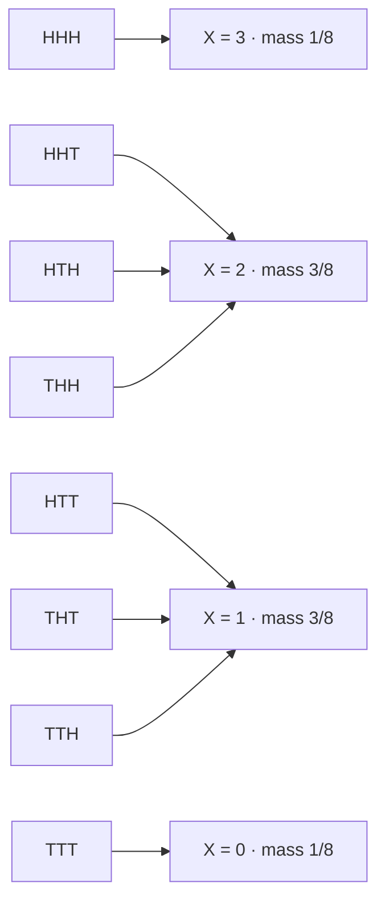

# Probability Mass Functions

When the support is countable the entire law is a list of numbers that sum to one, and every probability question is a sum over a subset of that list. There is no integration, no limit, and no smoothness assumption anywhere — which makes the discrete case the one where the theory is simplest and the modelling judgement is hardest, because deciding that a quantity really is discrete is a claim about the world rather than about the mathematics.

This page covers the mass function and its support, probabilities as sums, the exact two-way correspondence with the distribution function, a worked count against a measured base rate, the empirical mass function and the rate at which it converges, and the test for whether a market quantity is genuinely discrete. Joint and conditional mass functions are [Joint Distributions](05-joint-distributions.md) and [Conditional Distributions](07-conditional-distributions.md); the named families — Bernoulli, binomial, Poisson — are [Part V](../part-05-common-distributions/index.md) and appear below only as instances.

Counts are where "the probability of exactly this" is a real number rather than zero: losing days in a month, fills at a price level, strategies surviving a screen, consecutive stop-outs. Each of those has a mass function, and the mass function is the null against which the observed count is judged — which is the entire logic of asking whether a run of bad months is evidence of anything.

## The Mass Function of a Discrete Law

For a discrete random variable $X$, the **probability mass function** is

$$p_X(x)=\mathbf{P}(X=x)=\mathbf{P}\big(\{\omega\in\Omega:X(\omega)=x\}\big),$$

the induced law of [Random Variables](01-random-variables.md) evaluated on a single point. The second form is the definition and the first is the abbreviation, and keeping the second in view is what makes the object concrete: $p_X(x)$ is the total probability of every outcome the map sends to $x$.

The **support** is the set of values with positive mass, $\{x:p_X(x)>0\}$. The two conditions that make $p_X$ a law are

$$p_X(x)\ge 0\quad\text{for all }x,\qquad \sum_{x}p_X(x)=1,$$

with the sum running over the support. Both are inherited rather than imposed.

??? note "Proof that the support is countable and the masses sum to one"
    **Countability.** At most $n$ values can carry mass exceeding $1/n$, since $k$ such values would have total probability above $k/n$, which exceeds $1$ once $k>n$. The support is therefore the union over $n$ of finite sets, hence countable by [Sets and Functions](../part-01-mathematical-foundations/01-sets-and-functions.md).

    This is the same argument as the countable-jumps theorem on [Cumulative Distribution Functions](02-cumulative-distribution-functions.md), run on the other object — and necessarily so, since that page proves the jumps *are* the masses. A bounded quantity cannot be divided into uncountably many positive pieces, and that single observation constrains both descriptions at once.

    **Normalization.** The events $\{X=x\}$ over the support are pairwise disjoint, since $X$ is a function and assigns each outcome exactly one value, and their union is the whole space up to a null set. Countable additivity from [Probability Axioms](../part-02-probability-foundations/02-probability-axioms.md) then gives $\sum_x p_X(x)=\mathbf{P}(\Omega)=1$. Countability is what makes this step legal — countable additivity says nothing about uncountable unions, which is exactly why [Probability Density Functions](04-probability-density-functions.md) cannot be built this way.

## Every Probability Is a Sum Over a Set

For any set $B$ of values,

$$\mathbf{P}(X\in B)=\sum_{x\in B}p_X(x).$$

That is the whole calculus of the discrete case. Take three tosses of a fair coin and let $X$ count the heads. The sample space has eight equally likely outcomes and the map collapses them onto four values.



Each arrow carries probability $1/8$, and the mass at a value is the number of arrows arriving there divided by eight. That is the whole computation: counting the outcomes in a level set, which is why [Counting Principles](../part-01-mathematical-foundations/02-counting-principles.md) is a prerequisite for the discrete families and not for the continuous ones.

The multiplicities in that diagram — $1,3,3,1$ — are binomial coefficients, and they are the only reason the mass function is not flat. Each individual sequence is equally likely; there are simply more ways to arrive at one head than at zero. That distinction between an outcome and a value is where most discrete-probability errors originate, because natural language collapses it: "two heads out of three" names a value with three outcomes behind it, while "HHT" names one outcome, and they have different probabilities despite sounding equally specific. On an equiprobable sample space the mass function is the counting function rescaled, and nothing more.

| $k$ | Outcomes with $X=k$ | $p_X(k)$ | $F_X(k)$ |
|---|---|---|---|
| $0$ | TTT | $1/8=0.125$ | $0.125$ |
| $1$ | HTT, THT, TTH | $3/8=0.375$ | $0.500$ |
| $2$ | HHT, HTH, THH | $3/8=0.375$ | $0.875$ |
| $3$ | HHH | $1/8=0.125$ | $1.000$ |

A question like $\mathbf{P}(X\ge 2)$ is answered by adding the last two masses, $0.375+0.125=0.5$. A question like *did the second toss come up heads* cannot be answered at all, because it is not a set of values of $X$.

!!! note "Collapsing outcomes onto values is the only thing a random variable ever does"
    The eight-to-four collapse in the diagram is $\sigma(X)$ from [Random Variables](01-random-variables.md), now with masses attached. Nothing else happens in the construction of a mass function: the map partitions $\Omega$ into level sets, and $p_X$ reports the probability of each block. This is why the mass function is a complete description of $X$ and simultaneously a lossy description of the experiment, and why the same $p_X$ can arise from sample spaces with nothing in common.

## Mass Function and Distribution Function Determine Each Other

The two descriptions are related by summing and differencing, with no information lost either way:

$$F_X(x)=\sum_{t\le x}p_X(t),\qquad p_X(x)=F_X(x)-F_X(x^-).$$

??? note "Proof"
    Left to right is countable additivity applied to the disjoint decomposition $\{X\le x\}=\bigcup_{t\le x}\{X=t\}$, a countable union because the support is countable.

    Right to left is the jump theorem of [Cumulative Distribution Functions](02-cumulative-distribution-functions.md), which shows $F_X(x^-)=\mathbf{P}(X<x)$ and hence that the jump height is $\mathbf{P}(X=x)$. Applying it at every point of the support recovers every mass, and applying it off the support returns zero. So each object is a bijective re-encoding of the other, and which one to use is a matter of convenience — sums are natural for counts, and $F$ is natural for thresholds and quantiles.

```python
import numpy as np
from scipy.stats import binom

p = binom.pmf(np.arange(22), 21, 0.452)
F = np.concatenate([[0.0], np.cumsum(p)])               # F on the grid
back = np.diff(F)                                       # jumps recover the masses
print(f"  max |jumps(F) - p| {np.abs(back - p).max():.2e}")
print(f"  F(21) = {F[-1]:.10f}")
# =>   max |jumps(F) - p| 5.55e-17
#      F(21) = 1.0000000000
```

The round trip is exact to machine precision, which is the numerical statement of the theorem. It is also the reason `cumsum` and `diff` are the two operations that appear whenever discrete laws are handled in code: they *are* the correspondence.

## A Count With a Measured Base Rate

Take a real base rate — the index falls on $45.2\%$ of days — and ask what the distribution of down-days in a 21-day month looks like if days were independent. That model is a binomial mass function, and writing it down is what turns a vague sense that a month was bad into a number.

```python
import numpy as np
from scipy.stats import binom

n, p = 21, 0.452                                        # a 21-day month, measured base rate
k = np.arange(n + 1)
pmf = binom.pmf(k, n, p)
print(f"sum of all masses  {pmf.sum():.10f}     mode k={k[pmf.argmax()]}  p={pmf.max():.4f}")
for j in (5, 9, 15, 18):
    print(f"  P(K = {j:2d}) {binom.pmf(j, n, p):.5f}     P(K >= {j:2d}) {binom.sf(j - 1, n, p):.5f}")
# => sum of all masses  1.0000000000     mode k=9  p=0.1698
#      P(K =  5) 0.02539     P(K >=  5) 0.98798
#      P(K =  9) 0.16977     P(K >=  9) 0.66552
#      P(K = 15) 0.00987     P(K >= 15) 0.01382
#      P(K = 18) 0.00014     P(K >= 18) 0.00015
```

Even the most likely single outcome has probability only $0.1698$ — with twenty-two possible values the mass has to spread out, and being "most likely" carries little weight. The two columns answer different questions and the gap between them is the point. Fifteen down days in a month has mass $0.00987$, about one chance in a hundred; but *fifteen or more* has probability $0.01382$, and that is the number a test needs, because a month with sixteen down days is at least as surprising as one with fifteen. Reporting the point mass where the tail probability belongs understates the evidence, here by a factor of $1.4$, and by more the further into the tail the question sits.

The rule generalizes, and it is the reason a mass function is rarely the final answer to an applied question. Evidence is always about a *region* — the outcomes at least as extreme as the one observed — so the object a test consumes is a tail sum and not a mass. This is exactly the construction of a p-value in [The Hypothesis Testing Framework](../part-12-hypothesis-testing/01-hypothesis-testing-framework.md), and it explains a small confusion that recurs whenever discrete data is tested: for a continuous law the point has probability zero and there is no temptation to report it, while for a discrete law the point mass is a perfectly good number that answers the wrong question. Having a well-defined $\mathbf{P}(X=k)$ is a feature of the discrete case and a trap in it.

!!! warning "The mass function is the null, not the description"
    Everything above describes a world in which days are independent with a constant $45.2\%$ base rate, and markets are not that world. [Independence](../part-02-probability-foundations/05-independence.md) reports the empirical counterpart measured on twenty-five years of index data: eight monthly extreme-day counts observed against roughly thirteen expected under iid. The model is wrong in the *tamer* direction, which is the less-expected one, and that gap is a finding about the market rather than an error in the arithmetic. A binomial calculation is a statement about what would be surprising if a specific assumption held; it becomes a statement about the market only when the assumption has been checked, and checking it is [Probability and Random Variables](../../part-03-statistics/01-probability-and-random-variables.md).

## The Empirical Mass Function

Given observations $X_1,\ldots,X_n$, the natural estimate is the relative frequency

$$\hat p_n(x)=\frac{1}{n}\sum_{i=1}^{n}\mathbf{1}\{X_i=x\}.$$

```python
import numpy as np

rng = np.random.default_rng(13)
vals = np.array([-2, -1, 0, 1, 2])
true = np.array([0.05, 0.15, 0.60, 0.15, 0.05])
for m in (100, 10_000, 1_000_000):
    draws = rng.choice(vals, size=m, p=true)
    hat = np.array([(draws == v).mean() for v in vals])
    print(f"  n {m:7d}   max |phat - p| {np.abs(hat - true).max():.5f}"
          f"   1/sqrt(n) {1 / np.sqrt(m):.5f}")
# =>   n     100   max |phat - p| 0.03000   1/sqrt(n) 0.10000
#      n   10000   max |phat - p| 0.00480   1/sqrt(n) 0.01000
#      n 1000000   max |phat - p| 0.00040   1/sqrt(n) 0.00100
```

The worst-case error falls by roughly a factor of ten for each hundredfold increase in sample size, tracking $1/\sqrt{n}$ as the reference column shows. Unlike the density estimate on [Probability Density Functions](04-probability-density-functions.md), there is no bandwidth to choose and no bias term to trade against the noise: the support is known and finite, so the only error is sampling error. This is the easy case, and it is easy precisely because the discreteness was real.

!!! note "An empirical mass function is only meaningful when the support is genuinely discrete"
    Apply the same formula to daily returns rounded to four decimals and it returns one atom per observation, each of mass $1/n$, with a handful of accidental ties like the one on [Cumulative Distribution Functions](02-cumulative-distribution-functions.md). That object is not an estimate of anything — it converges to nothing as $n$ grows, because the number of distinct values grows with $n$. The repair is to group nearby values into bins, and a bin width is the $\delta$ of a density estimate. So the choice is not between a good and a bad mass function; it is between describing the quantity as discrete and describing it as continuous, and that decision belongs to the modeller rather than to the estimator.

## Where Discreteness Is Real

The test is whether the number of distinct values stops growing as the sample grows. If it converges to a fixed set, the quantity is discrete and a mass function is its natural description. If it keeps growing, the apparent discreteness came from the recording.

| Quantity | Genuinely discrete? | Why |
|---|---|---|
| Trade count in an interval | yes | a count; the support is $\{0,1,2,\ldots\}$ regardless of resolution |
| Sign of a return | yes | three values, and no measurement changes that |
| Price in ticks | yes | the exchange enforces the grid; prices between ticks do not exist |
| Order size in lots | yes | the same, enforced by the venue |
| A return rounded to 4dp | no | finer data gives more distinct values without limit |
| A price in dollars, pre-decimalization | historically yes | the grid was $1/16$; it stopped being discrete in 2001 |

The last row is worth keeping in mind, because it shows the property belongs to the market's rules rather than to the quantity's name. The same series can be discrete for one stretch of history and continuous for the next, and a model fitted across the boundary is fitting two different kinds of object. The tick-grid rows are the ones that matter most in practice: they are why the microstructure quantities of [Market Microstructure](../../part-01-foundations/03-market-microstructure.md) are genuinely count-like, and why the Poisson and binomial families of [Part V](../part-05-common-distributions/index.md) earn their place there rather than being convenient approximations.

So the test is whether the number of distinct values you observe keeps growing with the sample. If it does, you do not have a mass function — you have a rounded density, and every count-based statistic computed on it is measuring your rounding rule rather than the market. Discreteness has to be a property of the quantity, not of the recording, and the distinction is easy to check and easy to skip.
