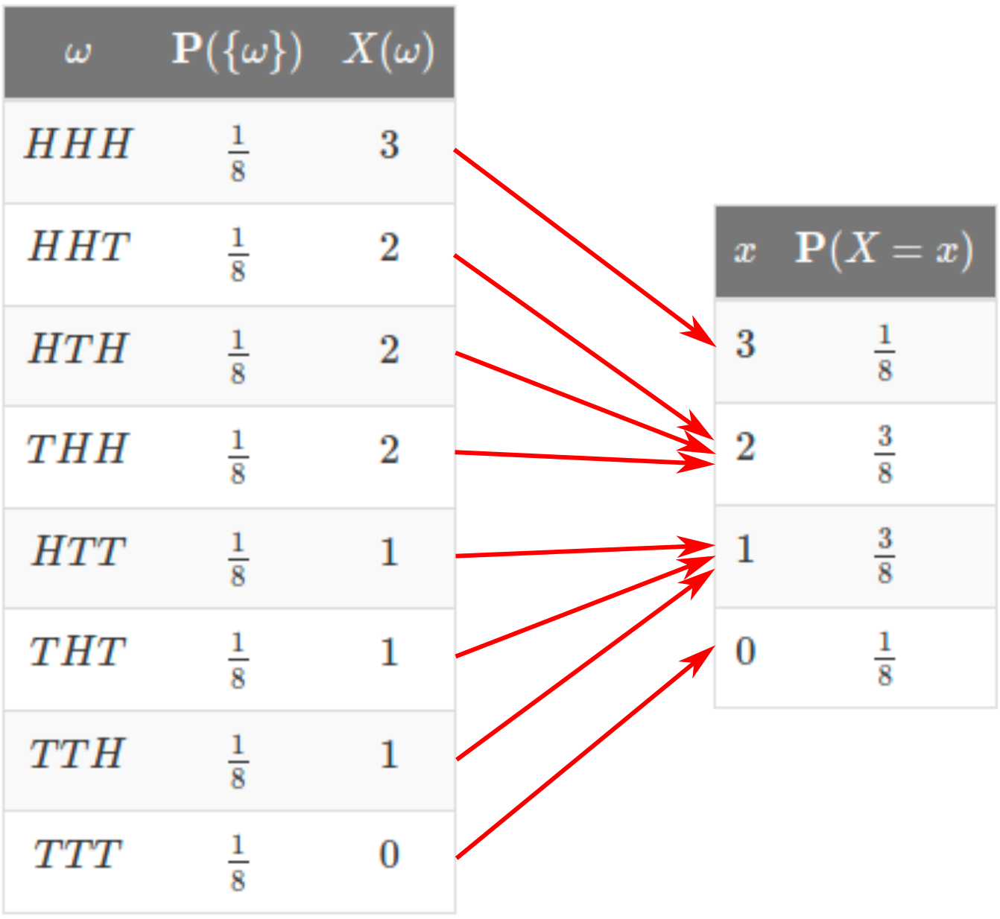

# Probability Mass Functions

The **probability mass function** $p_X(x)$ of a discrete random variable $X$ is its ***probability law*** or ***probability distribution***. It is the probability that $X$ will take the value $x$, i.e.,

$$p_X(x)=\mathbf{P}(X=x)=\mathbf{P}(\{\omega\in\Omega:X(\omega)=x\}).$$

## Example

Consider tossing a fair coin 3 times and define the random variable $X$ as the number of heads. We summarize all the possible outcomes of the experiment on the left table below. To extract the PMF, we add the probabilities of outcomes with the same number of heads. These are summarized on the right table.

  { width="400" .center }
