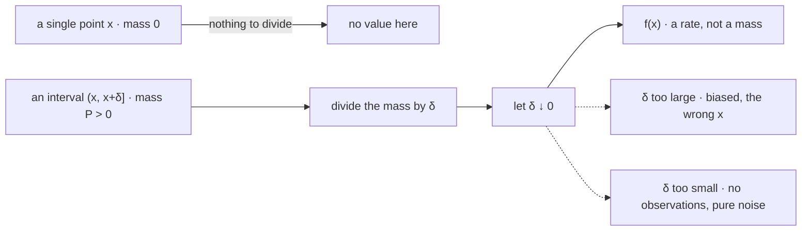

# Probability Density Functions

A density is not a probability. It is a rate — probability per unit of $x$ — and essentially every confusion about continuous distributions is a failure to keep that one distinction in view. A density can exceed one. It changes value when you change units. It is not defined at a point in any probabilistic sense, and the number it reports at a point is not the chance of anything.

This page covers why an uncountable support forces a rate rather than a mass, the integral that defines it, the fact that $f$ is unbounded above, the units it carries, the local-limit reading that connects it to histograms and bandwidth, and the laws that have no density at all. Named densities — Gaussian, exponential, Student's $t$ — are [Part V](../part-05-common-distributions/index.md) and appear here only as instances; what happens to a density under a change of coordinates is [Change of Variables](09-change-of-variables.md).

The trading stake is that a likelihood is a density value, so it inherits every one of these properties. The same fitted model on the same returns reports a log-likelihood of $+3{,}076$ when the data are in decimals and $-6{,}134$ when they are in basis points — a gap of over nine thousand nats produced by nothing but a unit choice. Any model comparison that crosses a rescaling, and any information criterion computed on differently-scaled series, is silently meaningless unless that term is carried.

## Why Uncountability Forces a Rate

[Probability Spaces](../part-02-probability-foundations/01-probability-spaces.md) proves that on an uncountable sample space individual outcomes must have probability zero. The consequence for description is immediate and is the reason this page exists at all.

??? note "Proof that a countably-supported law cannot describe a continuous random variable"
    Suppose every singleton has probability zero, and suppose the law were concentrated on a countable set $S=\{x_1,x_2,\ldots\}$, meaning $\mathbf{P}(X\in S)=1$. The singletons are pairwise disjoint, so countable additivity gives

    $$\mathbf{P}(X\in S)=\sum_{i}\mathbf{P}(X=x_i)=\sum_{i}0=0,$$

    contradicting $\mathbf{P}(X\in S)=1$. So no countable set carries the mass, and the enumerate-and-add strategy that defines a mass function has nothing to enumerate.

    The countable additivity of [Probability Axioms](../part-02-probability-foundations/02-probability-axioms.md) is doing real work here: with only finite additivity the sum of countably many zeros need not be zero, and the contradiction evaporates. This is one of the places where the countable strengthening earns its keep rather than being a technicality.

So mass cannot attach to points, and it must attach to something. What is left is intervals. Every real question about a continuous quantity — will the return fall between $-2\%$ and $-1\%$ — is a question about an interval, and the object that answers all of them at once is a function integrated over the interval rather than summed over its points. That is the whole idea, and the rest of the page is its consequences.

## The Defining Relation

A random variable $X$ **has a density** $f_X$ when

$$\mathbf{P}(a\le X\le b)=\int_{a}^{b}f_X(x)\,dx\qquad\text{for all }a\le b,$$

with $f_X$ satisfying the two conditions that make the integral a probability:

$$f_X(x)\ge 0\quad\text{for all }x,\qquad\int_{-\infty}^{\infty}f_X(x)\,dx=1.$$

Non-negativity is forced because a negative $f$ over a small enough interval would produce a negative probability. Normalization is the second axiom, $\mathbf{P}(\Omega)=1$, written in this language. Taking $a=-\infty$ recovers the distribution function of [Cumulative Distribution Functions](02-cumulative-distribution-functions.md), and differentiating runs the relation the other way:

$$F_X(x)=\int_{-\infty}^{x}f_X(t)\,dt,\qquad f_X(x)=\frac{d}{dx}F_X(x),$$

the second by the fundamental theorem of calculus, wherever $F_X$ is differentiable ([Calculus Essentials](../part-01-mathematical-foundations/06-calculus-essentials.md)). The density is not an independent object; it is the derivative of the one that always exists.

??? note "Proof that the endpoints do not matter"
    For a law with a density, $\mathbf{P}(X=a)=\int_a^a f_X(x)\,dx=0$, since an integral over a degenerate interval vanishes for any integrable $f$ — however large $f(a)$ is. So

    $$\mathbf{P}(a<X<b)=\mathbf{P}(a\le X\le b)=\mathbf{P}(a<X\le b)=\mathbf{P}(a\le X<b),$$

    and all four rows of the interval table on [Cumulative Distribution Functions](02-cumulative-distribution-functions.md) coincide. This is the *only* circumstance in which they do, and it is worth naming as a special case rather than absorbing as a habit: the moment a law acquires an atom — through a stop, a cap, or a flat state — the four expressions come apart again, and code written under the assumption that endpoints are free starts silently misreporting.

## A Density Is Not a Probability

Nothing in the defining relation bounds $f$ by one. The constraint is on the *integral*, and a function can be arbitrarily tall as long as it is correspondingly narrow.

```python
import numpy as np
from scipy.stats import norm, expon, uniform
from scipy.integrate import quad

print(f"Exp(rate 5)     f(0)   = {expon(scale=1/5).pdf(0):8.4f}")
print(f"Uniform[0,0.01] f(any) = {uniform(0, 0.01).pdf(0.005):8.4f}")
print(f"N(0, 0.01^2)    f(0)   = {norm(0, 0.01).pdf(0):8.4f}")
print(f"all three integrate to 1: {quad(expon(scale=1/5).pdf, 0, np.inf)[0]:.6f}"
      f"  {quad(uniform(0,0.01).pdf, 0, 0.01)[0]:.6f}"
      f"  {quad(norm(0,0.01).pdf, -1, 1)[0]:.6f}")
# => Exp(rate 5)     f(0)   =   5.0000
#    Uniform[0,0.01] f(any) = 100.0000
#    N(0, 0.01^2)    f(0)   =  39.8942
#    all three integrate to 1: 1.000000  1.000000  1.000000
```

The middle line is the cleanest case: a uniform distribution on an interval of width $0.01$ must have height $100$, because height times width has to be one. The third is the one that matters in practice — a Gaussian daily return with a $1\%$ standard deviation has $f(0)\approx 39.89$, and there is nothing unusual about that distribution whatsoever. It is the ordinary description of an ordinary asset.

!!! note "A density can be arbitrarily large and still describe a perfectly ordinary distribution"
    A value of $f$ above one is not a symptom of anything. It means the quantity is measured in units that are large relative to its spread, and it can be removed by rescaling — which is precisely the point, because a number that a change of units can move is not a probability. Probabilities are dimensionless and invariant; densities are neither. The sanity check that *does* work is that $f\ge 0$ everywhere and integrates to one, and any implementation that clips a density at one, or treats $f>1$ as an error, has misunderstood the object.

## The Units of $f$

Since $\int f_X(x)\,dx$ is dimensionless, $f_X$ must carry the reciprocal of whatever units $x$ is in:

$$[f_X]=\frac{1}{[x]}.$$

A density on returns-in-decimals is in units of *per unit return*; the same law in basis points is in *per basis point*, smaller by a factor of ten thousand. This is not a curiosity. It is why the single most-reported quantity in model fitting is not comparable across a rescaling.

```python
import numpy as np
from scipy.stats import norm

rng = np.random.default_rng(4)
r = rng.normal(0.0004, 0.011, 1000)
for name, s in [("decimals ", 1.0), ("percent  ", 100.0), ("bps      ", 10000.0)]:
    x = r * s                                           # the same data, relabelled
    m, sd = x.mean(), x.std(ddof=0)                     # refit by moments in each unit
    print(f"  {name} sigma {sd:10.4f}   f(0) {norm.pdf(0, m, sd):10.4f}"
          f"   sum log f {norm.logpdf(x, m, sd).sum():12.4f}")
print(f"  predicted shift per 100x rescale: n*log(100) = {1000 * np.log(100):.4f}")
# =>   decimals  sigma     0.0112   f(0)    35.7139   sum log f    3075.8815
#      percent   sigma     1.1167   f(0)     0.3571   sum log f   -1529.2887
#      bps       sigma   111.6669   f(0)     0.0036   sum log f   -6134.4589
#      predicted shift per 100x rescale: n*log(100) = 4605.1702
```

One model, one dataset, one fitting procedure, and three log-likelihoods spanning $9{,}210$ nats. The gaps are exactly $4{,}605.17$ each, and that number is $n\log 100$ — a thousand observations times the log of the rescaling factor — so the shift is entirely accounted for by the Jacobian of a linear change of units and contains no information about fit at all. Note also that the model was *refitted* in each row and the parameters track the units correctly; the discrepancy is not an estimation error but a property of the quantity being reported.

!!! warning "A log-likelihood is not comparable across a change of units"
    Maximum likelihood is safe, because the argmax does not move: rescaling shifts every candidate model's log-likelihood by the same constant ([Maximum Likelihood Estimation](../part-11-parameter-estimation/03-maximum-likelihood-estimation.md)). Anything comparing likelihood *levels* is not safe. AIC and BIC differences between models fitted on differently-scaled data are meaningless, as are likelihood ratios across a transformation and any tabulated "log-likelihood" reported without its units — see [Information Criteria (AIC/BIC)](../part-14-model-selection/03-information-criteria.md). The correction term is $\sum_i\log|g'(x_i)|$ for a transform $g$, and deriving it is the closing section of [Change of Variables](09-change-of-variables.md). The practical rule is duller and works: fix one coordinate system per project and never compare across two.

## The Local-Limit Reading

The density has an interpretation at a point after all, provided it is stated as a limit rather than as a value:

$$f_X(x)=\lim_{\delta\downarrow 0}\frac{\mathbf{P}(x<X\le x+\delta)}{\delta}.$$

The numerator is a genuine probability and goes to zero; the denominator goes to zero at the same rate; the ratio survives. This is the same $0/0$ structure, resolved the same way, as the conditional density on [Conditional Distributions](07-conditional-distributions.md) — and the resemblance is not a coincidence but the same theorem applied to one variable instead of two.



The top row is the failed attempt and the bottom row is the repair. Read the dashed branches as the estimation problem rather than the theory: the limit is taken by a theorem, but any estimate of $f$ has to stop at some finite $\delta$, and that $\delta$ is a histogram's bin width or a kernel's bandwidth.

```python
import numpy as np
from scipy.stats import norm

rng = np.random.default_rng(8)
z = rng.standard_normal(2_000_000)
x0 = 0.5
print(f"true f(0.5) = {norm.pdf(x0):.6f}")
for d in (0.5, 0.1, 0.02, 0.004, 0.0008):
    n = int(((z > x0) & (z <= x0 + d)).sum())           # mass in the window
    print(f"  delta {d:.4f}   n {n:7d}   mass/delta {n / z.size / d:.6f}")
# => true f(0.5) = 0.352065
#      delta 0.5000   n  300815   mass/delta 0.300815
#      delta 0.1000   n   68805   mass/delta 0.344025
#      delta 0.0200   n   14148   mass/delta 0.353700
#      delta 0.0040   n    2891   mass/delta 0.361375
#      delta 0.0008   n     568   mass/delta 0.355000
```

The entire bias–variance tradeoff, visible in five numbers. The first three rows converge steadily on $0.352065$ as the bias shrinks: a window of width $0.5$ averages the density over a stretch where it is falling, and reports $0.3008$ — too low by thirteen percent, and too low *systematically*, not by chance. The last two rows have essentially no bias left and have run out of data: $2{,}891$ observations, then $568$, and the estimates wander to $0.3614$ and $0.3550$ without settling. Two million draws support about three significant figures of a density at one point, and no amount of cleverness in the estimator changes the shape of that constraint.

!!! note "A histogram is a density estimate, and its bar height is a rate"
    A histogram normalized to unit area is exactly the computation above run at every $x$ at once, with $\delta$ the bin width. So a bar's height is in units of per-unit-$x$ and will exceed one whenever the bins are narrow relative to the spread — the same non-fact as before, met in a plot instead of a formula. The bin width is not a display setting; it is the $\delta$ in the limit, and choosing it is choosing a point on the tradeoff above. [Plotting for Research](../../part-02-python/06-plotting.md) picks these defaults, and the defaults are a modelling assumption wearing a cosmetic disguise.

## Not Every Law Has a Density

The definition is conditional — "$X$ **has a density** when" — and the condition genuinely fails.

| Law | Has a density? | Why |
|---|---|---|
| Gaussian, exponential, Student's $t$ | yes | $F$ is differentiable everywhere |
| Any discrete law | no | $F$ is a step function; the mass is on points |
| A strategy that is sometimes flat | no | an atom at zero, plus a density elsewhere |
| A return truncated by a stop | no | the transform moves mass onto the barrier |
| An empirical distribution of $n$ points | no | $n$ atoms of size $1/n$ and nothing between them |

The condition being violated in rows two through five is **absolute continuity**: $F$ must have no jumps, and mass must not concentrate on any set of zero length. The mixed laws of [Random Variables](01-random-variables.md) fail it by construction, and so does the object the last row names — which deserves attention, because it is not exotic. The empirical distribution is what every estimate is computed from, and it never has a density at any sample size.

The second clause of absolute continuity is doing more work than it looks. Having no atoms is not sufficient: there are laws whose distribution function is continuous everywhere — so no point carries mass — and yet which have no density, because all the mass sits on a set of total length zero. Such a law is called **singular continuous**, and the classical example is the one supported on the Cantor set. Its $F$ rises from $0$ to $1$ while having zero derivative almost everywhere, so the fundamental theorem of calculus cannot recover it and $\int f=0\ne 1$ for any candidate $f$.

$$\text{every law}\;=\;\underbrace{\text{atoms}}_{\text{a mass function}}\;+\;\underbrace{\text{absolutely continuous part}}_{\text{a density}}\;+\;\underbrace{\text{singular continuous part}}_{\text{neither}}$$

That decomposition is exhaustive and the three pieces are unique. The third term is the one that never appears in applied work and is worth knowing about anyway, because it is what makes "continuous" ambiguous: a random variable can be continuous in the sense of having no atoms and still fail to have a density. Only the middle term is what this page describes, and the first two together are what markets produce.

$F$ always exists; $f$ sometimes does. Every method that begins by writing down a likelihood, a density ratio, or an entropy has already assumed a law smooth enough to have one, and has assumed it before the first line of the derivation rather than as a stated hypothesis. Usually the assumption is harmless. It stops being harmless exactly where trading puts its atoms — at the stop, at the cap, at the flat state, at the barrier — which is to say at the prices the risk report cares about most. The useful habit is knowing which of your results would survive if the density were removed and only $F$ remained.
