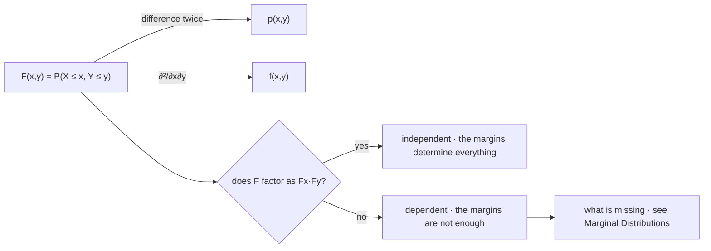

# Joint Distributions

Two random variables defined on the same sample space have a single law on $\mathbb{R}^2$, and that object — not the pair of one-dimensional laws — is what every portfolio question is really about. The pair $(X,Y)$ is one map into the plane rather than two maps into the line, and the whole difficulty of multivariate probability is that this one object contains strictly more than its two shadows.

This page covers the joint as a single pushforward, the joint mass function, density, and distribution function, the rectangle formula and the extra condition it imposes, independence as factorization at all three levels, and the extension to $n$ variables. Recovering the one-dimensional laws is [Marginal Distributions](06-marginal-distributions.md), conditioning one variable on another is [Conditional Distributions](07-conditional-distributions.md), and random vectors, covariance matrices, and the multivariate Gaussian are [Part VI](../part-06-multivariate-probability/index.md) — everything here stays with two scalars, or $n$ indexed scalars, and never introduces vector notation.

A portfolio's profit and loss is a function of the joint. A risk system, almost universally, stores per-asset return series plus a correlation matrix — strictly less information than the joint, and, as the last section shows, sometimes not even consistent with any joint law at all. The gap between what is stored and what is needed is where a surprising amount of risk lives.

## One Law on $\mathbb{R}^2$

Given $X$ and $Y$ on the same $(\Omega,\mathcal{F},\mathbf{P})$, define the map

$$(X,Y):\Omega\longrightarrow\mathbb{R}^2,\qquad \omega\mapsto\big(X(\omega),Y(\omega)\big).$$

This is a single random object, and the pushforward argument of [Random Variables](01-random-variables.md) transfers unchanged: for Borel $B\subseteq\mathbb{R}^2$, set $\mathbf{P}_{X,Y}(B)=\mathbf{P}\big((X,Y)^{-1}(B)\big)$, and the same proof shows it is a probability measure on the plane. The requirement that the variables share a sample space is not a technicality — it is what makes the pair meaningful. Two returns measured on different days, or two quantities from unrelated experiments, have no joint law, because there is no single $\omega$ that produces both.

The generating sets in two dimensions are the quadrants $(-\infty,x]\times(-\infty,y]$ rather than the rays, and they generate the Borel sets of the plane, so a function of two real variables again pins down the whole law.

## The Joint Mass Function

When both variables are discrete,

$$p_{X,Y}(x,y)=\mathbf{P}(X=x,\ Y=y),\qquad p_{X,Y}\ge 0,\qquad \sum_{x}\sum_{y}p_{X,Y}(x,y)=1,$$

where the comma means intersection: the event that $X=x$ *and* $Y=y$. Probabilities of larger events are sums over regions, $\mathbf{P}\big((X,Y)\in B\big)=\sum_{(x,y)\in B}p_{X,Y}(x,y)$, exactly as in the one-dimensional case with one more index to run over.

```python
import numpy as np

J = np.array([[0.10, 0.06, 0.04],                       # signal short
              [0.12, 0.18, 0.10],                       # signal flat
              [0.05, 0.11, 0.24]])                      # signal long
pX, pY = J.sum(axis=1), J.sum(axis=0)
print(f"total mass {J.sum():.4f}   margins  signal {np.round(pX, 3)}  outcome {np.round(pY, 3)}")
indep = np.outer(pX, pY)
print(f"largest gap from independence  {np.abs(J - indep).max():.4f}")
print(f"P(long, up) {J[2, 2]:.3f}   under independence {indep[2, 2]:.3f}"
      f"   lift {J[2, 2] / indep[2, 2]:.3f}")
# => total mass 1.0000   margins  signal [0.2 0.4 0.4]  outcome [0.27 0.35 0.38]
#    largest gap from independence  0.0880
#    P(long, up) 0.240   under independence 0.152   lift 1.579
```

Nine numbers summing to one describe the whole relationship between a three-state signal and a three-state outcome. The product of the margins is what the table *would* be if the two were unrelated, and the largest cell-by-cell discrepancy is $0.0880$ — comfortably larger than any of the individual masses could tolerate as rounding. The corner cell is the tradeable one: signal long and outcome up occurs $24.0\%$ of the time against $15.2\%$ under independence, a lift of $1.579$.

| $p_{X,Y}$ | down | unchanged | up | **margin** |
|---|---|---|---|---|
| **short** | $0.10$ | $0.06$ | $0.04$ | $0.20$ |
| **flat** | $0.12$ | $0.18$ | $0.10$ | $0.40$ |
| **long** | $0.05$ | $0.11$ | $0.24$ | $0.40$ |
| **margin** | $0.27$ | $0.35$ | $0.38$ | $1.00$ |

The row and column totals in the last row and column are the marginals, and their position in the table is where the name comes from. Note that the nine interior numbers determine the six edge numbers and the reverse is false — the whole subject of the next page.

## The Joint Density

When the law has no atoms and is smooth enough, probabilities of regions are double integrals against a joint density:

$$\mathbf{P}\big((X,Y)\in B\big)=\iint_{B}f_{X,Y}(x,y)\,dx\,dy,\qquad f_{X,Y}\ge 0,\qquad \iint_{\mathbb{R}^2}f_{X,Y}=1.$$

For a rectangle this is the iterated integral $\int_c^d\!\int_a^b f_{X,Y}(x,y)\,dx\,dy$, which is the form usually written down and the least interesting case in practice. The events that matter in finance are almost never rectangles. "Both positions lose money" is the quadrant $\{X<0,Y<0\}$; "the book loses more than $c$" is the half-plane $\{X+Y<-c\}$; "either leg breaches its limit" is a union of two strips. Each is a region, each needs the joint, and none of them factors into a statement about $X$ separately and $Y$ separately.

Everything on [Probability Density Functions](04-probability-density-functions.md) carries over with the obvious change of dimension, including the parts people would rather forget: $f_{X,Y}$ is a rate per unit *area*, it can be arbitrarily large, its units are $1/([x][y])$, and the law need not have one at all.

One structural point has no one-dimensional analogue. The support of a joint law can be a strict subset of the product of the two supports — $X$ and $Y$ can each range over the whole line while the pair is confined to a band around the diagonal. Nothing about either margin reveals this, which is the first hint that the margins are not the whole story.

## Mixed Pairs: One Discrete, One Continuous

The two cases above are the textbook ones and neither describes the most common situation in trading research: a discrete signal state $S$ paired with a continuous next-day return $R$. That pair has no joint mass function, because $R$ has no atoms and every $\mathbf{P}(S=s,R=r)$ is zero. It has no joint density either, because $S$ is discrete and no integral over $s$ makes sense. The law is perfectly well defined and simply fits neither template — the two-dimensional version of the mixed laws on [Random Variables](01-random-variables.md).

What describes it is a mass function in one argument and a density in the other:

$$\mathbf{P}(S=s,\ a\le R\le b)=p_S(s)\int_{a}^{b}f_{R\mid S}(r\mid s)\,dr,$$

one conditional density per state, weighted by the state's mass. This is the object every "what do returns look like when the signal fires" study is estimating, and reading it as a sum over $s$ recovers the unconditional return law — the mixture identity of [Conditional Distributions](07-conditional-distributions.md), which is where that reading is developed.

The general point is that the discrete-or-continuous dichotomy is a statement about convenient representations, not about which laws exist. The joint distribution function is defined for all of these cases without qualification, which is again why it is the description of record.

## The Joint Distribution Function and the Rectangle Formula

The description that always exists is again the distribution function, now of two arguments:

$$F_{X,Y}(x,y)=\mathbf{P}(X\le x,\ Y\le y)=\mathbf{P}_{X,Y}\big((-\infty,x]\times(-\infty,y]\big).$$

Probabilities of rectangles come out of it by inclusion–exclusion rather than by subtraction alone:

$$\mathbf{P}(a<X\le b,\ c<Y\le d)=F(b,d)-F(a,d)-F(b,c)+F(a,c).$$

??? note "Proof"
    Write $Q(u,v)=\{X\le u, Y\le v\}$ for the quadrant event, so $F(u,v)=\mathbf{P}(Q(u,v))$. The target rectangle is
    $$R=Q(b,d)\setminus\big(Q(a,d)\cup Q(b,c)\big),$$
    since removing the two overlapping quadrants strips off everything with $X\le a$ or $Y\le c$. Both removed sets are subsets of $Q(b,d)$, so monotonicity and finite additivity give $\mathbf{P}(R)=\mathbf{P}(Q(b,d))-\mathbf{P}(Q(a,d)\cup Q(b,c))$, and inclusion–exclusion from [Probability Axioms](../part-02-probability-foundations/02-probability-axioms.md) expands the union as
    $$\mathbf{P}(Q(a,d))+\mathbf{P}(Q(b,c))-\mathbf{P}(Q(a,d)\cap Q(b,c)).$$
    The intersection of the two quadrants is $Q(a,c)$, because requiring $X\le a$ and $X\le b$ with $a<b$ leaves $X\le a$, and likewise in $y$. Substituting gives the four-term formula. The $+F(a,c)$ is there because the corner was removed twice.

```python
import numpy as np

rng = np.random.default_rng(21)
n, rho = 500_000, 0.5
Z = rng.standard_normal(n)
X = Z
Y = rho * Z + np.sqrt(1 - rho ** 2) * rng.standard_normal(n)

a, b, c, d = -0.5, 1.0, 0.0, 1.5
F = lambda u, v: ((X <= u) & (Y <= v)).mean()           # the empirical joint CDF
direct = ((X > a) & (X <= b) & (Y > c) & (Y <= d)).mean()
rect = F(b, d) - F(a, d) - F(b, c) + F(a, c)
print(f"direct count      {direct:.6f}")
print(f"rectangle from F  {rect:.6f}")
print(f"difference        {abs(direct - rect):.2e}")
# => direct count      0.260196
#    rectangle from F  0.260196
#    difference        5.55e-17
```

The two agree to floating-point noise, as an identity must. What the check demonstrates is that $F$ is genuinely sufficient: the rectangle probability was never counted, only assembled from four values of the distribution function.

!!! warning "Non-decreasing in each argument is not enough to be a joint distribution function"
    In one dimension, monotone plus right-continuous plus the right limits characterizes a distribution function completely. In two dimensions those conditions are necessary and *not* sufficient. A function can be non-decreasing in $x$ for every fixed $y$ and non-decreasing in $y$ for every fixed $x$, and still assign a negative number to some rectangle through the four-term formula above — which would be a negative probability. The extra requirement, that every rectangle receive a non-negative value, is called being **2-increasing**, and it is an independent condition rather than a consequence. It is also precisely the condition a copula must satisfy to be a copula ([Copulas](../part-18-quant-finance-applications/15-copulas.md)), and the reason dependence structures cannot be specified by writing down whatever function seems reasonable.

## Independence as Factorization

$X$ and $Y$ are **independent** when every pair of events about them separately is independent in the sense of [Independence](../part-02-probability-foundations/05-independence.md). The workable form is that the joint factors, and it does so at whichever of the three levels is available:

$$F_{X,Y}(x,y)=F_X(x)F_Y(y),\qquad p_{X,Y}(x,y)=p_X(x)p_Y(y),\qquad f_{X,Y}(x,y)=f_X(x)f_Y(y).$$

??? note "Proof that the three factorizations are equivalent"
    **CDF to PMF.** In the discrete case the mass is recovered from $F$ by differencing in both arguments, and differencing a product of functions of separate variables gives the product of the separate differences, which is $p_X(x)p_Y(y)$.

    **CDF to PDF.** Where a density exists it is the mixed partial derivative $\partial^2F_{X,Y}/\partial x\,\partial y$, and differentiating $F_X(x)F_Y(y)$ once in each variable gives $F_X'(x)F_Y'(y)=f_X(x)f_Y(y)$.

    **Back again.** Integrating $f_X(x)f_Y(y)$ over the quadrant separates into a product of one-dimensional integrals, returning $F_X(x)F_Y(y)$; summing $p_X p_Y$ does the same.

    The CDF form is the definition of record, because it is the only one that requires neither a mass function nor a density to exist. For a mixed law — the flat-strategy case of [Random Variables](01-random-variables.md) — the other two statements are not even well posed, while the first is.



One object at the top, two optional descriptions branching left, and one test branching right. The test is the whole of the dependence question at this level, and it is binary — either the joint is the product of its margins or it is not. What the diagram cannot show is how *much* is missing in the "no" branch, and that quantity turns out to be large, unbounded by any correlation number, and the subject of the next page.

!!! note "Independence is the only case in which the marginals determine the joint"
    Read the factorization as a construction rather than a test: given $F_X$ and $F_Y$, the product $F_XF_Y$ is a valid joint distribution function, so a joint law with those margins always exists. It is one particular law among infinitely many with the same margins, and there is nothing canonical about it. The habit of treating independence as the neutral default — the thing to assume when nothing is known — is therefore a substantive modelling choice dressed as an absence of one, and it is the single assumption that most reliably understates portfolio tail risk.

## More Than Two Variables

Everything generalizes by adding indices. For $X_1,\ldots,X_n$ the joint distribution function is $F(x_1,\ldots,x_n)=\mathbf{P}(X_1\le x_1,\ldots,X_n\le x_n)$, mass functions and densities take $n$ arguments, and mutual independence is the factorization of all $n$ at once:

$$F(x_1,\ldots,x_n)=\prod_{i=1}^{n}F_{X_i}(x_i).$$

For an **iid** sequence the factors are all the same function, $F(x_1,\ldots,x_n)=\prod_i F(x_i)$, which is the statement [Independence](../part-02-probability-foundations/05-independence.md) makes and defers here for the meaning of $F$. Two cautions carry over from that page unchanged: mutual independence is strictly stronger than pairwise independence, and $n$-way factorization does not follow from checking pairs.

That last point has a sharp consequence for how dependence is stored in practice.

```python
import numpy as np

C = np.array([[1.0, 0.9, 0.9],
              [0.9, 1.0, -0.9],
              [0.9, -0.9, 1.0]])
w = np.array([1.0, -1.0, -1.0])
print(f"eigenvalues  {np.round(np.linalg.eigvalsh(C), 4)}")
print(f"portfolio variance for w = (1, -1, -1):  {w @ C @ w:.2f}")
# => eigenvalues  [-0.8  1.9  1.9]
#    portfolio variance for w = (1, -1, -1):  -2.40
```

Each pairwise correlation in that matrix is individually unobjectionable — $0.9$, $0.9$, and $-0.9$ are all perfectly ordinary numbers. Together they are impossible. A portfolio holding one unit of the first asset short one of each of the others has variance $-2.40$, and since variance is an average of squares it cannot be negative. The negative eigenvalue is the same fact stated in the language of [Basic Linear Algebra Review](../part-01-mathematical-foundations/05-linear-algebra-review.md): a valid correlation matrix must be positive semi-definite, and this one is not.

!!! note "A correlation matrix is a set of pairwise constraints, and some sets have no solution"
    If $A$ and $B$ move together and $A$ and $C$ move together, then $B$ and $C$ cannot move oppositely — the three constraints overdetermine each other, and beyond a point no three random variables satisfy them. This matters because correlation matrices are routinely assembled piecewise, from different estimation windows, different data vendors, or a mix of estimates and expert overrides, and nothing in that process enforces consistency. The failure is silent until an optimizer finds the negative direction and levers into it, which is exactly what [Portfolio Optimization and Correlation](../../part-08-portfolio-management/04-portfolio-optimization-and-correlation.md) observes happening.

A joint distribution is one object. Assembling it from parts — a set of marginals plus a table of pairwise correlations — is not a simplification of that object but a guess at it, and the guess is sometimes merely wrong and sometimes not the description of anything, as a negative eigenvalue announces without ambiguity. When the pieces do fit together, the more common situation, the guess is still one choice among infinitely many joints consistent with the same pieces. Exactly what the parts do and do not determine is the subject of the next page.
