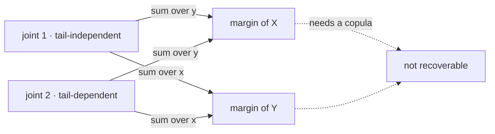

# Marginal Distributions

Marginalization is a projection, and like every projection it is lossy. Summing or integrating one variable away produces a smaller object, and the larger one cannot be rebuilt from it. The mechanics take three lines; the consequences take the rest of the page, because what gets destroyed is precisely the part of the model that determines whether two positions fail together.

This page covers marginalization for mass functions, densities, and distribution functions, the proof that a marginal is a genuine law, and then what the operation discards: the Fréchet–Hoeffding bounds on how much freedom is left, two joint laws with identical margins and opposite tail behaviour, the copula that names exactly what is missing, and the failure of risk to aggregate. Conditioning is [Conditional Distributions](07-conditional-distributions.md) and copula families are [Copulas](../part-18-quant-finance-applications/14-copulas.md). Correlation is deliberately *not* used here as the measure of dependence — it belongs to [Part IV](../part-04-expectation-and-moments/index.md), and the argument below is stronger without it, because the whole point is a difference that correlation cannot see.

Tail risk is not a function of the assets' marginal distributions. Every risk report that lists per-asset volatilities and per-asset VaRs has therefore reported the part of the model that does not answer the question it was produced to answer, and it will look identical under two dependence assumptions whose portfolio tail losses differ by a factor of five.

## Integrating a Variable Out

The marginal law of $X$ is recovered from the joint by summing or integrating over every value the other variable could take:

$$p_X(x)=\sum_{y}p_{X,Y}(x,y),\qquad f_X(x)=\int_{-\infty}^{\infty}f_{X,Y}(x,y)\,dy,\qquad F_X(x)=\lim_{y\to\infty}F_{X,Y}(x,y).$$

The third form is the one usually omitted and the only one that always applies, since it needs neither a mass function nor a density — the same reason the distribution function was the description of record on [Joint Distributions](05-joint-distributions.md).

??? note "Proof that the marginal is the law of $X$"
    In the discrete case, the events $\{Y=y\}$ over the support of $Y$ form a countable partition of the sample space, since $Y$ is a function and takes exactly one value on each outcome. So for fixed $x$,

    $$\{X=x\}=\bigcup_{y}\{X=x,\ Y=y\}$$

    as a disjoint union, and countable additivity gives $\mathbf{P}(X=x)=\sum_y p_{X,Y}(x,y)$. This is the [Law of Total Probability](../part-02-probability-foundations/06-law-of-total-probability.md) applied at each $x$ to the partition generated by $Y$ — marginalization is not a new operation but that law, used in the direction that discards information rather than the direction that assembles it.

    The continuous case replaces the sum with an integral and needs the density version rather than the axioms alone; the argument is the limiting one on [Conditional Distributions](07-conditional-distributions.md). For $F$, no argument is needed beyond continuity of measure: the events $\{X\le x, Y\le y\}$ increase to $\{X\le x\}$ as $y\to\infty$, because every outcome has *some* finite $Y$ value.

    In all three cases the result satisfies the conditions of a law — non-negative, normalized — which is what justifies calling it a distribution rather than a partial sum.

## Why the Word "Marginal"

The name is literal and comes from the table. Write a bivariate mass function as a grid and put the row totals down the right edge and the column totals along the bottom: the one-variable laws are written in the *margins* of the page.

| $p_{X,Y}$ | down | unchanged | up | **row total** |
|---|---|---|---|---|
| **short** | $0.10$ | $0.06$ | $0.04$ | $\mathbf{0.20}$ |
| **flat** | $0.12$ | $0.18$ | $0.10$ | $\mathbf{0.40}$ |
| **long** | $0.05$ | $0.11$ | $0.24$ | $\mathbf{0.40}$ |
| **column total** | $\mathbf{0.27}$ | $\mathbf{0.35}$ | $\mathbf{0.38}$ | $1.00$ |

Nine interior numbers, six edge numbers. The interior determines the edges by addition. The edges do not determine the interior, and the arithmetic makes the shortfall precise: the interior has $9-1=8$ free parameters after normalization, the two margins together have $2+2=4$, so four dimensions of the joint are invisible from the edges. Scaling that up is instructive rather than reassuring — a $10\times 10$ table has $99$ free parameters and margins that pin down $18$ of them.

## The Margins Do Not Determine the Joint

Fix both margins. The set of joint laws consistent with them is not a point but an interval, and the interval has explicit endpoints.

$$\max\big(F_X(x)+F_Y(y)-1,\ 0\big)\ \le\ F_{X,Y}(x,y)\ \le\ \min\big(F_X(x),\ F_Y(y)\big).$$

??? note "Proof of the Fréchet–Hoeffding bounds"
    Write $A=\{X\le x\}$ and $B=\{Y\le y\}$, so $F_{X,Y}(x,y)=\mathbf{P}(A\cap B)$.

    **Upper bound.** $A\cap B\subseteq A$ and $A\cap B\subseteq B$, so monotonicity of measure gives $\mathbf{P}(A\cap B)\le\min(\mathbf{P}(A),\mathbf{P}(B))$.

    **Lower bound.** Inclusion–exclusion gives $\mathbf{P}(A\cap B)=\mathbf{P}(A)+\mathbf{P}(B)-\mathbf{P}(A\cup B)$, and $\mathbf{P}(A\cup B)\le 1$ by the axioms, so $\mathbf{P}(A\cap B)\ge\mathbf{P}(A)+\mathbf{P}(B)-1$. Since probabilities are non-negative, the bound can be raised to zero whenever the right-hand side is negative.

    Both bounds use nothing but [Probability Axioms](../part-02-probability-foundations/02-probability-axioms.md), and both are **attained**: the upper by the comonotone coupling, in which $X$ and $Y$ are increasing functions of a single uniform, and the lower by the countermonotone one, in which they are opposite functions of it. Attainability is the substantive half — it means the interval is not a loose estimate but exactly the residual freedom the margins leave.

```python
import numpy as np

m = np.array([0.45, 0.40, 0.15])                        # margins: calm, normal, crisis
def coupling(a, b):                                     # comonotone: overlap of quantile blocks
    A, B = np.concatenate([[0], np.cumsum(a)]), np.concatenate([[0], np.cumsum(b)])
    return np.array([[max(0.0, min(A[i+1], B[j+1]) - max(A[i], B[j]))
                      for j in range(len(b))] for i in range(len(a))])

joints = {"independent":     np.outer(m, m),
          "comonotone":      coupling(m, m),
          "countermonotone": coupling(m, m[::-1])[:, ::-1]}
for name, J in joints.items():
    same = np.allclose(J.sum(1), m) and np.allclose(J.sum(0), m)
    print(f"  {name:16s} P(both crisis) {J[2, 2]:.4f}   margins identical: {same}")
print(f"  Frechet bounds     [{max(2 * m[2] - 1, 0):.4f}, {m[2]:.4f}]")
# =>   independent      P(both crisis) 0.0225   margins identical: True
#      comonotone       P(both crisis) 0.1500   margins identical: True
#      countermonotone  P(both crisis) 0.0000   margins identical: True
#      Frechet bounds     [0.0000, 0.1500]
```

Three joint laws, byte-identical margins, and the probability that both assets are in the crisis state ranges from zero to $0.15$ — from impossible to nearly seven times the independent value. No amount of per-asset data distinguishes them, because per-asset data *is* the margins, and the margins are the same in all three.



Two distinct joints on the left, one pair of margins on the right, and the solid arrows are the only direction that works. The dashed arrows are the reconstruction, and they do not close: given the margins alone there is no rule that returns joint 1 rather than joint 2. The label on the dashed arrows names what would have to be supplied to make the reconstruction unique.

!!! note "Independence is one point in an interval, not the middle of it"
    The independent coupling puts $0.0225$ on the worst joint cell while the bounds permit anything from $0$ to $0.1500$. It sits near the bottom of the admissible range, not at its centre — so "assume independence" is not a neutral default that splits the difference. It is a specific and, for the joint tail, close to maximally optimistic choice among the possibilities the data leaves open. That is a defensible modelling decision when a mechanism justifies it, and it is very often made because it is the assumption that makes the arithmetic factor.

## Identical Margins, Identical Correlation, Different Tails

The previous section fixed only the margins. Fixing a correlation as well removes far less of the freedom than the practice of reporting one implies.

```python
import numpy as np
from scipy.stats import norm, t as tdist

def gaussian_pair(n, rho, seed):
    r = np.random.default_rng(seed)
    z = r.standard_normal(n)
    return z, rho * z + np.sqrt(1 - rho ** 2) * r.standard_normal(n)

def t_pair(n, rho, df, seed):                           # t copula, then normal margins back on
    r = np.random.default_rng(seed)
    z = r.standard_normal(n)
    y = rho * z + np.sqrt(1 - rho ** 2) * r.standard_normal(n)
    w = np.sqrt(df / r.chisquare(df, n))
    return norm.ppf(tdist.cdf(z * w, df)), norm.ppf(tdist.cdf(y * w, df))

n = 1_000_000
GA, GB = gaussian_pair(n, 0.500, 31)
TA, TB = t_pair(n, 0.512, 3, 32)                        # rho tuned to match the correlation
print(f"  pearson    gaussian {np.corrcoef(GA, GB)[0, 1]:.4f}   t3 {np.corrcoef(TA, TB)[0, 1]:.4f}")
print(f"  margin 1% quantile  gaussian {np.quantile(GA, 0.01):+.3f}   t3 {np.quantile(TA, 0.01):+.3f}")
for lvl in (0.05, 0.01, 0.001):
    q = norm.ppf(lvl)
    g = ((GA < q) & (GB < q)).mean()
    t = ((TA < q) & (TB < q)).mean()
    print(f"  P(both below the {lvl:5.1%} quantile)  gaussian {g:.5f}   t3 {t:.5f}   ratio {t/g:.2f}x")
for lvl in (0.01, 0.001):
    pg, pt = (GA + GB) / 2, (TA + TB) / 2
    print(f"  equal-weight book, {lvl:5.1%} quantile   gaussian {np.quantile(pg, lvl):+.4f}"
          f"   t3 {np.quantile(pt, lvl):+.4f}")
# =>   pearson    gaussian 0.5006   t3 0.5012
#      margin 1% quantile  gaussian -2.330   t3 -2.326
#      P(both below the  5.0% quantile)  gaussian 0.01230   t3 0.01882   ratio 1.53x
#      P(both below the  1.0% quantile)  gaussian 0.00129   t3 0.00340   ratio 2.63x
#      P(both below the  0.1% quantile)  gaussian 0.00006   t3 0.00032   ratio 5.67x
#      equal-weight book,  1.0% quantile   gaussian -2.0162   t3 -2.1134
#      equal-weight book,  0.1% quantile   gaussian -2.6831   t3 -2.9098
```

Both models have standard normal margins — the marginal 1% quantile is $-2.33$ in each, to three decimals, so any per-asset risk number computed from either is the same number. Their correlations agree to three decimals by construction. Every summary statistic a risk report contains is therefore identical between them.

The joint tail is not identical, and the disagreement grows the further out it is measured: $1.53\times$ at the 5% level, $2.63\times$ at 1%, $5.67\times$ at 0.1%. The pattern is the important part. At the confidence levels most often reported the two models look like small variations on each other; at the levels that actually determine whether a book survives, one of them says joint failure is five times more likely than the other does. The equal-weight portfolio quantiles show the same thing translated into money — a 0.1% loss of $-2.68$ against $-2.90$, an eight percent understatement produced entirely by a dependence assumption that no marginal diagnostic can test.

!!! warning "Matching the margins and the correlation does not match the model"
    A validation procedure that checks fitted margins against empirical margins, and a fitted correlation against an empirical correlation, will pass both of these models identically. It has verified everything except the property the model is being used to predict. This is not a subtle failure mode — it is the standard one, and it is why [Drawdowns, Tail Risk, and Stress Testing](../../part-08-portfolio-management/05-drawdowns-tail-risk-stress-testing.md) tests books against joint scenarios rather than against per-asset distributions, and why the diagnostic that matters is a count of joint exceedances rather than a goodness-of-fit statistic on either margin.

## What Is Missing Has a Name

The gap between the margins and the joint is not an amorphous quantity. **Sklar's theorem** says that every joint distribution function factors into its margins and a single additional object:

$$F_{X,Y}(x,y)=C\big(F_X(x),\,F_Y(y)\big),$$

where $C$ is a **copula** — a joint distribution function on the unit square with uniform margins — and $C$ is unique wherever the margins are continuous. Conversely, any copula combined with any margins produces a valid joint law.

So the decomposition is clean and complete: margins, plus a copula, equals the joint. Marginalization discards exactly $C$ and nothing else. The two models in the previous section were built to make this concrete — same margins, different $C$ — and the $5.67\times$ tail ratio is the size of what the word "exactly" is covering. [Multivariate Random Variables](../part-06-multivariate-probability/01-multivariate-random-variables.md) runs the same construction at nine assets, and [Multivariate Gaussian Distribution](../part-06-multivariate-probability/05-multivariate-gaussian.md) explains why the Gaussian copula loses the contest at every depth: its tail dependence is zero at every correlation below one, so the gap is not a parameter that was set wrongly.

!!! note "The copula is the object a single correlation number is a one-parameter summary of"
    A correlation compresses $C$ to a scalar, which is why two models can agree on it and disagree on everything that matters in the tail. The transform that makes the copula's arguments uniform is the probability integral transform of [Change of Variables](09-change-of-variables.md), so that page and this one are the two halves of Sklar's statement: this page says a copula is what is missing, and that page supplies the machinery that puts a joint law into copula coordinates in the first place. What a correlation *does* summarize, and the precise sense in which it is a summary, is [Correlation](../part-04-expectation-and-moments/05-correlation.md).

## Risk Does Not Aggregate From the Margins

The clearest demonstration needs no simulation and no dependence at all.

```python
import numpy as np

loss, gain, p = 100.0, -5.0, 0.04                       # each position: lose 100 w.p. 0.04
print(f"  P(one defaults) {p:.2f} < 0.05  ->  95% VaR of each position {gain:+.0f}")
pboth = 1 - (1 - p) ** 2
print(f"  P(at least one of two defaults) {pboth:.4f} >= 0.05  ->  95% VaR of the book {loss - 5:+.0f}")
print(f"  sum of the parts {2 * gain:+.0f}   the whole {loss - 5:+.0f}")
# =>   P(one defaults) 0.04 < 0.05  ->  95% VaR of each position -5
#      P(at least one of two defaults) 0.0784 >= 0.05  ->  95% VaR of the book +95
#      sum of the parts -10   the whole +95
```

Each position defaults with probability $0.04$, which is below the $5\%$ threshold, so the 95% quantile never reaches the default and each position reports a VaR of $-5$ — a gain. Hold two of them and the probability that at least one defaults is $0.0784$, which is above the threshold, so the book's 95% quantile does reach a default and its VaR is $+95$. Two positions with a reported risk of $-5$ each combine into a book with a reported risk of $95$.

The two positions here are **independent**. There is no hidden dependence doing the damage; the failure is in the functional. VaR is a quantile, and a quantile is not additive across a sum, so the marginal numbers cannot be combined by any rule at all. Averaging the tail instead of indexing into it repairs it, and that is [Expected Shortfall](../part-18-quant-finance-applications/11-expected-shortfall.md); the general property is called subadditivity, and [Value at Risk](../part-18-quant-finance-applications/10-value-at-risk.md) is the page that catalogues where its absence bites.

| Quantity | Determined by the margins? | Where it is actually decided |
|---|---|---|
| Each asset's volatility and VaR | yes, entirely | the margins |
| Probability both assets breach together | no | the copula |
| Portfolio tail quantile | no | the copula |
| Diversification benefit in a crisis | no | the copula |
| Whether a risk report can detect the difference | no | nothing in it looks at the copula |

Marginals are what can be estimated well and the joint is what is needed. The gap between them is not a technicality; it is where the loss comes from. And it is the one assumption that per-asset data can never contradict — a century of marginal returns is consistent with every copula there is, so no quantity of history resolves it and no marginal backtest can fail because of it. The dependence assumption therefore has to be written down as explicitly as the distributional one, at the point where it enters, because it will not be discovered later by a diagnostic. It will be discovered by a drawdown.
