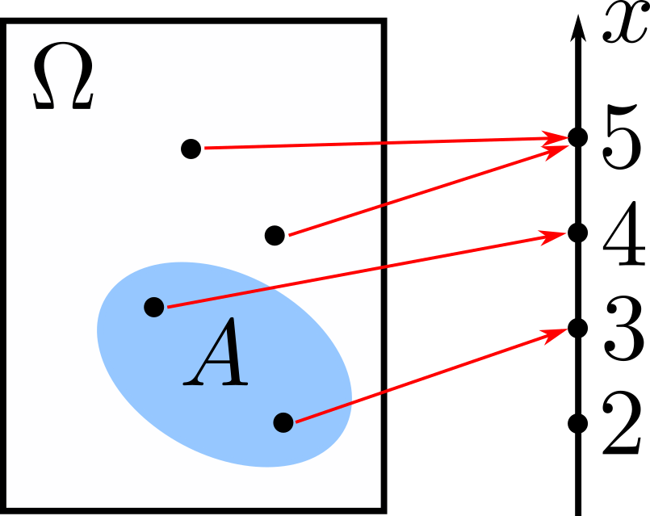

# Conditional Distributions

## Discrete Random Variables

### Conditioning on an Event

  { width="150" .center }

#### Conditional PMF and Expectation

We consider conditioning on an event $A$. Assuming that the probability that event $A$ occurs is positive, i.e., $\mathbf{P}(A)>0$, the **conditional PMF** of a random variable $X$ given that $A$ occurred is

$$p_{X\lvert A}(x)=\mathbf{P}(X=x\lvert A).$$

Like ordinary probabilities, it is normalized, i.e.,

$$\sum_{x}p_{X\lvert A}(x)=1.$$

The **conditional expectation** of $X$ is then

$$\mathbb{E}[X\lvert A]=\sum_{x}xp_{X\lvert A}(x).$$

Given a function of $X$, $g(X)$, its conditional expectation is

$$\mathbb{E}[g(X)\lvert A]=\sum_{x}g(x)p_{X\lvert A}(x).$$

#### Total Expectation Theorem

If we divide the sample space into $n$ disjoint events $A_1,\ldots,A_n,$ then the expectation of $X$ is

$$\mathbb{E}[X]=\mathbf{P}(A_1)\mathbb{E}[X\lvert A_1]+\ldots+\mathbf{P}(A_n)\mathbb{E}[X\lvert A_n].$$

### Conditioning on another Random Variable

We can also condition a random variable on another random variable. The conditional PMF of $X$ given that $Y=y$ is defined by

$$p_{X\lvert Y}(x\lvert y)=\dfrac{p_{X,Y}(x,y)}{p_Y(y)},$$

assuming that $p_Y(y)>0$. We can also condition on two random variables with the conditional PMF being

$$p_{X\lvert Y,Z}(x\lvert y,z)=\dfrac{p_{X,Y,Z}(x,y,z)}{p_{Y,Z}(y,z)}.$$

#### Conditional Expectation

The **conditional expectation** of a random variable $X$ conditioned on $Y=y$ is

$$\mathbb{E}[X\lvert Y=y]=\sum_{x}xp_{X\lvert Y}(x\lvert y).$$

Moreover, for any function $g(X)$,

$$\mathbb{E}[g(X)\lvert Y=y]=\sum_{x}g(x)p_{X\lvert Y}(x\lvert y).$$

### Independence

There are several statements we can make when two random variables, $X$ and $Y$, are independent. First,

$$\mathbb{E}[XY]=\mathbb{E}[X]\,\mathbb{E}[Y].$$

Moreover, $g(X)$ and $h(Y)$ are also independent, and

$$\mathbb{E}[g(X)h(Y)]=\mathbb{E}[g(x)]\,\mathbb{E}[h(Y)].$$

Finally, the variance of their sum is

$$\mathrm{var}(X+Y)=\mathrm{var}(X)+\mathrm{var}(Y).$$

## Continuous Random Variables

### Conditioning on an Event

$$\mathbb{E}[X\lvert A]=\int xf_{X\lvert A}(x)\,\mathrm{d}x$$

$$\mathbb{E}[g(X)\lvert A]=\int g(x)f_{X\lvert A}\,\mathrm{d}x$$

#### Total Probability Theorem

$$f_X(x)=\mathbf{P}(A_1)f_{X\lvert A_1}(x)+\ldots+\mathbf{P}(A_n)f_{X\lvert A_n}(x)$$

### Conditioning on another Random Variable

If $f_Y(y)>0,$

$$f_{X\lvert Y}(x\lvert y)=\dfrac{f_{X,Y}(x,y)}{f_Y(y)}$$

### Independence

$$f_{X,Y}(x,y)=f_X(x)f_Y(y)$$

If $X$ and $Y$ are independent,

$$\mathbb{E}[XY]=\mathbb{E}[X]\,\mathbb{E}[Y]$$
