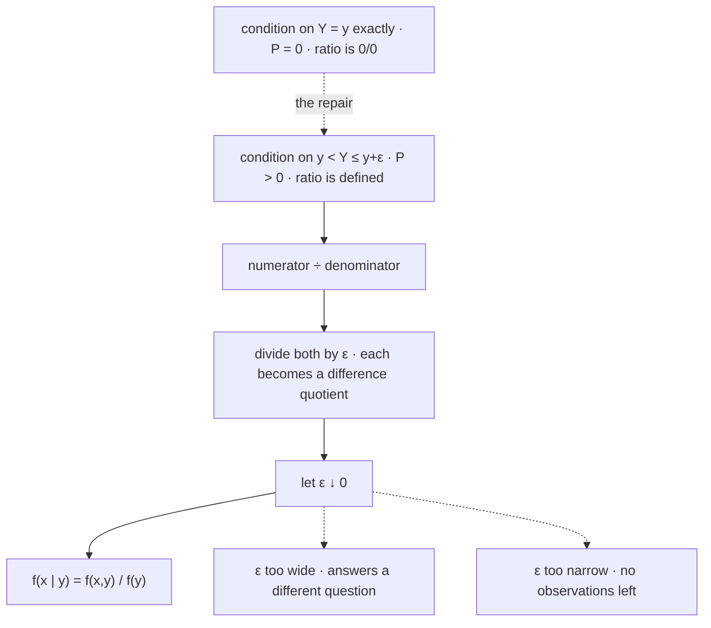

# Conditional Distributions

Conditioning a random variable on information produces another distribution, not a number. The unconditional law says what returns look like; the conditional law says what they look like on the days a signal fires, and the entire content of that signal is the difference between the two objects — not the difference between their centres, which is a summary somebody chose afterwards.

This page covers conditioning on an event, the conditional mass function obtained by slicing a joint and renormalizing, the conditional distribution function and density, the limiting construction that defines conditioning on an event of probability zero, the reading of a law as a mixture of its conditionals, and conditional independence. Two boundaries are worth stating up front. Conditioning on *events* was settled in [Conditional Probability](../part-02-probability-foundations/03-conditional-probability.md) and is used here rather than redeveloped. And conditional *expectation* — both the number $\mathbb{E}[X\mid Y=y]$ and the random variable it becomes when $y$ is allowed to vary — belongs to [Conditional Expectation](../part-04-expectation-and-moments/06-conditional-expectation.md). This page builds the object that page averages against.

The trading stake is the $\varepsilon$ in the third section. Research conditions on buckets — returns on days when the VIX closed between 17 and 19, forward performance in the third signal decile — and that bucket is literally the finite $\varepsilon$ whose limit defines the conditional density. Choosing its width is not a preprocessing detail; it is the same bias–variance tradeoff the theory hides inside a limit, and [Feature and Signal Engineering](../../part-04-strategy-development/05-feature-and-signal-engineering.md) makes the choice again on every feature it builds.

## Conditioning on an Event

Let $A$ be an event with $\mathbf{P}(A)>0$. The conditional law of $X$ given $A$ is described by exactly the same three objects as any other law, each defined by putting $\mathbf{P}(\cdot\mid A)$ where $\mathbf{P}$ used to be:

$$p_{X\mid A}(x)=\mathbf{P}(X=x\mid A),\qquad F_{X\mid A}(x)=\mathbf{P}(X\le x\mid A),\qquad f_{X\mid A}(x)=\frac{d}{dx}F_{X\mid A}(x).$$

That is the whole of this section, and it is short for a reason worth making explicit rather than leaving implicit.

??? note "Proof that nothing on the preceding pages needs restating"
    [Conditional Probability](../part-02-probability-foundations/03-conditional-probability.md) proves that $\mathbf{P}(\cdot\mid A)$ satisfies the three axioms of [Probability Axioms](../part-02-probability-foundations/02-probability-axioms.md) — it is non-negative, assigns $1$ to $\Omega$, and is countably additive. So $(\Omega,\mathcal{F},\mathbf{P}(\cdot\mid A))$ is a probability space, and $X$ is still a measurable function on it, because measurability is a property of $X$ and $\mathcal{F}$ alone and has nothing to do with which measure is attached.

    Every theorem of [Cumulative Distribution Functions](02-cumulative-distribution-functions.md), [Probability Mass Functions](03-probability-mass-functions.md), and [Probability Density Functions](04-probability-density-functions.md) is therefore available verbatim: $F_{X\mid A}$ is non-decreasing and right-continuous with the usual limits, its jumps are the conditional atoms, the conditional masses sum to one, and a conditional density integrates to one wherever it exists. No new proofs, because no new kind of object.

The consequence is that conditioning on an event is a change of measure and not a change of subject. The interesting difficulty starts one line later, when the conditioning event is not given in advance but is generated by the value of another random variable.

## Conditioning on a Discrete Random Variable

When $Y$ is discrete and $p_Y(y)>0$, the event $\{Y=y\}$ has positive probability and the previous section already covers it. Writing the definition out in terms of the joint mass function of [Joint Distributions](05-joint-distributions.md) gives the form that gets used:

$$p_{X\mid Y}(x\mid y)=\frac{p_{X,Y}(x,y)}{p_Y(y)}.$$

Operationally this is two steps: take the row of the joint table at $Y=y$, then divide by its own total. Slicing selects, and renormalizing restores the axiom that probabilities sum to one.

??? note "Proof that the conditional mass function is a mass function"
    Non-negativity is inherited from the joint. For normalization, sum over $x$ with $y$ held fixed:

    $$\sum_{x}p_{X\mid Y}(x\mid y)=\frac{1}{p_Y(y)}\sum_{x}p_{X,Y}(x,y)=\frac{p_Y(y)}{p_Y(y)}=1,$$

    where the middle step is precisely the marginalization identity of [Marginal Distributions](06-marginal-distributions.md). The denominator is the row total, so dividing by it is the only normalization that could work — and the fact that it *does* work is the marginal's definition, not a coincidence.

```python
import numpy as np

# rows: today's signal state, columns: tomorrow's outcome
J = np.array([[0.10, 0.06, 0.04],                       # short
              [0.12, 0.18, 0.10],                       # flat
              [0.05, 0.11, 0.24]])                      # long
states, outcomes = ["short", "flat ", "long "], ["down", "unch", "up"]

pS, pO = J.sum(axis=1), J.sum(axis=0)
print("unconditional      " + "  ".join(f"{o} {p:.3f}" for o, p in zip(outcomes, pO)))
for i, s in enumerate(states):
    row = J[i] / pS[i]                                  # slice the row, then renormalize
    print(f"given {s} P={pS[i]:.2f}  "
          + "  ".join(f"{o} {p:.3f}" for o, p in zip(outcomes, row))
          + f"   sum {row.sum():.3f}")
# => unconditional      down 0.270  unch 0.350  up 0.380
#    given short P=0.20  down 0.500  unch 0.300  up 0.200   sum 1.000
#    given flat  P=0.40  down 0.300  unch 0.450  up 0.250   sum 1.000
#    given long  P=0.40  down 0.125  unch 0.275  up 0.600   sum 1.000
```

Three conditional laws and one unconditional law, all on the same three outcomes. The signal's content is the gap between the last row and the first: a long reading moves $\mathbf{P}(\text{up})$ from $0.380$ to $0.600$ and $\mathbf{P}(\text{down})$ from $0.270$ to $0.125$. A short reading moves them the other way, to $0.200$ and $0.500$. Note what has *not* been done — nothing has been averaged, and no single number has been extracted. The three-vector is the answer, and any scalar summary of it is a later decision that discards part of what was measured.

!!! note "Collapsing a conditional distribution to a hit rate is a choice, and it is usually made silently"
    "The signal is 60% accurate" reports one coordinate of the bottom row and drops the other two. That is sometimes the right compression and it is never a free one, because two signals can agree on that coordinate and disagree everywhere else — which is the subject of the last section on this page, and the reason [Validation and Overfitting](../../part-04-strategy-development/08-validation-and-overfitting.md) treats a reported accuracy as the beginning of a question.

## When the Conditioning Event Has Probability Zero

For continuous $Y$ the construction above fails at the first step. Every event $\{Y=y\}$ has probability zero, as [Probability Spaces](../part-02-probability-foundations/01-probability-spaces.md) proves, so the ratio defining $\mathbf{P}(X\le x\mid Y=y)$ is $0/0$ and the definition of [Conditional Probability](../part-02-probability-foundations/03-conditional-probability.md) says nothing at all. This is not an edge case on a continuous space; it is the normal case. Both of that part's pages defer the repair to here, and here it is.

The repair is to condition on a band of positive probability and shrink it:

$$\mathbf{P}\big(X\le x\ \big|\ y<Y\le y+\varepsilon\big)=\frac{\displaystyle\int_{-\infty}^{x}\!\int_{y}^{y+\varepsilon}f_{X,Y}(s,t)\,dt\,ds}{\displaystyle\int_{y}^{y+\varepsilon}f_Y(t)\,dt}.$$

??? note "Proof of the limiting construction"
    Every quantity in the display is well defined for $\varepsilon>0$, because the conditioning event has positive probability whenever $f_Y$ is positive near $y$. As $\varepsilon\downarrow 0$ the numerator and the denominator both tend to zero, so the expression is $0/0$ in the limit and no limit can be read off directly.

    Divide the numerator and the denominator by $\varepsilon$. Neither the ratio nor its limit changes, but each piece is now a difference quotient of the kind [Calculus Essentials](../part-01-mathematical-foundations/06-calculus-essentials.md) evaluates. Assuming $f_{X,Y}$ is continuous in its second argument and $f_Y(y)>0$,

    $$\frac{1}{\varepsilon}\int_{y}^{y+\varepsilon}f_Y(t)\,dt\ \longrightarrow\ f_Y(y),\qquad \frac{1}{\varepsilon}\int_{-\infty}^{x}\!\int_{y}^{y+\varepsilon}f_{X,Y}(s,t)\,dt\,ds\ \longrightarrow\ \int_{-\infty}^{x}f_{X,Y}(s,y)\,ds.$$

    Both limits are finite and the denominator's is non-zero, so the quotient converges:

    $$F_{X\mid Y}(x\mid y)=\frac{1}{f_Y(y)}\int_{-\infty}^{x}f_{X,Y}(s,y)\,ds,$$

    and differentiating in $x$ gives the conditional density

    $$f_{X\mid Y}(x\mid y)=\frac{f_{X,Y}(x,y)}{f_Y(y)}.$$

    The final formula is the exact analogue of the discrete one, which is why it is easy to mistake for a definition rather than a theorem. It is a theorem. The ratio of the limits does not exist; the limit of the ratio does, and dividing by $\varepsilon$ is the entire content of the difference.



Read the solid path downwards: the top node is the object wanted and cannot be evaluated, so the second node replaces it with something that can, and the two middle steps are what make the replacement converge rather than merely approximate. The dashed branches on the right are what happens when $\varepsilon$ is a number chosen by a researcher rather than a variable sent to zero by a theorem — and in every applied setting it is the former.

```python
import numpy as np
from scipy.stats import norm
from scipy.integrate import quad

rng = np.random.default_rng(17)
n, rho = 2_000_000, 0.6
Y = rng.standard_normal(n)
X = rho * Y + np.sqrt(1 - rho ** 2) * rng.standard_normal(n)

c = rho / np.sqrt(1 - rho ** 2)
target = norm.cdf(-c)                                   # F(0 | Y=1), in closed form
print(f"unconditional P(X<=0) {(X <= 0).mean():.4f}     target F(0|Y=1) {target:.6f}")
for eps in (1.0, 0.5, 0.25, 0.10, 0.05, 0.01):
    m = np.abs(Y - 1.0) <= eps
    k, p = int(m.sum()), (X[m] <= 0).mean()
    band = (quad(lambda y: norm.cdf(-c * y) * norm.pdf(y), 1 - eps, 1 + eps)[0]
            / (norm.cdf(1 + eps) - norm.cdf(1 - eps)))  # the bias alone, no sampling error
    print(f"eps {eps:4.2f}  kept {k:7d}  est {p:.4f}"
          f"   bias {band - target:+.5f}   se {np.sqrt(p * (1 - p) / k):.5f}")
# => unconditional P(X<=0) 0.5003     target F(0|Y=1) 0.226627
#    eps 1.00  kept  955532  est 0.3076   bias +0.08063   se 0.00047
#    eps 0.50  kept  484390  est 0.2493   bias +0.02301   se 0.00062
#    eps 0.25  kept  242775  est 0.2322   bias +0.00596   se 0.00086
#    eps 0.10  kept   97226  est 0.2271   bias +0.00096   se 0.00134
#    eps 0.05  kept   48586  est 0.2285   bias +0.00024   se 0.00190
#    eps 0.01  kept    9789  est 0.2308   bias +0.00001   se 0.00426
```

The two error columns are computed separately and move in opposite directions, which is the point of printing them side by side. The bias falls by roughly a factor of four per row — $0.081$, $0.023$, $0.006$, $0.0010$, $0.0002$ — while the standard error grows, from $0.0005$ to $0.0043$. They cross at $\varepsilon=0.10$, where both are about $0.001$, and that row is the best estimate two million observations can support.

The widest bucket is the one to look at hardest. It is *precise*: a standard error of five ten-thousandths, five significant figures of apparent authority. It is also wrong by eight percentage points, because it answers a question about the average of a range of conditions rather than about the condition asked for. Precision and accuracy are decoupled here, and only one of them is visible in the output of a backtest. The narrowest bucket has the opposite failure, unbiased to five decimals and useless. The limit exists in the theory and no estimator reaches it at any fixed sample size — which is conditional-bucket research in its entirety, stated once.

!!! warning "The limit depends on how the conditioning set is shrunk"
    The construction above shrinks a horizontal band. Nothing forces that choice, and other choices give other answers. Conditioning on the event that a point lies on a given line through the origin, approached by shrinking a wedge of angles, produces a different conditional density from the same event approached by shrinking a strip — both limits exist, both are legitimate, and they disagree. This is the Borel–Kolmogorov paradox, and the resolution is that a conditional density given a probability-zero event is a statement about a *coordinate system* and not only about an event. Which is why re-parameterizing is never as innocent as it looks, and why [Change of Variables](09-change-of-variables.md) matters more than a page about the chain rule ought to.

## A Conditional Distribution Is a Distribution

Because $f_{X\mid Y}(\cdot\mid y)$ and $p_{X\mid Y}(\cdot\mid y)$ are genuine laws, every construction of the preceding pages applies to them unchanged and with no further argument. There is a conditional distribution function, conditional atoms where it jumps, a conditional survival function, and a conditional quantile function — so the conditional analogue of every risk number is available immediately:

$$F_{X\mid Y}^{-1}(u\mid y)=\inf\{x:F_{X\mid Y}(x\mid y)\ge u\}.$$

A VaR computed on the days a regime indicator is elevated is exactly this object at $u=0.01$, with $y$ the elevated state, and it inherits the non-uniqueness and estimation fragility that [Cumulative Distribution Functions](02-cumulative-distribution-functions.md) establishes for the unconditional version — made worse, because the conditional sample is smaller by construction. Substituting a conditional law into the definition of an average gives $\mathbb{E}[X\mid Y=y]$, and everything about that number, including the sense in which it becomes a random variable when $y$ is allowed to vary, is [Conditional Expectation](../part-04-expectation-and-moments/06-conditional-expectation.md).

| Object | Given an event $A$ | Given $Y=y$, discrete | Given $Y=y$, continuous |
|---|---|---|---|
| Mass | $\mathbf{P}(X=x\mid A)$ | $p_{X,Y}(x,y)/p_Y(y)$ | — |
| Distribution | $\mathbf{P}(X\le x\mid A)$ | $\sum_{s\le x}p_{X\mid Y}(s\mid y)$ | $\int_{-\infty}^{x}f_{X\mid Y}(s\mid y)\,ds$ |
| Density | $\tfrac{d}{dx}F_{X\mid A}(x)$ | — | $f_{X,Y}(x,y)/f_Y(y)$ |
| Defined by | the ratio, directly | the ratio, directly | a limit in $\varepsilon$ |

The last row is the only one that is not a definition, and it is the reason this page is longer than its discrete half would need.

## A Law Is a Mixture of Its Conditionals

Multiplying the conditional density by the marginal and integrating recovers the law of the other variable. Read left to right it is a computation; read right to left it is a model.

$$f_X(x)=\int f_{X\mid Y}(x\mid y)\,f_Y(y)\,dy,\qquad p_X(x)=\sum_{y}p_{X\mid Y}(x\mid y)\,p_Y(y).$$

??? note "Proof"
    The discrete case is one line: multiply $p_{X\mid Y}(x\mid y)=p_{X,Y}(x,y)/p_Y(y)$ through by $p_Y(y)$ and sum over $y$, which marginalizes the joint down to $p_X(x)$ by [Marginal Distributions](06-marginal-distributions.md). This is the [Law of Total Probability](../part-02-probability-foundations/06-law-of-total-probability.md) applied to the partition generated by $Y$, and it is the same identity that page states at the level of events.

    The continuous case is the same statement with the sum replaced by an integral, and it needs the section above rather than the axioms alone: each factor $f_{X\mid Y}(x\mid y)$ is defined only as an $\varepsilon$-limit, so the identity is a statement about those limits and not about ratios of probabilities. Substituting $f_{X\mid Y}(x\mid y)f_Y(y)=f_{X,Y}(x,y)$ reduces it to marginalizing the joint density, which is the definition.

    The event-partition version at the level of averages — $\mathbb{E}[X]=\sum_i\mathbf{P}(A_i)\,\mathbb{E}[X\mid A_i]$ — is proved on [Law of Total Probability](../part-02-probability-foundations/06-law-of-total-probability.md) and is not reproved here; its restatement in terms of a conditioning random variable is [Law of Total Expectation](../part-04-expectation-and-moments/07-law-of-total-expectation.md), and the corresponding split of the second moment is [Law of Total Variance](../part-04-expectation-and-moments/08-law-of-total-variance.md).

!!! note "Every mixture model in this book is this identity read from right to left"
    Left to right, the formula assembles a marginal from conditionals that are easier to estimate. Right to left, it is a generative recipe: draw $y$ from $f_Y$, then draw $x$ from $f_{X\mid Y}(\cdot\mid y)$. The mixtures section of [Law of Total Probability](../part-02-probability-foundations/06-law-of-total-probability.md) shows two Gaussian conditionals producing a marginal with sixteen times the tail mass of a variance-matched Gaussian, and the same reading underlies [Regime Detection](../part-18-quant-finance-applications/16-regime-detection.md), [Hidden Markov Models](../part-08-stochastic-processes/07-hidden-markov-models.md), and the empirical fat tails measured in [Returns and Their Distributions](../../part-03-statistics/02-returns-and-distributions.md). A fat-tailed marginal is very often a thin-tailed conditional plus an unobserved $y$.

Going the other way — from an observed $x$ back to a distribution over $y$ — is [Bayes' Rule](../part-02-probability-foundations/04-bayes-rule.md) with densities in place of probabilities, which is [Bayesian Signal Updating](../part-18-quant-finance-applications/08-bayesian-signal-updating.md). The pair of them, forwards and backwards, is the whole of filtering. When both conditionals are Gaussian the algebra closes in one line and the answer stays Gaussian, which is [Conditional Gaussian Distributions](../part-06-multivariate-probability/06-conditional-gaussian.md) and the reason that assumption is so hard to give up.

## Conditional Independence, and What a Signal Actually Changes

$X$ and $Y$ are independent exactly when conditioning changes nothing — $p_{X\mid Y}(x\mid y)=p_X(x)$ for every $y$ of positive mass, or $f_{X\mid Y}(x\mid y)=f_X(x)$ almost everywhere — which is the factorization of [Joint Distributions](05-joint-distributions.md) rearranged. A signal is worth having precisely to the extent that this fails. The natural next question is *how* it fails, and the answer is not one-dimensional.

```python
import numpy as np
from scipy.stats import norm

base = (0.0003, 0.012)
A = (0.0035, 0.012)                                     # same vol, higher mean
sB = 0.018
B = (-sB * norm.ppf(norm.cdf(0, *A)), sB)               # mean tuned to match A's hit rate
for name, (m, s) in [("baseline", base), ("signal A", A), ("signal B", B)]:
    print(f"{name}  mu {m:+.4f}  sd {s:.3f}   P(up) {1 - norm.cdf(0, m, s):.4f}"
          f"   P(r < -2%) {norm.cdf(-0.02, m, s):.4f}")
print(f"identical hit rates, tail ratio {norm.cdf(-0.02, *B) / norm.cdf(-0.02, *A):.2f}x")
# => baseline  mu +0.0003  sd 0.012   P(up) 0.5100   P(r < -2%) 0.0454
#    signal A  mu +0.0035  sd 0.012   P(up) 0.6147   P(r < -2%) 0.0251
#    signal B  mu +0.0053  sd 0.018   P(up) 0.6147   P(r < -2%) 0.0803
#    identical hit rates, tail ratio 3.20x
```

Both signals lift the probability of an up day from $51.0\%$ to $61.5\%$, to four decimal places, and by that measure they are the same signal. On the tail they are not close. Signal A cuts the frequency of a two-percent loss almost in half, from $4.54\%$ to $2.51\%$; signal B nearly doubles it, to $8.03\%$. The ratio between them is $3.20$, and no amount of additional accuracy data would reveal it, because accuracy is not where the difference lives. Signal B buys its hit rate with variance — a wider conditional distribution shifted further right — and a wider distribution pays for its right tail with its left one.

!!! note "A sizing rule reads the shape of a conditional distribution, not its centre"
    Whatever a position-sizing rule is, it is a functional of the conditional law: Kelly reads the whole distribution of outcomes, volatility targeting reads the second moment, and a drawdown constraint reads the left tail. Two signals with the same conditional mean and different conditional variances therefore receive different sizes from every rule in [Position Sizing and Risk Budgeting](../../part-04-strategy-development/06-position-sizing-and-risk-budgeting.md) — which is the practical argument for carrying the distribution as far into the pipeline as possible before summarizing it.

Conditional independence is the same statement with a third variable held fixed, $p_{X\mid Y,Z}=p_{X\mid Z}$, and it is a strictly different claim from independence: variables can be dependent unconditionally and independent given $Z$, or the reverse, as [Independence](../part-02-probability-foundations/05-independence.md) demonstrates in both directions. It is also the assumption that makes the joint law of a long sequence tractable at all, by letting it factor into a product of one-step conditionals — the structure that [Markov Chains](../part-08-stochastic-processes/05-markov-chains.md) is named after.

A signal reported as a conditional mean has been summarized before it was understood. The object it summarizes is a distribution, and the same improvement in the centre can arrive with a tail three times heavier, priced identically by every metric that looks only at the middle. So the honest statement of an edge is a conditional law rather than a number — and the honest statement of a bucket is its width, because a conditional law estimated on a band is a different object from the one the notation promises, by an amount nothing in the output reports.
