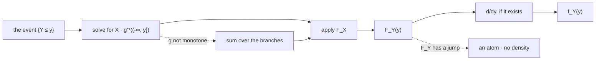

# Functions of Random Variables

Transforming a random variable requires no new probability theory at all. If $Y=g(X)$, then the event $\{Y\le y\}$ is the set of outcomes $X$ sends into $g^{-1}((-\infty,y])$, and computing its probability is the entire method. Everything else on this page is that one identity applied to particular $g$, plus the bookkeeping needed when $g$ is not invertible.

This page covers transformation as a preimage problem, the discrete level-set sum, the distribution function method, non-monotone $g$ handled branch by branch, minima and maxima, transforms that manufacture atoms, and functions of two variables including the convolution. When $g$ is smooth and invertible the method collapses to a single formula with a Jacobian in it, and that shortcut and its geometry are [Change of Variables](09-change-of-variables.md) — which is why that page reads second even though its formula is the one people quote.

Almost every number a trading system reports is a transform of a number it modelled. A stop is a maximum, a cap is a minimum, a drawdown is a running extremum, a monthly return is a sum, and a log return is a smooth reparameterization. The law of the reported quantity is therefore never the law that was estimated, and the transform is where the shape is decided — a point [Returns and Their Distributions](../../part-03-statistics/02-returns-and-distributions.md) meets immediately, since simple and log returns are transforms of each other.

## Transformation Is a Preimage Problem

For a Borel function $g:\mathbb{R}\to\mathbb{R}$ and a random variable $X$, the composite $Y=g(X)$ is a random variable, and its law is determined by

$$\{g(X)\in B\}=X^{-1}\big(g^{-1}(B)\big),\qquad \mathbf{P}(Y\in B)=\mathbf{P}_X\big(g^{-1}(B)\big).$$

Pull the target set back through $g$, then measure it under the law of $X$. No new measure is constructed and no new space appears.

??? note "Proof that $g\circ X$ is a random variable"
    Measurability requires $\{g(X)\in B\}\in\mathcal{F}$ for every Borel $B$. Since $g$ is Borel, $g^{-1}(B)$ is a Borel subset of $\mathbb{R}$; since $X$ is measurable, the preimage of any Borel set under $X$ is in $\mathcal{F}$. Composing, $\{g(X)\in B\}=X^{-1}(g^{-1}(B))\in\mathcal{F}$.

    The step that makes this work is that **preimages compose** — $(g\circ X)^{-1}=X^{-1}\circ g^{-1}$ — which is the property [Sets and Functions](../part-01-mathematical-foundations/01-sets-and-functions.md) establishes and [Probability Spaces](../part-02-probability-foundations/01-probability-spaces.md) points here for. Images do not compose in any useful way, and a theory built on them would need a separate argument for every transform instead of one argument for all of them.

    Note what the proof did *not* require: no continuity, no monotonicity, no differentiability, and no density. Those assumptions buy convenience later, never correctness here.

## The Discrete Case: Sum Over the Level Set

When $X$ is discrete, $g^{-1}(\{y\})$ is a set of values and the pullback is a sum:

$$p_Y(y)=\sum_{x:\,g(x)=y}p_X(x).$$

If $g$ is injective the sum has one term and the transform merely relabels the support — $Y=aX+b$ with $a\ne 0$ gives $p_Y(y)=p_X\!\big((y-b)/a\big)$, the masses unchanged and the values moved. If $g$ is not injective, masses **merge**, and the shape of the law changes even though no probability was created or destroyed. Squaring a symmetric law collapses $\pm x$ onto $x^2$ and doubles the mass at every non-zero value; taking the sign of a return collapses a whole distribution onto three points.

The condition $a\ne 0$ is not pedantry. At $a=0$ the transform sends everything to $b$, and the resulting law is a single atom — a legitimate random variable, and one with no inverse anywhere.

## The Distribution Function Method

For continuous $X$ the reliable procedure is two steps: write $\{Y\le y\}$ as an event about $X$, evaluate $F_X$ on it, then differentiate if a density is wanted.



Read the solid path as the method and the two dashed branches as the only complications. Neither is a failure of the method: a non-monotone $g$ just makes the preimage a union of intervals rather than one interval, and a jump in $F_Y$ just means the last step has nothing to produce. The step that never fails is the second one, which is why this page insists on the preimage as the method rather than treating it as a remark.

!!! note "The distribution function method never fails; the shortcut sometimes does"
    It needs no monotonicity, no differentiability, and no density, and it applies to discrete, continuous, and mixed inputs alike. The single-formula version on [Change of Variables](09-change-of-variables.md) is faster and assumes all three. When the two disagree, the method is right and the formula has been applied outside its hypotheses — which in practice means a transform that was not injective, or one that flattened an interval onto a point.

## Non-Monotone $g$: Summing the Branches

Take $Y=X^2$ with $X$ standard normal. The preimage of $(-\infty,y]$ for $y\ge 0$ is the interval $[-\sqrt{y},\sqrt{y}]$, so

$$F_Y(y)=\mathbf{P}(-\sqrt{y}\le X\le\sqrt{y})=\Phi(\sqrt{y})-\Phi(-\sqrt{y})=2\Phi(\sqrt{y})-1,$$

using the symmetry of the normal in the last step. Differentiating gives $f_Y(y)=\phi(\sqrt{y})/\sqrt{y}$ for $y>0$, a density that is unbounded at the origin — a concrete instance of the fact that densities need not be bounded ([Probability Density Functions](04-probability-density-functions.md)).

```python
import numpy as np
from scipy.stats import norm

rng = np.random.default_rng(41)
X = rng.standard_normal(1_000_000)
Y = X ** 2                                              # not monotone: two branches
for y in (0.25, 1.00, 4.00):
    theory = 2 * norm.cdf(np.sqrt(y)) - 1               # F_Y(y) = P(-sqrt y <= X <= sqrt y)
    print(f"  y {y:4.2f}   theory {theory:.6f}   simulated {(Y <= y).mean():.6f}")
# =>   y 0.25   theory 0.382925   simulated 0.382755
#      y 1.00   theory 0.682689   simulated 0.682790
#      y 4.00   theory 0.954500   simulated 0.954482
```

Agreement to four decimals at a million draws, which is what a correct derivation looks like against a simulation.

In general, if $g$ is piecewise monotone with branches $x_1(y),x_2(y),\ldots$ each solving $g(x_k)=y$, the density adds a contribution from each:

$$f_Y(y)=\sum_{k}f_X\big(x_k(y)\big)\left|\frac{dx_k}{dy}\right|.$$

The per-branch factor $|dx_k/dy|$ is the object [Change of Variables](09-change-of-variables.md) is about; this page names it and hands it over. What belongs here is the summation, because that is the part the preimage argument supplies and the single-branch formula cannot.

## Minima, Maxima, and Order Statistics

For independent $X_1,\ldots,X_n$ sharing a distribution function $F$, extremes have distribution functions in closed form:

$$F_{\max}(y)=F(y)^n,\qquad F_{\min}(y)=1-\big(1-F(y)\big)^n.$$

??? note "Proof"
    The maximum is at most $y$ exactly when *every* variable is, so $\{\max_i X_i\le y\}=\bigcap_i\{X_i\le y\}$. Independence factorizes the probability of the intersection into $\prod_i F(y)=F(y)^n$, using the $n$-fold factorization of [Joint Distributions](05-joint-distributions.md).

    For the minimum, complement first: $\{\min_i X_i>y\}=\bigcap_i\{X_i>y\}$, which factorizes to $(1-F(y))^n$, and subtracting from one gives the result. Complementing before factorizing is necessary — the event $\{\min\le y\}$ is a union, not an intersection, and unions do not factorize.

| $n$ | $\mathbf{P}(\max > 3\%)$ |
|---|---|
| $1$ | $0.0067$ |
| $5$ | $0.0329$ |
| $21$ | $0.1310$ |
| $252$ | $0.8144$ |

For a daily return that is $N(0.0003,\,0.012)$, a single day exceeds $+3\%$ with probability $0.0067$ — about one chance in a hundred and fifty. Over a trading year the probability that *some* day does is $0.8144$. The daily law never changed; only $n$ did.

!!! note "The worst day of the year is not the worst day scaled"
    Extremes have their own limiting theory, and it is not the Central Limit Theorem. Sums of many variables converge to a Gaussian; maxima of many variables converge to one of three quite different shapes, which is the content of [Extreme Value Theory](../part-18-quant-finance-applications/14-extreme-value-theory.md). This is why a risk estimate built by annualizing a daily volatility describes the body of the annual distribution and says almost nothing correct about its worst day, and why [Drawdown Probabilities](../part-18-quant-finance-applications/03-drawdown-probabilities.md) needs machinery of its own.

## Transforms That Create Atoms

Some transforms are not injective in the most consequential possible way: they flatten an interval onto a point. A stop-loss at level $c$ is $Y=\max(R,c)$, which maps the entire half-line below $c$ onto $c$ itself.

```python
import numpy as np
from scipy.stats import norm

mu, sd, c = 0.0003, 0.012, -0.02
rng = np.random.default_rng(42)
R = rng.normal(mu, sd, 1_000_000)
Y = np.maximum(R, c)                                    # a stop at -2%
print(f"  P(R = -2%) exactly        {(R == c).mean():.5f}")
print(f"  theory  P(Y = -2%)        {norm.cdf((c - mu) / sd):.5f}")
print(f"  simulated P(Y = -2%)      {(Y == c).mean():.5f}")
# =>   P(R = -2%) exactly        0.00000
#      theory  P(Y = -2%)        0.04535
#      simulated P(Y = -2%)      0.04563
```

The input law has no atoms anywhere — the first line confirms that not one of a million draws landed exactly on $-2\%$, as [Probability Density Functions](04-probability-density-functions.md) guarantees. The output law has an atom of mass $0.0454$, and it sits precisely on the stop level. A transform that touched no probability whatsoever manufactured a four-and-a-half percent point mass, and it put it at the one price the risk report is most interested in.

!!! warning "A stop turns a continuous distribution into a mixed one"
    The stopped return has an atom, therefore no density, therefore no likelihood in the ordinary sense — any calculation that begins by writing $f_Y$ is already wrong, and any histogram of stopped returns has a spike whose height depends on the bin width rather than on the data. The description that survives is the distribution function of [Cumulative Distribution Functions](02-cumulative-distribution-functions.md), and it is also where the endpoint conventions stop being interchangeable: with mass sitting exactly at $-2\%$, "a loss of 2% or worse" and "a loss worse than 2%" now differ by $0.0454$. Every capped, floored, or barrier-truncated payoff has this structure, which is most of them.

## Two Variables, and the Convolution

For $Z=g(X,Y)$ the method is unchanged, with the preimage now a region of the plane. In the discrete case the level set is a set of pairs:

$$p_Z(z)=\sum_{(x,y):\,g(x,y)=z}p_{X,Y}(x,y).$$

The most important case is the sum, $Z=X+Y$, whose level sets are the anti-diagonal lines $x+y=z$.

??? note "Proof of the convolution formula"
    The event $\{X+Y\le z\}$ is the half-plane below the line $x+y=z$, so

    $$F_Z(z)=\iint_{x+y\le z}f_{X,Y}(x,y)\,dx\,dy=\int_{-\infty}^{\infty}\!\!\int_{-\infty}^{z-x}f_{X,Y}(x,y)\,dy\,dx,$$

    rewriting the inner limit as $y\le z-x$. Differentiating in $z$ under the integral sign hits only the upper limit of the inner integral, giving $f_Z(z)=\int f_{X,Y}(x,z-x)\,dx$. If $X$ and $Y$ are independent the joint factorizes and

    $$f_Z(z)=\int_{-\infty}^{\infty}f_X(x)\,f_Y(z-x)\,dx,$$

    the **convolution** of the two densities. The discrete version is the same argument with sums: $p_Z(z)=\sum_x p_X(x)\,p_Y(z-x)$.

    Every step used the region and the joint. [Change of Variables](09-change-of-variables.md) obtains the same formula in three lines by mapping $(x,y)\mapsto(x+y,y)$ and marginalizing, and the contrast between the two derivations is the clearest statement of what the shortcut buys.

```python
import numpy as np

p = np.full(6, 1 / 6)
s = np.convolve(p, p)                                   # law of the sum of two dice
print("  sum      " + "  ".join(f"{k:2d}" for k in range(2, 13)))
print("  x36      " + "  ".join(f"{v * 36:2.0f}" for v in s))
print(f"  total {s.sum():.4f}")
# =>   sum       2   3   4   5   6   7   8   9  10  11  12
#      x36       1   2   3   4   5   6   5   4   3   2   1
#      total 1.0000
```

Two flat laws convolve into a triangular one. Nothing about either input suggested a peak in the middle, and the peak is not an approximation — the masses are exactly $k/36$. Convolution smooths and concentrates, and iterating it is what drives a sum of many independent variables toward the bell shape of [The Central Limit Theorem](../part-07-asymptotic-theory/03-central-limit-theorem.md). It is also the operation underneath $\sqrt{T}$ scaling: a $T$-day return is a $T$-fold convolution, and the reason its spread grows like $\sqrt{T}$ rather than like $T$ is a statement about how convolution combines dispersion, made precise in [Variance](../part-04-expectation-and-moments/02-variance.md) and used throughout [Exponentials, Logarithms, and Growth](../part-01-mathematical-foundations/07-exponentials-logarithms-growth.md).

| Transform | Kind of $g$ | Effect on the law | Where it appears in trading |
|---|---|---|---|
| $aX+b$ | injective, linear | relabels; shape preserved | unit changes, leverage |
| $X^2$, $\lvert X\rvert$ | two branches | folds; masses merge | realized variance, absolute moves |
| $\max(X,c)$ | flattens an interval | creates an atom at $c$ | stops, floors, capped payoffs |
| $\max(X_1,\ldots,X_n)$ | order statistic | $F^n$; shifts right with $n$ | worst day, running peak |
| $X+Y$ | many-to-one | convolves; smooths | multi-day returns, book aggregation |
| $e^X$ | smooth, injective | rescales the density | prices from log prices |

Every number a trading system reports is a transform of a number it modelled, and the transform is where the shape is decided. A stop does not merely truncate a loss; it moves mass onto a point and destroys the density. A sum does not merely add centres; it convolves, and manufactures a peak that neither input had. A maximum does not merely pick the largest; it changes which limit theorem applies. Nothing about the input law survives a transform automatically — the only thing that survives is the preimage identity, which is precisely why it is worth stating as the method rather than as a remark.
