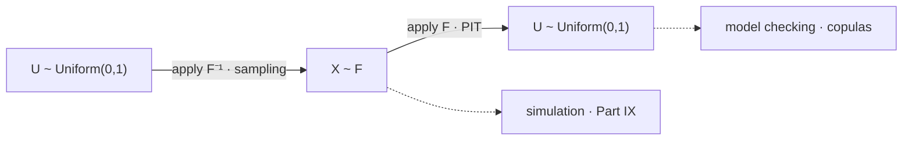

# Change of Variables

A density is a rate per unit of $x$, so re-expressing a random variable in a new coordinate has to rescale the rate by however much the coordinate change stretches the axis locally. That local stretch is the Jacobian, and the change-of-variables formula is bookkeeping around it. The random variable itself does not care which coordinate it is written in; its density does, by exactly one factor, and every quantity computed from the density carries that factor along.

This page covers the one-dimensional monotone formula derived from the method of [Functions of Random Variables](08-functions-of-random-variables.md), the Jacobian read as a stretch, the lognormal as the worked case, the probability integral transform, inverse-transform sampling, the multivariate determinant, and what a reparameterization does to a log-likelihood. The general non-monotone case stays on the previous page, named families are [Part V](../part-05-common-distributions/index.md), and linear maps applied to random vectors are [Linear Transformations](../part-06-multivariate-probability/04-linear-transformations.md).

Log returns are a coordinate choice, and the Jacobian is what it costs. It is the $1/y$ in the lognormal density, it is the gap between $e^{\mu}$ and $e^{\mu+\sigma^2/2}$ that gets called volatility drag, and it is the term that has to be added before two log-likelihoods computed on differently-scaled data can be compared at all — the unresolved problem left standing at the end of [Probability Density Functions](04-probability-density-functions.md).

## The Formula, Derived From the Method of the Previous Page

Let $X$ have density $f_X$ and let $Y=g(X)$ where $g$ is differentiable and strictly monotone, with inverse $h=g^{-1}$. Then

$$f_Y(y)=f_X\big(h(y)\big)\,\big|h'(y)\big|.$$

??? note "Proof"
    **Increasing $g$.** The event $\{Y\le y\}$ is $\{g(X)\le y\}=\{X\le h(y)\}$, since applying an increasing function to both sides of an inequality preserves it. So $F_Y(y)=F_X(h(y))$, and the chain rule of [Calculus Essentials](../part-01-mathematical-foundations/06-calculus-essentials.md) gives $f_Y(y)=f_X(h(y))\,h'(y)$. Here $h'>0$, so the derivative equals its own absolute value.

    **Decreasing $g$.** Now the inequality flips: $\{g(X)\le y\}=\{X\ge h(y)\}$, so $F_Y(y)=1-F_X(h(y))$ and differentiating gives $f_Y(y)=-f_X(h(y))\,h'(y)$. Here $h'<0$, so $-h'=|h'|$ and the two cases coincide.

    The absolute value is therefore not a convention imposed to keep the density positive — it is what the two branches produce, and the fact that they agree is why one formula covers both. Strict monotonicity is doing the work: it is what makes $h$ a function at all, and it is exactly the hypothesis that fails for $g(x)=x^2$, where the preimage is two intervals and the branch sum of [Functions of Random Variables](08-functions-of-random-variables.md) is needed instead.

Nothing here is independent of the previous page. This is the distribution function method, carried out once in general rather than once per transform, under the assumption that makes the algebra close.

## The Jacobian Read as a Stretch

The formula is easier to remember, and harder to misuse, in differential form:

$$f_Y(y)\,\lvert dy\rvert=f_X(x)\,\lvert dx\rvert.$$

Probability *mass* in corresponding infinitesimal intervals is the same on both sides — nothing is created or destroyed by renaming the axis. What changes is the width of the interval the mass sits in. If the map stretches a region by a factor of two, the same mass now occupies twice the width, so the rate must halve. The Jacobian $|dx/dy|$ is exactly that width ratio.

This also explains the direction people most often get backwards. The factor is the derivative of the *inverse* map evaluated at $y$, not the derivative of $g$ at $x$ — though the two are reciprocals, so quoting either is fine as long as it is the right way up. And it connects the formula to the integral calculus it came from: substitution in an integral, $\int f(g(x))g'(x)\,dx=\int f(u)\,du$, is the same statement about the same factor, which is why [Calculus Essentials](../part-01-mathematical-foundations/06-calculus-essentials.md) points here for the probabilistic reading of $u$-substitution.

| Statement | Symbol | Reads as |
|---|---|---|
| Mass is conserved | $f_Y(y)\lvert dy\rvert=f_X(x)\lvert dx\rvert$ | the same probability, in a new coordinate |
| The one-dimensional factor | $\lvert h'(y)\rvert=\lvert dx/dy\rvert$ | how much the map stretches the axis at $y$ |
| The multivariate factor | $\lvert\det Dh(y)\rvert$ | how much the map stretches *volume* at $y$ |

## The Lognormal, and Why the Median Is Not the Median of the Logs

Let $X\sim N(\mu,\sigma^2)$ and $Y=e^X$, the transform that turns a log return into a price ratio. Here $h(y)=\log y$ and $h'(y)=1/y$, so

$$f_Y(y)=\frac{1}{y\,\sigma\sqrt{2\pi}}\exp\!\left(-\frac{(\log y-\mu)^2}{2\sigma^2}\right),\qquad y>0.$$

The $1/y$ out front is not a normalizing fudge. It *is* the Jacobian, and it is the entire difference between the normal density and the lognormal one.

```python
import numpy as np
from scipy.integrate import quad

mu, s = 0.0, 0.20
f = lambda y: np.exp(-(np.log(y) - mu) ** 2 / (2 * s * s)) / (y * s * np.sqrt(2 * np.pi))
print(f"  derived density integrates to {quad(f, 1e-12, 50)[0]:.8f}")

rng = np.random.default_rng(51)
Y = np.exp(rng.normal(mu, s, 2_000_000))
for y in (0.9, 1.0, 1.2):
    d = 0.01
    emp = ((Y > y - d) & (Y <= y + d)).mean() / (2 * d)  # the local-limit estimate
    print(f"  f({y:.1f})  formula {f(y):.5f}   simulated {emp:.5f}")
print(f"  median exp(mu) {np.exp(mu):.5f}   mean exp(mu+s^2/2) {np.exp(mu + s*s/2):.5f}"
      f"   sample mean {Y.mean():.5f}")
# =>   derived density integrates to 1.00000000
#      f(0.9)  formula 1.92919   simulated 1.91942
#      f(1.0)  formula 1.99471   simulated 1.98667
#      f(1.2)  formula 1.09709   simulated 1.09245
#      median exp(mu) 1.00000   mean exp(mu+s^2/2) 1.02020   sample mean 1.02022
```

The derived density integrates to one to eight decimals and matches the simulated rates at three separate points, which is the confirmation that the Jacobian was applied correctly and the right way up.

The last line is the one with consequences. **The median transforms and the mean does not.** Because $\exp$ is strictly increasing, it preserves order, so it maps the median of $X$ to the median of $Y$: the median price ratio is $e^{\mu}=1.0000$, read straight off. The mean does not survive the trip — it is $e^{\mu+\sigma^2/2}=1.0202$, confirmed by the sample. So a log return averaging zero corresponds to a price ratio whose *typical* value is exactly one and whose *average* value is above one.

!!! note "Volatility drag is a Jacobian"
    The $e^{\sigma^2/2}$ wedge between median and mean is a property of the exponential map's curvature, not a cost charged by the market. Quantiles pass through monotone transforms untouched, which is why [Cumulative Distribution Functions](02-cumulative-distribution-functions.md) can define $F^{-1}$ and have it commute with any increasing $g$; averages do not, because averaging and a nonlinear map do not commute. The practical reading is that the compounded growth an investor experiences tracks the median and the arithmetic average of returns tracks the mean, and the gap widens with $\sigma^2$ — which is developed as growth arithmetic in [Exponentials, Logarithms, and Growth](../part-01-mathematical-foundations/07-exponentials-logarithms-growth.md), as a distribution family in [Lognormal Distribution](../part-05-common-distributions/12-lognormal-distribution.md), and as a process in [Geometric Brownian Motion](../part-08-stochastic-processes/09-geometric-brownian-motion.md).

## The Probability Integral Transform

Feed a random variable through its own distribution function and the result is uniform.

$$X\sim F\ \text{continuous}\quad\Longrightarrow\quad F(X)\sim\text{Uniform}(0,1).$$

??? note "Proof, and where it fails"
    For continuous and strictly increasing $F$, and $u\in(0,1)$,

    $$\mathbf{P}\big(F(X)\le u\big)=\mathbf{P}\big(X\le F^{-1}(u)\big)=F\big(F^{-1}(u)\big)=u,$$

    which is the distribution function of a uniform. The general continuous case replaces the middle step with the generalized inverse of [Cumulative Distribution Functions](02-cumulative-distribution-functions.md) and its equivalence $F^{-1}(u)\le x\iff u\le F(x)$, which handles flat stretches of $F$ without incident.

    **It fails for discrete $F$.** If $F$ is a step function its range is a finite or countable set of levels, so $F(X)$ takes only those values and cannot be uniform — it is a discrete random variable with atoms exactly at the jumps. This is not a technicality: PIT-based backtests of count models and of any discretely-supported forecast are invalid as stated, and the repair is a *randomized* PIT that spreads each atom uniformly across the jump it occupies.

Because the output is uniform whatever $F$ was, the transform is the standard device for putting different laws on a common footing. Feeding each margin through its own $F$ is precisely how a joint law is placed into copula coordinates, which is the operational half of the Sklar decomposition stated on [Marginal Distributions](06-marginal-distributions.md). It is also the basis of model checking: if a forecasting model is right, its predicted distribution function evaluated at the realized outcome should look uniform across many days, and any departure — clustering near the ends, a hump in the middle — diagnoses a specific failure of the forecast.

## Inverse-Transform Sampling

Running the same transform backwards generates samples from any law at all.

$$U\sim\text{Uniform}(0,1)\quad\Longrightarrow\quad F^{-1}(U)\sim F.$$

??? note "Proof"
    By the generalized-inverse equivalence of [Cumulative Distribution Functions](02-cumulative-distribution-functions.md), $F^{-1}(u)\le x$ holds exactly when $u\le F(x)$. Therefore

    $$\mathbf{P}\big(F^{-1}(U)\le x\big)=\mathbf{P}\big(U\le F(x)\big)=F(x),$$

    the last step because $U$ is uniform and $F(x)\in[0,1]$. So $F^{-1}(U)$ has distribution function $F$, as claimed.

    This argument used no density, no continuity, and no monotonicity of any transform — only the equivalence, which holds for every distribution function. So it works for discrete and mixed $F$ as well, and it therefore **discharges the converse claimed on [Cumulative Distribution Functions](02-cumulative-distribution-functions.md)**: given any non-decreasing, right-continuous $F$ running from $0$ to $1$, the recipe constructs a random variable having it. Every such function really is somebody's distribution function.



One picture, two theorems, read in opposite directions. Going right builds a sample from a law you specify, which is the foundation of [Random Number Generation](../part-09-monte-carlo-methods/01-random-number-generation.md) and [Sampling Methods](../part-09-monte-carlo-methods/02-sampling-methods.md) and hence of every simulated path in [Monte Carlo Simulation](../part-09-monte-carlo-methods/03-monte-carlo-simulation.md). Going left takes data you have and checks it against a law you proposed.

```python
import numpy as np
from scipy.stats import kstest

rng = np.random.default_rng(52)
lam = 2.5
u = rng.random(1_000_000)
X = -np.log1p(-u) / lam                                 # F inverse for the exponential
for q in (0.25, 0.50, 0.90, 0.99):
    print(f"  q {q:.2f}   sample {np.quantile(X, q):.5f}   theory {-np.log1p(-q)/lam:.5f}")
back = 1 - np.exp(-lam * X)                             # F(X) should return u exactly
print(f"  round trip max |F(X) - u| {np.abs(back - u).max():.2e}")
print(f"  KS of F(X) against uniform {kstest(back, 'uniform').statistic:.5f}")
# =>   q 0.25   sample 0.11499   theory 0.11507
#      q 0.50   sample 0.27720   theory 0.27726
#      q 0.90   sample 0.92078   theory 0.92103
#      q 0.99   sample 1.84257   theory 1.84207
#      round trip max |F(X) - u| 1.11e-16
#      KS of F(X) against uniform 0.00064
```

Uniform draws in, exponential quantiles out, matching theory to four decimals at every level tested. The round trip returns the original uniforms to machine precision, which is the numerical content of the two theorems being exact inverses.

!!! note "Every Monte Carlo path in this book starts with a uniform"
    A generator produces uniforms and nothing else; every other distribution is a transform of them. So the correctness of a simulation rests on two separable things — the quality of the uniform stream and the correctness of the transform — and they fail in different ways and are debugged differently. It is also why `default_rng(seed)` appears at the top of every block in this appendix: fixing the uniforms fixes everything downstream of them.

## The Multivariate Jacobian

In $n$ dimensions the local stretch factor is a volume ratio, and the determinant is what measures it. For an invertible differentiable map with inverse $h$,

$$f_Y(y)=f_X\big(h(y)\big)\,\big\lvert\det Dh(y)\big\rvert,$$

where $Dh$ is the matrix of partial derivatives. The determinant is the right object because that is what a determinant *is* — the factor by which a linear map scales volume, as [Basic Linear Algebra Review](../part-01-mathematical-foundations/05-linear-algebra-review.md) establishes — and a differentiable map is linear to first order in a small enough neighbourhood.

```python
import numpy as np

A = np.array([[2.0, 1.0], [0.0, 3.0]])
detA = np.linalg.det(A)
fX = lambda v: np.exp(-0.5 * (v @ v)) / (2 * np.pi)     # standard bivariate normal
print(f"  det A {detA:.4f}")
for x in (np.array([0.0, 0.0]), np.array([1.0, -1.0])):
    print(f"  x {x}   f_X(x) {fX(x):.6f}   f_Y(Ax) {fX(x) / detA:.6f}"
          f"   ratio {detA:.6f}")
# =>   det A 6.0000
#      x [0. 0.]   f_X(x) 0.159155   f_Y(Ax) 0.026526   ratio 6.000000
#      x [ 1. -1.]   f_X(x) 0.058550   f_Y(Ax) 0.009758   ratio 6.000000
```

The ratio is exactly $6$ at both points and at every other point, to every decimal, because it is an identity rather than an approximation: the map spreads the same total probability over six times the area, so the density is six times lower everywhere.

The payoff is the convolution. Take the map $(x,y)\mapsto(u,v)=(x+y,\,y)$, whose inverse is $(u,v)\mapsto(u-v,\,v)$ with Jacobian matrix $\left(\begin{smallmatrix}1&-1\\0&1\end{smallmatrix}\right)$ and determinant $1$. The formula gives

$$f_{U,V}(u,v)=f_{X,Y}(u-v,\,v),$$

and marginalizing $v$ away — the operation of [Marginal Distributions](06-marginal-distributions.md) — yields $f_U(u)=\int f_{X,Y}(u-v,v)\,dv$, the convolution. Three lines. [Functions of Random Variables](08-functions-of-random-variables.md) needed a half-plane integral and a differentiation under the integral sign to reach the same result, and the contrast is the clearest available statement of what the shortcut buys and what it costs: the long derivation needs no invertibility and works for any $g$, and the short one needs a smooth invertible map and finishes in a line.

## Reparameterization and the Log-Likelihood

Applying a monotone transform $g$ to every observation and refitting changes the log-likelihood by a fixed amount:

$$\log L_Y=\log L_X-\sum_{i}\log\big\lvert g'(x_i)\big\rvert.$$

This closes the loop left open on [Probability Density Functions](04-probability-density-functions.md), where the same model on the same returns scored $+3{,}075.88$ in decimals and $-6{,}134.46$ in basis points. For the linear rescaling $g(x)=cx$ the correction is $n\log c$, which for $n=1000$ and $c=100$ is $4{,}605.17$ — exactly the gap observed there, entirely accounted for, and containing no information about how well anything fits.

!!! warning "Two log-likelihoods computed in different coordinates are not comparable without the Jacobian term"
    Maximum likelihood is invariant, because the correction is the same constant for every candidate model and therefore does not move the argmax ([Maximum Likelihood Estimation](../part-11-parameter-estimation/03-maximum-likelihood-estimation.md)). Anything that compares likelihood *levels* is not invariant: AIC and BIC across differently-scaled data, likelihood ratios spanning a transform, and any "model score" tabulated without its units all inherit the shift ([Information Criteria (AIC/BIC)](../part-14-model-selection/03-information-criteria.md)). The failure is silent, because the corrupted number is a plausible-looking real number and nothing flags it. The discipline is to fix one coordinate system per project, state it, and add the Jacobian on the rare occasion two coordinate systems genuinely have to be compared.

A coordinate change is free for the random variable and never free for its density. The variable does not care whether it is written in returns or log returns, in dollars or in basis points; the density does, by exactly one factor, and every quantity computed from it — a likelihood, a mode, an information criterion, the height of a plotted curve — carries that factor along. Quantiles are the exception worth memorizing, because they pass through monotone maps untouched, which is why medians and VaRs can be moved between coordinate systems without thought and means and modes cannot. Log returns are the right coordinate for almost everything in this book. The discipline is remembering that it was a choice.
