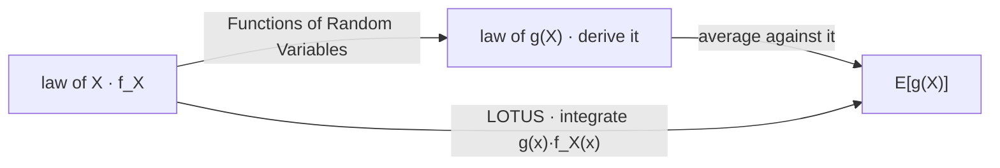

# Expected Value

An expectation is the one summary of a distribution that combines across positions with no assumption whatever about how they move together — and it is also the one that a working lifetime of data will not pin down. Those two facts are not unrelated, and between them they decide what a quantitative business can actually be organised around.

This page covers the discrete and continuous definitions and the condition both presuppose, a distribution with no mean at all, linearity and why it needs nothing, the law of the unconscious statistician, Jensen's inequality, and Markov's bound. It does not cover spread, which is [Variance](02-variance.md), and it does not derive the law of $g(X)$ — that is [Functions of Random Variables](../part-03-random-variables/08-functions-of-random-variables.md), and the entire point of the fourth section below is that you never need to.

The trading stake is an asymmetry. On the same twenty-five years of index data, the annualized volatility is pinned to within $0.9\%$ of itself and the annualized mean to within $52\%$ of itself — a fifty-eight-fold gap between two numbers computed from one file by one procedure. The mean is the easiest moment to combine and the hardest to measure, and every other page in this part describes a quantity with the opposite profile. [Probability and Random Variables](../../part-03-statistics/01-probability-and-random-variables.md) measures both on real returns.

## The Definition and the Condition It Requires

For a discrete random variable the expectation is a mass-weighted sum over the support, and for one with a density it is an integral against that density:

$$\mathbb{E}[X]=\sum_{x}x\,p_X(x),\qquad \mathbb{E}[X]=\int_{-\infty}^{\infty}x\,f_X(x)\,dx,$$

with $p_X$ from [Probability Mass Functions](../part-03-random-variables/03-probability-mass-functions.md) and $f_X$ from [Probability Density Functions](../part-03-random-variables/04-probability-density-functions.md). Both are centres of mass: each possible value weighted by how much probability sits there.

Neither display is a definition yet. A sum over a countably infinite support and an integral over the whole line can both fail to have a value, and the condition that rules the failure out is absolute convergence:

$$\mathbb{E}\lvert X\rvert<\infty.$$

??? note "Proof that absolute convergence is the right condition"
    Suppose $\sum_x x\,p_X(x)$ converges but $\sum_x\lvert x\rvert\,p_X(x)$ does not. By the rearrangement theorem of [Sequences and Infinite Series](../part-01-mathematical-foundations/04-sequences-and-series.md), the terms of a conditionally convergent series can be reordered to sum to *any* real number, or to diverge.

    The support of a random variable carries no canonical order. It is a set of values, and nothing in the probability space distinguishes one enumeration of it from another — the map $X$ was defined on outcomes, not on an ordered list. So a quantity whose value depends on the order in which the support is enumerated is not a property of the law at all, and calling it "the expectation" would attach a number to a choice the model never made.

    Requiring $\mathbb{E}\lvert X\rvert<\infty$ removes the dependence: an absolutely convergent series has the same sum under every rearrangement. The continuous case is the same statement about $\int\lvert x\rvert f_X(x)\,dx$, and it is why the integral is defined by splitting $X$ into its positive and negative parts and requiring both to be finite.

The condition is not a formality that holds in practice. It fails for a distribution the reader has already met.

## A Distribution With No Mean

The standard Cauchy has density $f(x)=1/\big(\pi(1+x^2)\big)$ — perfectly well defined, symmetric about zero, with a median of exactly zero. Its tails decay like $x^{-2}$, which is slowly enough that $\int\lvert x\rvert f(x)\,dx$ diverges logarithmically. It has no mean.

```python
import numpy as np

rng = np.random.default_rng(7)
for n in (10 ** k for k in range(3, 8)):
    c, g = rng.standard_cauchy(n), rng.standard_normal(n)
    print(f"  n {n:9d}   cauchy mean {c.mean():+9.4f}   normal mean {g.mean():+8.4f}")

rng = np.random.default_rng(17)                               # the sharper statement
avg = rng.standard_cauchy((20_000, 1000)).mean(axis=1)        # average of 1000 draws
one = rng.standard_cauchy(20_000)                             # a single draw
for q in (0.01, 0.25, 0.50, 0.75, 0.99):
    print(f"  q{q:<5.2f}  average of 1000 {np.quantile(avg, q):+8.2f}"
          f"   one draw {np.quantile(one, q):+8.2f}")
# =>   n      1000   cauchy mean   +1.3140   normal mean  -0.0139
#      n     10000   cauchy mean   -0.8872   normal mean  -0.0037
#      n    100000   cauchy mean   +1.4403   normal mean  -0.0011
#      n   1000000   cauchy mean   +0.2207   normal mean  -0.0010
#      n  10000000   cauchy mean  -34.0321   normal mean  -0.0007
#      q0.01   average of 1000   -34.45   one draw   -32.12
#      q0.25   average of 1000    -0.99   one draw    -0.99
#      q0.50   average of 1000    +0.00   one draw    +0.00
#      q0.75   average of 1000    +0.99   one draw    +1.02
#      q0.99   average of 1000   +30.87   one draw   +30.92
```

The right column of the top block behaves as expected and the left column does not settle. Read its last row deliberately: at ten million draws the Cauchy average is $-34$, further from zero than at any smaller sample. That is not bad luck at one $n$ — it is what the absence of a mean looks like from outside, and more data buys nothing because there is no number being approached.

The bottom block is the sharper statement, and it says averaging accomplishes literally nothing here.

!!! note "The average of a thousand Cauchy draws is distributed exactly like one draw"
    The two columns agree across the whole distribution, and the agreement is exact rather than approximate: the average of $n$ independent Cauchy variables has the *same* Cauchy law as a single one, for every $n$. Averaging is normally a device for reducing spread, and here it reduces none, because there is no mean for it to close in on and no variance for it to shrink. This is the concrete content of "the distribution has no mean" — a structural statement about what more data can buy, not a complaint that an integral is awkward.

The Cauchy is not a curiosity in this book. It is the Student-$t$ with one degree of freedom, and [Returns and Their Distributions](../../part-03-statistics/02-returns-and-distributions.md) fits daily index returns with $\nu=2.65$ — comfortably above one, so the mean exists, and low enough that the higher moments discussed in [Higher-Order Moments](03-higher-order-moments.md) do not.

## Linearity, and Why It Is Unconditional

Two identities carry most of the practical weight of this part:

$$\mathbb{E}[aX+b]=a\,\mathbb{E}[X]+b,\qquad \mathbb{E}[X+Y]=\mathbb{E}[X]+\mathbb{E}[Y].$$

The first follows by substituting $ax+b$ into the defining sum and splitting it. The second is the one worth pausing on, because of what it does *not* require: $X$ and $Y$ may be dependent in any way at all — comonotone, countermonotone, tied through a common factor, anything the joint laws of [Joint Distributions](../part-03-random-variables/05-joint-distributions.md) permit — and the identity still holds exactly. Iterating gives $\mathbb{E}\big[\sum_i w_iX_i\big]=\sum_i w_i\,\mathbb{E}[X_i]$ for any weights and any dependence.

!!! note "Linearity is the only aggregation rule in this part that needs no assumption about dependence"
    Every other combination rule in Part IV carries a hypothesis. A variance of a sum needs the cross terms ([Variance](02-variance.md)); a covariance needs a joint law ([Covariance](04-covariance.md)); a correlation needs both margins and the copula ([Correlation](05-correlation.md)). Expectation needs nothing. That is why a book's expected return is the one portfolio quantity computable from per-position numbers alone, and it is exactly the property [Marginal Distributions](../part-03-random-variables/06-marginal-distributions.md) shows every *other* portfolio quantity lacks. A risk report that adds up expected P&L is doing something legitimate; the same report adding up VaRs is not.

## The Law of the Unconscious Statistician

To average a function of $X$, there is an obvious route and a shorter one. The obvious route derives the law of $Y=g(X)$ by the methods of [Functions of Random Variables](../part-03-random-variables/08-functions-of-random-variables.md) and then averages against it. The shorter one skips the intermediate object entirely:

$$\mathbb{E}[g(X)]=\sum_{x}g(x)\,p_X(x),\qquad \mathbb{E}[g(X)]=\int_{-\infty}^{\infty}g(x)\,f_X(x)\,dx.$$

This is the **law of the unconscious statistician**, so named because it is what someone unaware that $g(X)$ has a law of its own would write down anyway. It is a theorem, not a definition, and it is the result [Calculus Essentials](../part-01-mathematical-foundations/06-calculus-essentials.md) routes here for.

??? note "Proof of the law of the unconscious statistician"
    Take the discrete case. By definition $\mathbb{E}[Y]=\sum_y y\,p_Y(y)$, and by the level-set sum of [Functions of Random Variables](../part-03-random-variables/08-functions-of-random-variables.md), $p_Y(y)=\sum_{x:\,g(x)=y}p_X(x)$. Substituting,

    $$\mathbb{E}[Y]=\sum_{y}y\sum_{x:\,g(x)=y}p_X(x)=\sum_{y}\ \sum_{x:\,g(x)=y}g(x)\,p_X(x),$$

    where the inner replacement of $y$ by $g(x)$ is legitimate because the inner sum runs only over $x$ with $g(x)=y$. The double sum groups the support of $X$ by the value of $g$ and then sums each group, which visits every $x$ exactly once — so it collapses to $\sum_x g(x)p_X(x)$. Absolute convergence licenses the regrouping, which is the condition of the first section doing work again.

    The continuous case is the same argument run through the change-of-variables machinery of [Change of Variables](../part-03-random-variables/09-change-of-variables.md); the Jacobian that appears when the density of $g(X)$ is constructed is exactly the factor that cancels when the substitution is made, which is why the shortcut is available at all.

```python
import numpy as np
from scipy.integrate import quad

mu, s = 0.0, 0.20
lognormal = lambda y: np.exp(-(np.log(y) - mu) ** 2 / (2 * s * s)) / (y * s * np.sqrt(2 * np.pi))
normal = lambda x: np.exp(-(x - mu) ** 2 / (2 * s * s)) / (s * np.sqrt(2 * np.pi))

viaY = quad(lambda y: y * lognormal(y), 1e-12, 60)[0]         # average against the law of e^X
viaX = quad(lambda x: np.exp(x) * normal(x), -20, 20)[0]      # LOTUS: never build that law
print(f"  E[exp(X)] via the density of exp(X)   {viaY:.10f}")
print(f"  E[exp(X)] via LOTUS                   {viaX:.10f}")
print(f"  closed form exp(mu + sigma^2/2)       {np.exp(mu + s * s / 2):.10f}")
print(f"  exp(E[X]) = exp(mu)                   {np.exp(mu):.10f}   <- gap {viaX - np.exp(mu):+.10f}")
# =>   E[exp(X)] via the density of exp(X)   1.0202013400
#      E[exp(X)] via LOTUS                   1.0202013400
#      closed form exp(mu + sigma^2/2)       1.0202013400
#      exp(E[X]) = exp(mu)                   1.0000000000   <- gap +0.0202013400
```

Ten matching decimals across three routes. The first line built the lognormal density — the $1/y$ Jacobian derived on [Change of Variables](../part-03-random-variables/09-change-of-variables.md) — and integrated against it; the second never constructed that density at all. The last line is a different quantity, and the next section is about why.



Two paths from the same starting node to the same terminal node. The upper one is Part III's method and it always works; the lower one is one step and skips the intermediate object. The reason to know both is that the upper path is the only one that produces the law of $g(X)$ — which you need if the question is about a quantile of $g(X)$ rather than its average — while the lower path is the only one available when $g$ is not invertible and no clean density for $g(X)$ exists.

## Jensen's Inequality

The gap in the last code block was $+0.0202$, and the sign is not an accident. For any convex $g$,

$$\mathbb{E}[g(X)]\ \ge\ g\big(\mathbb{E}[X]\big),$$

with the inequality reversed for concave $g$, and strict unless $g$ is affine on the support of $X$ or $X$ is degenerate.

??? note "Proof of Jensen's inequality"
    Write $m=\mathbb{E}[X]$. A convex function lies above each of its supporting lines, so there is a real $\lambda$ with

    $$g(x)\ \ge\ g(m)+\lambda\,(x-m)\qquad\text{for every }x.$$

    Both sides are functions of $X$, and expectation preserves the ordering of random variables, so taking expectations gives $\mathbb{E}[g(X)]\ge g(m)+\lambda\,\mathbb{E}[X-m]$. By the linearity of the previous section, $\mathbb{E}[X-m]=\mathbb{E}[X]-m=0$, so the linear term vanishes and $\mathbb{E}[g(X)]\ge g(m)$.

    The proof uses nothing but linearity and the existence of a supporting line, which is why the result holds for every convex $g$ and every law with a mean, with no smoothness assumption on $g$.

!!! note "The direction of the volatility-drag gap is fixed by convexity alone, not by anything the market does"
    The $+0.0202$ above is $e^{\sigma^2/2}-1$, and it is positive because $\exp$ is convex — full stop. [Change of Variables](../part-03-random-variables/09-change-of-variables.md) derives the *size* of that wedge from a Jacobian and observes that the median transforms while the mean does not; [Exponentials, Logarithms, and Growth](../part-01-mathematical-foundations/07-exponentials-logarithms-growth.md) turns it into compound-growth arithmetic; and this page supplies the part neither of them needs to argue, which is that the gap can never have the other sign. Every property of the resulting family belongs to [Lognormal Distribution](../part-05-common-distributions/17-lognormal-distribution.md).

The practical corollary is that $\mathbb{E}[g(X)]$ and $g(\mathbb{E}[X])$ are different numbers and substituting one for the other is a directional error, not a rounding one. Plugging an average forecast into a nonlinear payoff understates it when the payoff is convex and overstates it when concave, by an amount that grows with the spread of the forecast.

## A Mean Bounds a Tail

A single number constrains a whole tail, provided the variable cannot be negative. For $X\ge 0$ and any $a>0$,

$$\mathbf{P}(X\ge a)\ \le\ \frac{\mathbb{E}[X]}{a}.$$

??? note "Proof of Markov's inequality"
    The indicator $\mathbf{1}\{X\ge a\}$ is one exactly when $X\ge a$ and zero otherwise, so the pointwise inequality

    $$X\ \ge\ a\,\mathbf{1}\{X\ge a\}$$

    holds for every outcome: where the indicator is zero the right side is zero and $X\ge0$ by hypothesis, and where it is one the right side is $a$ and $X\ge a$ by construction. Taking expectations of both sides and using $\mathbb{E}[\mathbf{1}_A]=\mathbf{P}(A)$ gives $\mathbb{E}[X]\ge a\,\mathbf{P}(X\ge a)$, which rearranges to the claim.

    Non-negativity is not a convenience here — it is the whole proof. Without it the pointwise bound fails wherever $X$ is negative, and no amount of repair recovers the result: a variable with mean zero and enormous symmetric tails is an immediate counterexample.

| $a/\mathbb{E}[X]$ | Markov bound on $\mathbf{P}(X\ge a)$ |
|---|---|
| $2$ | $0.500$ |
| $5$ | $0.200$ |
| $10$ | $0.100$ |
| $20$ | $0.050$ |

These are terrible bounds, and that is the point. They are also unimprovable without further information, because for each row there is a non-negative law attaining it — put mass $1/k$ at $k\,\mathbb{E}[X]$ and the rest at zero. One number, no distributional assumption, and a guarantee that holds for every non-negative law there is. Sharpening it requires a second number, and that is [Variance](02-variance.md).

## The Moment You Cannot Measure

```python
import numpy as np

mu_a, sd_a = 0.075, 0.195                                     # published SPY annualized figures
print(f"  years of daily data before the average is twice its own spread from zero:"
      f" {4 * sd_a ** 2 / mu_a ** 2:.1f}")
for yrs in (1, 5, 25):
    spread_mu = sd_a / np.sqrt(yrs)                           # spread of the average
    spread_sd = sd_a / np.sqrt(2 * 252 * yrs)                 # spread of the volatility
    print(f"  {yrs:2d}y   mean {mu_a:+.3f} +/- {spread_mu:.3f}"
          f" ({100 * spread_mu / mu_a:5.1f}% of itself)"
          f"   vol {sd_a:.3f} +/- {spread_sd:.4f} ({100 * spread_sd / sd_a:4.1f}% of itself)")
print(f"  ratio of the two relative spreads at 25 years:"
      f" {(sd_a / np.sqrt(25) / mu_a) / (sd_a / np.sqrt(2 * 252 * 25) / sd_a):.0f}x")
# =>   years of daily data before the average is twice its own spread from zero: 27.0
#       1y   mean +0.075 +/- 0.195 (260.0% of itself)   vol 0.195 +/- 0.0087 ( 4.5% of itself)
#       5y   mean +0.075 +/- 0.087 (116.3% of itself)   vol 0.195 +/- 0.0039 ( 2.0% of itself)
#      25y   mean +0.075 +/- 0.039 ( 52.0% of itself)   vol 0.195 +/- 0.0017 ( 0.9% of itself)
#      ratio of the two relative spreads at 25 years: 58x
```

The inputs are the published annualized figures for the index, $\mu=0.075$ and $\sigma=0.195$, and the $\pm0.039$ on the last row reproduces the interval [Probability and Random Variables](../../part-03-statistics/01-probability-and-random-variables.md) reports on the actual series. The two columns describe the same twenty-five years, computed by the same kind of averaging, and one of them is fifty-eight times sharper than the other.

!!! warning "A one-year backtest's average return is one draw from a distribution whose spread is two and a half times the quantity being measured"
    At one year the average return is $\pm0.195$ around a true value of $0.075$ — the spread is $260\%$ of the thing it is measuring, so the sign is barely determined, let alone the magnitude. The volatility over the same year is good to $4.5\%$. Every backtest shorter than a decade is therefore reporting one number that is essentially noise and another that is essentially exact, in the same table, formatted identically. Which is why [Validation and Overfitting](../../part-04-strategy-development/08-validation-and-overfitting.md) treats a reported mean return as a hypothesis and a reported volatility as a measurement.

The mechanism is arithmetic rather than folklore, and worth stating as a moment fact. The relative spread of an average carries a factor $\sigma/\mu$; the relative spread of a volatility does not. For daily equity returns $\sigma/\mu$ is about $40$, so the mean starts forty times behind and the two only ever converge at rate $\sqrt{n}$ apiece — which is to say, never. Getting the mean to the precision the volatility already has at one year would take on the order of $40^2$ times as much history.

So the first moment is simultaneously the easiest quantity in this part to combine and the hardest to measure. It aggregates across a book with no assumption about dependence, which no other moment does; and a quarter-century of data leaves it at half its own size, which no other moment suffers. Every remaining page describes a quantity with the inverted profile — measurable in weeks, and impossible to aggregate without knowing something about how things move together. That inversion is not a piece of market lore. It is a consequence of the definitions on this page, and it is the reason a quantitative business is built around estimating risk and merely hoping about return.
