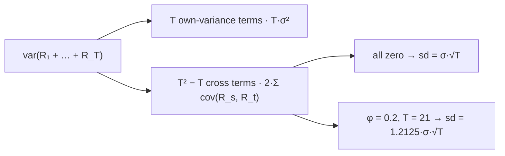

# Variance

A variance is the smallest amount of information that lets you say something true about how far a random variable gets from its mean without knowing anything else about its distribution. That is a stronger claim than "variance measures spread", and the section on Chebyshev's inequality below is what makes it a claim rather than a slogan.

This page covers the second central moment and the existence condition it needs, the computational formula and the reason it is unsafe, affine transformations and standardization, Chebyshev's inequality, the variance of a sum, and what an average squared deviation averages to. It does not cover the third and fourth moments, which are [Higher-Order Moments](03-higher-order-moments.md), and it stops before any limit in $n$: the law of large numbers is Chebyshev plus a limit and nothing else, and the limit belongs to [The Weak Law of Large Numbers](../part-07-asymptotic-theory/01-weak-law-of-large-numbers.md).

Every risk number that scales as $\sigma\sqrt{T}$ is a claim about the variance of a *sum*, and the claim is false by a computable amount whenever the cross terms are not zero. An autocorrelation of $0.2$ at lag one — small enough that three years of data would not reject zero — inflates true monthly volatility by $21\%$, and every position size, drawdown expectation and capital requirement downstream is scaled by the understated figure. [Time Series Analysis](../../part-03-statistics/03-time-series.md) measures the autocorrelation; this page prices it.

## The Second Central Moment

For a random variable $X$ with mean $\mu=\mathbb{E}[X]$,

$$\mathrm{var}(X)=\mathbb{E}\big[(X-\mu)^2\big],\qquad \sigma_X=\sqrt{\mathrm{var}(X)},$$

with the discrete and continuous forms following from the law of the unconscious statistician on [Expected Value](01-expected-value.md):

$$\mathrm{var}(X)=\sum_{x}(x-\mu)^2\,p_X(x),\qquad \mathrm{var}(X)=\int_{-\infty}^{\infty}(x-\mu)^2\,f_X(x)\,dx.$$

The quantity being averaged is a square, so $\mathrm{var}(X)\ge 0$ always, with equality exactly when $X$ is degenerate — equal to $\mu$ with probability one. Squared deviations also make the units awkward: a variance of returns is in units of return *squared*, which is why the standard deviation, back in the original units, is the number anyone quotes.

Existence needs more than page 01 required. The mean needs $\mathbb{E}\lvert X\rvert<\infty$; a variance needs $\mathbb{E}[X^2]<\infty$, which is strictly stronger. There are laws with a perfectly good mean and no variance at all, and [Higher-Order Moments](03-higher-order-moments.md) shows that the one fitted to daily index returns is uncomfortably close to being one of them.

## The Computational Formula

Expanding the square gives an identity that is algebraically exact and numerically treacherous:

$$\mathrm{var}(X)=\mathbb{E}[X^2]-\big(\mathbb{E}[X]\big)^2.$$

??? note "Proof of the computational formula"
    Expand the square inside the expectation and apply linearity from [Expected Value](01-expected-value.md), remembering that $\mu$ is a constant and comes out of an expectation untouched:

    $$\mathbb{E}\big[(X-\mu)^2\big]=\mathbb{E}\big[X^2-2\mu X+\mu^2\big]=\mathbb{E}[X^2]-2\mu\,\mathbb{E}[X]+\mu^2.$$

    Substituting $\mathbb{E}[X]=\mu$ collapses the last two terms to $-2\mu^2+\mu^2=-\mu^2$, giving $\mathbb{E}[X^2]-\mu^2$.

    Linearity is doing all the work, and it is worth noticing that no independence, no symmetry and no distributional assumption entered — the identity holds for every law with a finite second moment.

```python
import numpy as np

rng = np.random.default_rng(20)
z = rng.standard_normal(1_000_000).astype(np.float32)         # unit variance, wherever we put it
for level in (1e0, 1e3, 1e6, 1e8):
    x = z + np.float32(level)                                 # same spread, moved up the axis
    two_pass = ((x - x.mean()) ** 2).mean()                   # subtract first, then square
    shortcut = (x ** 2).mean() - x.mean() ** 2                # square first, then subtract
    print(f"  level {level:8.0e}   two-pass {two_pass:+18.6f}   E[X^2]-E[X]^2 {shortcut:+18.6f}")
# =>   level    1e+00   two-pass          +0.999928   E[X^2]-E[X]^2          +0.999928
#      level    1e+03   two-pass          +0.999928   E[X^2]-E[X]^2          +1.000000
#      level    1e+06   two-pass          +1.003849   E[X^2]-E[X]^2     +196608.000000
#      level    1e+08   two-pass          +0.003840   E[X^2]-E[X]^2 -3221225472.000000
```

Every row describes the same distribution — unit variance, shifted along the axis — and the identity above says both columns must print $1$. At a level of $10^6$ the shortcut returns $196{,}608$. At $10^8$ it returns a **negative number**, from a formula whose left-hand side is an average of squares and provably cannot be negative.

The mechanism is cancellation. At $10^8$ both $\mathbb{E}[X^2]$ and $(\mathbb{E}[X])^2$ are about $10^{16}$, and the difference between them is $1$ — sixteen significant figures apart, where float32 carries about seven. The subtraction discards every digit that mattered and returns rounding noise. The two-pass column fails at that level too, and for a different reason worth separating: float32 spacing near $10^8$ is about $8$, larger than the entire spread being measured, so the shift has already destroyed the data before any variance formula sees it.

!!! warning "The rearrangement that makes a variance cheap to compute is the one that makes it unsafe to compute"
    The shortcut is attractive because it is single-pass and updatable — it needs only running sums of $x$ and $x^2$, which is exactly what a streaming risk system wants. It is also the version that fails first, and it fails silently: nothing raises, and a negative variance propagates into a standard deviation as a NaN several steps downstream from the cause. The practical rules are to compute variances on returns rather than on price levels, where the ratio of spread to level is not tiny; to use a shifted or two-pass form when levels are unavoidable; and to treat a negative output not as a numerical curiosity but as proof that the computation lost its significant digits. [Covariance](04-covariance.md) has the same identity in a worse form, since it subtracts a product of two large means.

## Affine Transformations and Standardization

Variance ignores shifts and squares scalings:

$$\mathrm{var}(aX+b)=a^2\,\mathrm{var}(X),\qquad \sigma_{aX+b}=\lvert a\rvert\,\sigma_X.$$

??? note "Proof that variance ignores shifts and squares scalings, and that standardization always works"
    Let $Y=aX+b$. By linearity $\mathbb{E}[Y]=a\mu+b$, so the deviation is $Y-\mathbb{E}[Y]=a(X-\mu)$ — the $b$ cancels before anything is squared, which is the whole reason shifts do not matter. Then

    $$\mathrm{var}(Y)=\mathbb{E}\big[a^2(X-\mu)^2\big]=a^2\,\mathbb{E}\big[(X-\mu)^2\big]=a^2\,\mathrm{var}(X),$$

    pulling the constant $a^2$ out by linearity. Taking square roots gives $\lvert a\rvert\sigma_X$, the absolute value because a standard deviation is non-negative while $a$ need not be.

    For standardization, set $Z=(X-\mu)/\sigma$, which is the case $a=1/\sigma$, $b=-\mu/\sigma$. Then $\mathbb{E}[Z]=(\mu-\mu)/\sigma=0$ and $\mathrm{var}(Z)=\sigma^{-2}\mathrm{var}(X)=1$. The only requirement is $0<\sigma<\infty$.

!!! note "Standardizing changes the scale of a random variable and nothing else about it"
    A standardized variable has mean zero and variance one, and that exhausts what standardizing accomplishes. It does not make a distribution normal, symmetric or thin-tailed: a standardized $t(2.65)$ is still a $t(2.65)$, with the same shape and the same tail index, and a Cauchy cannot be standardized at all because neither of the two required numbers exists. The familiar statement that $Z\sim\mathcal{N}(0,1)$ holds only when $X$ was already normal, and it is a fact about [The Gaussian Distribution](../part-05-common-distributions/11-gaussian-distribution.md) rather than about standardization.

## Chebyshev's Inequality

[Expected Value](01-expected-value.md) showed that a mean bounds a tail through Markov's inequality. A variance sharpens it dramatically, and the derivation is two lines. The variable $(X-\mu)^2$ is non-negative, so Markov applies to it at threshold $c^2$:

$$\mathbf{P}\big(\lvert X-\mu\rvert\ge c\big)=\mathbf{P}\big((X-\mu)^2\ge c^2\big)\ \le\ \frac{\mathbb{E}\big[(X-\mu)^2\big]}{c^2}=\frac{\sigma^2}{c^2}.$$

Writing $c=k\sigma$ puts it in the form usually quoted: the probability of landing $k$ or more standard deviations from the mean is at most $1/k^2$, for **every** law with a finite variance. The price of that generality is looseness, and the comparison worth having is with a bound that assumes a family and gets a great deal more: under normality the sampling distribution of $s^2$ is known exactly, and [Chi-Square Distribution](../part-05-common-distributions/15-chi-square-distribution.md) turns it into an interval on $\sigma$ rather than a bound on a tail.

```python
import numpy as np
from scipy.stats import norm, t as tdist

print("     k   Chebyshev      Gaussian    std t(5)   the law that attains it")
for k in (2, 3, 4, 5, 10):
    # two-point law: mass 1/(2k^2) at each of +-k, the rest at 0. Variance is exactly 1.
    p_tail = 2 * (1 / (2 * k ** 2))
    var = 2 * (k ** 2) * (1 / (2 * k ** 2))
    print(f"  {k:4d}   {1 / k ** 2:.6f}   {2 * norm.sf(k):.9f}   {2 * tdist.sf(k * np.sqrt(5/3), 5):.6f}"
          f"   {p_tail:.6f}  (var {var:.1f})")
print(f"  at k=4 the bound is {(1/16) / (2 * norm.sf(4)):.0f}x too wide for a Gaussian"
      f" and exact for the two-point law")
# =>      k   Chebyshev      Gaussian    std t(5)   the law that attains it
#         2   0.250000   0.045500264   0.049313   0.250000  (var 1.0)
#         3   0.111111   0.002699796   0.011725   0.111111  (var 1.0)
#         4   0.062500   0.000063342   0.003573   0.062500  (var 1.0)
#         5   0.040000   0.000000573   0.001328   0.040000  (var 1.0)
#        10   0.010000   0.000000000   0.000050   0.010000  (var 1.0)
#      at k=4 the bound is 987x too wide for a Gaussian and exact for the two-point law
```

!!! note "Chebyshev is loose for every distribution you have named and exact for the one you have not"
    Against a Gaussian at four standard deviations the bound is nine hundred and eighty-seven times too wide, which invites dismissing it as useless. The last column is why that reading is wrong. The two-point law — mass $1/(2k^2)$ at each of $\pm k$ and everything else at zero — has variance exactly one and puts exactly $1/k^2$ beyond $k$, hitting the bound at every row. So Chebyshev is not a weak bound; it is the *best* statement true of all laws simultaneously, and the gap to the Gaussian column measures how much the Gaussian assumption is buying rather than how much the inequality is wasting. A fat-tailed return series sits between the two columns and, as the $t(5)$ column shows, closer to the bound than the Gaussian is.

The law of large numbers is this inequality applied to an average, whose variance the next section computes. That is the whole proof, and the limit it takes is [The Weak Law of Large Numbers](../part-07-asymptotic-theory/01-weak-law-of-large-numbers.md).

## The Variance of a Sum

Variances do not add in general. Expanding a sum of $T$ terms produces the own-variance terms and a second group that is usually ignored:

$$\mathrm{var}\Big(\sum_{t=1}^{T}R_t\Big)=\sum_{t=1}^{T}\mathrm{var}(R_t)\ +\ 2\sum_{s<t}\mathrm{cov}(R_s,R_t).$$

??? note "Proof of the variance of a sum"
    Write $S=\sum_t R_t$ and $\mathbb{E}[S]=\sum_t\mu_t$ by linearity, so $S-\mathbb{E}[S]=\sum_t(R_t-\mu_t)$. Squaring a sum gives every ordered pair of terms:

    $$\Big(\sum_{t}(R_t-\mu_t)\Big)^{\!2}=\sum_{s}\sum_{t}(R_s-\mu_s)(R_t-\mu_t).$$

    Taking expectations term by term — legitimate by linearity — turns each summand into $\mathrm{cov}(R_s,R_t)$, which is $\mathrm{var}(R_t)$ when $s=t$. The double sum has $T$ diagonal entries and $T^2-T$ off-diagonal ones; since $\mathrm{cov}(R_s,R_t)=\mathrm{cov}(R_t,R_s)$, the off-diagonal entries pair up, which is where the factor of $2$ and the restriction $s<t$ come from. The definition and properties of the covariance itself are [Covariance](04-covariance.md).

Two special cases carry most of the usage. If the terms are uncorrelated the second sum vanishes and variances add, so a $T$-period sum of identically distributed returns has standard deviation $\sigma\sqrt{T}$ — the $\sqrt{T}$ rule, which is not an approximation but an exact statement conditional on an empty second sum. And with weights $1/n$ the same identity gives $\mathrm{var}(\bar X_n)=\sigma^2/n$ for uncorrelated terms, which is the fact [Expected Value](01-expected-value.md) borrowed to argue about how hard a mean is to pin down.



Both boxes feed the total, and the $\sqrt{T}$ rule is the claim that the right-hand one is empty. Note the counts: at $T=21$ there are $21$ own-variance terms and $420$ cross terms, so the second box does not need large individual covariances to matter — it needs only that they fail to cancel. The two leaves are the same identity evaluated under two hypotheses about the same market.

```python
import numpy as np

def inflation(T, phi):                                        # exact finite-T variance factor
    return 1 + 2 * sum((1 - k / T) * phi ** k for k in range(1, T))

print("      T     phi=+0.2            phi=+0.3            phi=-0.2")
for T in (5, 21, 252, 10_000):
    row = [np.sqrt(inflation(T, p)) for p in (0.2, 0.3, -0.2)]
    print(f"  {T:5d}   vol x {row[0]:.4f}        vol x {row[1]:.4f}        vol x {row[2]:.4f}")
for p in (0.2, 0.3, -0.2):
    print(f"  phi {p:+.1f}: the T -> inf corner is sqrt((1+phi)/(1-phi)) = {np.sqrt((1+p)/(1-p)):.4f}")
# =>       T     phi=+0.2            phi=+0.3            phi=-0.2
#          5   vol x 1.1726        vol x 1.2700        vol x 0.8498
#         21   vol x 1.2125        vol x 1.3412        vol x 0.8246
#        252   vol x 1.2237        vol x 1.3610        vol x 0.8172
#      10000   vol x 1.2247        vol x 1.3627        vol x 0.8165
#      phi +0.2: the T -> inf corner is sqrt((1+phi)/(1-phi)) = 1.2247
#      phi +0.3: the T -> inf corner is sqrt((1+phi)/(1-phi)) = 1.3628
#      phi -0.2: the T -> inf corner is sqrt((1+phi)/(1-phi)) = 0.8165
```

For an AR(1) sequence the covariance at lag $k$ is $\phi^k$ times the variance, and the double sum collapses to the exact factor $1+2\sum_{k=1}^{T-1}(1-k/T)\phi^k$ printed above. That single expression reconciles two figures the book quotes in different places. At a monthly horizon, $T=21$, an autocorrelation of $0.2$ inflates volatility by a factor of $1.2125$ — the $21\%$ that [Independence](../part-02-probability-foundations/05-independence.md) reports; an autocorrelation of $0.3$ gives $1.3412$, and the $\sqrt{(1+\phi)/(1-\phi)}=1.3628$ corner is the $33\%$ that [Exponentials, Logarithms, and Growth](../part-01-mathematical-foundations/07-exponentials-logarithms-growth.md) quotes. They are the same formula read at a finite horizon and in the limit, and the finite-horizon answer is the one a monthly risk number needs.

The last column is the reminder that the correction is not always in the flattering direction. Negative autocorrelation — mean reversion — makes a sum *less* volatile than $\sqrt{T}$ implies, so the same rule that understates risk for a trending series overstates it for a reverting one.

## What a Sample Variance Averages

Squared deviations taken around the sample's own average come out systematically small, and the shortfall is exactly computable.

??? note "Proof that the average squared deviation from the sample average falls short by a factor (n−1)/n"
    Let $X_1,\dots,X_n$ be uncorrelated with common mean $\mu$ and variance $\sigma^2$, and write $\bar X$ for their average. Expand around the true mean:

    $$\frac1n\sum_i(X_i-\bar X)^2=\frac1n\sum_i(X_i-\mu)^2-(\bar X-\mu)^2,$$

    which follows by writing $X_i-\bar X=(X_i-\mu)-(\bar X-\mu)$, squaring, and noting the cross term sums to $-2(\bar X-\mu)^2$. Now take expectations. The first term averages to $\sigma^2$; the second is $\mathrm{var}(\bar X)=\sigma^2/n$ by the previous section. So

    $$\mathbb{E}\Big[\frac1n\sum_i(X_i-\bar X)^2\Big]=\sigma^2-\frac{\sigma^2}{n}=\frac{n-1}{n}\,\sigma^2.$$

    The mechanism is that $\bar X$ is pulled toward the sample, so deviations measured from it are smaller than deviations measured from $\mu$ — by exactly the amount the average itself moves.

Simulating four sample sizes with four hundred thousand replications each gives $0.50052$, $0.79953$, $0.96677$ and $0.99614$ at $n=2,5,30,252$, against the predicted $0.50000$, $0.80000$, $0.96667$ and $0.99603$. The gap is large at small $n$ and negligible by a trading year.

That is as far as this page goes. What to *do* about the factor, and the vocabulary for describing what it is, belong to [Point Estimation](../part-11-parameter-estimation/01-point-estimation.md) and [Properties of Estimators](../part-11-parameter-estimation/02-properties-of-estimators.md).

## Why the Second Moment Is the One You Get

On the same twenty-five years of index data, the volatility is pinned to $0.9\%$ of itself and the mean to $52\%$. [Expected Value](01-expected-value.md) gave the arithmetic; the reason is visible in the definitions on this page. A variance is estimating its own scale — the quantity being averaged, $(X-\mu)^2$, has a typical size of exactly $\sigma^2$ — so the relative precision depends on the sample size alone. A mean is estimating a quantity roughly forty times smaller than the scale of the thing being averaged, and pays a factor of $\sigma/\mu$ for the privilege.

That single ratio explains why risk models work while return models disappoint, and it also explains what is most expensive on this page. The cross terms in the variance of a sum are a correction nobody can see in three years of data — an autocorrelation of $0.2$ is not distinguishable from zero at that length — and every position size in a book depends on them. A quantity too small to detect and too large to ignore is the worst possible combination, and it is the normal case.
