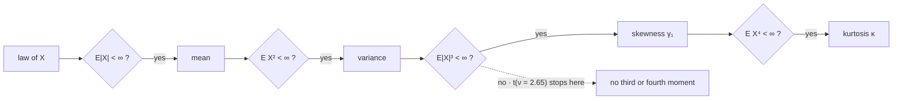

# Higher-Order Moments

The third and fourth moments are the two numbers most often quoted about a return distribution and the two least likely to exist. Both facts matter, and the second one is usually left out of the sentence that quotes them.

This page covers raw, central and standardized moments, skewness and kurtosis with the $-3$ derived rather than asserted, the moments a two-regime mixture actually produces, the order up to which a heavy-tailed law has any moments at all, and what a sample kurtosis is measuring when the population one is infinite. It does not fit tails — that is [Extreme Value Theory](../part-18-quant-finance-applications/14-extreme-value-theory.md) — and it does not catalogue any family's moments, which is [Part V](../part-05-common-distributions/index.md).

Every fat-tail correction sold to a risk desk consumes a fourth moment, and the distribution it is applied to does not have one. That is the trading stake, and it is not a technicality about pathological examples: it follows from the tail index [Returns and Their Distributions](../../part-03-statistics/02-returns-and-distributions.md) fits to real index returns.

## Raw, Central, and Standardized Moments

Three families of moment, each obtained from the last by removing a nuisance:

$$\mu_k'=\mathbb{E}[X^k],\qquad \mu_k=\mathbb{E}\big[(X-\mu)^k\big],\qquad \tilde\mu_k=\frac{\mu_k}{\sigma^k}.$$

The raw moments depend on where the distribution sits; the central ones subtract that out; the standardized ones divide the scale out as well. Only the third family is comparable across assets, which is why skewness and kurtosis are defined as standardized quantities rather than as central ones.

| Order $k$ | Standardized moment | What it locates | Free of location? | Free of scale? | Exists when |
|---|---|---|---|---|---|
| $1$ | — | the centre | no | no | $\mathbb{E}\lvert X\rvert<\infty$ |
| $2$ | — | the spread | yes | no | $\mathbb{E}[X^2]<\infty$ |
| $3$ | $\gamma_1$, skewness | the asymmetry | yes | yes | $\mathbb{E}\lvert X\rvert^3<\infty$ |
| $4$ | $\kappa$, kurtosis | the tail weight | yes | yes | $\mathbb{E}[X^4]<\infty$ |

??? note "Proof that the standardized moments are free of both location and scale"
    Let $Y=aX+b$ with $a>0$. By linearity on [Expected Value](01-expected-value.md), $\mathbb{E}[Y]=a\mu+b$, so the deviation is $Y-\mathbb{E}[Y]=a(X-\mu)$ and the $b$ has vanished before any power is taken. Raising to the $k$th and taking expectations,

    $$\mu_k(Y)=\mathbb{E}\big[a^k(X-\mu)^k\big]=a^k\,\mu_k(X).$$

    Meanwhile $\sigma_Y=a\,\sigma_X$ from [Variance](02-variance.md), so $\sigma_Y^k=a^k\sigma_X^k$ and the two factors of $a^k$ cancel in the ratio:

    $$\tilde\mu_k(Y)=\frac{a^k\mu_k(X)}{a^k\sigma_X^k}=\tilde\mu_k(X).$$

    For $a<0$ the same computation gives a factor $(-1)^k$, so the even standardized moments are unchanged and the odd ones flip sign — which is exactly right, since reflecting a distribution should reverse its asymmetry and leave its tail weight alone.

    This is why a skewness is comparable across assets and a third central moment is not: the latter is in units of return cubed and would rank a volatile asset as more skewed purely for being volatile.



The gates are not decoration. Each one can fail, and failing at gate $k$ means every higher moment fails too, since a finite $\mathbb{E}\lvert X\rvert^{k+1}$ would force a finite $\mathbb{E}\lvert X\rvert^{k}$. The dashed branch is where daily index returns actually land: past the variance, short of the skewness. Everything from the fifth section onward is about that branch.

## Skewness

The third standardized moment measures asymmetry:

$$\gamma_1=\frac{\mathbb{E}\big[(X-\mu)^3\big]}{\sigma^3}.$$

Cubing preserves sign, so deviations to the right contribute positively and those to the left negatively, and the cube weights large deviations far more than small ones. Negative skew therefore means the *large* moves lean left, whatever the bulk of the distribution is doing — a distribution can have negative skew and still rise more days than it falls, which is the usual shape for an equity index and the exact shape of a short-volatility strategy.

??? note "Proof that a symmetric law has zero odd central moments"
    Suppose the density satisfies $f(\mu+u)=f(\mu-u)$ for every $u$. Substituting $u=x-\mu$ in the defining integral,

    $$\mu_k=\int_{-\infty}^{\infty}(x-\mu)^k f(x)\,dx=\int_{-\infty}^{\infty}u^k f(\mu+u)\,du.$$

    Split at zero and substitute $u\mapsto-u$ in the negative half. Symmetry makes the two densities agree, while $u^k$ picks up $(-1)^k$. For odd $k$ the halves cancel exactly, so $\mu_k=0$, provided $\mathbb{E}\lvert X\rvert^k<\infty$ so the two halves are separately finite rather than $\infty-\infty$.

    The converse is false and the failure is common: zero skewness does not imply symmetry, because a long thin right tail can offset a fat short left one in the third moment while the two sides look nothing alike. Skewness is one number, and one number cannot certify a shape.

The book's measured values span three orders of magnitude, which is itself the point. Daily SPY returns come in at $-0.20$ and monthly at $-0.63$; the `shortvol` sleeve reaches $-7.6$ monthly and $-5.65$ daily; and the `pairs` sleeve prints $+38.77$, which [Risk Measurement](../../part-08-portfolio-management/01-risk-measurement.md) flags as a data artifact from a single 2008 divergence rather than a property of the strategy. A statistic that a single observation can move by that much is telling you about the observation.

## Kurtosis and the Minus Three

The fourth standardized moment measures tail weight, and it is conventionally reported after subtracting three:

$$\kappa=\frac{\mathbb{E}\big[(X-\mu)^4\big]}{\sigma^4}-3.$$

The $-3$ is not arbitrary. For a standard normal $Z$, integration by parts on the Gaussian density gives the recursion $\mathbb{E}[Z^{k}]=(k-1)\,\mathbb{E}[Z^{k-2}]$ for even $k$, so from $\mathbb{E}[Z^0]=1$ and $\mathbb{E}[Z^2]=1$ we get $\mathbb{E}[Z^4]=3\cdot 1=3$. Subtracting three therefore places the Gaussian at exactly zero and makes the sign of $\kappa$ read as *heavier-tailed than normal* or *lighter*. The quantity before subtraction is sometimes called raw kurtosis; the quantity after it, excess kurtosis, is what every number quoted in this book means.

Two cautions. Kurtosis is driven by the fourth power, so it is dominated by the few largest deviations in any sample — it is a statement about the extremes and only incidentally about the shape near the middle. And it cannot distinguish a fat tail from a peaked centre, since both raise the same integral.

## Two Regimes Manufacture a Skew and Half a Kurtosis

[Law of Total Probability](../part-02-probability-foundations/06-law-of-total-probability.md) builds a mixture of two Gaussian regimes and shows it producing tails sixteen times heavier than a variance-matched single Gaussian at a four-percent threshold. Its moments are worth computing exactly, because they say which of the measured facts about returns a two-regime story can and cannot account for.

```python
import numpy as np

w, m1, s1, m2, s2 = 0.15, 0.0006, 0.008, -0.0015, 0.025       # Part II's published regimes
mu = (1 - w) * m1 + w * m2
comps = ((1 - w, m1 - mu, s1), (w, m2 - mu, s2))              # weight, mean gap, own sd

v  = sum(p * (d ** 2 + s ** 2) for p, d, s in comps)
c3 = sum(p * (d ** 3 + 3 * d * s ** 2) for p, d, s in comps)
c4 = sum(p * (d ** 4 + 6 * d ** 2 * s ** 2 + 3 * s ** 4) for p, d, s in comps)
print(f"  mean {mu:.6f}   sd {np.sqrt(v):.6f}"
      f"   skew {c3 / v ** 1.5:+.3f}   excess kurtosis {c4 / v ** 2 - 3:.3f}")

v0 = (1 - w) * s1 ** 2 + w * s2 ** 2                          # same regimes, means set equal
k0 = ((1 - w) * 3 * s1 ** 4 + w * 3 * s2 ** 4) / v0 ** 2 - 3
print(f"  means set equal:  sd {np.sqrt(v0):.6f}   skew {0.0:+.3f}   excess kurtosis {k0:.3f}")

lo, hi = 0.02, 0.20                                           # what turbulent sd reaches 11.41?
for _ in range(60):
    mid = (lo + hi) / 2
    vm = (1 - w) * s1 ** 2 + w * mid ** 2
    km = ((1 - w) * 3 * s1 ** 4 + w * 3 * mid ** 4) / vm ** 2 - 3
    lo, hi = (mid, hi) if km < 11.41 else (lo, mid)
print(f"  turbulent sd needed to reach 11.41: {mid:.4f} daily"
      f" ({np.sqrt(252) * mid:.0%} annualized, 15% of the time)")
# =>   mean 0.000285   sd 0.012195   skew -0.249   excess kurtosis 5.503
#      means set equal:  sd 0.012172   skew +0.000   excess kurtosis 5.485
#      turbulent sd needed to reach 11.41: 0.0447 daily (71% annualized, 15% of the time)
```

??? note "Proof of the mixture's central moments"
    Let $X$ come from component $i$ with probability $w_i$, where component $i$ is normal with mean $m_i$ and standard deviation $s_i$. Write $\mu=\sum_i w_i m_i$ for the overall mean and $d_i=m_i-\mu$ for each component's gap from it.

    Conditioning on the component and expanding $(X-\mu)^k=\big((X-m_i)+d_i\big)^k$ by the binomial theorem,

    $$\mu_k=\sum_i w_i\sum_{j=0}^{k}\binom{k}{j}d_i^{\,k-j}\,\mathbb{E}\big[(X-m_i)^j\big],$$

    where the inner expectation is a central moment of a normal: zero for odd $j$, and $1,\;s_i^2,\;3s_i^4$ for $j=0,2,4$. Keeping only the surviving terms gives the three lines the code computes:

    $$\mu_2=\sum_i w_i\big(d_i^2+s_i^2\big),\quad \mu_3=\sum_i w_i\big(d_i^3+3d_is_i^2\big),\quad \mu_4=\sum_i w_i\big(d_i^4+6d_i^2s_i^2+3s_i^4\big).$$

    Note where each contribution comes from. The skewness has no term free of $d_i$, so it is produced entirely by the *mean* gap between regimes. The kurtosis has the term $3s_i^4$, which survives even when all the means agree, so it is produced by the *variance* gap.

!!! note "The skew of index returns is a mean-gap effect and the kurtosis is a variance-gap effect"
    The mixture reproduces the measured daily skew almost exactly — $-0.249$ against the published $-0.20$ — because skew comes from the regimes having different means, and a $0.06\%$-versus-$-0.15\%$ split is enough. It delivers less than half the measured kurtosis, $5.50$ against $11.41$, because kurtosis comes from the regimes having different variances and two of them is not enough heterogeneity. Forcing a two-regime story to reach $11.41$ requires the turbulent state at $4.47\%$ daily — $71\%$ annualized, fifteen percent of the time — which is not what the data shows. The repair is not a wilder second regime but a *continuum* of them, and a continuous scale mixture of normals is [Student's t Distribution](../part-05-common-distributions/16-students-t-distribution.md).

The second line reconciles this page with Part II: setting the means equal gives a standard deviation of $0.012172$, exactly the variance-matched $\sigma$ that page prints, because it matched on the within-regime piece. Restoring the mean gap moves it to $0.012195$, a change of $0.2\%$, so that page's sixteen-fold tail comparison stands unaffected.

## Moments That Do Not Exist

A distribution's moments exist only up to the order its tail permits, and the cutoff is sharp.

??? note "Proof that E|X|^k is finite exactly when k is below the tail index"
    Suppose the density decays as a power law, $f(x)\sim c\,x^{-\nu-1}$ as $x\to\infty$, which is the behaviour of a Student-$t$ with $\nu$ degrees of freedom. Then for large $M$,

    $$\mathbb{E}\lvert X\rvert^k\ \approx\ \text{finite part}\ +\ 2c\int_{M}^{\infty}x^{k}\,x^{-\nu-1}\,dx=2c\int_{M}^{\infty}x^{k-\nu-1}\,dx.$$

    The integral $\int^\infty x^{p}\,dx$ converges exactly when $p<-1$, so here it converges exactly when $k-\nu-1<-1$, that is when $k<\nu$. Every contribution from the bounded region is finite, so the tail alone decides.

    The cutoff is therefore the tail index itself, and it is not a smooth degradation: at $k$ just below $\nu$ the moment is finite, and at $k$ just above it is infinite, with nothing in between. Which side of $k=1$ and $k=2$ a law falls on decides which limit theorems apply to it at all — the first is the only hypothesis [The Weak Law of Large Numbers](../part-07-asymptotic-theory/01-weak-law-of-large-numbers.md) needs and the second is the entry fee for [The Central Limit Theorem](../part-07-asymptotic-theory/03-central-limit-theorem.md), so a tail index is not merely a description of shape but a statement about which asymptotics are available.

```python
import numpy as np

nu = 2.65                                                     # the book's fitted tail index
rng = np.random.default_rng(33)
x = np.abs(rng.standard_t(nu, 4_000_000))
print(f"  Student-t with nu = {nu}: E|X|^k is finite only for k < {nu}")
print("      k     n=10^4      n=10^5      n=10^6    n=4x10^6")
for k in (1, 2, 3, 4):
    p = x ** k
    print(f"    {k:3d}  " + "  ".join(f"{p[:n].mean():10.2f}"
                                      for n in (10_000, 100_000, 1_000_000, 4_000_000)))
print("  highest finite moment order:  gaussian inf   t(8) 8.00"
      f"   t(2.65) {nu}   EVT tail xi=0.327 -> {1/0.327:.2f}")
# =>   Student-t with nu = 2.65: E|X|^k is finite only for k < 2.65
#          k     n=10^4      n=10^5      n=10^6    n=4x10^6
#          1        1.14        1.16        1.16        1.17
#          2        3.48        4.20        3.96        3.99
#          3       36.18      120.59       93.79      108.61
#          4      999.14    13954.04    13501.13    23644.45
#      highest finite moment order:  gaussian inf   t(8) 8.00   t(2.65) 2.65   EVT tail xi=0.327 -> 3.06
```

Read the four rows as a ladder being climbed until it ends. The first row settles at $1.17$ and stays there. The second wobbles around $4$ and is genuinely converging — the true value is $\nu/(\nu-2)=4.08$, finite because $2<2.65$. The third and fourth rows do not converge to anything; they jump by factors of three and twenty as the sample grows, which is what an infinite expectation looks like when you try to average toward it. The ladder stops *between* the second and third rungs, which is precisely where the mermaid above put the dashed branch.

The last line gives the same cutoff for the other laws in play. The generalized Pareto shape $\xi=0.327$ that [Drawdowns, Tail Risk, and Stress Testing](../../part-08-portfolio-management/05-drawdowns-tail-risk-stress-testing.md) fits to the book's own returns implies moments only up to order $1/\xi=3.06$ — the "3.1" that lesson reports, arrived at independently.

!!! warning "Every method that consumes a fourth moment is undefined on the distribution it is usually applied to"
    Cornish–Fisher expansions, which adjust a Gaussian [Value at Risk](../part-18-quant-finance-applications/11-value-at-risk.md) using sample skewness and kurtosis, are sold precisely as fat-tail corrections and require both to exist. Moment-matched simulation, which calibrates a synthetic return series to four sample moments, requires the same. So does any strategy screen with a kurtosis threshold. On a law with $\nu=2.65$ none of the three is computing an approximation to anything — the quantity being matched is infinite, and what the code returns is a function of the sample size. The methods that survive parameterize the tail directly rather than through moments: [Extreme Value Theory](../part-18-quant-finance-applications/14-extreme-value-theory.md) and [Heavy-Tailed Returns](../part-18-quant-finance-applications/13-heavy-tailed-returns.md), and for a coherent tail number, [Expected Shortfall](../part-18-quant-finance-applications/12-expected-shortfall.md).

## A Sample Kurtosis Is Not an Estimate

The previous section says the population quantity does not exist. It is worth seeing what the computation does anyway, because it always returns a number and the number looks respectable.

```python
import numpy as np
from scipy.stats import kurtosis

for nu_, truth in ((8.0, "population excess kurtosis 1.50"),
                   (2.65, "population excess kurtosis does not exist")):
    print(f"  t({nu_})  {truth}")
    rng = np.random.default_rng(34)
    for n in (250, 1000, 6410, 100_000):
        reps = max(400, 4_000_000 // n)
        k = kurtosis(rng.standard_t(nu_, (reps, n)), axis=1)
        print(f"     n={n:7d}  median {np.median(k):8.2f}   95th pct {np.quantile(k, 0.95):9.2f}")
# =>   t(8.0)  population excess kurtosis 1.50
#         n=    250  median     0.90   95th pct      3.45
#         n=   1000  median     1.19   95th pct      2.95
#         n=   6410  median     1.37   95th pct      2.25
#         n= 100000  median     1.47   95th pct      1.72
#      t(2.65)  population excess kurtosis does not exist
#         n=    250  median     8.84   95th pct     72.56
#         n=   1000  median    18.97   95th pct    192.59
#         n=   6410  median    48.03   95th pct    438.52
#         n= 100000  median   202.62   95th pct   2574.96
```

The two blocks are the same computation on two laws and they behave in categorically different ways. In the top block the median climbs $0.90 \to 1.19 \to 1.37 \to 1.47$ toward the true $1.50$ while the $95$th percentile tightens $3.45 \to 2.95 \to 2.25 \to 1.72$ around it: the spread is shrinking and the centre is converging, which is what measuring something looks like. In the bottom block the median goes $8.84 \to 18.97 \to 48.03 \to 202.62$ and the $95$th percentile goes $72 \to 193 \to 439 \to 2575$. Nothing is converging. More data produces a larger answer, reliably, because the fourth moment is infinite and a larger sample simply reaches further into the tail that supplies it.

!!! note "A number that grows with the sample is not a statistic of the population"
    The row at $n=6410$ is SPY's actual sample size, and its median of $48$ brackets the published $11.41$ comfortably within the sampling distribution — the measured value is a draw from that distribution, not a measurement of a population quantity, because there is no population quantity. This is the same conclusion [Drawdowns, Tail Risk, and Stress Testing](../../part-08-portfolio-management/05-drawdowns-tail-risk-stress-testing.md) reaches about its own sample kurtosis of $29.2$; what this page adds is the mechanism and the demonstration that the divergence is a property of the law rather than a defect in the arithmetic. The honest reading of "SPY has excess kurtosis $11.41$" is that the returns are heavy-tailed enough that the fourth moment does not exist — which is a real and important fact, and a different one from the number suggests. The general form of the diagnostic on display here — recompute the statistic on nested subsamples and watch whether it settles or drifts — is the one [Continuous Mapping Theorem](../part-07-asymptotic-theory/06-continuous-mapping-theorem.md) recommends for every plug-in, and this is the drifting case.

## What Four Numbers Cannot Say

There is a structural rhyme with the previous part worth stating explicitly. [Marginal Distributions](../part-03-random-variables/06-marginal-distributions.md) showed that projecting a joint law onto its margins discards exactly one thing, a copula, and named it. Projecting a law onto its first four moments discards more and names less: infinitely many distributions share all four, and the ones that share them differ precisely in the region the fourth moment was consulted about.

So moments are the wrong coordinates for a tail. They are a global summary computed by integrating against the whole distribution, and a tail is a local question about one end of it; the fourth moment answers the tail question only indirectly, and only when it exists. A tail index answers it directly and exists whenever the tail is a power law, which is the case that matters.

The practical rule that follows is narrow and worth stating flatly: summarize a distribution by moments only up to the order it has them. For daily index returns that order is two. Reporting a skewness alongside a mean and a volatility is already a stretch, and reporting a kurtosis is reporting the sample size.
