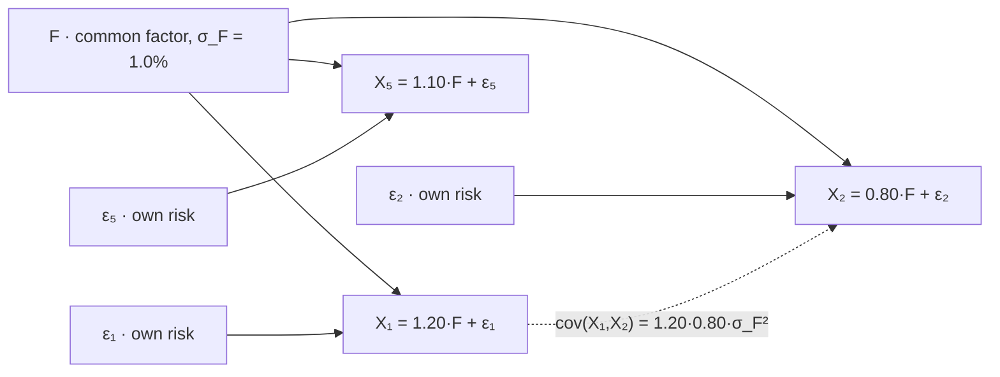

# Covariance

Covariance is the only moment that answers whether adding a position helps, and it answers with a sign. Everything else in this part describes one variable at a time; this is the first quantity that describes a relationship, and it is the term that turns a collection of positions into a portfolio rather than a list.

This page covers the definition and its shortcut, bilinearity, the variance of a weighted sum, the exact sense in which independence forces a zero covariance and the exact sense in which nothing comes back, and positive semi-definiteness stated once. It stops at two indexed scalars per term: matrices, eigenvalues and the apparatus of a covariance matrix are [Covariance Matrices](../part-06-multivariate-probability/02-covariance-matrices.md), and the scale-free version of everything here is [Correlation](05-correlation.md).

In an $n$-position book there are $n$ variances and $n^2-n$ covariances, and the risk report has rows for the first kind. That ratio is the trading stake, and the first code block below makes it concrete: in a five-sleeve book with ordinary loadings, the terms nobody has a row for carry $62.6\%$ of the total variance.

## The Definition and the Shortcut

For two random variables on the same sample space, with means $\mu_X$ and $\mu_Y$,

$$\mathrm{cov}(X,Y)=\mathbb{E}\big[(X-\mu_X)(Y-\mu_Y)\big].$$

The product of two deviations is positive when both fall on the same side of their means and negative when they fall on opposite sides, so the average measures the tendency to move together, weighted by how far each moves. Setting $Y=X$ recovers the second central moment: $\mathrm{cov}(X,X)=\mathrm{var}(X)$, so a variance is the special case of a covariance with itself, and every property below specializes to something already on [Variance](02-variance.md).

Expanding the product gives the same kind of shortcut, and the same kind of trouble:

$$\mathrm{cov}(X,Y)=\mathbb{E}[XY]-\mathbb{E}[X]\,\mathbb{E}[Y].$$

??? note "Proof of the shortcut, and why it inherits the numerical problem from Variance"
    Multiply out and apply linearity from [Expected Value](01-expected-value.md), remembering that $\mu_X$ and $\mu_Y$ are constants:

    $$\mathbb{E}\big[(X-\mu_X)(Y-\mu_Y)\big]=\mathbb{E}[XY]-\mu_Y\,\mathbb{E}[X]-\mu_X\,\mathbb{E}[Y]+\mu_X\mu_Y.$$

    Substituting $\mathbb{E}[X]=\mu_X$ and $\mathbb{E}[Y]=\mu_Y$ collapses the last three terms to $-\mu_X\mu_Y-\mu_X\mu_Y+\mu_X\mu_Y=-\mu_X\mu_Y$, giving the result.

    The numerical warning on [Variance](02-variance.md) applies here in a worse form. That page showed the analogous rearrangement returning a *negative* variance in float32 once the data sat at a level of $10^8$, because two nearly equal large numbers were being subtracted. Here the subtracted quantity is a product of two large means rather than the square of one, so the cancellation is at least as severe and the result is not even sign-constrained — there is no non-negativity to violate, so nothing announces the failure. Compute covariances on returns, not on price levels.

!!! note "A covariance has units, so its magnitude means nothing on its own"
    A covariance between two return series is in units of return squared; between a return and a dollar P&L it is return-dollars; between two prices quoted in different currencies it is whatever those two currencies multiply to. So a covariance of $0.0001$ is not small and one of $50$ is not large — the numbers are not on a scale that admits those words, and comparing covariances across pairs measured in different units is meaningless. Only the *sign* is directly readable, which is why the opening sentence of this page claims a sign and nothing more. Dividing out both scales gives a dimensionless number that can be compared and bounded, and that is the entire job of [Correlation](05-correlation.md).

## Bilinearity

Covariance is linear in each argument separately. For constants $a,b,c,d$,

$$\mathrm{cov}(aX+b,\ cY+d)=ac\,\mathrm{cov}(X,Y),$$

and more generally, for any weights and any collection of variables,

$$\mathrm{cov}\Big(\sum_i a_iX_i,\ \sum_j b_jY_j\Big)=\sum_i\sum_j a_ib_j\,\mathrm{cov}(X_i,Y_j).$$

??? note "Proof of bilinearity"
    Take the two-variable case first. By linearity, $\mathbb{E}[aX+b]=a\mu_X+b$, so the deviation is $(aX+b)-(a\mu_X+b)=a(X-\mu_X)$ — the additive constants cancel before any product is formed, which is why $b$ and $d$ do not appear in the answer. Then

    $$\mathrm{cov}(aX+b,\,cY+d)=\mathbb{E}\big[a(X-\mu_X)\cdot c(Y-\mu_Y)\big]=ac\,\mathbb{E}\big[(X-\mu_X)(Y-\mu_Y)\big].$$

    For the general form, write each deviation as a sum of deviations, expand the product into a double sum of pairwise products, and take expectations term by term. Linearity licenses the interchange, and each surviving term is $a_ib_j\,\mathrm{cov}(X_i,Y_j)$.

    Nothing in either argument used independence, a distributional assumption, or anything beyond linearity of expectation. That is worth flagging because the *next* section's result does depend on independence, and the two are easy to conflate.



Every off-diagonal covariance in this model travels through the single node $F$ and none of it through the $\varepsilon$ leaves, because the idiosyncratic terms are independent of the factor and of each other. So a covariance is not really a property of a pair — it is a statement about what the pair *shares*, and a factor model is the hypothesis that there are only a few things to share. The dashed edge is not a separate mechanism; it is the composition of the two solid paths above it.

## The Variance of a Portfolio

[Variance](02-variance.md) computed the variance of a sum of $T$ returns over time. The same identity with weights gives the variance of a book across positions:

$$\mathrm{var}\Big(\sum_i w_iX_i\Big)=\sum_i\sum_j w_iw_j\,\mathrm{cov}(X_i,X_j)=\sum_i w_i^2\,\mathrm{var}(X_i)+\sum_{i\neq j}w_iw_j\,\mathrm{cov}(X_i,X_j).$$

??? note "Proof of the portfolio variance identity"
    Apply bilinearity with both arguments equal to the same weighted sum:

    $$\mathrm{var}\Big(\sum_i w_iX_i\Big)=\mathrm{cov}\Big(\sum_i w_iX_i,\ \sum_j w_jX_j\Big)=\sum_i\sum_j w_iw_j\,\mathrm{cov}(X_i,X_j),$$

    using $\mathrm{var}(Z)=\mathrm{cov}(Z,Z)$ at the first step and the general bilinearity result at the second. Splitting the double sum at $i=j$ separates the $n$ own-variance terms from the $n^2-n$ cross terms.

    The count is the thing to carry away. Own-variance terms grow linearly in the number of positions and cross terms grow quadratically, so beyond a handful of positions the second sum has far more entries than the first — and it does not need large individual covariances to dominate, only enough of them failing to cancel.

```python
import numpy as np

beta = np.array([1.20, 0.80, 1.00, 0.40, 1.10])               # loadings on one common factor
sig_f, sig_e = 0.010, np.array([0.008, 0.011, 0.006, 0.014, 0.009])
w = np.full(5, 0.2)

cov = np.outer(beta, beta) * sig_f ** 2 + np.diag(sig_e ** 2)  # cov(Xi,Xj) = bi bj sf^2 (i != j)
double_sum = sum(w[i] * w[j] * cov[i, j] for i in range(5) for j in range(5))
own_only = sum(w[i] ** 2 * cov[i, i] for i in range(5))

rng = np.random.default_rng(404)
F = rng.normal(0, sig_f, 3_000_000)
X = beta[:, None] * F + rng.normal(0, sig_e[:, None], (5, 3_000_000))
print(f"  var from the double sum {double_sum:.10f}   sd {np.sqrt(double_sum):.6f}")
print(f"  var simulated           {(w @ X).var():.10f}   sd {(w @ X).std():.6f}")
print(f"  own-variance terms only                       sd {np.sqrt(own_only):.6f}")
print(f"  cross terms carry {100 * (1 - own_only / double_sum):.1f}% of the portfolio variance")
print("  factor share of each name: " + "  ".join(
    f"{(b * sig_f) ** 2 / ((b * sig_f) ** 2 + e ** 2):.0%}" for b, e in zip(beta, sig_e)))
# =>   var from the double sum 0.0001009200   sd 0.010046
#      var simulated           0.0001008892   sd 0.010044
#      own-variance terms only                       sd 0.006142
#      cross terms carry 62.6% of the portfolio variance
#      factor share of each name: 69%  35%  74%  8%  60%
```

A desk that added up the five sleeves' own variances and stopped would report a book volatility of $0.61\%$ against a true $1.00\%$ — an understatement of $39\%$, produced by a model in which nothing is unusual. The loadings are between $0.4$ and $1.2$ and no pair is unusually related; the cross terms dominate simply because there are twenty of them and five of the others. Note the last line too: on a per-name basis the factor explains between $8\%$ and $74\%$ of each sleeve's own variance, so no single position looks factor-dominated even though the book is.

## Independence Implies Zero Covariance, and Nothing Comes Back

If $X$ and $Y$ are independent then $\mathrm{cov}(X,Y)=0$.

??? note "Proof that independence gives zero covariance"
    Independence in the sense of [Independence](../part-02-probability-foundations/05-independence.md) factorizes the joint law, and by the factorization of the joint density or mass function established in [Joint Distributions](../part-03-random-variables/05-joint-distributions.md),

    $$\mathbb{E}[XY]=\iint xy\,f_{X,Y}(x,y)\,dx\,dy=\int x f_X(x)\,dx\int y f_Y(y)\,dy=\mathbb{E}[X]\,\mathbb{E}[Y],$$

    the middle step being the separation of a double integral whose integrand factors. Substituting into the shortcut gives $\mathrm{cov}(X,Y)=\mathbb{E}[XY]-\mathbb{E}[X]\mathbb{E}[Y]=0$. The discrete case replaces both integrals with sums.

    The converse is false, and the reason is visible in the proof: independence is a statement about the entire joint law, while a covariance is a single number extracted from it by one particular integral. Many joint laws integrate to zero there without factorizing anywhere.

```python
import numpy as np

rng = np.random.default_rng(414)
X = rng.standard_normal(2_000_000)
Y = X ** 2                                                    # Y is a function of X, exactly
print(f"  cov(X, Y)      {np.cov(X, Y)[0, 1]:+.6f}     corr(X, Y)      {np.corrcoef(X, Y)[0, 1]:+.6f}")
print(f"  cov(|X|, Y)    {np.cov(abs(X), Y)[0, 1]:+.6f}     corr(|X|, Y)    {np.corrcoef(abs(X), Y)[0, 1]:+.6f}")
edges = np.quantile(X, np.linspace(0, 1, 6))
print("  var(Y) within each quintile of X: " + "  ".join(
    f"{Y[(X >= edges[i]) & (X < edges[i+1])].var():.2f}" for i in range(5)))
# =>   cov(X, Y)      -0.001488     corr(X, Y)      -0.001054
#      cov(|X|, Y)    +0.796538     corr(|X|, Y)    +0.936027
#      var(Y) within each quintile of X: 2.61  0.03  0.00  0.03  2.61
```

$Y$ is not merely dependent on $X$ — it is a deterministic function of it, with no noise whatever. Knowing $X$ tells you $Y$ exactly. The covariance is zero to three decimals, because the symmetry of the normal makes the positive and negative contributions cancel in that one integral. The second line shows the dependence is trivially detectable with a different pairing, and the third line shows it a third way: the conditional variance of $Y$ collapses from $2.61$ in the outer quintiles of $X$ to $0.00$ in the middle one, a hundredfold swing that no covariance registered.

!!! warning "Zero covariance is a statement about one specific kind of dependence and is silent about every other kind"
    Covariance detects the *linear* component of a relationship, and it detects nothing else. The sharpest instance is not exotic: $Y=X^2$ is the most common shape in finance, because it is what "volatility depends on the signal" looks like. A feature that predicts the *size* of the next move but not its direction has zero covariance with the return and is exactly what a volatility-targeting overlay wants; a screen ranking candidate features by covariance discards it. The general failure — that agreeing on covariance says nothing about agreeing in the tails — is measured in [Marginal Distributions](../part-03-random-variables/06-marginal-distributions.md), where two joint laws matching on every margin and on their correlation to three decimals differ by a factor of $5.67$ in the joint tail.

## Positive Semi-Definiteness, Stated Once

The portfolio identity says that for *every* choice of weights,

$$\sum_i\sum_j w_iw_j\,\mathrm{cov}(X_i,X_j)\ \ge\ 0,$$

because the left-hand side is a variance and variances cannot be negative. That is the whole proof, and the property it states is called positive semi-definiteness. It is not an extra assumption imposed on a table of covariances; it is variance non-negativity, transcribed — the same observation [Basic Linear Algebra Review](../part-01-mathematical-foundations/05-linear-algebra-review.md) makes from the other direction.

!!! note "A set of pairwise covariances estimated separately need not be the covariance structure of anything"
    Each entry in a covariance table is a statement about two variables, and nothing in the process of computing them one pair at a time enforces the joint constraint above. Estimate different pairs on different or overlapping samples, mix vendors, or overlay a hand-set view on a fitted table, and the result can assign a negative variance to some portfolio — at which point it is not the covariance structure of any collection of random variables, and an optimizer will find that direction and lever into it. [Joint Distributions](../part-03-random-variables/05-joint-distributions.md) exhibits three pairwise correlations of $0.9$, $0.9$ and $-0.9$ that no three random variables can have. What to do about it — projection, shrinkage, factor structure — belongs to [Covariance Matrices](../part-06-multivariate-probability/02-covariance-matrices.md) and [Correlation Matrices](../part-06-multivariate-probability/03-correlation-matrices.md).

## Covariance Is What Diversification Is Made Of

```python
import numpy as np

sd, sharpe = 0.10, 1.0                                        # two identical sleeves
print("     rho    portfolio vol    Sharpe    where the number comes from")
for rho, src in ((0.756, "tsmom / tsmom_meta"), (0.340, "tom / svol"),
                 (0.000, "orthogonal"), (-0.290, "pairs / svol"), (-1.000, "a perfect hedge")):
    pv = sd * np.sqrt((1 + rho) / 2)
    s = "unbounded" if pv == 0 else f"{sharpe * sd / pv:.3f}"
    print(f"  {rho:+.3f}    {pv:.4f}         {s:>9s}     {src}")
# =>      rho    portfolio vol    Sharpe    where the number comes from
#      +0.756    0.0937             1.067     tsmom / tsmom_meta
#      +0.340    0.0819             1.222     tom / svol
#      +0.000    0.0707             1.414     orthogonal
#      -0.290    0.0596             1.678     pairs / svol
#      -1.000    0.0000         unbounded     a perfect hedge
```

Five books, each holding two sleeves with identical standalone properties — $10\%$ volatility and a Sharpe of $1.0$ apiece. The only thing that differs between rows is one covariance term, and it moves the combined Sharpe from $1.067$ to $1.678$. The three interior values are the book's own measured pairs: [Risk Measurement](../../part-08-portfolio-management/01-risk-measurement.md) reports $+0.756$ between `tsmom` and its meta-labelled version, which is why holding both is worth so little, and [Portfolio Construction and Transaction Costs](../../part-04-strategy-development/07-portfolio-construction-and-transaction-costs.md) reports a spread from $-0.29$ to $+0.34$ across its five sleeves.

This is the precise sense in which that lesson is right that low correlation is worth money. It is not a vague diversification benefit — it is a specific negative term in the double sum of the third section, and covariance is the only term in that sum that can be negative. Own variances are squares and always add; only the cross terms can subtract. Two sleeves at $\rho=0.756$ are $1.07$ sleeves and two at $\rho=-0.29$ turn ingredients worth a Sharpe of $1.00$ each into a book worth $1.68$, and nothing about either sleeve changed between those two rows. The entire difference lives in a number that appears on neither sleeve's own report, which is why a per-position risk system can be complete, accurate, and unable to answer the only question that matters.
