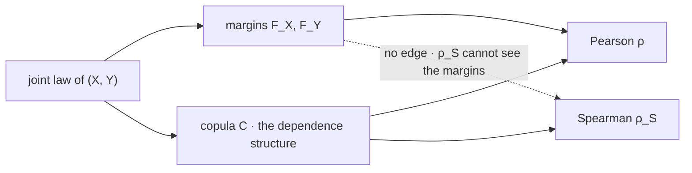

# Correlation

A correlation is a cosine. Once that is taken literally rather than as an analogy, every true statement about diversification becomes a statement about an angle, and the bound $\lvert\rho\rvert\le 1$ stops needing a proof of its own because it is the Cauchy–Schwarz inequality wearing different notation.

This page covers the standardization of a covariance, the proof of the bound and the exact case of equality, the geometry, what $\rho$ summarizes and what it cannot see, Spearman's rank correlation, and the ceiling correlation places on diversification. It does not develop the dependence structure that $\rho$ compresses — [Marginal Distributions](../part-03-random-variables/06-marginal-distributions.md) named that object and [Copulas](../part-18-quant-finance-applications/15-copulas.md) parameterizes it — and it does not test anything, which is [Nonparametric Tests](../part-12-hypothesis-testing/08-nonparametric-tests.md).

The number that determines how many independent bets a book contains is not a property of the book. It is a property of the day: nine sector ETFs are $2.49$ effective bets on an ordinary day and $1.76$ in the worst decile, and both numbers follow from one correlation through arithmetic on this page. [Risk Parity, Diversification, and Factors](../../part-08-portfolio-management/03-risk-parity-diversification-factors.md) measures them.

## Standardizing a Covariance

[Covariance](04-covariance.md) ends by noting that a covariance carries units, so its magnitude is not readable. Dividing by both standard deviations removes them:

$$\rho(X,Y)=\frac{\mathrm{cov}(X,Y)}{\sigma_X\,\sigma_Y}.$$

Equivalently, $\rho$ is the covariance of the two *standardized* variables of [Variance](02-variance.md): if $U=(X-\mu_X)/\sigma_X$ and $V=(Y-\mu_Y)/\sigma_Y$, then $\rho=\mathbb{E}[UV]=\mathrm{cov}(U,V)$. That reformulation is worth keeping, because every proof below is easier in terms of $U$ and $V$ than in terms of $X$ and $Y$.

??? note "Proof that ρ is invariant under increasing affine maps and flips sign under decreasing ones"
    Let $X'=aX+b$ and $Y'=cY+d$. Bilinearity on [Covariance](04-covariance.md) gives $\mathrm{cov}(X',Y')=ac\,\mathrm{cov}(X,Y)$, and the scaling rule on [Variance](02-variance.md) gives $\sigma_{X'}=\lvert a\rvert\sigma_X$ and $\sigma_{Y'}=\lvert c\rvert\sigma_Y$. So

    $$\rho(X',Y')=\frac{ac\,\mathrm{cov}(X,Y)}{\lvert a\rvert\lvert c\rvert\,\sigma_X\sigma_Y}=\frac{ac}{\lvert ac\rvert}\,\rho(X,Y)=\mathrm{sign}(ac)\,\rho(X,Y).$$

    The absolute values in the denominator and their absence in the numerator are the entire content: a standard deviation cannot be negative while a covariance can, so the sign survives in one place and not the other. Rescaling from decimals to basis points, or from dollars to euros, leaves $\rho$ untouched; flipping the sign of one variable flips $\rho$.

    Note the limitation this exposes. Invariance holds for *affine* maps only. Applying a nonlinear monotone transform to one variable — a log, an exponential — changes $\rho$, sometimes drastically, even though it changes nothing about which observations are larger than which. That failure is what the Spearman section repairs.

## The Bound Is Cauchy–Schwarz

$$-1\le\rho(X,Y)\le 1,$$

with equality exactly when one variable is an affine function of the other.

??? note "Proof that |ρ| ≤ 1, and exactly when it is an equality"
    Work with the standardized $U$ and $V$, which have mean zero and variance one, so $\mathbb{E}[U^2]=\mathbb{E}[V^2]=1$ and $\mathbb{E}[UV]=\rho$. For any real $t$ consider

    $$q(t)=\mathbb{E}\big[(tU+V)^2\big]=t^2\,\mathbb{E}[U^2]+2t\,\mathbb{E}[UV]+\mathbb{E}[V^2]=t^2+2\rho t+1.$$

    The left side is the expectation of a square, so $q(t)\ge0$ for every $t$. A quadratic with positive leading coefficient is non-negative everywhere exactly when its discriminant is non-positive:

    $$(2\rho)^2-4\le0\quad\Longleftrightarrow\quad \rho^2\le1\quad\Longleftrightarrow\quad \lvert\rho\rvert\le1.$$

    **Equality.** If $\lvert\rho\rvert=1$ the discriminant is zero, so $q$ has a repeated real root $t_0=-\rho$, meaning $\mathbb{E}[(t_0U+V)^2]=0$. An expectation of a non-negative quantity vanishes only if the quantity is zero with probability one, so $V=-t_0U$ almost surely — $Y$ is an affine function of $X$, increasing when $\rho=+1$ and decreasing when $\rho=-1$. Conversely, an affine relationship gives $\lvert\rho\rvert=1$ by the invariance result above.

    This argument is the Cauchy–Schwarz inequality, with $\langle X,Y\rangle=\mathbb{E}[XY]$ as the inner product on centred random variables. [Basic Linear Algebra Review](../part-01-mathematical-foundations/05-linear-algebra-review.md) asks for exactly that identification, and it is why the bound needs no separate argument: it is the statement that an inner product cannot exceed the product of the norms, which in this inner product reads $\lvert\mathrm{cov}(X,Y)\rvert\le\sigma_X\sigma_Y$.

!!! note "Centred random variables form an inner product space, and the rest of this part lives in it"
    Setting $\langle X,Y\rangle=\mathbb{E}[XY]$ on variables with mean zero and finite variance satisfies every requirement of an inner product: it is symmetric, linear in each argument by the bilinearity of [Covariance](04-covariance.md), and non-negative on the diagonal because $\langle X,X\rangle=\mathrm{var}(X)$. So a standard deviation is a norm, a covariance is an inner product, a correlation is a cosine, and Cauchy–Schwarz is the bound above — four objects that look like separate definitions are one structure. The payoff arrives on [Conditional Expectation](06-conditional-expectation.md), where the same inner product makes $\mathbb{E}[X\mid Y]$ an orthogonal projection and turns the law of total variance into the Pythagorean theorem.

```python
import numpy as np

rng = np.random.default_rng(505)
n, rho = 2000, 0.6
z = rng.standard_normal(n)
x = z
y = rho * z + np.sqrt(1 - rho ** 2) * rng.standard_normal(n)

u, v = x - x.mean(), y - y.mean()                             # centre, then treat as vectors
cos = (u @ v) / (np.linalg.norm(u) * np.linalg.norm(v))
print(f"  cos(theta) between the demeaned vectors  {cos:+.6f}")
print(f"  np.corrcoef                              {np.corrcoef(x, y)[0, 1]:+.6f}")
print(f"  angle  {np.degrees(np.arccos(cos)):.1f} deg")
print("  discriminant 4rho^2 - 4, zero exactly at the degenerate cases:")
for r in (-1.0, -0.31, 0.0, 0.756, 1.0):
    print(f"    rho {r:+.3f}  ->  {4 * r ** 2 - 4:+.4f}")
# =>   cos(theta) between the demeaned vectors  +0.577365
#      np.corrcoef                              +0.577365
#      angle  54.7 deg
#      discriminant 4rho^2 - 4, zero exactly at the degenerate cases:
#        rho -1.000  ->  +0.0000
#        rho -0.310  ->  -3.6156
#        rho +0.000  ->  -4.0000
#        rho +0.756  ->  -1.7139
#        rho +1.000  ->  +0.0000
```

The first two lines agree to six decimals because they are the same arithmetic: centre each series, then divide a dot product by a product of lengths. The discriminant rows show where the bound binds — it is zero only at $\rho=\pm1$, the two configurations in which the quadratic touches the axis and the affine relationship is forced. Everywhere else there is slack, and the slack is what makes a correlation informative rather than degenerate.

## Correlation Is a Cosine

Treat each centred return series as a vector. Its length is the standard deviation (up to a factor of $\sqrt{n}$), the dot product between two of them is the covariance, and the correlation is the cosine of the angle between them.

| $\rho$ | Angle | Equal-weight vol, unit inputs | Where the number comes from |
|---|---|---|---|
| $+1.000$ | $0.0^\circ$ | $1.0000$ | one position held twice |
| $+0.756$ | $40.9^\circ$ | $0.9370$ | `tsmom` and its meta-labelled version |
| $+0.340$ | $70.1^\circ$ | $0.8185$ | `tom` against `svol` |
| $0.000$ | $90.0^\circ$ | $0.7071$ | orthogonal |
| $-0.290$ | $106.9^\circ$ | $0.5958$ | `pairs` against `svol` |
| $-1.000$ | $180.0^\circ$ | $0.0000$ | a perfect hedge |

Uncorrelated means geometrically orthogonal, perfectly correlated means parallel, and $\rho=-1$ means antiparallel. The middle rows are the book's own measured sleeve pairs. Read down the third column and the moral is the one [Basic Linear Algebra Review](../part-01-mathematical-foundations/05-linear-algebra-review.md) asked to have carried here: adding a sleeve helps exactly to the extent its return vector points somewhere the book does not already point. A sleeve at $40.9^\circ$ is mostly a repeat of what you own; a sleeve past $90^\circ$ is subtracting risk.

## What ρ Summarizes and What It Does Not

$\rho$ is the best *linear* summary of a relationship, and that qualifier is load-bearing. [Covariance](04-covariance.md) exhibits $Y=X^2$ with $X$ standard normal: correlation zero to three decimals, while $Y$ is a deterministic function of $X$ and the conditional variance of $Y$ swings by a factor of a hundred across quintiles of $X$. A correlation of zero rules out a linear relationship and rules out nothing else.

The subtler failure is that $\rho$ can be right about the middle and silent about the ends. [Marginal Distributions](../part-03-random-variables/06-marginal-distributions.md) constructs two joint laws with identical margins whose correlations agree to three decimals, and finds their joint tail probabilities differing by a factor of $5.67$ at the one-in-a-thousand level. Both models would pass any validation that checks margins and a correlation.



Two solid arrows arrive at Pearson and only one at Spearman, and the missing edge is the whole content of the next section. Pearson is computed from the margins *and* the copula, which is why a monotone remapping of one margin moves it even though nothing about the dependence has changed. Spearman reads the copula alone, so nothing done to a margin can move it. That also says precisely what a Pearson correlation *is* as a summary: one number extracted from an object with two parts, contaminated by the part it was not trying to measure.

!!! note "Correlation compresses a whole dependence structure to one number, and the compression is lossy in a specific direction"
    A copula on two variables is an entire bivariate function; $\rho$ is one scalar read off it. Any such compression discards information, but this one discards it unevenly: $\rho$ is an average weighted by how far each observation sits from its mean, so the centre of the joint distribution and the tails contribute in proportions that have nothing to do with which region a risk question is about. Two copulas can therefore agree on $\rho$ to three decimals and disagree by a factor of five where a book actually fails. That is not an argument against correlation — it is an argument for knowing which question it answers, and the answer is *how much of one variable's linear variation is shared with another's*, at the scale where most of the data lives.

## Spearman's Rank Correlation

Feed each variable through its own distribution function first, then take the ordinary correlation of the results:

$$\rho_S(X,Y)=\rho\big(F_X(X),\,F_Y(Y)\big).$$

The transform is the probability integral transform of [Change of Variables](../part-03-random-variables/09-change-of-variables.md), which maps any continuous variable to a uniform. So $\rho_S$ is a Pearson correlation of two uniforms, and on a finite sample the transform is exactly what replacing each observation by its rank accomplishes — hence the name.

??? note "Proof that Spearman's ρ depends on the copula alone"
    Let $g$ be strictly increasing. Then $g(X)\le g(x)$ exactly when $X\le x$, so $F_{g(X)}(g(x))=F_X(x)$ — the transformed variable $F_{g(X)}(g(X))$ is the same random variable as $F_X(X)$. Applying any strictly increasing transform to either coordinate therefore leaves the pair $\big(F_X(X),F_Y(Y)\big)$ unchanged, and hence leaves $\rho_S$ unchanged.

    By Sklar's theorem, stated on [Marginal Distributions](../part-03-random-variables/06-marginal-distributions.md), the joint law of $\big(F_X(X),F_Y(Y)\big)$ *is* the copula $C$. So $\rho_S$ is a functional of $C$ and of nothing else, which is the invariance restated: the margins have been transformed away before the correlation is taken.

    This is the precise sense in which a correlation is a one-parameter summary of a copula, and it is what that page's closing note defers here. Pearson needs both ingredients; Spearman needs one.

```python
import numpy as np
from scipy.stats import spearmanr

rng = np.random.default_rng(515)
n = 5000
z = rng.standard_normal(n)
x, y = z, 0.5 * z + np.sqrt(0.75) * rng.standard_normal(n)    # a bivariate normal pair, rho = 0.5
xi, yi = rng.standard_normal(n), rng.standard_normal(n)       # and a genuinely independent pair
xi[0], yi[0] = 120.0, 120.0                                   # with one contaminated observation

def show(tag, a, b):
    print(f"  {tag:26s} pearson {np.corrcoef(a, b)[0, 1]:+.4f}"
          f"   spearman {spearmanr(a, b).statistic:+.4f}")
show("clean pair", x, y)
show("after y -> exp(3y)", x, np.exp(3 * y))
show("independent, 1 outlier", xi, yi)
print(f"  bivariate normal closed form: (6/pi)arcsin(rho/2)"
      f" = {6 / np.pi * np.arcsin(0.5 / 2):.5f}")
# =>   clean pair                 pearson +0.5007   spearman +0.4828
#      after y -> exp(3y)         pearson +0.0762   spearman +0.4828
#      independent, 1 outlier     pearson +0.7441   spearman +0.0083
#      bivariate normal closed form: (6/pi)arcsin(rho/2) = 0.48258
```

Three rows, three distinct facts. The first shows the two coefficients broadly agreeing on a well-behaved pair, and the $0.4828$ is not an approximation to $0.5$ — for a bivariate normal the exact relationship is $\rho_S=(6/\pi)\arcsin(\rho/2)$, which at $\rho=0.5$ is $0.48258$. The second applies a strictly increasing map to one coordinate: Pearson collapses from $0.50$ to $0.08$ while Spearman does not move in the fourth decimal, because nothing about the ordering changed. The third is the one to remember.

!!! warning "One observation in five thousand can manufacture a correlation of 0.74 between independent series"
    The two series in the last row are independent by construction, and a single contaminated observation — one bad print, one stale quote, one corporate action applied to the wrong date — moves Pearson to $+0.7441$ while Spearman stays at $+0.0083$. The mechanism is that Pearson averages *products* of deviations, so one pair of large deviations contributes a term of order $M^2$ against a background of order $n$, and it wins whenever $M^2$ is comparable to $n$. This is why the main course instructs printing both and reading the gap: a large Pearson with a near-zero Spearman is a data-quality alarm, not a finding. It is also why the `pairs` sleeve's skew of $+38.77$ was flagged as an artifact in [Risk Measurement](../../part-08-portfolio-management/01-risk-measurement.md) rather than reported as a property.

The published pair goes the other way and is reassuring for it: SPY against TLT gives Pearson $-0.31$ and Spearman $-0.26$, close enough that the negative relationship is broad-based rather than the work of a handful of days. That agreement is itself the information, and it is the five-second diagnostic [Probability and Random Variables](../../part-03-statistics/01-probability-and-random-variables.md) recommends. Kendall's $\tau$ is a third rank-based coefficient with the same copula-only property, developed alongside the families in [Copulas](../part-18-quant-finance-applications/15-copulas.md); rank correlations computed between a signal and forward returns are the information coefficients of [Feature and Signal Engineering](../../part-04-strategy-development/05-feature-and-signal-engineering.md).

## Correlation Caps Diversification

```python
import numpy as np

print("  published sector numbers, reproduced from rho alone (N = 9 sectors)")
for r, tag in ((0.314, "calm year"), (0.327, "middle 80% of days"),
               (0.516, "worst decile of days"), (0.922, "March 2020 peak")):
    print(f"    rho {r:.3f}  {tag:22s} N_eff {9 / (1 + 8 * r):.2f}")
print("  the ceiling is 1/rho, whatever N is")
for r in (0.100, 0.300, 0.516):
    row = "  ".join(f"N={N:<5d}{N / (1 + (N - 1) * r):6.2f}" for N in (5, 20, 100, 1000))
    print(f"    rho {r:.3f}:  {row}    limit {1 / r:.2f}")
# =>   published sector numbers, reproduced from rho alone (N = 9 sectors)
#        rho 0.314  calm year              N_eff 2.56
#        rho 0.327  middle 80% of days     N_eff 2.49
#        rho 0.516  worst decile of days   N_eff 1.76
#        rho 0.922  March 2020 peak        N_eff 1.07
#      the ceiling is 1/rho, whatever N is
#        rho 0.100:  N=5      3.57  N=20     6.90  N=100    9.17  N=1000   9.91    limit 10.00
#        rho 0.300:  N=5      2.27  N=20     2.99  N=100    3.26  N=1000   3.33    limit 3.33
#        rho 0.516:  N=5      1.63  N=20     1.85  N=100    1.92  N=1000   1.94    limit 1.94
```

??? note "Proof of the effective bet count for an equal-weight book"
    Take $N$ assets each with volatility $\sigma$ and every pair correlated at $\rho$, held at weight $1/N$. The portfolio-variance identity of [Covariance](04-covariance.md) has $N$ own terms and $N^2-N$ cross terms:

    $$\mathrm{var}\Big(\tfrac1N\sum_iX_i\Big)=\frac{1}{N^2}\Big(N\sigma^2+(N^2-N)\rho\sigma^2\Big)=\frac{\sigma^2}{N}\big(1+(N-1)\rho\big).$$

    Now ask how many *uncorrelated* assets would produce this same variance. At zero correlation the bracket is one, so $N_{\text{eff}}$ solves $\sigma^2/N_{\text{eff}}=\sigma^2\big(1+(N-1)\rho\big)/N$, giving

    $$N_{\text{eff}}=\frac{N}{1+(N-1)\rho}\ \xrightarrow[N\to\infty]{}\ \frac{1}{\rho}.$$

    The limit is immediate: the numerator grows like $N$ and the denominator like $N\rho$. So the ceiling depends only on $\rho$, and adding assets past a point buys nothing at all.

The first block reproduces four numbers [Portfolio Optimization and Correlation](../../part-08-portfolio-management/04-portfolio-optimization-and-correlation.md) measures on nine sector ETFs, from the correlation alone and one line of arithmetic. The second block is the ceiling: at $\rho=0.3$, five assets give $2.27$ bets, a hundred give $3.26$, a thousand give $3.33$, and infinity gives $3.33$. Ninety-five of the last hundred additions bought $0.07$ of a bet between them.

## A Number That Changes When You Need It Not To

The rolling correlation between stocks and long bonds ran near $-0.50$ through 2008 and 2020 and reached $+0.08$ by the end of 2022; nine sectors sat at $0.314$ in a calm year and $0.922$ in March 2020. A correlation is therefore not a property of a pair of assets. It is a property of a pair of assets *and a regime*, and the arithmetic above says the diversification a book actually owns is $1/\rho$ evaluated at whichever $\rho$ the day supplies — which is $3.2$ bets in the calm case and $1.1$ in the crisis, from the same nine holdings.

A book sized on the full-sample number is therefore sized on an average across regimes, and the regime that breaks it is precisely the one that average was diluted by. The uncomfortable part is that this is not an estimation problem that more history fixes: the full-sample correlation may be measured perfectly and still be the wrong number to size on, because the quantity is not constant. What determines which $\rho$ arrives is not on this page. A correlation is one scalar squeezed out of a copula, and the copula is where the answer lives.
