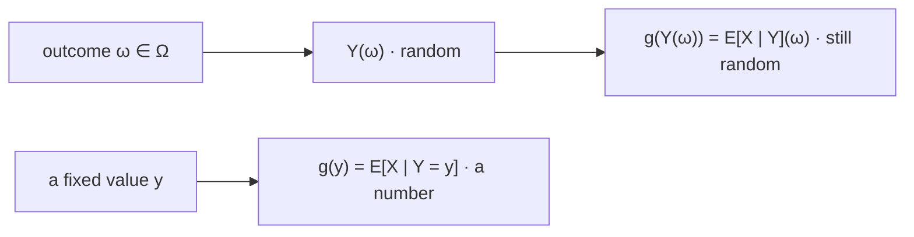

# Conditional Expectation

$\mathbb{E}[X\mid Y]$ is the best possible prediction of $X$ from $Y$ under squared error — not the best linear one, not the best among some family, the best full stop. That makes it the object every predictive model in this book is trying to compute, and the ceiling none of them can exceed.

This page owns both objects the notation covers: the number $\mathbb{E}[X\mid Y=y]$, one per value of $y$, and the random variable $\mathbb{E}[X\mid Y]$ that they assemble into. It covers the properties that follow immediately, the orthogonality that makes conditional expectation a projection, and the best-predictor theorem. It does not build the conditional law it averages against — that is [Conditional Distributions](../part-03-random-variables/07-conditional-distributions.md), and this page averages what that page constructs. Iterating the operation is [Law of Total Expectation](07-law-of-total-expectation.md).

A signal-selection process that ranks candidates by correlation is measuring the best *linear* predictor and discarding everything else it was shown. The last section exhibits a signal with a correlation of $+0.0005$ to the next return that explains $85\%$ of its variance — a signal every correlation screen in [Feature and Signal Engineering](../../part-04-strategy-development/05-feature-and-signal-engineering.md) would rank dead last.

## Averaging Against a Conditional Law

[Conditional Distributions](../part-03-random-variables/07-conditional-distributions.md) constructs the conditional law of $X$ given $Y=y$ — a mass function $p_{X\mid Y}(\cdot\mid y)$ in the discrete case, a density $f_{X\mid Y}(\cdot\mid y)$ in the continuous one, the latter defined by a limiting argument because the conditioning event has probability zero. Averaging against it gives a number:

$$\mathbb{E}[X\mid Y=y]=\sum_{x}x\,p_{X\mid Y}(x\mid y),\qquad \mathbb{E}[X\mid Y=y]=\int_{-\infty}^{\infty}x\,f_{X\mid Y}(x\mid y)\,dx.$$

Nothing new is being defined. These are the definitions of [Expected Value](01-expected-value.md) with a conditional law substituted for an unconditional one, which is legitimate because a conditional law is a law — that page's existence condition applies unchanged, now as $\mathbb{E}\big[\lvert X\rvert\,\big|\,Y=y\big]<\infty$.

There is one number for each $y$, so what has been defined is a *function* on the values $Y$ can take. Write it $g(y)=\mathbb{E}[X\mid Y=y]$.

## From a Number to a Random Variable

Composing $g$ with $Y$ produces a new random variable:

$$\mathbb{E}[X\mid Y]=g(Y).$$

Before $Y$ is observed this is random, because $Y$ is. After $Y$ is observed it is a number. The notation is unfortunate — the same symbol with and without an $=y$ denotes objects of different types — and conflating them is the commonest error in this material.

??? note "Proof that E[X | Y] is a function of Y and therefore a random variable"
    The function $g$ is defined pointwise on the range of $Y$: for each attainable $y$, the conditional law exists and $g(y)$ is its mean. Composing gives the map $\omega\mapsto g(Y(\omega))$ from the sample space to the reals.

    To be a random variable this composite must be measurable, which by the preimage argument of [Random Variables](../part-03-random-variables/01-random-variables.md) requires $\{g(Y)\le c\}\in\mathcal{F}$ for every $c$. Since $\{g(Y)\le c\}=Y^{-1}\big(g^{-1}((-\infty,c])\big)$ and preimages compose, this holds whenever $g$ is a Borel function — which it is, being a limit of measurable functions in the general construction.

    The substantive point is not the measurability but what it implies: $\mathbb{E}[X\mid Y]$ is a function of $Y$ *and of nothing else*. It cannot depend on $X$ except through the averaging already performed, which is exactly why it is available as a forecast — you can evaluate it knowing only $Y$.

```python
import numpy as np

vals = np.array([-150.0, -50.0, 0.0, 50.0, 150.0])            # next-day return, basis points
pY = np.array([0.15, 0.62, 0.23])                             # P(signal = sell, flat, buy)
cond = np.array([[0.20, 0.30, 0.30, 0.15, 0.05],              # the law of X given each bucket
                 [0.10, 0.22, 0.36, 0.22, 0.10],
                 [0.05, 0.12, 0.26, 0.35, 0.22]])
J = pY[:, None] * cond                                        # the joint mass function

g = cond @ vals                                               # E[X | Y = y], one number per y
for b, p, m in zip(("sell", "flat", "buy "), pY, g):
    print(f"    P(Y = {b}) = {p:.2f}     E[X | Y = {b}] = {m:+7.2f} bps")
EX = pY @ g
print(f"  E[X|Y] is a 3-valued random variable:  mean {EX:+.4f}   sd {np.sqrt(pY @ (g - EX) ** 2):.4f}")
print(f"  E[X] taken directly from the joint:    {J.sum(axis=0) @ vals:+.4f}")
# =>     P(Y = sell) = 0.15     E[X | Y = sell] =  -30.00 bps
#        P(Y = flat) = 0.62     E[X | Y = flat] =   +0.00 bps
#        P(Y = buy ) = 0.23     E[X | Y = buy ] =  +37.00 bps
#      E[X|Y] is a 3-valued random variable:  mean +4.0100   sd 20.8276
#      E[X] taken directly from the joint:    +4.0100
```

Three numbers and one random variable, in the same output. The three lines are the values of $g$; the fourth line describes the random variable $g(Y)$, which takes those three values with the printed probabilities and therefore has a mean and a standard deviation of its own. Pages 07 and 08 both return to this table — the agreement between the last two lines is the subject of one, and the standard deviation of $20.8276$ is the subject of the other.

!!! note "E[X | Y] is a random variable and E[X | Y = y] is a number, and conflating them is the commonest error on this page"
    The distinction shows up as soon as you try to take an expectation. Asking for $\mathbb{E}\big[\mathbb{E}[X\mid Y]\big]$ is meaningful — it averages a random variable, and the answer is on [Law of Total Expectation](07-law-of-total-expectation.md). Asking for $\mathbb{E}\big[\mathbb{E}[X\mid Y=y]\big]$ is not, because the inner quantity is a constant and the outer expectation does nothing. Likewise $\mathrm{var}\big(\mathbb{E}[X\mid Y]\big)$ is the informative quantity that [Law of Total Variance](08-law-of-total-variance.md) is built on, while the variance of a number is zero. The tell is whether $y$ appears: if it does, you have a number.



The same function $g$ appears in both rows, which is precisely why the two objects get confused. What differs is when $y$ is pinned down. In the top row nothing is fixed, so the output still varies with the outcome and is a random variable; in the bottom row a particular $y$ is supplied first, so the output is a constant. A forecast lives in the top row before the data arrives and the bottom row after.

## The Properties That Follow Immediately

Three properties hold, each inherited from the corresponding property of ordinary expectation applied within a conditional law:

$$\mathbb{E}[aX+bZ\mid Y]=a\,\mathbb{E}[X\mid Y]+b\,\mathbb{E}[Z\mid Y],\qquad \mathbb{E}\big[h(Y)\,X\mid Y\big]=h(Y)\,\mathbb{E}[X\mid Y],$$

and, when $X$ and $Y$ are independent, $\mathbb{E}[X\mid Y]=\mathbb{E}[X]$ — a constant, since conditioning on something irrelevant changes nothing.

??? note "Proof that known factors come out"
    Evaluate at a fixed value first. On the event $\{Y=y\}$ the quantity $h(Y)$ equals the constant $h(y)$, so by linearity of expectation under the conditional law,

    $$\mathbb{E}\big[h(Y)X\mid Y=y\big]=\mathbb{E}\big[h(y)X\mid Y=y\big]=h(y)\,\mathbb{E}[X\mid Y=y].$$

    This holds for every $y$, so the two functions of $y$ agree everywhere, and composing each with $Y$ gives the identity between random variables.

    The step that does the work is that conditioning on $Y$ makes any function of $Y$ known, and a known quantity behaves as a constant inside the average. This is the property the rest of the page runs on: the orthogonality proof, the best-predictor proof, and both laws on pages 07 and 08 all reduce to pulling an $h(Y)$ out of a conditional expectation at the right moment.

!!! note "Mean independence sits strictly between independence and zero covariance"
    The third property has a converse that fails, and the failure is informative. Call $X$ **mean-independent** of $Y$ when $\mathbb{E}[X\mid Y]=\mathbb{E}[X]$. Then independence implies mean independence, and mean independence implies zero covariance — but neither arrow reverses, so the three conditions form a strict hierarchy rather than a set of synonyms.

    $$X\perp Y\ \Longrightarrow\ \mathbb{E}[X\mid Y]=\mathbb{E}[X]\ \Longrightarrow\ \mathrm{cov}(X,Y)=0.$$

    The counterexample from [Covariance](04-covariance.md) separates the last two cleanly. With $X$ standard normal and $Y=X^2$, the covariance is zero, so the right-hand condition holds; but $\mathbb{E}[Y\mid X]=X^2$, which is emphatically not the constant $\mathbb{E}[Y]=1$, so the middle one fails. Zero covariance is genuinely weaker than mean independence, and mean independence — being a statement about one moment of the conditional law rather than about the whole law — is genuinely weaker than independence. Where a result needs one of these, it is worth checking which.

## Orthogonality

Define the residual $X-\mathbb{E}[X\mid Y]$: what is left of $X$ after the best use of $Y$. It is uncorrelated with *every* function of $Y$, not merely with $Y$ itself.

$$\mathbb{E}\Big[\big(X-\mathbb{E}[X\mid Y]\big)\,h(Y)\Big]=0\qquad\text{for every }h\text{ with }\mathbb{E}[h(Y)^2]<\infty.$$

??? note "Proof of the orthogonality property"
    Condition on $Y$ and use the previous section to pull $h(Y)$ out:

    $$\mathbb{E}\Big[\big(X-\mathbb{E}[X\mid Y]\big)h(Y)\ \Big|\ Y\Big]=h(Y)\,\mathbb{E}\Big[X-\mathbb{E}[X\mid Y]\ \Big|\ Y\Big]=h(Y)\Big(\mathbb{E}[X\mid Y]-\mathbb{E}[X\mid Y]\Big)=0,$$

    where the middle step uses linearity and the fact that $\mathbb{E}[X\mid Y]$ is itself a function of $Y$ and so comes out of the inner conditional expectation unchanged. The result is the zero random variable, and averaging it gives zero — which is the tower property of [Law of Total Expectation](07-law-of-total-expectation.md) applied to something that was already zero, so no circularity is involved.

    Geometrically, in the inner product $\langle X,Y\rangle=\mathbb{E}[XY]$ identified on [Correlation](05-correlation.md), this says the residual is orthogonal to the entire subspace of square-integrable functions of $Y$. So $\mathbb{E}[X\mid Y]$ is the orthogonal projection of $X$ onto that subspace, and every property on this page is a projection property.

```python
import numpy as np

rng = np.random.default_rng(616)
n = 4_000_000
Y = rng.uniform(-2, 2, n)
X = Y ** 2 - 1 + rng.normal(0, np.sqrt(0.25), n)
resid = X - (Y ** 2 - 1)                                      # X minus E[X|Y], exactly
for tag, h in (("1", np.ones(n)), ("Y", Y), ("Y^2", Y ** 2),
               ("sin(3Y)", np.sin(3 * Y)), ("1{Y>1}", (Y > 1).astype(float))):
    print(f"    E[(X - E[X|Y]) * h(Y)={tag:8s}] = {(resid * h).mean():+.6f}")
print(f"  but E[(X - E[X]) * Y^2]            = {((X - X.mean()) * Y ** 2).mean():+.6f}   <- not zero")
# =>     E[(X - E[X|Y]) * h(Y)=1       ] = +0.000227
#        E[(X - E[X|Y]) * h(Y)=Y       ] = -0.000019
#        E[(X - E[X|Y]) * h(Y)=Y^2     ] = -0.000134
#        E[(X - E[X|Y]) * h(Y)=sin(3Y) ] = +0.000319
#        E[(X - E[X|Y]) * h(Y)=1{Y>1}  ] = -0.000002
#      but E[(X - E[X]) * Y^2]            = +1.422440   <- not zero
```

Five arbitrarily chosen functions of $Y$ — a constant, a linear term, a quadratic, an oscillation, an indicator — and the residual is uncorrelated with all of them to Monte Carlo precision. The last line is the same expression with the *unconditional* mean subtracted instead, and it is nowhere near zero, which is what makes the first five non-trivial: the orthogonality is a property of $\mathbb{E}[X\mid Y]$ specifically and not of centring in general.

## The Best Predictor

Among all functions of $Y$, the conditional expectation minimizes expected squared error.

??? note "Proof that E[X | Y] minimizes mean squared error"
    Let $h$ be any function of $Y$ with finite second moment, and split the error around the conditional mean:

    $$X-h(Y)=\underbrace{\big(X-\mathbb{E}[X\mid Y]\big)}_{\text{residual}}+\underbrace{\big(\mathbb{E}[X\mid Y]-h(Y)\big)}_{\text{a function of }Y}.$$

    Square and take expectations. The cross term is $2\,\mathbb{E}\big[(X-\mathbb{E}[X\mid Y])\cdot\big(\mathbb{E}[X\mid Y]-h(Y)\big)\big]$, and the second bracket is a function of $Y$, so the whole thing vanishes by the orthogonality of the previous section. That leaves

    $$\mathbb{E}\big[(X-h(Y))^2\big]=\mathbb{E}\Big[\big(X-\mathbb{E}[X\mid Y]\big)^2\Big]+\mathbb{E}\Big[\big(\mathbb{E}[X\mid Y]-h(Y)\big)^2\Big].$$

    The first term does not involve $h$ and the second is non-negative, vanishing exactly when $h(Y)=\mathbb{E}[X\mid Y]$ almost surely. So that choice is optimal and it is the only optimal one.

    This is the Pythagorean theorem for the projection identified above, and it is worth noting that the *same display* with $h$ taken to be the constant $\mathbb{E}[X]$ is the law of total variance — which is why [Law of Total Variance](08-law-of-total-variance.md) needs no new machinery.

```python
import numpy as np

rng = np.random.default_rng(606)
n = 2_000_000
Y = rng.uniform(-2, 2, n)
X = Y ** 2 - 1 + rng.normal(0, np.sqrt(0.25), n)
cm = Y ** 2 - 1                                               # the conditional mean
b = np.cov(X, Y)[0, 1] / Y.var()
lin = X.mean() + b * (Y - Y.mean())
print(f"  constant  E[X]              MSE {((X - X.mean()) ** 2).mean():.5f}")
print(f"  best linear  a + bY         MSE {((X - lin) ** 2).mean():.5f}")
print(f"  conditional mean  E[X|Y]    MSE {((X - cm) ** 2).mean():.5f}")
print(f"  irreducible noise variance      {0.25:.5f}")
print(f"  best linear slope b = cov(X,Y)/var(Y) = {b:+.5f}")
print(f"  var(X) {X.var():.5f}   var(E[X|Y]) {cm.var():.5f}   share {cm.var()/X.var():.4f}")
print(f"  correlation(X, Y) {np.corrcoef(X, Y)[0, 1]:+.5f}   <- sees none of it")
# =>   constant  E[X]              MSE 1.67272
#      best linear  a + bY         MSE 1.67272
#      conditional mean  E[X|Y]    MSE 0.25030
#      irreducible noise variance      0.25000
#      best linear slope b = cov(X,Y)/var(Y) = +0.00055
#      var(X) 1.67272   var(E[X|Y]) 1.42182   share 0.8500
#      correlation(X, Y) +0.00049   <- sees none of it
```

The relationship is $X=Y^2-1+\varepsilon$ with $Y$ symmetric about zero, so the conditional mean is a parabola and the best *linear* approximation to a parabola on a symmetric range is a horizontal line. The first two rows are therefore identical to five decimals: fitting a slope to this data buys exactly nothing over predicting the constant. The third row reaches $0.25030$ against an irreducible noise floor of $0.25000$ — the conditional mean captures essentially everything there is.

!!! warning "A signal with a correlation of +0.0005 to the next return can explain eighty-five percent of its variance"
    The best linear predictor here is as bad as no predictor at all, while the conditional mean removes $85\%$ of the variance. Any screen that ranks candidate features by correlation, or by the $t$-statistic of a univariate regression slope, would place this feature at the bottom of the list. The failure mode is not exotic: it is what any *symmetric* relationship looks like, and symmetric relationships are common in markets because the natural things to condition on — a volatility level, a spread width, a distance from a moving average — often predict the magnitude of the next move rather than its direction. The diagnostic that catches it is the one [Covariance](04-covariance.md) uses: look at the conditional distribution across buckets of the feature rather than at a single number summarizing the pair.

## What a Model Is

Every forecasting object in this book is an attempt to compute the same function $g$, and they differ only in the class of $h$ they search over and the data they search it with. [Simple Linear Regression](../part-13-regression/01-simple-linear-regression.md) restricts $h$ to affine functions, so it estimates the best linear approximation to $\mathbb{E}[X\mid Y]$ — the same object only when the conditional mean happens to be linear, which the block above shows is a real assumption and not a formality. [Conditional Gaussian Distributions](../part-06-multivariate-probability/06-conditional-gaussian.md) is the case where it provably is linear, which is most of why the Gaussian assumption is so hard to give up. A tree ensemble searches piecewise-constant $h$; [Bayesian Prediction](../part-16-bayesian-statistics/07-bayesian-prediction.md) computes the average by integrating a posterior; the Kyle model of [Market Impact Models](../../advanced/05-market-impact-models.md) prices at $\mathbb{E}[v\mid y]$ and gets a linear answer because its inputs are jointly Gaussian.

So the theorem above is not a fact about a formula. It is the specification every model in the book is written against, and the ceiling none of them can exceed: no procedure, however sophisticated, beats $\mathbb{E}[X\mid Y]$ at squared error, and the gap between a model's error and the conditional mean's is the only meaningful measure of how much of the available signal it found. What remains after that — the irreducible $0.25$ in the block above — is not a modelling failure. It is the part of $X$ that $Y$ does not determine, and no amount of effort on the same $Y$ will touch it. Conditioning on *less* information gives a coarser projection and a different answer, and the identity relating the two is [Law of Total Expectation](07-law-of-total-expectation.md).
