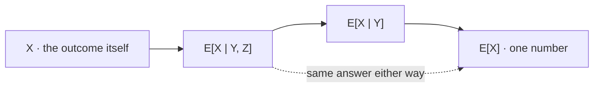

# Law of Total Expectation

Averaging a conditional average returns the unconditional one, exactly. Stated that way the identity sounds like bookkeeping, and as a computational device it is. Its more consequential use is as a constraint on reporting: every number produced by quantitative research is conditioned on something, and this law says what the unconditional quantity must be given the conditional one — including all the terms the report does not contain.

This page covers the tower property, its iterated form across nested information, the assembly of an unconditional average from conditional pieces, Wald's identity for a random number of terms, and conditioning on survival. The event-partition version, $\mathbb{E}[X]=\sum_i\mathbf{P}(A_i)\,\mathbb{E}[X\mid A_i]$, is **proved on [Law of Total Probability](../part-02-probability-foundations/06-law-of-total-probability.md)** and is stated here only in order to be generalized. The second-moment analogue is [Law of Total Variance](08-law-of-total-variance.md).

Every reported number in quantitative finance is conditioned on something, and usually on the fact that it was worth reporting. The fifth section makes that precise with fifty thousand strategies that have exactly no edge, of which the survivors average a Sharpe of $+1.24$.

## The Identity

For any $X$ with a finite mean and any $Y$ on the same space,

$$\mathbb{E}\big[\mathbb{E}[X\mid Y]\big]=\mathbb{E}[X].$$

The inner object is the random variable of [Conditional Expectation](06-conditional-expectation.md); the outer expectation averages it over the distribution of $Y$. The result is a constant, and it is the constant you would have got without conditioning at all.

??? note "Proof of the tower property"
    Take $Y$ discrete. The inner quantity is the random variable taking the value $g(y)=\mathbb{E}[X\mid Y=y]$ when $Y=y$, so averaging it over $Y$ gives

    $$\mathbb{E}\big[\mathbb{E}[X\mid Y]\big]=\sum_{y}g(y)\,\mathbf{P}(Y=y)=\sum_{y}\mathbb{E}[X\mid Y=y]\,\mathbf{P}(Y=y).$$

    The right-hand side is exactly the event-partition law applied to the partition generated by $Y$ — the events $\{Y=y\}$ are disjoint and exhaust the space, because $Y$ takes one value on each outcome. That law is proved on [Law of Total Probability](../part-02-probability-foundations/06-law-of-total-probability.md) and is not reproved here, so the tower property is a corollary rather than a new theorem.

    Two conditions are doing quiet work. The interchange of summation implicit in the event-partition proof needs absolute convergence, which is the existence condition of [Expected Value](01-expected-value.md); without it the rearrangement is not licensed and the identity can fail. And blocks with $\mathbf{P}(Y=y)=0$ contribute nothing whatever value is assigned to the undefined conditional, so they may be dropped. For continuous $Y$ the sum becomes an integral against $f_Y$, with the conditional density supplied by the limiting construction of [Conditional Distributions](../part-03-random-variables/07-conditional-distributions.md).

!!! note "The event-partition version of this law is proved in Part II and is generalized here rather than reproved"
    It is worth being explicit about who owns what, because the three pages involved are easy to confuse. [Law of Total Probability](../part-02-probability-foundations/06-law-of-total-probability.md) proves the version for a partition $\{A_i\}$ of positive-probability events, in full, including the convergence caveat. [Conditional Distributions](../part-03-random-variables/07-conditional-distributions.md) constructs the conditional laws but deliberately averages nothing. This page supplies the one genuinely new ingredient: the weights come from a random variable rather than from a partition chosen in advance, so the weighted average $\mathbb{E}[X\mid Y]$ is itself random before $Y$ is observed, and the outer expectation is an average over that randomness rather than a sum over a list. Everything else is inherited.

## Iterating

The name *law of iterated expectations* comes from what happens with nested information. If $Y$ is coarser than $(Y,Z)$ — knowing both tells you at least as much as knowing one —

$$\mathbb{E}\Big[\mathbb{E}[X\mid Y,Z]\ \Big|\ Y\Big]=\mathbb{E}[X\mid Y].$$

The coarser conditioning wins. Averaging away $Z$ from the finer forecast reproduces the coarser forecast exactly, so nothing is gained or lost by going through the intermediate step.

??? note "Proof of the iterated form"
    The cleanest argument is geometric, using the projection identified on [Conditional Expectation](06-conditional-expectation.md). Write $\mathcal{H}_Y$ for the space of square-integrable functions of $Y$ and $\mathcal{H}_{Y,Z}$ for the functions of both, so $\mathcal{H}_Y\subseteq\mathcal{H}_{Y,Z}$ — any function of $Y$ alone is in particular a function of $Y$ and $Z$.

    Conditional expectation is orthogonal projection onto these spaces. Projecting onto a subspace and then onto a subspace of *that* is the same as projecting onto the smaller one directly, which is a standard fact about nested orthogonal projections and is exactly what the display asserts.

    Directly: let $W=\mathbb{E}[X\mid Y,Z]$. For any $h$, orthogonality in $\mathcal{H}_{Y,Z}$ gives $\mathbb{E}\big[(X-W)h(Y,Z)\big]=0$, and taking $h$ to depend on $Y$ only — legitimate, since such an $h$ is in the larger space — gives $\mathbb{E}\big[(X-W)h(Y)\big]=0$. So $X$ and $W$ have the same projection onto $\mathcal{H}_Y$, which is the claim. Setting $Y$ constant recovers the tower property of the previous section as the special case where the coarser information is nothing at all.



Each solid arrow discards information, and the chain from left to right is what "iterated" names. The dashed arrow is the theorem. Dropping $Z$ and then $Y$ gives the same answer as dropping both at once, and that is not obvious — it is what makes the law a tool rather than a tautology, because it licenses inserting an intermediate conditioning purely to make a calculation tractable and then removing it for free. Most applications of this identity are exactly that manoeuvre: condition on whatever makes the inner average easy, then average it away.

## Computing an Unconditional Average From Conditional Ones

```python
import numpy as np

pS = np.array([0.85, 0.15])                                   # Part II's published regimes
mS = np.array([0.0006, -0.0015])
print(f"  calm      P {pS[0]:.2f}   E[R | calm]      {mS[0]:+.4f}")
print(f"  turbulent P {pS[1]:.2f}   E[R | turbulent] {mS[1]:+.4f}")
print(f"  E[R] = {pS @ mS:.6f} per day, or {252 * (pS @ mS):.2%} over 252 days")

vals = np.array([-150.0, -50.0, 0.0, 50.0, 150.0])            # the page-06 table again
pY = np.array([0.15, 0.62, 0.23])
cond = np.array([[0.20, 0.30, 0.30, 0.15, 0.05],
                 [0.10, 0.22, 0.36, 0.22, 0.10],
                 [0.05, 0.12, 0.26, 0.35, 0.22]])
g = cond @ vals
print(f"  signal table: E[E[X|Y]] = {pY @ g:+.4f} bps"
      f"   E[X] direct = {(pY[:, None] * cond).sum(axis=0) @ vals:+.4f} bps")
# =>   calm      P 0.85   E[R | calm]      +0.0006
#      turbulent P 0.15   E[R | turbulent] -0.0015
#      E[R] = 0.000285 per day, or 7.18% over 252 days
#      signal table: E[E[X|Y]] = +4.0100 bps   E[X] direct = +4.0100 bps
```

Two instances of the same arithmetic. The first uses the regime numbers of [Law of Total Probability](../part-02-probability-foundations/06-law-of-total-probability.md) and reproduces its published $7.18\%$; the second takes the signal table of [Conditional Expectation](06-conditional-expectation.md) and confirms that averaging the three conditional means against their probabilities returns the joint's own mean, $+4.01$ basis points.

The moral is that page's and worth restating at this level. The headline number describes neither regime: on $85\%$ of days the strategy earns more than $0.0285\%$ and on $15\%$ it loses money outright. Reporting the unconditional figure is not wrong — it is the correct expectation — but it is a weighted average of two facts, and the weights are exactly what changes when the market does.

## A Random Number of Terms

When the *number* of terms is itself random, the tower handles it in one step. If $N$ is a non-negative integer random variable independent of an iid sequence $X_1,X_2,\dots$,

$$\mathbb{E}\Big[\sum_{i=1}^{N}X_i\Big]=\mathbb{E}[N]\,\mathbb{E}[X].$$

??? note "Proof of Wald's identity"
    Condition on $N$. Given $N=n$, the sum has a fixed number of terms and linearity from [Expected Value](01-expected-value.md) applies directly:

    $$\mathbb{E}\Big[\sum_{i=1}^{N}X_i\ \Big|\ N=n\Big]=\mathbb{E}\Big[\sum_{i=1}^{n}X_i\Big]=n\,\mathbb{E}[X],$$

    where the first equality is where independence enters: it says that learning $N=n$ tells you nothing about the values of the $X_i$, so their conditional means are still $\mathbb{E}[X]$. Without that, the inner expectation is not $n\,\mathbb{E}[X]$ and the argument stops.

    So $\mathbb{E}\big[\sum_i X_i\mid N\big]=N\,\mathbb{E}[X]$ as a random variable, and taking the outer expectation gives $\mathbb{E}[N]\,\mathbb{E}[X]$ by pulling out the constant $\mathbb{E}[X]$.

```python
import numpy as np

rng = np.random.default_rng(707)
lam, edge, sd = 50.0, 120.0, 400.0                            # trades/month, mean edge, per-trade sd
months = 400_000
N = rng.poisson(lam, months)
total = rng.normal(edge * N, sd * np.sqrt(N))                 # sum of N iid trades
print(f"  E[N] {lam:.1f}   E[X] {edge:.1f}")
print(f"  Wald  E[N]E[X] = {lam * edge:,.1f}      simulated {total.mean():,.1f}")
# =>   E[N] 50.0   E[X] 120.0
#      Wald  E[N]E[X] = 6,000.0      simulated 6,002.0
```

A desk expecting fifty trades a month at an average edge of \$120 expects \$6,000 a month, and the randomness in the trade count costs nothing in expectation — the count and the edge multiply cleanly. That is a genuinely useful simplification, and it depends entirely on a hypothesis that trading rules routinely violate.

!!! note "Wald needs the trade count independent of the trades, and a stop-loss rule breaks exactly that"
    A strategy that halts for the day after a large loss, or that scales down after a drawdown, or that trades more when signals are firing — which is most strategies — has an $N$ that is a function of the $X_i$. The independence hypothesis fails, and the identity fails with it. Worse, it usually fails in the flattering direction: rules that cut activity after losses truncate the left tail of the count-weighted sum, so the naive $\mathbb{E}[N]\mathbb{E}[X]$ understates nothing while the realized distribution has been reshaped in a way the expectation does not show. The version of the result that survives a stopping rule is optional stopping, in [Martingales](../part-08-stochastic-processes/10-martingales.md); the count process itself is usually modelled as one of the arrival processes in [Poisson Processes](../part-08-stochastic-processes/03-poisson-processes.md); and the practical consequence for sizing is in [Position Sizing and Risk Budgeting](../../part-04-strategy-development/06-position-sizing-and-risk-budgeting.md).

## Conditioning on Survival

The most expensive conditioning in quantitative research is the one nobody writes down: a number is reported because it survived a filter.

```python
import numpy as np

rng = np.random.default_rng(717)
cands, days = 50_000, 756                                     # zero-edge candidates, 3-year tests
r = rng.normal(0.0, 0.01, (cands, days))                      # every one has exactly no edge
S = np.sqrt(252) * r.mean(axis=1) / r.std(axis=1, ddof=1)
keep = S > 1.0
p = keep.mean()
print(f"  candidates {cands:,}   P(Sharpe > 1) {p:.4f}   survivors {keep.sum():,}")
print(f"  E[S]             {S.mean():+.4f}")
print(f"  E[S | survived]  {S[keep].mean():+.4f}")
print(f"  E[S | did not]   {S[~keep].mean():+.4f}")
print(f"  tower: {p * S[keep].mean() + (1 - p) * S[~keep].mean():+.6f}  vs  {S.mean():+.6f}")
# =>   candidates 50,000   P(Sharpe > 1) 0.0424   survivors 2,120
#      E[S]             -0.0018
#      E[S | survived]  +1.2412
#      E[S | did not]   -0.0568
#      tower: -0.001774  vs  -0.001774
```

Fifty thousand candidate strategies, each with a true edge of exactly zero, each backtested over three years. Keep the ones with a Sharpe above $1.0$ and you keep $2{,}120$ of them, averaging $+1.24$. The last line is the tower property closing the books: the survivors' average and the rejects' average, weighted by how often each happens, reproduce the population mean of $-0.0018$ to six decimals.

The effect is not a feature of these particular numbers. Selecting on a quantity always inflates its conditional average, and the tower says by how much.

??? note "Proof that conditioning on survival strictly inflates the average"
    Let $A=\{S>c\}$ be any selection event with $0<\mathbf{P}(A)<1$. Splitting on $A$ and $A^\mathsf{C}$ — the two-block case of the event-partition law —

    $$\mathbb{E}[S]=\mathbf{P}(A)\,\mathbb{E}[S\mid A]+\big(1-\mathbf{P}(A)\big)\,\mathbb{E}\big[S\mid A^\mathsf{C}\big].$$

    Every value in $A$ exceeds $c$ and every value in $A^\mathsf{C}$ is at most $c$, so $\mathbb{E}[S\mid A]>c\ge\mathbb{E}[S\mid A^\mathsf{C}]$ whenever the selection is not vacuous. The unconditional mean is a weighted average of the two, so it lies strictly between them, and in particular

    $$\mathbb{E}[S\mid A]>\mathbb{E}[S].$$

    Rearranging the identity gives the size of the gap directly:

    $$\mathbb{E}[S\mid A]-\mathbb{E}[S]=\frac{1-\mathbf{P}(A)}{\mathbf{P}(A)}\,\Big(\mathbb{E}[S]-\mathbb{E}\big[S\mid A^\mathsf{C}\big]\Big),$$

    which grows without bound as $\mathbf{P}(A)\to0$. A more selective filter produces a larger inflation, mechanically, with no reference to whether anything being selected has any merit. Checking against the printed output: $\mathbf{P}(A)=0.0424$ gives a factor $(1-0.0424)/0.0424=22.6$, applied to a gap of $-0.0018-(-0.0568)=0.0550$, for an inflation of $1.242$. Added to the population mean that is $+1.240$, against the observed $+1.2412$ — the residual is rounding in the three printed inputs.

!!! warning "A number conditioned on survival is not a biased estimate of the unconditional one — it is a different quantity"
    Nothing here was overfitted in any procedural sense. No parameter was tuned, no data was reused, no lookahead was committed, and each strategy saw its own independent sample exactly once. The $+1.24$ is not an error in anyone's arithmetic; it is the correct value of $\mathbb{E}[S\mid S>1]$, which is simply a different quantity from $\mathbb{E}[S]$. Treating the first as an estimate of the second is the mistake, and it is invisible in any diagnostic run on the surviving strategy alone. What makes the identity useful rather than merely deflating is that it is *exact*: the gap is a computable function of the search width and the filter, so it can be priced in advance rather than discovered afterwards. That computation is [Data Snooping Bias](../part-15-multiple-testing/04-data-snooping-bias.md), [Multiple Comparisons](../part-15-multiple-testing/01-multiple-comparisons.md) and [White's Reality Check](../part-15-multiple-testing/05-whites-reality-check.md), and the practice is [Validation and Overfitting](../../part-04-strategy-development/08-validation-and-overfitting.md).

## The Identity That Prices a Backtest

The tower is usually presented as a computational convenience — condition on something that makes the inner average easy, then average it away — and the second section shows why that works. Its more important use is the one the last two sections illustrate: as a constraint on what a set of reported numbers can jointly be.

Every number in a research note is $\mathbb{E}[\,\cdot\mid\text{something}]$. Returns given that the strategy was live; a Sharpe given that the strategy was selected; a hit rate given that the signal fired. The identity says the unconditional quantity is a probability-weighted average that includes every term the note omits, and the omitted terms are usually the ones that did not survive to be written about. Two numbers are therefore never enough on their own — a conditional average is uninterpretable without the probability of the condition.

That is the practical demand this page makes. The reported Sharpe of a survivor is not evidence about a population until it has been divided back through by the probability of surviving, and that probability is a property of the search rather than of the strategy: how many candidates were tried, on what filter, over what sample. Which is why the width of a search is a number a research process has to record, and almost never does.
