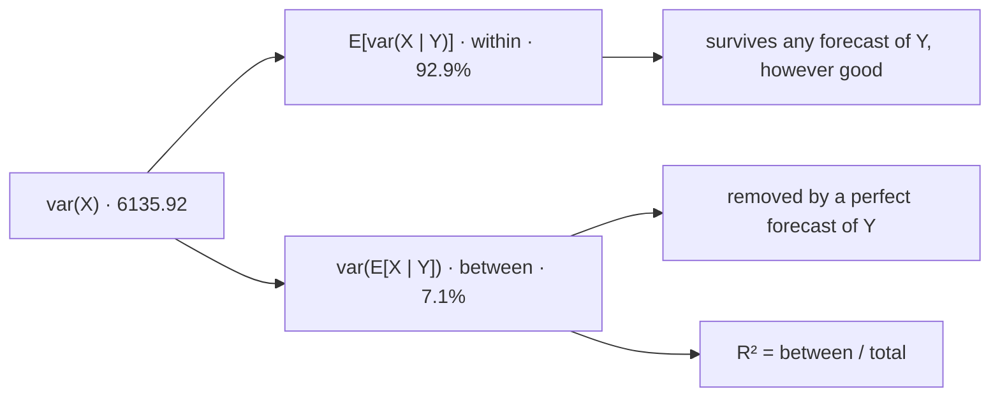

# Law of Total Variance

Variance splits exactly into the part conditioning removes and the part it cannot, and the split is a budget rather than an accounting curiosity. It states, from the joint law alone and before any model is built, the ceiling on what knowing $Y$ can do for the spread of $X$.

This page covers the decomposition and its proof as a Pythagorean identity, the within-and-between reading, the explained-variance ratio, and the variance of a sum of a random number of terms. It does not decompose a covariance against a third variable, and it fits nothing to data: the sample version of this decomposition is analysis of variance, in [Descriptive Statistics](../part-10-statistics-foundations/02-descriptive-statistics.md) and [Multiple Linear Regression](../part-13-regression/02-multiple-linear-regression.md).

Knowing the market's regime is worth almost nothing for a variance and a great deal for a mean, and the ratio between those two facts is computable to two decimal places. That asymmetry is the trading stake, and it is why "regimes don't matter, the variance explained is tiny" is a sentence people say and should not.

## The Decomposition

For any $X$ with a finite second moment and any $Y$,

$$\mathrm{var}(X)=\underbrace{\mathbb{E}\big[\mathrm{var}(X\mid Y)\big]}_{\text{within}}+\underbrace{\mathrm{var}\big(\mathbb{E}[X\mid Y]\big)}_{\text{between}}.$$

Both terms are built from objects on [Conditional Expectation](06-conditional-expectation.md): $\mathrm{var}(X\mid Y)$ is the variance computed inside the conditional law, itself a random variable because it depends on $Y$; and $\mathbb{E}[X\mid Y]$ is the conditional mean, whose variance across values of $Y$ is the second term.

??? note "Proof of the decomposition"
    Apply the computational formula of [Variance](02-variance.md) inside the conditional law: $\mathrm{var}(X\mid Y)=\mathbb{E}[X^2\mid Y]-\big(\mathbb{E}[X\mid Y]\big)^2$. Taking expectations of both sides and using the tower property of [Law of Total Expectation](07-law-of-total-expectation.md) on the first term,

    $$\mathbb{E}\big[\mathrm{var}(X\mid Y)\big]=\mathbb{E}[X^2]-\mathbb{E}\Big[\big(\mathbb{E}[X\mid Y]\big)^2\Big].$$

    Separately, the computational formula applied to the random variable $\mathbb{E}[X\mid Y]$ gives

    $$\mathrm{var}\big(\mathbb{E}[X\mid Y]\big)=\mathbb{E}\Big[\big(\mathbb{E}[X\mid Y]\big)^2\Big]-\Big(\mathbb{E}\big[\mathbb{E}[X\mid Y]\big]\Big)^2=\mathbb{E}\Big[\big(\mathbb{E}[X\mid Y]\big)^2\Big]-\big(\mathbb{E}[X]\big)^2,$$

    the last step by the tower property again. Adding the two displays cancels the middle term and leaves $\mathbb{E}[X^2]-(\mathbb{E}[X])^2$, which is $\mathrm{var}(X)$.

??? note "Proof that the two terms are the Pythagorean legs of the projection on Conditional Expectation"
    Split the deviation of $X$ from its mean through the conditional mean:

    $$X-\mathbb{E}[X]=\underbrace{\big(X-\mathbb{E}[X\mid Y]\big)}_{\text{residual}}+\underbrace{\big(\mathbb{E}[X\mid Y]-\mathbb{E}[X]\big)}_{\text{a function of }Y}.$$

    The second bracket is a function of $Y$, so by the orthogonality result of [Conditional Expectation](06-conditional-expectation.md) the two brackets are orthogonal in the inner product $\langle U,V\rangle=\mathbb{E}[UV]$ identified on [Correlation](05-correlation.md). Squared norms therefore add:

    $$\mathrm{var}(X)=\mathbb{E}\Big[\big(X-\mathbb{E}[X\mid Y]\big)^2\Big]+\mathbb{E}\Big[\big(\mathbb{E}[X\mid Y]-\mathbb{E}[X]\big)^2\Big],$$

    and the first term is $\mathbb{E}[\mathrm{var}(X\mid Y)]$ by the tower property while the second is $\mathrm{var}(\mathbb{E}[X\mid Y])$ because $\mathbb{E}[X\mid Y]$ has mean $\mathbb{E}[X]$.

    This is the *same display* as the best-predictor proof on [Conditional Expectation](06-conditional-expectation.md), with the competing predictor $h$ taken to be the constant $\mathbb{E}[X]$. The law of total variance is therefore not a second theorem; it is the Pythagorean identity for a projection the reader has already met, read with one particular choice of comparison point.

!!! note "Conditioning can only reduce the expected variance and never increase it"
    Both terms are non-negative, so $\mathbb{E}\big[\mathrm{var}(X\mid Y)\big]\le\mathrm{var}(X)$ for every $Y$ whatsoever — including a $Y$ that is pure noise, unrelated to $X$, or deliberately adversarial. Information cannot hurt *on average*. It can certainly hurt on a particular value: $\mathrm{var}(X\mid Y=y)$ may exceed $\mathrm{var}(X)$ for some $y$, and a forecast conditioned on that $y$ is genuinely less certain than an unconditional one. The guarantee lives entirely in the averaging, which is worth knowing before quoting it as a reason that more data is always better.

## Within and Between

```python
import numpy as np

vals = np.array([-150.0, -50.0, 0.0, 50.0, 150.0])
pY = np.array([0.15, 0.62, 0.23])
cond = np.array([[0.20, 0.30, 0.30, 0.15, 0.05],
                 [0.10, 0.22, 0.36, 0.22, 0.10],
                 [0.05, 0.12, 0.26, 0.35, 0.22]])
g = cond @ vals                                               # E[X | Y = y]
cv = np.array([cond[i] @ (vals - g[i]) ** 2 for i in range(3)])   # var(X | Y = y)
EX = pY @ g
vX = (pY[:, None] * cond).sum(axis=0) @ (vals - EX) ** 2
within, between = pY @ cv, pY @ (g - EX) ** 2
print(f"  E[X] {EX:+.4f} bps    var(X) {vX:.2f}   sd {np.sqrt(vX):.2f} bps")
for b, p, m, v in zip(("sell", "flat", "buy "), pY, g, cv):
    print(f"    Y={b}  P {p:.2f}   E[X|Y] {m:+7.2f}   var(X|Y) {v:8.2f}   sd {np.sqrt(v):6.2f}")
print(f"  E[var(X|Y)]  within  {within:8.2f}  ({100 * within / vX:.1f}%)")
print(f"  var(E[X|Y])  between {between:8.2f}  ({100 * between / vX:.1f}%)")
print(f"  sum {within + between:.2f}   var(X) {vX:.2f}    sqrt(between) = {np.sqrt(between):.4f}")
# =>   E[X] +4.0100 bps    var(X) 6135.92   sd 78.33 bps
#        Y=sell  P 0.15   E[X|Y]  -30.00   var(X|Y)  5850.00   sd  76.49
#        Y=flat  P 0.62   E[X|Y]   +0.00   var(X|Y)  5600.00   sd  74.83
#        Y=buy   P 0.23   E[X|Y]  +37.00   var(X|Y)  5881.00   sd  76.69
#      E[var(X|Y)]  within   5702.13  (92.9%)
#      var(E[X|Y])  between   433.79  (7.1%)
#      sum 6135.92   var(X) 6135.92    sqrt(between) = 20.8276
```

The same signal table [Conditional Expectation](06-conditional-expectation.md) introduced, now split. The three conditional variances are all close to each other and close to the total — knowing the signal barely narrows the distribution of the next return. What the signal moves is the *centre*, from $-30$ to $+37$ basis points, and that movement is the entire between term.

Two consistency checks worth noticing. The two components sum to $6135.92$, matching $\mathrm{var}(X)$ exactly rather than approximately, because the identity is exact. And $\sqrt{433.79}=20.8276$ is precisely the standard deviation page 06 printed for the random variable $\mathbb{E}[X\mid Y]$ — three pages computing one object.



The split is exhaustive and exact, so the right branch is the *entire* ceiling on what knowing $Y$ can do for the spread of $X$ — not an estimate of it, and not conditional on a modelling choice. And the left branch is what remains after a forecast that is not merely good but perfect. Reading the diagram right to left rather than left to right is the useful direction: it says how much a class of models can possibly be worth before any of them is built.

## Almost All of the Variance Is Within

```python
import numpy as np

pS = np.array([0.85, 0.15])                                   # Part II's published regimes
mS = np.array([0.0006, -0.0015])
vS = np.array([0.008, 0.025]) ** 2
ER = pS @ mS
within, between = pS @ vS, pS @ (mS - ER) ** 2
print(f"  E[var(R|S)]  within-regime   {within:.10f}   sd {np.sqrt(within):.6f}")
print(f"  var(E[R|S])  between-regime  {between:.10f}   sd {np.sqrt(between):.6f}")
print(f"  var(R)       total           {within + between:.10f}   sd {np.sqrt(within + between):.6f}")
print(f"  between-regime share of total variance {100 * between / (within + between):.2f}%")
print(f"  annualized: total {np.sqrt(252 * (within + between)):.4f}"
      f"   a perfect regime timer removes {np.sqrt(252*(within+between)) - np.sqrt(252*within):.5f}")
# =>   E[var(R|S)]  within-regime   0.0001481500   sd 0.012172
#      var(E[R|S])  between-regime  0.0000005623   sd 0.000750
#      var(R)       total           0.0001487123   sd 0.012195
#      between-regime share of total variance 0.38%
#      annualized: total 0.1936   a perfect regime timer removes 0.00037
```

Two reconciliations first, because both are small honesties that cost a sentence each. The within-regime standard deviation is $0.012172$ — exactly the variance-matched $\sigma$ that [Law of Total Probability](../part-02-probability-foundations/06-law-of-total-probability.md) prints, because that page matched on the within piece and set both regime means to zero. Restoring the mean gap raises the total to $0.012195$, a change of $0.2\%$, which leaves its sixteen-fold tail comparison at a four-percent threshold entirely intact. And the annualized total of $0.1936$ sits next to the $0.195$ measured on real index returns, so the two-regime toy is calibrated to something.

Now the finding. The between-regime term is $0.38\%$ of the total variance. A forecaster who knew tomorrow's regime with certainty — not estimated it well, *knew* it — would reduce annualized volatility from $19.36\%$ to $19.32\%$, a saving of four basis points.

!!! warning "A perfect regime forecast removes four basis points of annualized volatility and flips the sign of the expected return"
    The same partition, on the same inputs, carries a mean gap from $+0.06\%$ to $-0.15\%$ per day — one regime makes money and the other loses it. So regime knowledge is nearly worthless for predicting *how far* returns will move and decisive for predicting *which way*. A risk decomposition and a return decomposition run on identical inputs and answer different questions, and reading the first as though it answered the second is exactly how "regimes don't matter, the variance explained is tiny" gets said. It is why [Market Regimes](../../part-01-foundations/06-market-regimes.md) is a positioning question rather than a volatility-forecasting one, and why the latent-state machinery of [Hidden Markov Models](../part-08-stochastic-processes/07-hidden-markov-models.md) and [Regime Detection](../part-18-quant-finance-applications/15-regime-detection.md) is aimed at the mean.

## Explained Variance Is var(E[X | Y]) / var(X)

The between term over the total is the fraction of variance a perfect forecast of $Y$ removes, and that ratio *is* $R^2$ — by construction rather than by convention:

$$R^2=\frac{\mathrm{var}\big(\mathbb{E}[X\mid Y]\big)}{\mathrm{var}(X)}.$$

??? note "Proof that the ratio equals ρ² when the conditional mean is linear"
    Suppose $\mathbb{E}[X\mid Y]=a+bY$. Then $\mathrm{var}(\mathbb{E}[X\mid Y])=b^2\,\mathrm{var}(Y)$ by the scaling rule of [Variance](02-variance.md). Taking the covariance of $X$ with $Y$ and using the tower property,

    $$\mathrm{cov}(X,Y)=\mathbb{E}\big[(X-\mathbb{E}[X])Y\big]=\mathbb{E}\Big[\big(\mathbb{E}[X\mid Y]-\mathbb{E}[X]\big)Y\Big]=b\,\mathrm{var}(Y),$$

    so $b=\mathrm{cov}(X,Y)/\mathrm{var}(Y)$ — the best linear slope of [Conditional Expectation](06-conditional-expectation.md). Substituting,

    $$R^2=\frac{b^2\,\mathrm{var}(Y)}{\mathrm{var}(X)}=\frac{\mathrm{cov}(X,Y)^2}{\mathrm{var}(Y)\,\mathrm{var}(X)}=\rho^2.$$

    The linearity hypothesis is essential and is exactly what fails in the counterexample of [Conditional Expectation](06-conditional-expectation.md): there the ratio is $0.8500$ while $\rho^2\approx 2\times10^{-7}$. The ratio still means what it always meant — the share of variance a perfect forecast removes — and it is $\rho^2$ that has stopped tracking it. So $R^2$ is the more fundamental quantity and $\rho^2$ is a special case that requires an assumption nobody usually states.

| Information coefficient | $R^2=\text{IC}^2$ |
|---|---|
| $0.01$ | $0.01\%$ |
| $0.03$ | $0.09\%$ |
| $0.05$ | $0.25\%$ |
| $0.10$ | $1.00\%$ |
| $0.30$ | $9.00\%$ |

!!! note "A signal worth trading explains under a tenth of one percent of return variance"
    A rank information coefficient of $0.03$ is a respectable signal by the standards of [Feature and Signal Engineering](../../part-04-strategy-development/05-feature-and-signal-engineering.md), and the decomposition assigns it $0.09\%$ of the between term. The textbook table two sections above has $R^2=7.1\%$; real ones are roughly eighty times smaller. Any research process that screens candidates on explained variance therefore rejects every signal that has ever made money, and the reason is a type mismatch rather than a threshold set too high: profit is a statement about the first moment and $R^2$ is a statement about the second. A signal that shifts the conditional mean by a few basis points while leaving the conditional variance untouched is precisely what a tradeable edge looks like, and it is invisible to a variance criterion by construction.

## The Variance of a Sum of a Random Number of Terms

When the number of terms is random, the decomposition delivers the answer in one step. For iid $X_i$ and an independent count $N$,

$$\mathrm{var}\Big(\sum_{i=1}^{N}X_i\Big)=\mathbb{E}[N]\,\mathrm{var}(X)+\big(\mathbb{E}[X]\big)^2\,\mathrm{var}(N).$$

??? note "Proof of the random-sum variance formula"
    Condition on $N$. Given $N=n$ the sum has a fixed number of independent terms, so by the variance-of-a-sum result of [Variance](02-variance.md) with no cross terms, $\mathrm{var}\big(\sum_i X_i\mid N\big)=N\,\mathrm{var}(X)$; and by Wald's argument on [Law of Total Expectation](07-law-of-total-expectation.md), $\mathbb{E}\big[\sum_i X_i\mid N\big]=N\,\mathbb{E}[X]$.

    Substituting both into the decomposition,

    $$\mathrm{var}\Big(\sum_i X_i\Big)=\mathbb{E}\big[N\,\mathrm{var}(X)\big]+\mathrm{var}\big(N\,\mathbb{E}[X]\big)=\mathbb{E}[N]\,\mathrm{var}(X)+\big(\mathbb{E}[X]\big)^2\,\mathrm{var}(N),$$

    pulling the constants $\mathrm{var}(X)$ and $\mathbb{E}[X]$ out of the two outer operations, the second squared because variance scales quadratically. Independence of $N$ from the terms is used in both inner steps, the same hypothesis Wald needs.

```python
import numpy as np

lam, edge = 50.0, 120.0
print("   per-trade sd    var(sum)        from trades    from the count")
for sd in (100.0, 400.0, 1000.0):
    from_trades, from_count = lam * sd ** 2, edge ** 2 * lam
    tot = from_trades + from_count
    print(f"   {sd:11.0f}   {tot:12,.0f}    {100*from_trades/tot:8.1f}%      {100*from_count/tot:8.1f}%")
rng = np.random.default_rng(707)
N = rng.poisson(lam, 400_000)
tot_sim = rng.normal(edge * N, 400.0 * np.sqrt(N))
print(f"  at sd=400: formula {lam * 400.0**2 + edge**2*lam:,.1f}   simulated {tot_sim.var():,.1f}")
print(f"  monthly P&L sd {np.sqrt(lam*400.0**2 + edge**2*lam):,.1f}"
      f"   vs a fixed-50-trade month {np.sqrt(lam)*400.0:,.1f}")
# =>    per-trade sd    var(sum)        from trades    from the count
#               100      1,220,000        41.0%          59.0%
#               400      8,720,000        91.7%           8.3%
#              1000     50,720,000        98.6%           1.4%
#      at sd=400: formula 8,720,000.0   simulated 8,711,353.7
#      monthly P&L sd 2,953.0   vs a fixed-50-trade month 2,828.4
```

The two terms answer different questions about the same desk, and the sensitivity rows carry the content. When the per-trade edge is sharp relative to its noise — the first row, where each trade makes \$120 give or take \$100 — most of the month-to-month variation in P&L is *how many trades arrived*, not how they went. When the per-trade noise dominates, the count barely matters. So opportunity risk and execution risk trade places as the strategy's signal-to-noise changes, and the decomposition says exactly where the crossover sits. A desk in the first regime should be managing its pipeline; a desk in the third should be managing its trades.

## Two Ways a Number Can Move

The decomposition is exact and exhaustive, which is what makes it a budget rather than a description. Everything in the left term is out of reach of any forecast of $Y$, however good; everything in the right term is available to a perfect one. So the law states, from the joint law alone and before a single model is fitted, the ceiling on an entire class of approaches.

And when the two numbers come out at $92.9\%$ and $7.1\%$ — or, on the regime data, $99.6\%$ and $0.4\%$ — the honest conclusion is not that the conditioning variable is useless. It is that variance was the wrong quantity to have decomposed. The regime moved the mean by twenty-one basis points a day while moving the variance by almost nothing, and the mean is where the money is. Which returns the part to where it started: the mean is the moment that matters most and the one, as [Expected Value](01-expected-value.md) established, that nobody can measure.
