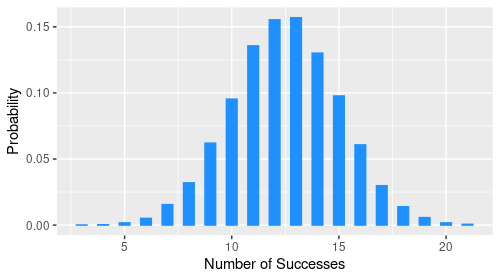

# Binomial Distribution

  { width="200" .center }

Consider $n$ independent trials where the outcome of each trial is either a success with probability $p$, or a failure with probability $1-p$. The number of successes in $n$ independent trials is described by a **binomial distribution** with two parameters $n$ and $p$. We denote it by $\mathrm{Binom}(n,p)$.

## From Coin Tosses to the PMF

  { width="400" .center }

Suppose we toss a coin $n$ times with the probability of getting a head $\mathbf{P}(\text{H})=p$ and, hence, the probability of getting a tail $\mathbf{P}(\text{T})=1-p$. We assume that the tosses are *independent*, i.e., the outcome of previous tosses does not affect subsequent tosses. What is the probability of getting $k$ heads?

Before we proceed, we consider the specific case $n=6$ and compute the probability of getting the sequence $\text{HTHHTH}$. We use the multiplication principle — and, shortly, the binomial coefficient — both of which are derived in [Counting Principles](../part-01-mathematical-foundations/02-counting-principles.md). This gives

$$\mathbf{P}(\text{HTHHTH})=p\cdot(1-p)\cdot p\cdot p\cdot(1-p)\cdot p=p^4(1-p)^2.$$

To compute for the probability of getting **any** sequence with $4$ heads, we have to multiply the above expression with the number of $4$-head sequences. This is just the same as number of $4$-element subsets taken from a set with $6$ elements, i.e., $\binom{6}{4}$. Therefore, the probability of getting $4$ heads in $6$ coin tosses is

$$\mathbf{P}(4\;\text{heads})=\binom{6}{4}p^4(1-p)^{6-4}.$$

Generalizing this result, the probability of getting $k$ heads in $n$ coin tosses is

$$\mathbf{P}(k\;\text{heads})=\binom{n}{k}p^k(1-p)^{n-k}.$$

## Probability Mass Function

The probability mass function of a binomial distribution is given by

$$p_X(k)=\binom{n}{k}p^k(1-p)^{n-k}$$

where $k=0,1,2,\ldots,n.$

## Expectation

The expectation of a binomial distribution is

$$\mathbb{E}[X]=np.$$

??? note "Proof"
    $$\begin{align}
    \mathbb{E}[X]&=\sum_{k=0}^{n}k\binom{n}{k}p^k(1-p)^{n-k}\\
    &=\sum_{k=1}^{n}k\,\dfrac{n!}{k!(n-k)!}p^k(1-p)^{n-k}\\
    &=\sum_{k=1}^{n}\dfrac{n!}{(k-1)!(n-k)!}p^k(1-p)^{n-k}\\
    &=np\sum_{k=1}^{n}\dfrac{(n-1)!}{(k-1)!(n-k)!}p^{k-1}(1-p)^{n-k}.
    \end{align}$$

    We let $k=j+1$ so that

    $$\mathbb{E}[X]=np\sum_{j=0}^{n-1}\dfrac{(n-1)!}{j!(n-1-j)!}p^j(1-p)^{n-1-j}.$$

    Now, from the binomial expansion formula, we have

    $$(a+b)^{n-1}=\sum_{i=0}^{n-1}\dfrac{(n-1)!}{i!(n-1-i)!}\,a^{i}b^{n-1-i}$$

    so that

    $$\begin{align}
    \mathbb{E}[X]&=np\left[p+(1-p)\right]^{n-1}\\
    &=np.
    \end{align}$$

### Simpler Calculation

A simpler way to calculate the expectation of a binomial random variable is to realize that it is the sum of $n$ independent Bernoulli random variables, each with parameter $p$, i.e.,

$$X=X_1+\ldots+X_n$$

so that, by linearity,

$$\begin{align}
\mathbb{E}[X]&=\mathbb{E}[X_1]+\ldots+\mathbb{E}[X_n]\\
&=p+\ldots+p\\
&=np.
\end{align}$$

## Variance

The variance of a binomial distribution is

$$\mathrm{var}(X)=np(1-p).$$

??? note "Proof"
     To calculate the variance, we have

    $$\begin{align}
    \mathrm{var}(X)&=\mathrm{var}(X_1+\ldots+X_n)\\
    &=\mathrm{var}(X_1)+\ldots+\mathrm{var}(X_n)\\
    &=p(1-p)+\ldots+p(1-p)\\
    &=np(1-p).
    \end{align}$$

## Monte Carlo Simulation

We can simulate a binomial distribution by tossing a coin ```n``` times. For each toss, if a head comes up, we'll call it a success and map it to ```1```. Otherwise, it's a failure and map it to ```0```. The probability of success is ```p```. After ```n``` trials, we will count the number of successes. We will replicate this ```10000``` times and calculate the proportion of replications with ```k``` successes. Finally, we plot the resulting distribution. The code below is an implementation of this in ```R```.

```r
library(tidyverse)

n <- 25        # number of trials
p <- 0.5       # probability of success
reps <- 10000  # number of replications

num_success <- replicate(reps, {
  trials <- sample(c(0, 1), size = n, replace = TRUE, prob = c(1-p, p))
  sum(trials)
})

# Plot the number of success versus the proportion of replications
data.frame(num_success) %>%
  ggplot(aes(num_success)) +
  geom_bar(aes(y = ..prop..)) +
  labs(x = "Number of Successes", y = "Probability")
```

  { width="500" .center }
