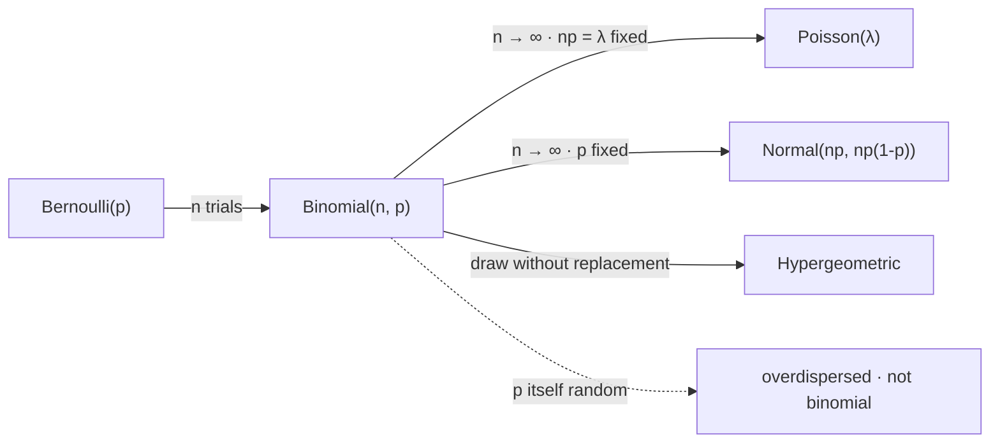

# Binomial Distribution

The binomial's mean survives any amount of dependence between the trials, and its variance survives none. Both numbers are normally quoted in the same breath as the phrase *$n$ independent trials*, which conceals the fact that only one of them is actually using the assumption — and it is the one every significance test is built out of.

This page covers the mass function assembled from a count of sequences, the mean by linearity and the variance by independence, the two limits the family exits through, the normal approximation and the regime where it stops working, what happens to the count when the trials share a common factor, and the hit rate the best of a thousand worthless strategies will report. It does not cover the single trial, which is [Bernoulli Distribution](01-bernoulli-distribution.md); it does not cover sampling from a finite population without replacement, which is [Hypergeometric Distribution](05-hypergeometric-distribution.md); and it proves neither of the two limit theorems it invokes — the rare-event limit is [Poisson Distribution](06-poisson-distribution.md) and the central limit theorem is [Part VII](../part-07-asymptotic-theory/index.md).

The trading stake is a number that looks like an edge and is not. A thousand strategies with no predictive power at all, each evaluated on $250$ trades, will produce a best hit rate near $60\%$ — comfortably ahead of a genuine $55\%$ signal, and produced entirely by the binomial spread of a coin flip. [Validation and Overfitting](../../part-04-strategy-development/08-validation-and-overfitting.md) is written against exactly this arithmetic.

## Counting the Sequences

Fix $n$ trials, each succeeding with probability $p$, and let $X$ count the successes. Any *particular* sequence with $k$ successes has probability $p^k(1-p)^{n-k}$, because independence lets the per-trial probabilities multiply and the exponents only record how many of each kind appeared. The order in which they appeared has dropped out entirely, so every sequence with the same $k$ carries the same probability, and the total mass at $k$ is that common value times the number of such sequences,

$$p_X(k)=\binom{n}{k}p^k(1-p)^{n-k},\qquad k=0,1,\ldots,n.$$

The binomial coefficient counts the ways of choosing which $k$ of the $n$ trials succeeded, which is the number of $k$-element subsets of an $n$-element set — the object built in [Counting Principles](../part-01-mathematical-foundations/02-counting-principles.md). Two separate facts have been used and it is worth keeping them apart: independence gave the product, and combinatorics gave the multiplicity.

??? note "Proof that the binomial probabilities sum to one for combinatorial rather than analytic reasons"
    The binomial theorem states that for any reals $a,b$ and integer $n\ge0$,

    $$(a+b)^n=\sum_{k=0}^{n}\binom{n}{k}a^k b^{n-k},$$

    and it is proved by expanding the product $(a+b)(a+b)\cdots(a+b)$ and asking how many of the $2^n$ terms contribute $a^kb^{n-k}$: exactly the number of ways to pick which $k$ factors donated an $a$, which is $\binom{n}{k}$. Setting $a=p$ and $b=1-p$ makes the left side $1^n=1$ and the right side the total binomial mass, so the probabilities sum to one.

    The route matters more than the result. Nothing analytic was used — no series converged, no limit was taken, no property of $p$ beyond $a+b=1$. The identity is a statement about counting subsets that happens to be evaluated at a probability, so it holds exactly, at every $n$, with no error term. Compare [Poisson Distribution](06-poisson-distribution.md), whose masses sum to one because the exponential series converges, which is a genuinely analytic fact and carries the approximation error that the Poisson limit theorem then has to control.

## The Mean Needs Nothing, the Variance Needs Independence

Write $X=X_1+\cdots+X_n$ as a sum of indicators, one per trial. The mean is immediate and it is immediate for a reason worth naming.

$$\mathbb{E}[X]=\sum_{i=1}^{n}\mathbb{E}[X_i]=np.$$

The variance is not a sum in general. Expanding the square of the centred sum produces $n$ diagonal terms and $n(n-1)$ cross terms, and only the vanishing of the latter delivers the familiar answer,

$$\mathrm{var}(X)=\sum_{i}\mathrm{var}(X_i)+\sum_{i\ne j}\mathrm{cov}(X_i,X_j)=np(1-p)+n(n-1)\bar\rho\,p(1-p),$$

where $\bar\rho$ is the average pairwise correlation of the indicators. The textbook $np(1-p)$ is the special case $\bar\rho=0$.

??? note "Proof that the mean survives arbitrary dependence between the trials"
    Linearity of expectation, established in [Expected Value](../part-04-expectation-and-moments/01-expected-value.md), requires only that each $\mathbb{E}[X_i]$ exists. It requires nothing about the joint law of $(X_1,\ldots,X_n)$ — not independence, not exchangeability, not even that the joint law be specified. Each indicator has mean $p$ whatever the others are doing, so the sum has mean $np$.

    The statement is stronger than it looks. Let the trials be perfectly dependent, $X_1=X_2=\cdots=X_n$: then $X$ is $n$ with probability $p$ and $0$ otherwise, its mean is still $np$, and its distribution is not remotely binomial. So $\mathbb{E}[X]=np$ identifies nothing about the law; it is compatible with a two-point distribution at the extremes and with the binomial in between.

    This is why $np$ is the safe half of the pair. Anything that consumes only the mean of a count — an expected number of breaches, an expected trade count, a budget for commissions — is robust to whatever correlation the trials actually have. Anything that consumes the spread is not, and the next proof is where the assumption gets spent.

??? note "Proof that the count's variance is np(1-p) only when the indicators are uncorrelated"
    For indicators, $\mathrm{cov}(X_i,X_j)=\mathbf{P}(A_i\cap A_j)-p^2$, so the cross terms vanish exactly when the pairwise joint probabilities factor. Full independence is sufficient and far more than necessary — pairwise uncorrelatedness is the whole requirement, and [Covariance](../part-04-expectation-and-moments/04-covariance.md) shows those are different conditions.

    Writing $\bar\rho$ for the average pairwise correlation, the double sum collapses to $\mathrm{var}(X)=np(1-p)\big[1+(n-1)\bar\rho\big]$. The bracket is the entire content of the independence assumption, and note how it scales: the correction carries a factor $n-1$, so a correlation far too small to detect in any pair still multiplies the variance by a large number once $n$ is large. At $n=250$ and $\bar\rho=0.05$ the bracket is $13.45$.

    The load-bearing hypothesis is therefore not independence but the smallness of $n\bar\rho$, and that product is what a real trade sequence violates. Overlapping holding periods, a shared market factor, and a signal that persists across days all make consecutive trades correlated, and none of them touch the mean.

## Sums, Limits, and the Family's Two Exits

Two binomials on the same $p$ add: if $X\sim\mathrm{Binom}(m,p)$ and $Y\sim\mathrm{Binom}(n,p)$ are independent, then $X+Y\sim\mathrm{Binom}(m+n,p)$, because concatenating $m$ trials with $n$ more trials is $m+n$ trials. The family is closed under addition in $n$ and in nothing else — two binomials with different $p$ do not add to a binomial, which is why a book of strategies with different hit rates has no binomial trade count.



The two solid exits on the right are the same limit taken along different paths, and which one you land on is decided by what happens to $np(1-p)$. Hold $np$ fixed and the spread stays bounded, the count stays lumpy and integer-flavoured, and the limit is Poisson. Hold $p$ fixed and $np(1-p)$ grows without bound, the distribution smooths out, and the limit is normal. The dashed branch is the one that leaves the family altogether: let $p$ vary between blocks and the count is overdispersed, with a variance the binomial has no parameter to express.

## The Normal Approximation and Where It Breaks

The count is a sum of $n$ independent terms, so a central limit theorem applies and $X$ is approximately normal with mean $np$ and variance $np(1-p)$. The approximation is used constantly and it is graded by a single quantity.

```python
import numpy as np
from scipy.stats import binom, norm

print("  P(X >= k) at a matched tail depth of 2.5 standard deviations")
print("        n       p   np(1-p)    skew    k       exact      normal    ratio")
for n, p in ((250, 0.500), (6410, 0.020), (250, 0.100), (250, 0.020), (250, 0.001)):
    v = n * p * (1 - p)
    mu, sd = n * p, np.sqrt(v)
    k = int(np.ceil(mu + 2.5 * sd))                            # same z for every row
    exact = binom.sf(k - 1, n, p)
    approx = norm.sf((k - 0.5 - mu) / sd)                      # continuity-corrected
    print(f"  {n:7d}  {p:6.3f} {v:8.2f} {(1 - 2 * p) / sd:8.3f} {k:5d}"
          f"  {exact:10.6f}  {approx:10.6f} {approx / exact:8.2f}")
# =>   P(X >= k) at a matched tail depth of 2.5 standard deviations
#            n       p   np(1-p)    skew    k       exact      normal    ratio
#          250   0.500    62.50    0.000   145    0.006741    0.006821     1.01
#         6410   0.020   125.64    0.086   157    0.007042    0.005788     0.82
#          250   0.100    22.50    0.169    37    0.010403    0.007667     0.74
#          250   0.020     4.90    0.434    11    0.012795    0.006484     0.51
#          250   0.001     0.25    1.997     2    0.026426    0.006188     0.23
```

Every row asks the same question at the same depth — $2.5$ standard deviations into the upper tail — so the ratio column is comparable across rows, and it is ordered perfectly by the skew column and by nothing else. At $p=0.5$ the count is symmetric, the skew is exactly zero, and the approximation is right to $1\%$. As the skew climbs the ratio falls monotonically: $0.086\to0.82$, $0.169\to0.74$, $0.434\to0.51$, and at $np(1-p)=0.25$ the normal reports a quarter of the true probability.

What the ordering shows is that $n$ is not the governing quantity. The $6410$-trial row has a smaller skew than the $250$-trial row at $p=0.1$ and approximates better, but it gets there through $np(1-p)=125.64$ rather than through $n$, and a large $n$ with a small enough $p$ lands anywhere on the ladder. The skewness $(1-2p)/\sqrt{np(1-p)}$ is the leading correction term in the expansion of the true distribution around the normal, which is why it grades the error, and why the error always appears in the tail before it appears anywhere else.

!!! warning "A normal approximation to a rare-event count is wrong in the direction that makes a risk number look safe"
    For $p<1/2$ the count is right-skewed, so the normal understates the upper tail — the probability of an unusually *large* number of breaches, stop-outs, or limit violations. A daily limit breached with probability $0.02$ over $250$ days is exactly this regime: the true chance of eleven or more breaches is $1.28\%$ and the normal approximation reports $0.65\%$, so a desk sizing a buffer from it is working with half the risk it has. The correct object at fixed $np$ is [Poisson Distribution](06-poisson-distribution.md), and if the breaches cluster then even the Poisson understates it, which is [Negative Binomial Distribution](04-negative-binomial-distribution.md).

## Correlated Trials Overdisperse the Count

Let the hit rate itself vary between blocks — a strategy that works in trending regimes and not otherwise — by drawing $P$ from a beta law with mean $p$ and then drawing the count from $\mathrm{Binom}(n,P)$. The pairwise correlation induced is $\bar\rho=1/(a+b+1)$, and the resulting count has the variance the previous proof predicted.

```python
import numpy as np

rng = np.random.default_rng(23)
n, p, reps = 250, 0.34, 400_000                                # 250 trades at the sleeve's rate
print("  count variance when the hit rate itself moves between blocks")
print("      rho     mean    var    binomial   inflation   n_eff")
for rho in (0.0, 0.01, 0.05, 0.20):
    if rho == 0.0:
        x = rng.binomial(n, p, reps)
    else:
        s = 1.0 / rho - 1.0                                    # a + b, from rho = 1/(a+b+1)
        x = rng.binomial(n, rng.beta(p * s, (1 - p) * s, reps))
    base = n * p * (1 - p)
    print(f"    {rho:5.2f} {x.mean():8.2f} {x.var():8.1f} {base:9.1f}"
          f" {x.var() / base:10.2f} {n / (1 + (n - 1) * rho):8.1f}")
# =>   count variance when the hit rate itself moves between blocks
#          rho     mean    var    binomial   inflation   n_eff
#         0.00    84.98     56.0      56.1       1.00    250.0
#         0.01    84.98    196.4      56.1       3.50     71.6
#         0.05    85.06    752.5      56.1      13.41     18.6
#         0.20    85.10   2848.1      56.1      50.77      4.9
```

The mean column does not move. That is the first proof, printed: whatever correlation is introduced, the expected number of wins stays at $np=85$, and any calculation that stops at the mean is untouched. Every other column moves violently. At $\bar\rho=0.05$ — a correlation between two trades so small that no pairwise test on real data would ever reject zero — the variance is thirteen times the binomial value, and the $250$ trades carry as much information as about $19$ independent ones.

!!! note "An effective sample size of 19 is what a hit rate computed on 250 correlated trades is actually worth"
    The last column is $n/[1+(n-1)\bar\rho]$, the number of independent trials that would carry the same variance. It falls off a cliff: at $\bar\rho=0.20$ the two hundred and fifty trades are worth five. Every standard error, $t$-statistic, and $p$-value computed from a trade sequence inherits this factor, and computing it requires an estimate of $\bar\rho$ that the backtest usually does not produce. This is the same failure [Variance](../part-04-expectation-and-moments/02-variance.md) describes for the $\sqrt{T}$ scaling of volatility, arriving through a different door, and it is why [Validation and Overfitting](../../part-04-strategy-development/08-validation-and-overfitting.md) resamples blocks rather than individual trades.

## The Best of a Thousand Coin Flips

The reason the binomial belongs in a chapter about backtests is not that it models a strategy. It is that it models the *search*.

```python
import numpy as np
from scipy.stats import binom

rng = np.random.default_rng(29)
n, m, reps = 250, 1000, 5000                                   # 250 trades, 1000 candidates
best = rng.binomial(n, 0.50, (reps, m)).max(axis=1) / n
print(f"  {m} strategies with no edge at all, {n} trades each, true rate 0.500")
for q in (0.05, 0.50, 0.95):
    print(f"    quantile {q:4.2f} of the best hit rate found   {np.quantile(best, q):.4f}")
print(f"  a single strategy's own 95th percentile        "
      f"  {binom.ppf(0.95, n, 0.50) / n:.4f}")
med = np.median(best)
print(f"  P(a genuine 55% strategy beats that median best fluke)"
      f"   {binom.sf(med * n - 1, n, 0.55):.3f}")
print(f"  trades needed before a 55% edge clears it reliably   "
      f"  {min(k for k in range(250, 40_000, 50) if binom.sf(binom.ppf(1 - 1 / m, k, 0.50), k, 0.55) > 0.95)}")
# =>   1000 strategies with no edge at all, 250 trades each, true rate 0.500
#        quantile 0.05 of the best hit rate found   0.5880
#        quantile 0.50 of the best hit rate found   0.6000
#        quantile 0.95 of the best hit rate found   0.6200
#      a single strategy's own 95th percentile          0.5520
#      P(a genuine 55% strategy beats that median best fluke)   0.063
#      trades needed before a 55% edge clears it reliably     2250
```

A single worthless strategy exceeds $55.2\%$ only one time in twenty, which is the number a naive significance test is built around. Search a thousand of them and the *best* one reports $60\%$, with the middle nine-tenths of that best-of landing between $58.8\%$ and $62\%$. Nothing in the search was dishonest and no strategy was fitted to anything — the figure is a pure order statistic of a coin flip. Against it, a genuinely skilled $55\%$ strategy measured on the same $250$ trades wins only $6.3\%$ of the time: the search beats real skill roughly fifteen times out of sixteen. Restoring the true edge to a reliable win over the best fluke takes about $2{,}250$ trades, nine times the sample the comparison was originally run on.

## What a Winning Streak Proves

The same arithmetic disposes of the streak, which is the anecdotal form of the same error. In $n$ fair flips the longest run of successes is close to $\log_2 n$, so $250$ trades produce an eight-win streak as a matter of course, and the waiting-time law behind that estimate is [Geometric Distribution](03-geometric-distribution.md). A trader with eight straight wins has produced the modal outcome of no skill whatever.

What ties the three sections together is that each one is a question about the tail of a count, and each one is answered by a spread rather than by a centre. The mean of the count told us nothing in any of them: it was $np$ under dependence, $np$ under overdispersion, and $np$ for every one of the thousand searched strategies. All the information was in $\mathrm{var}(X)$, and $\mathrm{var}(X)$ is precisely the quantity that the independence assumption was silently spent on.

So the practical rule is to distrust any binomial calculation in proportion to how much of the answer comes from the second moment. An expected trade count is safe. A standard error on a hit rate is only as good as the estimate of $\bar\rho$ standing behind it, which is usually no estimate at all. And a $p$-value on the best of a searched set is not a small number that got lucky — it is the wrong distribution, because the object being tested is a maximum and the null being used is a single draw. Correcting that is [Part XV](../part-15-multiple-testing/index.md).
