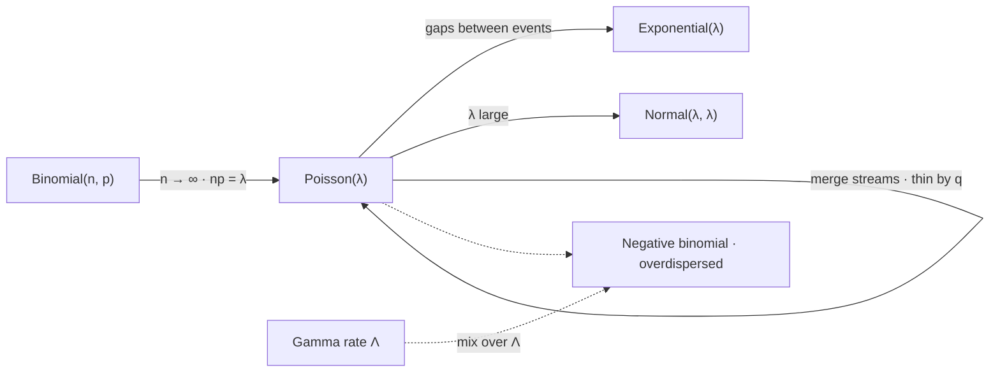

# The Poisson Distribution

The Poisson is the only law in common use whose mean and variance are forced to be the same number. That single constraint is what makes it the default model for counting anything, and it is also what makes it the easiest model in this part to refute: one division, on data anybody already has, and the claim either survives or does not. On market counts it does not survive, and the direction of the failure is always the same.

This page covers the rare-event limit that produces the family from the binomial, the mass function and the analytic rather than combinatorial reason it sums to one, the equality of mean and variance, additivity under superposition and thinning, the equivalence between Poisson counts and exponential gaps, and the diagnostic that a real arrival series fails. It does not cover the two-parameter repair that absorbs the failure, which is [Negative Binomial Distribution](04-negative-binomial-distribution.md); it does not develop the density of the gaps, which is [Exponential Distribution](10-exponential-distribution.md); and it does not construct the process in continuous time, which is [Part VIII](../part-08-stochastic-processes/index.md).

The trading stake is that order arrivals, fills, limit breaches, and jumps are all counted by systems that assume a Poisson and therefore assume that a burst is impossible. [Market Microstructure](../../part-01-foundations/03-market-microstructure.md) describes the arrivals; [Probability Mass Functions](../part-03-random-variables/03-probability-mass-functions.md) argues that such quantities are genuinely count-like rather than approximately so. Both are right, and neither implies the counts are Poisson — the fifth section below measures the gap and the sixth explains it.

## The Limit of Rare Trials

Take a binomial with many trials and a small success probability, holding the expected count fixed at $\lambda=np$ as $n$ grows. Individual trials become negligible, the number of them becomes irrelevant, and what survives in the limit is a law parameterised by the expected count alone,

$$p_X(k)=\frac{\lambda^{k}e^{-\lambda}}{k!},\qquad k=0,1,2,\ldots$$

This is the sense in which the Poisson is the law of rare events: not that $\lambda$ is small, but that each of the many opportunities for an event is individually unlikely. A trading day offers millions of microseconds in which an order might arrive and a handful in which one does.

??? note "Proof that the binomial converges to the Poisson at fixed np"
    Fix $k$ and write $p=\lambda/n$. The binomial mass is

    $$\binom{n}{k}p^{k}(1-p)^{n-k}=\frac{n(n-1)\cdots(n-k+1)}{k!}\cdot\frac{\lambda^{k}}{n^{k}}\cdot\Big(1-\frac{\lambda}{n}\Big)^{n}\Big(1-\frac{\lambda}{n}\Big)^{-k}.$$

    Take the three groups in turn. The falling factorial over $n^k$ is a product of $k$ terms each tending to $1$, since $k$ is held fixed while $n$ grows. The middle factor $(1-\lambda/n)^n$ tends to $e^{-\lambda}$ by the defining limit of the exponential. The last factor tends to $1$ for the same reason as the first. What is left is $\lambda^k e^{-\lambda}/k!$.

    The hypothesis that is load-bearing is that $k$ stays fixed while $n$ grows — the convergence is pointwise in $k$, and it is not uniform far out in the tail. That is exactly the regime where [Binomial Distribution](02-binomial-distribution.md) found the normal approximation failing too, and for the same underlying reason: the three approximations to a count agree near the mean and disagree about the tail, which is the only place a risk calculation ever looks.

The masses sum to one because $\sum_k\lambda^k/k!=e^{\lambda}$, which is the exponential series — a genuinely analytic fact, converging for every real $\lambda$, and the reason [Sequences and Infinite Series](../part-01-mathematical-foundations/04-sequences-and-series.md) is a prerequisite here where [Counting Principles](../part-01-mathematical-foundations/02-counting-principles.md) was one for the binomial. The contrast is worth keeping: the binomial's normalisation is a finite identity about subsets and is exact by construction; the Poisson's is a limit, and the family carries an approximation error the binomial never had.

## Mean and Variance Are the Same Number

$$\mathbb{E}[X]=\lambda,\qquad \mathrm{var}(X)=\lambda.$$

??? note "Proof that both moments equal λ, via the factorial moment"
    The factor $k$ cancels against the $k!$, which is the trick the whole family rewards. For the mean,

    $$\mathbb{E}[X]=\sum_{k\ge1}k\,\frac{\lambda^{k}e^{-\lambda}}{k!}=\lambda e^{-\lambda}\sum_{k\ge1}\frac{\lambda^{k-1}}{(k-1)!}=\lambda e^{-\lambda}e^{\lambda}=\lambda.$$

    The same manoeuvre applied to $X(X-1)$ cancels two factors and gives $\mathbb{E}[X(X-1)]=\lambda^{2}$ directly. Then $\mathbb{E}[X^{2}]=\lambda^{2}+\lambda$ and $\mathrm{var}(X)=\lambda^{2}+\lambda-\lambda^{2}=\lambda$.

    The equality is not a coincidence to be admired but a consequence of having one parameter. A one-parameter family on the non-negative integers cannot set its centre and its spread separately, so *some* relation between them is forced; the Poisson's is that they coincide. This is the constraint [Negative Binomial Distribution](04-negative-binomial-distribution.md) buys its way out of, and the price is exactly one extra parameter.

Equidispersion has a consequence that is easy to state and easy to check. The coefficient of variation is $1/\sqrt{\lambda}$, so counts become *relatively* more predictable as they grow: a hundred expected fills a day arrive with a $10\%$ relative spread, ten thousand with a $1\%$ spread. Any claim that a large count is erratic in relative terms is a claim that it is not Poisson.

## Sums and Thinning

The family is closed in both directions, and neither closure needs a calculation about mass functions.

$$X\sim\mathrm{Pois}(\lambda_1),\ Y\sim\mathrm{Pois}(\lambda_2)\ \text{independent}\ \Longrightarrow\ X+Y\sim\mathrm{Pois}(\lambda_1+\lambda_2).$$

Superposition: merging two independent Poisson streams gives a Poisson stream at the summed rate. Thinning: keeping each event of a $\mathrm{Pois}(\lambda)$ stream independently with probability $q$ gives $\mathrm{Pois}(\lambda q)$, and the kept and discarded streams are independent of each other.

??? note "Proof of superposition and thinning, and of the independence thinning produces"
    For the sum, condition on $X$ and convolve:

    $$\mathbf{P}(X+Y=k)=\sum_{j=0}^{k}\frac{\lambda_1^{j}e^{-\lambda_1}}{j!}\cdot\frac{\lambda_2^{k-j}e^{-\lambda_2}}{(k-j)!}=\frac{e^{-(\lambda_1+\lambda_2)}}{k!}\sum_{j=0}^{k}\binom{k}{j}\lambda_1^{j}\lambda_2^{k-j},$$

    and the sum is $(\lambda_1+\lambda_2)^k$ by the binomial theorem — the same identity that normalised the binomial, reappearing to add two Poissons.

    For thinning, let $N\sim\mathrm{Pois}(\lambda)$ and let $K\mid N=n$ be $\mathrm{Binom}(n,q)$. Then

    $$\mathbf{P}(K=k,\,N-K=m)=\frac{\lambda^{k+m}e^{-\lambda}}{(k+m)!}\binom{k+m}{k}q^{k}(1-q)^{m}=\frac{(\lambda q)^{k}e^{-\lambda q}}{k!}\cdot\frac{(\lambda(1-q))^{m}e^{-\lambda(1-q)}}{m!},$$

    which factors into two Poisson masses. The factorisation *is* the independence, and it is genuinely surprising: $K$ and $N-K$ are conditionally dependent given $N$ — they must sum to it — yet unconditionally independent. That happens only because $N$ is Poisson, and it is the property that makes the family so convenient for splitting order flow by venue, side, or size, since each stream can then be modelled without reference to the others.

```python
import numpy as np
from scipy.stats import binom, poisson

lam = 4.0
k = np.arange(0, 60)
ref = poisson.pmf(k, lam)
print("  Binom(n, lam/n) converging to Pois(lam) at lam = 4")
print("        n     TV distance      P(X=0)   rel err    P(X>=12)   rel err")
for n in (8, 40, 400, 4000, 400_000):
    b = binom.pmf(k, n, lam / n)
    tail, ref_tail = b[12:].sum(), ref[12:].sum()
    print(f"  {n:8d} {0.5 * np.abs(b - ref).sum():13.6f} {b[0]:11.6f}"
          f" {b[0] / ref[0] - 1:9.2%} {tail:11.8f} {tail / ref_tail - 1:9.2%}")
print(f"  {'Poisson':>8} {0.0:13.6f} {ref[0]:11.6f} {0.0:9.2%}"
      f" {ref[12:].sum():11.8f} {0.0:9.2%}")
# =>   Binom(n, lam/n) converging to Pois(lam) at lam = 4
#            n     TV distance      P(X=0)   rel err    P(X>=12)   rel err
#             8      0.169090    0.003906   -78.67%  0.00000000  -100.00%
#            40      0.026453    0.014781   -19.30%  0.00038083   -58.39%
#           400      0.002520    0.017951    -1.99%  0.00084928    -7.21%
#          4000      0.000251    0.018279    -0.20%  0.00090851    -0.73%
#        400000      0.000003    0.018315    -0.00%  0.00091516    -0.01%
#       Poisson      0.000000    0.018316     0.00%  0.00091523     0.00%
```

Convergence is fast in aggregate and slower where it matters. By $n=400$ the total variation distance is a quarter of a percent, which would ordinarily be called excellent — but the two relative-error columns are not the same size. The mass at zero is $2\%$ low and the twelve-or-more tail is $7\%$ low, and it takes another factor of ten in $n$ to bring the tail inside a percent. That is the pointwise-in-$k$ caveat from the proof made visible: total variation averages the error over the whole support and so is dominated by the bulk, while a risk number reads one tail and gets the error that is still there when the bulk has settled. The last row is the limit each column is walking toward.

## The Gaps Between Events Are Exponential

Poisson counts and exponential gaps are two descriptions of one object, and the bridge between them is a single line of algebra: waiting longer than $t$ for the next arrival is the same event as counting zero arrivals in $[0,t]$.

$$\mathbf{P}(T>t)=\mathbf{P}\big(N(t)=0\big)=e^{-\lambda t}.$$

That is the exponential survival function, so $T\sim\mathrm{Exp}(\lambda)$. Read in reverse, independent exponential gaps generate Poisson counts. The two facts are equivalent, and the equivalence is why memorylessness — the defining property of the gaps, established discretely in [Geometric Distribution](03-geometric-distribution.md) — is the real content of the Poisson assumption. A Poisson arrival model says that the time since the last order carries no information about when the next one comes.



The solid arrows are all exact or limiting statements inside the family, and the loop is the closure of the previous section. The dashed pair is the exit, and it is the one this page ends on: the moment the rate stops being a constant, the count leaves the family and lands in a strictly larger one.

The block below runs the equivalence as an experiment. Nothing in it draws a Poisson variate — the process is built entirely from exponential waiting times, and the counts are read off afterwards by binning the arrival instants.

```python
import numpy as np
from scipy.stats import poisson

rng = np.random.default_rng(37)
lam, horizon = 4.0, 200_000                                    # rate per unit, units observed
gaps = rng.exponential(1 / lam, int(lam * horizon * 1.2))      # the process, built from gaps only
times = np.cumsum(gaps)
counts = np.bincount(times[times < horizon].astype(int), minlength=horizon)[:horizon]
print(f"  a process assembled from exponential gaps at rate {lam}, never from a count")
print(f"    counts per unit interval:  mean {counts.mean():.4f}"
      f"   var {counts.var():.4f}   var/mean {counts.var() / counts.mean():.4f}")
print("      k     observed      Pois(4)")
for kk in (0, 2, 4, 8, 12):
    print(f"    {kk:5d} {(counts == kk).mean():12.6f} {poisson.pmf(kk, lam):12.6f}")
# =>   a process assembled from exponential gaps at rate 4.0, never from a count
#        counts per unit interval:  mean 4.0002   var 3.9978   var/mean 0.9994
#          k     observed      Pois(4)
#            0     0.018295     0.018316
#            2     0.146400     0.146525
#            4     0.196455     0.195367
#            8     0.030015     0.029770
#           12     0.000600     0.000642
```

The counts come out Poisson to three decimal places across the whole range printed, and the dispersion ratio lands on $0.9994$. No Poisson variate was drawn anywhere in the block — only exponential gaps and a `bincount` — so the agreement is not a tautology but the equivalence doing work. It also means the two modelling assumptions are one assumption: choosing a Poisson for the counts *is* choosing memoryless gaps, whether or not the gaps were ever thought about.

## Equidispersion Is a Testable Claim

The ratio of sample variance to sample mean is the entire diagnostic. Under a Poisson it is one, up to sampling noise of order $\sqrt{2/m}$ on $m$ intervals; on clustered arrivals it is not close.

```python
import numpy as np
from scipy.stats import poisson

rng = np.random.default_rng(41)
m, base = 200_000, 4.0                                         # intervals observed, mean count
quiet, busy, pbusy = 2.0, 12.0, 0.20                           # a calm rate and a burst rate
regime = rng.random(m) < pbusy
rate = np.where(regime, busy, quiet)                           # same average, clustered in time
clustered = rng.poisson(rate)
plain = rng.poisson(base, m)
print(f"  two count series with the same long-run mean of {base}")
print("      series          mean       var    var/mean   P(N>=12)   Poisson says")
for name, s in (("homogeneous  ", plain), ("two-regime   ", clustered)):
    print(f"    {name} {s.mean():9.4f} {s.var():9.4f} {s.var() / s.mean():9.4f}"
          f" {(s >= 12).mean():11.5f} {poisson.sf(11, base):13.5f}")
print(f"  sampling noise on var/mean under a true Poisson: +/- {np.sqrt(2 / m):.4f}")
# =>   two count series with the same long-run mean of 4.0
#          series          mean       var    var/mean   P(N>=12)   Poisson says
#        homogeneous      3.9933    3.9926    0.9998     0.00097       0.00092
#        two-regime       3.9998   20.0632    5.0161     0.10765       0.00092
#      sampling noise on var/mean under a true Poisson: +/- 0.0032
```

Both series average four events per interval, so any report quoting only the rate calls them identical. The homogeneous series returns a dispersion ratio of $0.9998$, inside the $\pm0.0032$ of sampling noise the last line quantifies. The two-regime series returns $5.02$ — more than a thousand standard errors away, so the test is not delicate and does not need much data to fire.

The observed variance of $20.06$ is worth checking against the decomposition rather than just noting. The mixing law here has $\mathbb{E}[\Lambda]=4$ and $\mathrm{var}(\Lambda)=0.8\times0.2\times(12-2)^2=16$, so the next section's identity predicts $4+16=20$ exactly, and that is what came out. The consequence is in the last two columns: the true chance of twelve or more arrivals is $10.8\%$ and the Poisson reports $0.09\%$, understating the burst a capacity plan was sized to exclude by a factor of a hundred and seventeen.

!!! warning "A dispersion ratio is one line of code, and a Poisson assumption that has never been checked against it is an untested claim rather than a modelling convenience"
    The failure is one-directional. Mixing rates can only *raise* the variance relative to the mean, by the law of total variance decomposition in [Law of Total Variance](../part-04-expectation-and-moments/08-law-of-total-variance.md) — the within-regime variance is $\mathbb{E}[\Lambda]$ and the between-regime term adds $\mathrm{var}(\Lambda)$ on top, so $\mathrm{var}(N)=\mathbb{E}[\Lambda]+\mathrm{var}(\Lambda)\ge\mathbb{E}[N]$ always. There is no market mechanism that produces underdispersion and several that produce clustering, so a fitted Poisson is systematically optimistic about bursts and never pessimistic. Compute the ratio before the model, not after the incident.

## When the Rate Is Not Constant

The decomposition in that warning is the whole explanation, and it is worth writing out because it names precisely what a Poisson assumption is assuming:

$$\mathrm{var}(N)=\underbrace{\mathbb{E}\big[\mathrm{var}(N\mid\Lambda)\big]}_{\mathbb{E}[\Lambda]}+\underbrace{\mathrm{var}\big(\mathbb{E}[N\mid\Lambda]\big)}_{\mathrm{var}(\Lambda)}=\mathbb{E}[N]+\mathrm{var}(\Lambda).$$

A Poisson is the case $\mathrm{var}(\Lambda)=0$ — the rate is a known constant. Every departure from that adds to the variance and none subtracts, so equidispersion is not the typical case with clustering as an exception; it is the boundary of the possible, and real processes sit strictly inside. Giving $\Lambda$ a gamma law recovers the negative binomial exactly, which is the closed-form version of this decomposition.

## What the One Parameter Costs

The Poisson's single parameter is the source of everything good about it and of its one systematic failure, and the two are not separable. One parameter is why $\lambda$ estimates at rate $1/\sqrt{m}$ from nothing but a count total, why the family closes under merging and splitting, why the gaps come out exponential, and why the whole model can be carried in a person's head. One parameter is also why there is nowhere to put the fact that arrivals cluster.

So the family's honest role is the same one [Geometric Distribution](03-geometric-distribution.md) settled on: a null, not a model. It states exactly what "events arriving at a constant rate with no memory" would imply, in closed form, for free. The measurement is then the discrepancy — a dispersion ratio of three says the rate varies enough to triple the variance, and that number is an estimate of something real about the market rather than a diagnostic failure.

The practical rule follows from the direction of the error. Use the Poisson to compute an expected count, where it is robust and where the extra parameter would not help. Do not use it to compute the probability of a large count, because that is precisely the quantity its one parameter has no room to get right, and the error is always in the direction of reporting that the burst you are worried about cannot happen.
