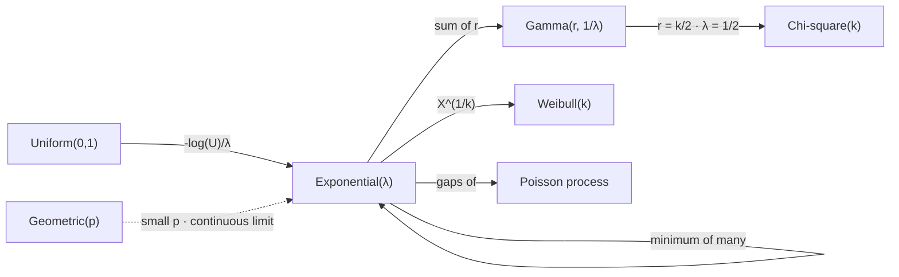

# Exponential Distribution

The exponential is the continuous law with no memory, and everything else about it is a restatement of that. Its hazard is constant, which is the claim that nothing ages: a position that has been open for an hour is no closer to being stopped out than one opened a minute ago, and a quiet market is no more overdue for a trade than a busy one. The claim is precise, it is testable on any duration series, and it is false on all of them — but knowing exactly how it fails is more informative than any fitted alternative.

This page covers the density and the two parameterisations that get confused, memorylessness as a characterisation of the family, the constant hazard that says the same thing in survival language, the minimum of independent exponentials and the surprising independence it produces, the sum that leaves the family, the maximum-entropy property that explains when the exponential is the honest choice, and the shape of the failure on real durations. It does not cover the discrete analogue, which is [Geometric Distribution](03-geometric-distribution.md); it does not develop the law of the sum, which is [Gamma Distribution](13-gamma-distribution.md); and it does not build the family whose hazard is allowed a shape, which is [Weibull Distribution](18-weibull-distribution.md).

The trading stake is that durations cluster. Trades arrive in bursts, regimes persist, and drawdowns that have lasted a year tend to last longer still — [Geometric Distribution](03-geometric-distribution.md) already found the discrete version of this, with an observed longest underwater spell of $2{,}294$ days against a memoryless prediction of $258$. The last section measures the same failure on a continuous duration and names its shape: the empirical hazard falls with age, and a constant-hazard model is therefore optimistic about long waits by a margin that grows the longer one waits.

## The Density and Its Two Parameterisations

$X$ is exponential with rate $\lambda>0$ when

$$f_X(x)=\lambda e^{-\lambda x},\qquad F_X(x)=1-e^{-\lambda x},\qquad \mathbf{P}(X>x)=e^{-\lambda x},\qquad x\ge0.$$

The survival function is the form to remember, because every property below is a statement about $e^{-\lambda x}$ and its one distinguishing feature: it is the unique function turning addition into multiplication.

$$\mathbb{E}[X]=\frac{1}{\lambda},\qquad \mathrm{var}(X)=\frac{1}{\lambda^{2}},\qquad \text{so the coefficient of variation is exactly }1.$$

That last equality is a free diagnostic. Any duration series whose sample standard deviation differs materially from its sample mean is not exponential, and no fitting is required to establish it.

The two parameterisations are rate $\lambda$ and scale $\theta=1/\lambda$, and the libraries disagree: `numpy`'s `exponential` and `scipy`'s `expon` both take the *scale*, while the density above and most textbooks are written in the *rate*. A factor of $\lambda^2$ in a variance is an easy error to make and a hard one to see, since both versions produce plausible-looking positive numbers.

## Memorylessness, Continuous Version

$$\mathbf{P}(X>s+t\mid X>s)=\frac{e^{-\lambda(s+t)}}{e^{-\lambda s}}=e^{-\lambda t}=\mathbf{P}(X>t).$$

The elapsed wait cancels, exactly as in the discrete case. And exactly as in the discrete case, the interesting statement is the converse.

??? note "Proof that the exponential is the only memoryless law on the positive reals"
    Let $G(x)=\mathbf{P}(X>x)$ and suppose $G(s+t)=G(s)G(t)$ for all $s,t\ge0$. This is the Cauchy functional equation in multiplicative form. Taking logarithms where $G>0$ and writing $h=\log G$ gives $h(s+t)=h(s)+h(t)$.

    On the rationals this forces $h(q)=qh(1)$ by induction — first for integers, then for reciprocals of integers, then for their products. Extending to the reals requires one more hypothesis, and monotonicity supplies it: $G$ is non-increasing because it is a survival function, so $h$ is non-increasing, and a non-increasing additive function agreeing with a linear one on a dense set agrees with it everywhere. Hence $h(x)=-\lambda x$ with $\lambda=-h(1)\ge0$, and $G(x)=e^{-\lambda x}$.

    The extra hypothesis is not a technicality that can be waved away, and this is the one place where the continuous argument is genuinely harder than the discrete one. Without monotonicity or measurability the Cauchy equation admits pathological solutions — everywhere-discontinuous additive functions, constructed from a Hamel basis — and the theorem is false. In the discrete case the rationals never entered and induction over the integers finished the job, which is why [Geometric Distribution](03-geometric-distribution.md) could prove its uniqueness theorem in four lines.

## The Hazard Is Constant, and That Is the Whole Assumption

The hazard rate of a positive random variable is the instantaneous failure rate given survival so far,

$$h(x)=\frac{f_X(x)}{\mathbf{P}(X>x)}=\frac{\lambda e^{-\lambda x}}{e^{-\lambda x}}=\lambda.$$

Constant, at every age. This is the most practically useful form of memorylessness, because it is what one actually measures: bin the durations by age, count how many end in each bin as a fraction of those still running, and plot. A flat plot is an exponential and a sloping one is not, and the direction of the slope names the failure.

| Hazard shape | Meaning | Family |
|---|---|---|
| constant | nothing ages; the wait is always starting over | exponential |
| increasing | ageing; the longer it has run, the sooner it ends | [Weibull](18-weibull-distribution.md) with $k>1$ |
| decreasing | entrenchment; the longer it has run, the longer it continues | Weibull with $k<1$, or a mixture of exponentials |

```python
import numpy as np

rng = np.random.default_rng(71)
lam = 1 / 50.0                                                 # mean wait of 50 units
x = rng.exponential(1 / lam, 4_000_000)
print(f"  Exp(rate = {lam}):  mean {x.mean():8.3f} (exact {1 / lam:.1f})"
      f"   sd {x.std():8.3f}   cv {x.std() / x.mean():.4f} (exact 1)")
print("      age reached   still running   P(50 more)   hazard over next unit")
for s in (0, 25, 50, 100, 200):
    alive = x[x > s]
    print(f"    {s:11d} {alive.size:15d} {(alive > s + 50).mean():13.4f}"
          f" {((alive <= s + 1).mean()):22.4f}")
print(f"  memoryless prediction, the same for every row:"
      f" {np.exp(-lam * 50):.4f} and {1 - np.exp(-lam):.4f}")
# =>   Exp(rate = 0.02):  mean   49.939 (exact 50.0)   sd   49.930   cv 0.9998 (exact 1)
#          age reached   still running   P(50 more)   hazard over next unit
#                  0         4000000        0.3673                 0.0198
#                 25         2424989        0.3674                 0.0199
#                 50         1469030        0.3675                 0.0199
#                100          539913        0.3678                 0.0196
#                200           72623        0.3696                 0.0199
#      memoryless prediction, the same for every row: 0.3679 and 0.0198
```

The two right-hand columns are flat while the population column falls by a factor of fifty-five. That is the discrete demonstration repeated in continuous time, and the reading is the same: conditioning on survival selects a drastically smaller group whose prospects are identical to a fresh start's.

## The Minimum of Independent Exponentials

Suppose several things could end a position — a stop, a target, a time exit, a risk override — and each would fire at an independent exponential time with its own rate. The first to fire is exponential at the summed rate,

$$\min(X_1,\ldots,X_m)\sim\mathrm{Exp}(\lambda_1+\cdots+\lambda_m),\qquad \mathbf{P}(X_j\ \text{is the minimum})=\frac{\lambda_j}{\sum_i\lambda_i}.$$

??? note "Proof that the minimum is exponential and that which risk fires is independent of when"
    The minimum exceeds $x$ exactly when every one of them does, so independence gives

    $$\mathbf{P}(\min_i X_i>x)=\prod_{i}e^{-\lambda_i x}=e^{-(\sum_i\lambda_i)x},$$

    which is the exponential survival function at the summed rate. This is the multiplicative property of $e^{-\lambda x}$ doing the work again, and it is why rates add: a book exposed to four independent hazards faces one hazard equal to their total.

    For the identity of the winner, condition on $X_j=x$ and require all others to exceed it:

    $$\mathbf{P}(X_j\ \text{smallest},\ X_j>t)=\int_{t}^{\infty}\lambda_je^{-\lambda_jx}\prod_{i\ne j}e^{-\lambda_ix}\,\mathrm{d}x=\frac{\lambda_j}{\sum_i\lambda_i}\,e^{-(\sum_i\lambda_i)t}.$$

    The right-hand side factors into a term depending only on $j$ and a term depending only on $t$. That factorisation *is* the independence: which risk materialises carries no information about when, and vice versa. The consequence is worth stating plainly, because it is usually assumed rather than known — under competing exponential risks, the mix of exit reasons observed in a sample is unrelated to the holding periods observed in that same sample, so conditioning on "trades that were stopped out" does not bias the duration distribution.

    That independence is a property of the exponential and of nothing else. Under any other duration law the winner and the winning time are dependent, and exit-reason-conditioned duration statistics are biased.

```python
import numpy as np

rng = np.random.default_rng(73)
rates = np.array([1 / 8.0, 1 / 20.0, 1 / 60.0])                # stop, target, time exit
names = ("stop", "target", "time")
draws = rng.exponential(1 / rates, (2_000_000, 3))
first, who = draws.min(axis=1), draws.argmin(axis=1)
print(f"  three competing exits at rates {np.round(rates, 4)}")
print(f"    time to first exit: mean {first.mean():.4f}"
      f"   exact {1 / rates.sum():.4f}   cv {first.std() / first.mean():.4f}")
print("      exit      share    exact     mean duration when it wins")
for j, nm in enumerate(names):
    sel = who == j
    print(f"    {nm:8s} {sel.mean():8.4f} {rates[j] / rates.sum():8.4f}"
          f" {first[sel].mean():21.4f}")
print(f"    unconditional mean duration {first.mean():27.4f}")
# =>   three competing exits at rates [0.125  0.05   0.0167]
#        time to first exit: mean 5.2156   exact 5.2174   cv 0.9992
#          exit      share    exact     mean duration when it wins
#        stop       0.6527   0.6522                5.2221
#        target     0.2607   0.2609                5.1986
#        time       0.0867   0.0870                5.2178
#        unconditional mean duration                      5.2156
```

Two things are printed here and the second is the surprising one. The time to first exit is exponential at the summed rate, so a book facing three hazards with mean waits of $8$, $20$ and $60$ faces an effective mean wait of $5.2$ — shorter than any individual hazard, because rates add and means do not. And the mean duration conditional on *which* exit fired is the same number for all three, matching the unconditional mean. Trades that hit their stop are not shorter than trades that hit their target, which under any other duration law they would be.

## Sums Are Gamma, and the Sum Is Where the Shape Comes From

Adding independent exponentials leaves the family immediately. The sum of $r$ of them at common rate $\lambda$ has density $\lambda^{r}x^{r-1}e^{-\lambda x}/(r-1)!$, which is $\mathrm{Gamma}(r,1/\lambda)$ and is developed in [Gamma Distribution](13-gamma-distribution.md).

The structural point is that the sum has a *shape* the summands lacked. An exponential density is maximal at zero and decreasing; a sum of two is zero at the origin, rises, and falls — it has a mode away from zero, because getting a small total requires both waits to be small and that is doubly unlikely. Memorylessness does not survive the addition, and the hazard of the sum is increasing rather than constant. So the one-parameter memoryless law sits at the boundary of a two-parameter family, and the second parameter is exactly the departure from memorylessness.



The loop at the exponential is the closure of the previous section, and it is the only self-loop anywhere in this part — no other family here is closed under taking minima. Every other arrow leaves, and the two that matter most for what follows are the sum, which produces a shape, and the power transform, which produces a hazard slope.

## Maximum Entropy Given a Mean

Among all densities on $[0,\infty)$ with a specified mean, the exponential has the largest entropy. This is the continuous counterpart of the discrete uniform's maximum-entropy property, with one constraint added.

??? note "Proof that the exponential maximises entropy on the half-line at a fixed mean"
    Let $f$ be any density on $[0,\infty)$ with $\int_0^\infty xf(x)\,\mathrm{d}x=1/\lambda$, and let $g(x)=\lambda e^{-\lambda x}$. The difference from the exponential's entropy is a Kullback–Leibler divergence,

    $$H(g)-H(f)=\int_0^\infty f\log\frac{f}{g}\,\mathrm{d}x\ \ge\ 0,$$

    where the middle step uses $\int f\log g=\int f(\log\lambda-\lambda x)=\log\lambda-1$, which depends on $f$ only through its mean — and the mean was fixed, which is why the constraint is exactly what makes the argument close. Non-negativity of the divergence is Jensen's inequality, as on [Discrete Uniform Distribution](08-discrete-uniform-distribution.md), with equality only when $f=g$.

    The interpretation is the useful part. Choosing an exponential is choosing to assume the average duration and nothing else. If that is genuinely all that is known, the choice is not merely convenient but optimal in a precise sense. The moment something further is known — that durations cluster, that the hazard slopes — the exponential is no longer the least committed law consistent with the evidence, and continuing to use it is an active assumption rather than an absence of one.

## Durations in Markets Are Not Exponential

The diagnostic is the hazard plot, and the failure has a characteristic shape.

```python
import numpy as np

rng = np.random.default_rng(79)
n = 2_000_000
fast, slow, w = 12.0, 120.0, 0.7                               # two regimes, same overall mean
x = np.where(rng.random(n) < w, rng.exponential(fast, n), rng.exponential(slow, n))
ref = rng.exponential(x.mean(), n)                             # a fitted exponential, same mean
print(f"  durations from a two-regime mixture, mean {x.mean():.2f},"
      f" cv {x.std() / x.mean():.3f} (exponential would be 1.000)")
width = 10.0                                                   # one bin width for every row
print(f"      age      still running     empirical hazard    fitted-exponential hazard")
for s in (0, 10, 30, 80, 200):
    alive, alive_r = x[x > s], ref[ref > s]
    print(f"    {s:7d} {alive.size:16d} {(alive <= s + width).mean() / width:20.5f}"
          f" {(alive_r <= s + width).mean() / width:24.5f}")
# =>   durations from a two-regime mixture, mean 44.39, cv 1.865 (exponential would be 1.000)
#          age      still running     empirical hazard    fitted-exponential hazard
#              0          2000000              0.04191                  0.02016
#             10          1161801              0.03342                  0.02013
#             30           582955              0.01761                  0.02021
#             80           310431              0.00832                  0.02019
#            200           113038              0.00808                  0.02016
```

The mixture's coefficient of variation is $1.865$, and the first section already noted that this alone rejects the family — no fitting, no test statistic, one division. The hazard columns then say how the rejection happens. Both are computed over the same fixed bin width, so they are directly comparable, and the fitted exponential's sits at $0.0202$ in every row, as a constant hazard must. The mixture's starts at twice that and falls to a third of it, a fivefold decline across the range. Early on, most survivors belong to the fast regime and end quickly; later, the fast ones have all finished and the survivors are the slow ones, which continue.

That selection effect is the mechanism behind every decreasing hazard in finance, and it does not require anything exotic. Two regimes with different speeds are sufficient, and no individual duration in this simulation has memory at all — each is drawn from a perfectly memoryless exponential. The memory lives in the *mixture*, exactly as the overdispersion of [Negative Binomial Distribution](04-negative-binomial-distribution.md) lived in a mixture of Poissons, and by exactly the same mechanism. That coefficient of variation has a second job once these durations are strung into a process: [Renewal Processes](../part-08-stochastic-processes/04-renewal-processes.md) shows that the gap an observer lands in by sampling the calendar averages $\mu(1+c^{2})$ rather than $\mu$, so at $c=1.865$ a duration measured by daily snapshots comes back more than four times the truth while both numbers are computed correctly.

!!! warning "A constant hazard fitted to a decreasing one is optimistic about long waits, and the error grows with the wait"
    The fitted exponential and the true mixture agree on the mean by construction, so any calculation stopping at the average is unaffected. Everything about the tail is wrong in one direction. By age $80$ the fitted model's hazard is two and a half times the truth, and it keeps predicting that the wait is about to end when it is not. Applied to a drawdown, this is the model that says recovery is imminent throughout a decade underwater; applied to a position, it is the risk system that expects a stop to fire and is still waiting. The repair is either an explicit mixture or a family with a hazard parameter, which is [Weibull Distribution](18-weibull-distribution.md).

So the exponential occupies the same position among continuous durations that the geometric holds among discrete ones and the Poisson holds among counts: it is the unique law expressing the absence of structure, which makes it the right null and a poor model. The three failures are the same failure — a mixture over an unobserved regime — and in each case the mixture's parameters are the interesting quantity while the base family supplies only the reference point.

The practical rule is to plot the hazard before fitting anything. It costs one line, it needs no likelihood and no optimiser, and it distinguishes the three cases in the table above immediately. A flat hazard licenses everything on this page; a sloping one tells you both that the exponential is wrong and which direction the correction goes, which is more than a goodness-of-fit statistic would have told you and considerably more than a fitted rate.
