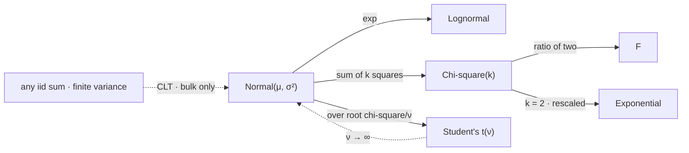

# The Gaussian Distribution

The normal distribution is right about the middle of a return series and wrong about the ends, and every number a risk system produces is about the ends. That is not a criticism of the family so much as a description of the trade it offers: in exchange for closure under addition, closure under linear maps, two sufficient parameters, and a limit theorem that makes it turn up unbidden, it fixes the tail at a decay rate that no financial series has ever exhibited.

This page covers the standard density and the constant that normalises it, the moments and the reason two of them suffice, closure under affine maps and under sums, the moment generating function that proves both closures at once, the tail scoreboard that measures the failure, and the two things the central limit theorem does not promise. It does not prove the central limit theorem, which is [Part VII](../part-07-asymptotic-theory/index.md); it does not cover the exponential of a normal, which is [Lognormal Distribution](12-lognormal-distribution.md); it does not build the heavy-tailed repair, which is [Student's t Distribution](16-students-t-distribution.md); and it treats no vector, so the multivariate normal is [Part VI](../part-06-multivariate-probability/index.md).

The trading stake is a single measured number. Daily index returns have an excess kurtosis of $11.41$ and a fitted Student-$t$ tail index of $\nu=2.65$, both reported in [Returns and Their Distributions](../../part-03-statistics/02-returns-and-distributions.md). A normal law has excess kurtosis zero by construction and no parameter that could take any other value. The fifth section turns that mismatch into a count of days.

## The Standard Normal and Its Constant

$Z$ is standard normal when its density is

$$f_Z(z)=\frac{1}{\sqrt{2\pi}}e^{-z^{2}/2},\qquad z\in\mathbb{R}.$$

The shape is $e^{-z^2/2}$ and everything else is bookkeeping, but the bookkeeping is not obvious: there is no elementary antiderivative of $e^{-z^2/2}$, so the constant cannot be found by integrating in the usual way.

??? note "Proof that the Gaussian integral equals the square root of 2π"
    Let $I=\int_{-\infty}^{\infty}e^{-z^{2}/2}\,\mathrm{d}z$. The trick is to compute $I^{2}$ instead, as a double integral over the plane:

    $$I^{2}=\int_{-\infty}^{\infty}\!\!\int_{-\infty}^{\infty}e^{-(x^{2}+y^{2})/2}\,\mathrm{d}x\,\mathrm{d}y.$$

    The integrand depends on $x$ and $y$ only through $x^{2}+y^{2}$, so switch to polar coordinates, where $x^{2}+y^{2}=r^{2}$ and the area element is $r\,\mathrm{d}r\,\mathrm{d}\theta$. The angular integral contributes $2\pi$, and the radial one is now elementary *because the Jacobian supplied the factor of $r$*:

    $$I^{2}=2\pi\int_{0}^{\infty}re^{-r^{2}/2}\,\mathrm{d}r=2\pi\Big[-e^{-r^{2}/2}\Big]_{0}^{\infty}=2\pi.$$

    So $I=\sqrt{2\pi}$, taking the positive root since the integrand is positive.

    The load-bearing step is the Jacobian, and it is worth dwelling on why. In one dimension $e^{-z^2/2}$ has no elementary antiderivative; in two dimensions the change to polar coordinates manufactures exactly the extra factor of $r$ that makes it integrable. The same machinery is the subject of [Change of Variables](../part-03-random-variables/09-change-of-variables.md), and this is the cleanest example in the book of a Jacobian doing something other than bookkeeping. It also explains why $\Phi$ has no closed form while its square over the plane does — a genuine asymmetry, not a failure of ingenuity.

The general member of the family is obtained by shifting and scaling: $X=\mu+\sigma Z$ has density

$$f_X(x)=\frac{1}{\sigma\sqrt{2\pi}}\exp\Big(-\frac{(x-\mu)^{2}}{2\sigma^{2}}\Big),\qquad \mathbb{E}[X]=\mu,\qquad \mathrm{var}(X)=\sigma^{2}.$$

Because every member arises this way, standardising — forming $Z=(X-\mu)/\sigma$ — is exactly the inverse operation, and it is the reason a single table of $\Phi$ serves the whole family.

## Every Moment, and the Two That Are Enough

All moments exist and all of them are determined by the first two. The odd central moments vanish by symmetry, and the even ones follow a double-factorial pattern:

$$\mathbb{E}\big[(X-\mu)^{2k}\big]=\sigma^{2k}(2k-1)!!=\sigma^{2k}\cdot 1\cdot3\cdot5\cdots(2k-1).$$

So the fourth central moment is $3\sigma^{4}$, which is the origin of the $-3$ in the definition of excess kurtosis: the normal is the reference point subtracted off, and [Higher-Order Moments](../part-04-expectation-and-moments/03-higher-order-moments.md) derives the convention rather than asserting it.

The important consequence is negative. Because every moment is a function of $\mu$ and $\sigma$, no amount of moment-matching can ever give a normal a heavier tail. Skewness is zero, excess kurtosis is zero, and there is no third parameter to adjust — a normal fitted to a return series is not a normal that has been asked to accommodate the tail and refused; it is a normal that has no mechanism for the question.

## Affine Maps and Sums Stay Normal

$$X\sim\mathcal{N}(\mu,\sigma^{2})\ \Longrightarrow\ aX+b\sim\mathcal{N}(a\mu+b,\ a^{2}\sigma^{2}).$$

The intercept appears in the mean and not in the variance. This is worth stating deliberately because it is the single most common slip in writing the result down, and because it is exactly the asymmetry [Variance](../part-04-expectation-and-moments/02-variance.md) established in general: a shift moves the centre and leaves the spread alone, while a scaling moves both, the variance quadratically.

??? note "Proof that an affine map of a normal is normal, with the intercept in the mean and not the variance"
    Let $Y=aX+b$ with $a\neq0$. The distribution function transforms by substitution: for $a>0$,

    $$F_Y(y)=\mathbf{P}\Big(X\le\frac{y-b}{a}\Big)=F_X\Big(\frac{y-b}{a}\Big),$$

    and differentiating gives $f_Y(y)=\frac{1}{\lvert a\rvert}f_X\big(\frac{y-b}{a}\big)$, the $\lvert a\rvert$ covering the case $a<0$ where the inequality reverses. Substituting the normal density,

    $$f_Y(y)=\frac{1}{\lvert a\rvert\sigma\sqrt{2\pi}}\exp\Big(-\frac{\big(\frac{y-b}{a}-\mu\big)^{2}}{2\sigma^{2}}\Big)=\frac{1}{\lvert a\rvert\sigma\sqrt{2\pi}}\exp\Big(-\frac{(y-b-a\mu)^{2}}{2a^{2}\sigma^{2}}\Big),$$

    where the inner bracket was multiplied through by $a$ and the $a^{2}$ absorbed into the denominator. That is the density of $\mathcal{N}(a\mu+b,\,a^{2}\sigma^{2})$ read off directly.

    Both features of the answer are visible in the algebra. The $b$ travels with $y$ inside the squared term, so it relocates the centre; the $a$ appears squared in the denominator and as $\lvert a\rvert$ in the normalising constant, so it rescales the spread and renormalises the height. A statement of this result that puts the mean at $a\mu$ has lost the shift, and the error is silent — the variance is still right, the shape is still right, and only the location is wrong, which is exactly the parameter a backtest is least able to detect.

Independent normals also add:

$$X_1\sim\mathcal{N}(\mu_1,\sigma_1^{2}),\ X_2\sim\mathcal{N}(\mu_2,\sigma_2^{2})\ \text{independent}\ \Longrightarrow\ X_1+X_2\sim\mathcal{N}(\mu_1+\mu_2,\ \sigma_1^{2}+\sigma_2^{2}).$$

These two closures together are what make the family so convenient: a portfolio is a linear combination of its holdings, and if the holdings are jointly normal the portfolio is normal with parameters available in closed form. No other family in this part offers both.

## The Moment Generating Function

$$M_X(t)=\mathbb{E}\big[e^{tX}\big]=\exp\Big(\mu t+\frac{\sigma^{2}t^{2}}{2}\Big),$$

finite for every real $t$ — a strong property that [Lognormal Distribution](12-lognormal-distribution.md) shows is easily lost.

??? note "Proof of the moment generating function, and of both closures as corollaries"
    Take $Z$ standard and complete the square in the exponent:

    $$\mathbb{E}[e^{tZ}]=\frac{1}{\sqrt{2\pi}}\int e^{tz-z^{2}/2}\,\mathrm{d}z=e^{t^{2}/2}\cdot\frac{1}{\sqrt{2\pi}}\int e^{-(z-t)^{2}/2}\,\mathrm{d}z=e^{t^{2}/2},$$

    since $tz-z^{2}/2=-\tfrac12(z-t)^{2}+\tfrac12t^{2}$ and the remaining integral is a normal density in $z$ centred at $t$, which integrates to one. For $X=\mu+\sigma Z$, $M_X(t)=e^{\mu t}M_Z(\sigma t)=\exp(\mu t+\sigma^{2}t^{2}/2)$.

    Both closures now follow in one line each, because an MGF determines a law uniquely. For an affine map, $M_{aX+b}(t)=e^{bt}M_X(at)=\exp\big((a\mu+b)t+a^{2}\sigma^{2}t^{2}/2\big)$ — the parameters of $\mathcal{N}(a\mu+b,a^{2}\sigma^{2})$, with the intercept landing in the linear term exactly as the density argument found. For a sum of independents, MGFs multiply, and $\exp(\mu_1t+\sigma_1^2t^2/2)\exp(\mu_2t+\sigma_2^2t^2/2)$ adds both parameters in the exponent.

    What makes this work is that the exponent is a *quadratic in $t$*, and the family of quadratics is closed under the operations above. That is the whole reason the normal is closed under addition while, say, the uniform is not: convolving two uniforms gives a triangular density because the corresponding transform is not closed. Finiteness of $M_X$ for all real $t$ is also what forces every moment to exist, since the moments are the coefficients of its Taylor expansion.

```python
import numpy as np
from scipy.stats import norm

rng = np.random.default_rng(83)
mu, sd = 0.0004, 0.011                                         # a day of index returns
x = rng.normal(mu, sd, 4_000_000)
print(f"  N(mu = {mu}, sigma = {sd}): central moments against the double factorial")
for k in (1, 2, 3, 4, 6):
    exact = 0.0 if k % 2 else sd ** k * np.prod(np.arange(1, k, 2))
    print(f"    order {k}:  sample {((x - mu) ** k).mean():13.6e}   exact {exact:13.6e}")
a, b = 250.0, -0.02                                            # annualize, then charge a fee
y = a * x + b
print(f"  affine map Y = {a}X + {b}")
print(f"    mean   sample {y.mean():9.5f}   a*mu + b {a * mu + b:9.5f}"
      f"   a*mu alone {a * mu:9.5f}  <- dropping b is the classic slip")
print(f"    sd     sample {y.std():9.5f}   |a|*sigma {abs(a) * sd:9.5f}")
# =>   N(mu = 0.0004, sigma = 0.011): central moments against the double factorial
#        order 1:  sample  1.695653e-06   exact  0.000000e+00
#        order 2:  sample  1.210652e-04   exact  1.210000e-04
#        order 3:  sample -4.823789e-10   exact  0.000000e+00
#        order 4:  sample  4.399186e-08   exact  4.392300e-08
#        order 6:  sample  2.668838e-11   exact  2.657341e-11
#      affine map Y = 250.0X + -0.02
#        mean   sample   0.08042   a*mu + b   0.08000   a*mu alone   0.10000  <- dropping b is the classic slip
#        sd     sample   2.75074   |a|*sigma   2.75000
```

The moment rows confirm that the odd orders vanish and the even ones follow $1,\,1\cdot3,\,1\cdot3\cdot5$ times the appropriate power of $\sigma$. The affine rows make the intercept visible: annualising a daily return and charging two percent gives a mean of $0.08$, and the version that drops $b$ reports $0.10$ — a twenty-five percent overstatement of expected return, from an error that leaves the volatility, the shape, and every diagnostic plot completely intact.



Every solid arrow out of the normal is a construction used later in this part, and the two dashed ones are the family's boundary. The $\nu\to\infty$ arrow says the $t$ contains the normal as a limiting case, so nothing is lost by working in the larger family. The CLT arrow is dashed for a different reason, and the sixth section is about what its dashes mean.

## What Φ Says and What Happened

The normal fixes tail probabilities at values that can be looked up and compared against a count of days.

```python
import numpy as np
from scipy.stats import norm, t

n, nu = 6410, 2.65                                             # 25 years of days, fitted index
scale = np.sqrt((nu - 2) / nu)                                 # rescale t to unit variance
print(f"  expected number of days beyond k sigma in {n} trading days")
print("      k     normal       t(2.65)     ratio    normal: one such day every")
for k in (2, 3, 4, 5, 6, 8):
    pn, pt = 2 * norm.sf(k), 2 * t.sf(k / scale, nu)
    print(f"    {k:3d} {pn * n:10.4f} {pt * n:12.4f} {pt / pn:10.3g}"
          f" {1 / (pn * 252):20.3g} years")
# =>   expected number of days beyond k sigma in 6410 trading days
#          k     normal       t(2.65)     ratio    normal: one such day every
#          2   291.6567     220.3385      0.755               0.0872 years
#          3    17.3057      81.8886       4.73                 1.47 years
#          4     0.4060      39.4180       97.1                 62.6 years
#          5     0.0037      22.1457   6.03e+03             6.92e+03 years
#          6     0.0000      13.7713   1.09e+06             2.01e+06 years
#          8     0.0000       6.4775   8.12e+11             3.19e+12 years
```

The scoreboard is the argument. At two standard deviations the normal actually expects *more* days than the $t$ — a heavy tail has to buy its extremes from somewhere, and it buys them from the shoulders — so anyone validating a model at the two-sigma level will find the normal fitting well or slightly conservatively. By four sigma the $t$ expects ninety-seven times as many days; by six, a million times as many.

The last column is why this is not an academic point. Under a normal law a four-sigma day is a once-in-sixty-year event and a six-sigma day is a once-in-two-million-year event. Markets produce both within the memory of people still working. That is not a run of bad luck against a correct model; it is the wrong model, and the scoreboard says by how much.

!!! warning "A Gaussian value-at-risk is a quantile of a distribution the data reject, and the rejection is strongest exactly where the number is read"
    The failure is not that the normal is approximate. It is that the approximation error is smallest in the region nobody asks about and largest in the region the whole calculation exists to describe. A $99\%$ VaR sits at $2.33$ standard deviations, where the table above shows the discrepancy still modest; a $99.9\%$ stress number sits past three, where it is not; and the loss that actually ends a fund sits further out still. Because every moment of a normal is fixed by $\mu$ and $\sigma$, no recalibration repairs this — the family has no parameter for it. Methods that parameterise the tail directly are the alternative, and the course's are [Heavy-Tailed Returns](../part-18-quant-finance-applications/13-heavy-tailed-returns.md) and [Extreme Value Theory](../part-18-quant-finance-applications/14-extreme-value-theory.md), with [Student's t Distribution](16-students-t-distribution.md) supplying the smallest one-parameter extension.

## The Central Limit Theorem's Two Silences

The usual defence of the normal is the central limit theorem: sums of many independent contributions are approximately normal, and a daily return is a sum of many trades. The theorem is true and the defence is weaker than it looks, for two reasons that the code below separates.

```python
import numpy as np
from scipy.stats import norm

rng = np.random.default_rng(89)
nu, reps = 2.65, 400_000
print(f"  standardized means of n iid t({nu}) draws, against the normal they converge to")
print("       n    P(|Z| > 3)     normal    ratio    P(|Z| > 5)     normal    ratio")
for n in (1, 10, 100, 1000):
    z = rng.standard_t(nu, (reps, n)).mean(axis=1)
    z = z / z.std()
    p3, p5 = (np.abs(z) > 3).mean(), (np.abs(z) > 5).mean()
    print(f"  {n:6d} {p3:11.5f} {2 * norm.sf(3):10.5f} {p3 / (2 * norm.sf(3)):8.1f}"
          f" {p5:12.6f} {2 * norm.sf(5):10.7f} {p5 / (2 * norm.sf(5)):8.0f}")
# =>   standardized means of n iid t(2.65) draws, against the normal they converge to
#           n    P(|Z| > 3)     normal    ratio    P(|Z| > 5)     normal    ratio
#           1     0.01383    0.00270      5.1     0.003865  0.0000006     6742
#          10     0.01016    0.00270      3.8     0.002027  0.0000006     3537
#         100     0.00674    0.00270      2.5     0.000992  0.0000006     1731
#        1000     0.00478    0.00270      1.8     0.000478  0.0000006      833
```

The first silence is about *rate*. The theorem says the limit is normal and says nothing about how large $n$ must be, and the answer depends on the summands: here, averaging a thousand draws still leaves the three-sigma tail $1.8$ times too heavy and the five-sigma tail $833$ times too heavy. Both ratios are falling — the theorem is true and the convergence is real — but they are falling slowly, and the five-sigma column has further to go after a thousand terms than the three-sigma column had after one. Convergence is genuine and it arrives at the centre first, working outward — which is the same pointwise-not-uniform behaviour [Poisson Distribution](06-poisson-distribution.md) found in the binomial limit and [Binomial Distribution](02-binomial-distribution.md) found in the normal approximation to a count.

The second silence is about *hypotheses*. The theorem requires finite variance and independence, and a return series supplies neither cleanly: the fitted $\nu=2.65$ leaves the variance finite but the fourth moment infinite, so the convergence is slow in precisely the way printed above, and volatility clustering makes consecutive contributions dependent. A theorem whose conclusion is approached slowly and whose hypotheses hold marginally is not much of a guarantee.

## Right About the Middle

It is worth being clear about what survives all of this, because the normal is not going anywhere and should not.

Its two closures are genuinely rare and genuinely useful. Portfolio construction is linear algebra on positions, and the normal is the only family here under which a portfolio's law is available from its components' without simulation — which is why mean–variance optimisation, factor models, and Kalman filtering are all built on it and all work. For the middle of the distribution, which is where turnover, capacity, and hedging errors live, the fit is good and the convenience is decisive.

What it cannot do is the tail, and the reason is structural rather than empirical: with every moment pinned by $\mu$ and $\sigma$, the family has no free parameter with which to be wrong about the tail in a correctable way. So the practical rule is to split the question rather than the model. Use a normal wherever the answer is a function of the central mass and closure buys something — position sizing, expected turnover, tracking error. Do not use it for a quantile past two standard deviations, a stress scenario, a capital buffer, or a probability of ruin, and do not attempt to fix those by re-estimating $\sigma$ on a longer window. The number that is wrong is not $\sigma$; it is the shape, and the shape is not a parameter.
