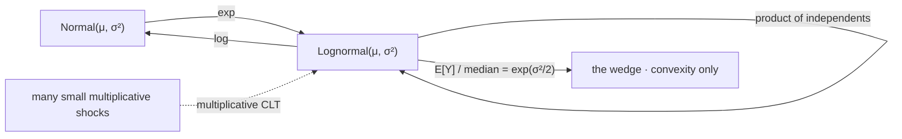

# Lognormal Distribution

The lognormal has every moment finite and is still not determined by them — there are other distributions, visibly different ones, sharing its entire moment sequence exactly. That makes it the sharpest counterexample in this part to the habit of describing a law by its moments, and it is also the law of every price that grows by multiplication. Both facts matter, and the second is why the first is not a curiosity.

This page covers the density built from a Jacobian, the mean, median, and mode as three genuinely different numbers, the finiteness of every moment alongside the divergence of the moment generating function, the moment-indeterminacy that follows, the multiplicative central limit theorem, and the terminal-wealth arithmetic that decides who gets the average. It does not derive the change-of-variables machinery, which is [Change of Variables](../part-03-random-variables/09-change-of-variables.md); it does not develop the compound-growth reading, which is [Exponentials, Logarithms, and Growth](../part-01-mathematical-foundations/07-exponentials-logarithms-growth.md); and it does not construct the continuous-time process, which is [Geometric Brownian Motion](../part-08-stochastic-processes/09-geometric-brownian-motion.md).

The trading stake is the gap between what an index returns and what an investor in it gets. On the book's published figures of $\mu=0.075$ and $\sigma=0.195$, twenty-five years of compounding gives an expected terminal wealth of $6.5$ times capital and a median of $4.1$ — and fewer than a third of investors reach the average. Nothing in that is a fee, a behavioural error, or a market phenomenon. It is the shape the exponential produces, and its sign cannot be negotiated.

## The Density from a Jacobian

$Y$ is lognormal when $\log Y$ is normal. Writing $X=\log Y\sim\mathcal{N}(\mu,\sigma^{2})$, the density of $Y=e^{X}$ follows from the change-of-variables formula, and the $1/y$ that appears is the Jacobian of the log:

$$f_Y(y)=\frac{1}{y\sigma\sqrt{2\pi}}\exp\Big(-\frac{(\log y-\mu)^{2}}{2\sigma^{2}}\Big),\qquad y>0.$$

The parameters $\mu$ and $\sigma$ are the mean and standard deviation of the *logarithm*, not of $Y$. This is the most common error in using the family and it is not a small one: $\sigma=0.195$ describes a log-return volatility, while the standard deviation of $Y$ itself is a different number with different units.

$$\mathbb{E}[Y]=e^{\mu+\sigma^{2}/2},\qquad \mathrm{var}(Y)=\big(e^{\sigma^{2}}-1\big)e^{2\mu+\sigma^{2}}.$$

??? note "Proof of the mean, and that it exceeds the exponential of the mean log"
    By the law of the unconscious statistician there is no need to construct $f_Y$ at all — the mean is an expectation of $e^{X}$ against the *normal* density, which is the moment generating function of $X$ evaluated at $t=1$:

    $$\mathbb{E}[e^{X}]=M_X(1)=e^{\mu+\sigma^{2}/2},$$

    using the MGF proved on [The Gaussian Distribution](11-gaussian-distribution.md). The $k$-th moment is $M_X(k)=e^{k\mu+k^{2}\sigma^{2}/2}$ by the same substitution, finite for every $k$, and that is the fact the third section turns on.

    Now compare with $e^{\mathbb{E}[X]}=e^{\mu}$. The ratio is $e^{\sigma^{2}/2}\ge1$, with equality only when $\sigma=0$. The inequality is Jensen's, applied to the convex function $\exp$, and [Expected Value](../part-04-expectation-and-moments/01-expected-value.md) makes the point this proof only restates: the direction is fixed by convexity alone and cannot depend on anything about the market. A supporting line at $\mu$ lies below $\exp$ everywhere, so averaging the exponential can never come in below the exponential of the average.

    Strict convexity is the load-bearing hypothesis, and it is what makes the gap strict rather than merely non-negative. Any strictly convex transform of a non-degenerate random variable produces the same wedge; the exponential is simply the case where the wedge has a name and a closed form.

```python
import numpy as np
from scipy.integrate import quad

mu, s = 0.0, 0.20                                              # parameters of the log, not of Y
lognormal = lambda y: np.exp(-(np.log(y) - mu) ** 2 / (2 * s * s)) / (y * s * np.sqrt(2 * np.pi))
print(f"  Lognormal from mu = {mu}, sigma = {s}")
print(f"    total mass                       {quad(lognormal, 1e-12, 60)[0]:.10f}")
print(f"    mean   exp(mu + s^2/2)           {np.exp(mu + s * s / 2):.10f}"
      f"   by integration {quad(lambda y: y * lognormal(y), 1e-12, 60)[0]:.10f}")
print(f"    median exp(mu)                   {np.exp(mu):.10f}")
print(f"    mode   exp(mu - s^2)             {np.exp(mu - s * s):.10f}")
print(f"    sd     sqrt(e^(s^2) - 1) * E[Y]  "
      f"{np.sqrt(np.exp(s * s) - 1) * np.exp(mu + s * s / 2):.10f}")
print(f"    the wedge exp(s^2/2) - 1         {np.exp(s * s / 2) - 1:+.10f}")
# =>   Lognormal from mu = 0.0, sigma = 0.2
#        total mass                       1.0000000000
#        mean   exp(mu + s^2/2)           1.0202013400   by integration 1.0202013400
#        median exp(mu)                   1.0000000000
#        mode   exp(mu - s^2)             0.9607894392
#        sd     sqrt(e^(s^2) - 1) * E[Y]  0.2060977765
#        the wedge exp(s^2/2) - 1         +0.0202013400
```

The mean reproduces the $1.0202013400$ that [Expected Value](../part-04-expectation-and-moments/01-expected-value.md) obtains by three independent routes, here by a fourth — integrating against the constructed density rather than avoiding it. The three centres are all different and they are ordered, which is the next section.

## Mean, Median, and Mode Are Three Different Numbers

$$\text{mode}=e^{\mu-\sigma^{2}}\ <\ \text{median}=e^{\mu}\ <\ \text{mean}=e^{\mu+\sigma^{2}/2}.$$

The ordering is strict whenever $\sigma>0$ and the gaps widen with $\sigma$. All three are legitimate answers to "what does this distribution do", and they answer different questions: the mode is the single most likely outcome, the median is what half of all outcomes beat, and the mean is what averaging across many parallel histories would give.

??? note "Proof that the median transforms under exp and the mean does not"
    Let $g$ be strictly increasing and $m$ the median of $X$, so $\mathbf{P}(X\le m)=1/2$. Because $g$ is strictly increasing, $\{X\le m\}$ and $\{g(X)\le g(m)\}$ are the same event, so $\mathbf{P}(g(X)\le g(m))=1/2$ and $g(m)$ is the median of $g(X)$. Quantiles are preserved by monotone maps, exactly and with no further conditions.

    The mean has no such property. $\mathbb{E}[g(X)]=g(\mathbb{E}[X])$ requires $g$ affine, and for convex $g$ Jensen makes the left side larger. So under $\exp$ the median travels along to $e^{\mu}$ while the mean picks up the factor $e^{\sigma^{2}/2}$ and separates.

    This is why the median is the better summary of a compounded quantity and the mean the better summary of a one-period one. An investor experiences a single path and the typical path ends near the median; a book running many independent bets within a year collects something near the mean. Confusing the two is the entire content of the volatility-drag literature, and its arithmetic version is [Exponentials, Logarithms, and Growth](../part-01-mathematical-foundations/07-exponentials-logarithms-growth.md).

## Every Moment Is Finite and the MGF Is Not

The $k$-th moment is $\mathbb{E}[Y^{k}]=e^{k\mu+k^{2}\sigma^{2}/2}$ — finite for every $k$, however large. And yet

$$M_Y(t)=\mathbb{E}\big[e^{tY}\big]=\infty\quad\text{for every }t>0.$$

??? note "Proof that the moment generating function diverges for every positive t"
    Write the expectation against the lognormal density and substitute $y=e^{x}$ to return to the normal:

    $$\mathbb{E}\big[e^{tY}\big]=\int_{-\infty}^{\infty}\exp\big(te^{x}\big)\frac{1}{\sigma\sqrt{2\pi}}e^{-(x-\mu)^{2}/2\sigma^{2}}\,\mathrm{d}x.$$

    Compare the two exponents as $x\to\infty$. The first factor grows like $e^{te^{x}}$, a double exponential; the density decays like $e^{-x^{2}/2\sigma^{2}}$, which is only Gaussian in $x$. A double exponential beats Gaussian decay for large enough $x$, so the integrand tends to infinity rather than zero and the integral diverges. This holds for every $t>0$ however small, since $t$ affects only the constant multiplying $e^{x}$.

    The two facts are not in conflict and it is worth seeing why. Finiteness of every moment says $\mathbb{E}[Y^{k}]<\infty$ for each fixed $k$; finiteness of the MGF would say the *series* $\sum_k t^{k}\mathbb{E}[Y^{k}]/k!$ converges. Here the moments grow like $e^{k^{2}\sigma^{2}/2}$, which outruns $k!$, so every term is finite and the series diverges everywhere. A moment sequence that fails to reconstitute an analytic function is precisely the setup for a law that fails to be determined by its moments — which is the next section.

## The Law Is Not Determined by Its Moments

There is a family of distributions, none of them lognormal, matching the lognormal's every moment.

??? note "Proof that a perturbed lognormal has identical moments"
    Take the standard case $\mu=0$, $\sigma=1$, with density $f$, and define for $\lvert a\rvert\le1$

    $$f_a(y)=f(y)\big[1+a\sin(2\pi\log y)\big].$$

    Each $f_a$ is non-negative, because the bracket lies in $[0,2]$. Both that it integrates to one and that its moments are unchanged follow from a single computation: for every integer $k\ge0$,

    $$\int_{0}^{\infty}y^{k}f(y)\sin(2\pi\log y)\,\mathrm{d}y=0.$$

    Substituting $y=e^{x}$ turns the left side into $\frac{1}{\sqrt{2\pi}}\int e^{kx}e^{-x^{2}/2}\sin(2\pi x)\,\mathrm{d}x$, and completing the square in the first two factors gives $e^{k^{2}/2}\,\mathbb{E}[\sin(2\pi Z)]$ for $Z\sim\mathcal{N}(k,1)$. That expectation is the imaginary part of the normal characteristic function evaluated at $2\pi$, namely $e^{-2\pi^{2}}\sin(2\pi k)$, and $\sin(2\pi k)=0$ because $k$ is an integer.

    So every $f_a$ is a density and has exactly the lognormal's moments, for every $k$. The integrality of $k$ is the load-bearing hypothesis and it is a sharp one: the same integral at non-integer $k$ is not zero, so these laws differ in their fractional moments while agreeing on every whole one. The construction is Heyde's, and the mechanism — an oscillation whose period matches the lattice the integer moments sample — is why the failure is invisible to any finite number of moments and to all of them together.

```python
import numpy as np
from scipy.integrate import quad

f = lambda y: np.exp(-np.log(y) ** 2 / 2) / (y * np.sqrt(2 * np.pi))   # standard lognormal
fa = lambda y, a: f(y) * (1 + a * np.sin(2 * np.pi * np.log(y)))
# Integrate on the log scale: y = e^x turns each moment into a Gaussian-weighted
# integral, which quadrature handles cleanly. On the y scale the oscillation
# defeats it — the k = 0 row comes back as 0.64 instead of 1.
phi = lambda x: np.exp(-x ** 2 / 2) / np.sqrt(2 * np.pi)
mom = lambda k, a: quad(lambda x: np.exp(k * x) * phi(x)
                        * (1 + a * np.sin(2 * np.pi * x)), -20, 20 + k, limit=400)[0]
print("  a perturbed lognormal, sharing every moment with the original")
print("      k         lognormal           a = 0.8          difference")
for k in range(0, 6):
    m0, ma = mom(k, 0.0), mom(k, 0.8)
    print(f"    {k:3d} {m0:18.8f} {ma:18.8f} {ma - m0:18.10f}")
print("  the densities are nowhere near each other")
for y in (0.5, 1.0, 2.0, 4.0):
    print(f"    y = {y:4.1f}   f(y) {f(y):.6f}   f_a(y) {fa(y, 0.8):.6f}"
          f"   ratio {fa(y, 0.8) / f(y):.4f}")
# =>   a perturbed lognormal, sharing every moment with the original
#          k         lognormal           a = 0.8          difference
#          0         1.00000000         1.00000000       0.0000000000
#          1         1.64872127         1.64872127      -0.0000000000
#          2         7.38905610         7.38905610       0.0000000000
#          3        90.01713130        90.01713130       0.0000000000
#          4      2980.95798704      2980.95798704       0.0000000000
#          5    268337.28652087    268337.28652087       0.0000000001
#      the densities are nowhere near each other
#        y =  0.5   f(y) 0.627496   f_a(y) 1.097804   ratio 1.7495
#        y =  1.0   f(y) 0.398942   f_a(y) 0.398942   ratio 1.0000
#        y =  2.0   f(y) 0.156874   f_a(y) 0.039297   ratio 0.2505
#        y =  4.0   f(y) 0.038153   f_a(y) 0.058152   ratio 1.5242
```

The moment columns agree to every digit printed, and the agreement is exact rather than numerical — the proof shows it holds for every $k$, so the residual of $10^{-10}$ at the fifth moment is quadrature error against a difference that is genuinely zero. The density rows show the two laws are not close in any other sense: at $y=0.5$ the perturbed density is $75\%$ larger than the lognormal's and at $y=2$ it is a quarter of it. These are not neighbouring distributions. A moment-matching procedure given data from $f_{0.8}$ would return a lognormal and report a perfect fit.

!!! warning "Matching moments does not identify a distribution, and on this family it does not even come close"
    [Higher-Order Moments](../part-04-expectation-and-moments/03-higher-order-moments.md) showed that four moments fail to pin a law, which is unsurprising. This is the stronger statement: *all* of them fail, on a family with no pathology anywhere — every moment finite, a smooth density on the positive half-line, and the law of every geometric-growth model in finance. Moment-matched simulation, Cornish–Fisher expansions, and any calibration whose objective is a distance between moment vectors are identifying nothing here. What does determine a law is the density, the distribution function, or the characteristic function — which, unlike the MGF, exists for every law and always determines it.

## Products Go Where Sums Go

The family is closed under multiplication for exactly the reason the normal is closed under addition, since the logarithm converts one into the other:

$$Y_1\sim\mathrm{LN}(\mu_1,\sigma_1^{2}),\ Y_2\sim\mathrm{LN}(\mu_2,\sigma_2^{2})\ \text{independent}\ \Longrightarrow\ Y_1Y_2\sim\mathrm{LN}(\mu_1+\mu_2,\ \sigma_1^{2}+\sigma_2^{2}).$$

The central limit theorem transfers the same way. A product of many independent positive factors, each a small multiplicative shock, has a log that is a sum of many small independent terms — so the log is asymptotically normal and the product asymptotically lognormal. That is the multiplicative central limit theorem, and it is why the lognormal is the default model for a price: prices evolve by percentage changes, and a percentage change is a multiplication.



The self-loop is the closure, the second one in this part after the exponential's closure under minima. The dashed arrow carries the same two silences [The Gaussian Distribution](11-gaussian-distribution.md) itemised — slow convergence, hypotheses holding only marginally on real returns — because it is the same theorem seen through a logarithm.

## Terminal Wealth, and Who Gets the Mean

Now the trading stake, on the book's published figures.

```python
import numpy as np
from scipy.stats import norm

mu_a, sd_a, yrs = 0.075, 0.195, 25                             # published annualized figures
m = (mu_a - sd_a ** 2 / 2) * yrs                               # drift of the log over the horizon
s = sd_a * np.sqrt(yrs)
print(f"  {yrs} years at mu = {mu_a}, sigma = {sd_a}: log-wealth ~ N({m:.4f}, {s ** 2:.4f})")
print(f"    mean terminal wealth    exp(mu*T)          {np.exp(mu_a * yrs):8.3f}x")
print(f"    median terminal wealth  exp((mu-s^2/2)*T)  {np.exp(m):8.3f}x")
print(f"    mode                    exp(m - s^2)       {np.exp(m - s ** 2):8.3f}x")
print(f"    P(beat the mean)                           {norm.sf(mu_a * yrs, m, s):8.3f}")
print("      horizon      mean     median   P(beat mean)")
for T in (1, 5, 10, 25, 50):
    mt, st = (mu_a - sd_a ** 2 / 2) * T, sd_a * np.sqrt(T)
    print(f"    {T:9d} {np.exp(mu_a * T):10.3f} {np.exp(mt):10.3f}"
          f" {norm.sf(mu_a * T, mt, st):13.3f}")
# =>   25 years at mu = 0.075, sigma = 0.195: log-wealth ~ N(1.3997, 0.9506)
#        mean terminal wealth    exp(mu*T)             6.521x
#        median terminal wealth  exp((mu-s^2/2)*T)     4.054x
#        mode                    exp(m - s^2)          1.567x
#        P(beat the mean)                              0.313
#          horizon      mean     median   P(beat mean)
#                1      1.078      1.058         0.461
#                5      1.455      1.323         0.414
#               10      2.117      1.750         0.379
#               25      6.521      4.054         0.313
#               50     42.521     16.434         0.245
```

The average investor does not get the average. Over twenty-five years the mean terminal wealth is $6.5$ times capital and the median is $4.1$, and the chance of reaching the mean is under a third: the average is carried by a thin set of very good paths and most paths finish below it. The table shows the effect compounding — the share beating the mean falls monotonically with the horizon, so the longer the period, the fewer of the people in it the average describes.

None of this involves a cost. There are no fees in the calculation, no taxes, no frictions, and no behavioural mistakes; the inputs are an arithmetic mean and a volatility. What separates the two numbers is that $\mathbb{E}[\exp(\cdot)]$ and $\exp(\mathbb{E}[\cdot])$ are different operations, and the market never had a say in which is larger.

## The Drag Is Convexity

It is worth being precise about what the $\sigma^{2}/2$ term is, because it is routinely described as a cost that volatility imposes and it is not a cost at all.

It is not paid to anyone. It appears in no fee schedule, it cannot be hedged away, and reducing turnover does not reduce it. It is the difference between two summaries of one distribution — a distribution that is right-skewed because the exponential of a symmetric variable is right-skewed — and it exists in a frictionless market with a perfectly efficient investor. Halving $\sigma$ quarters it, which is the only lever there is, and that lever is why volatility targeting improves compounded returns even when it does nothing whatever to expected returns.

What follows for practice is a habit about which number to quote. An arithmetic mean return answers a question about one period and aggregates across positions with no assumptions, which makes it the right input to a portfolio calculation. A geometric mean — the median's growth rate — answers a question about one path over many periods, which is what an investor experiences. Both are correct; quoting one where the other belongs is the error, and at twenty-five years and ordinary equity volatility it is an error of more than a third of terminal wealth.

The deeper lesson is the moment-indeterminacy, and it generalises well past this family. A distribution is not its moments. Here they all exist, all are finite, all are available in closed form, and all together fail to identify the law — so a procedure that consumes moments has no way of knowing what it has fitted. The objects that do determine a law are the density, the distribution function, and the characteristic function, and the practical rule is to work with those whenever the question is about the shape of a tail rather than the size of an average.
