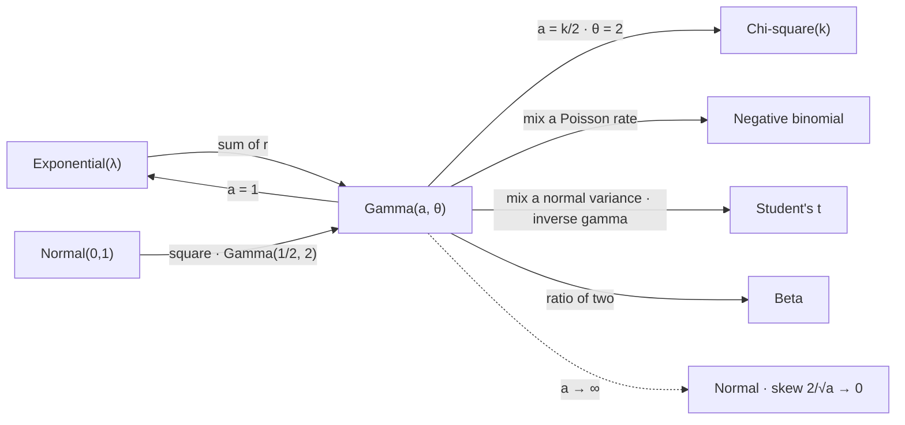

# Gamma Distribution

The gamma is the connective tissue of this part. It is what a sum of exponential waits becomes, it contains the chi-square as a special case, it is the conjugate prior for a Poisson rate, and it is the mixing law that converts a normal into a Student's $t$. None of those four roles obviously has anything to do with the others, and all four are the same two-parameter density with the shape dial set differently.

This page covers the density and the function that normalises it, the three parameterisations and the confusion they generate, the sum of exponentials that produces the family, additivity in the shape, the special cases the family contains, the conjugacy that makes it the natural prior for a rate, and the reading of the shape parameter as a distance from normality. It does not cover the overdispersed count the gamma mixes into, which is [Negative Binomial Distribution](04-negative-binomial-distribution.md); it does not develop the sampling-theory role, which is [Chi-Square Distribution](15-chi-square-distribution.md); it does not build the scale mixture, which is [Student's t Distribution](16-students-t-distribution.md); and it does not develop Bayesian machinery, which is [Part XVI](../part-16-bayesian-statistics/index.md).

The trading stake is that the shape parameter measures something real. [Negative Binomial Distribution](04-negative-binomial-distribution.md) fitted a shape of $2.5$ to a clustered count series, and the last section explains what that number says: the arrival rate has a coefficient of variation of $1/\sqrt{2.5}\approx0.63$, so it moves by nearly two thirds of its own size. A shape of $2.5$ is not a nuisance parameter — it is the estimate of how unstable the market's rate is, and it is also, by the same arithmetic, a statement about how far the sum of that many waits is from being normal.

## The Density and the Gamma Function

$X$ has a gamma law with shape $a>0$ and scale $\theta>0$ when

$$f_X(x)=\frac{1}{\Gamma(a)\theta^{a}}x^{a-1}e^{-x/\theta},\qquad x>0,$$

where the gamma function is defined by the integral that makes this a density,

$$\Gamma(a)=\int_{0}^{\infty}t^{a-1}e^{-t}\,\mathrm{d}t.$$

The moments are

$$\mathbb{E}[X]=a\theta,\qquad \mathrm{var}(X)=a\theta^{2},\qquad \text{skewness}=\frac{2}{\sqrt{a}},\qquad \text{mode}=(a-1)\theta\ \ (a\ge1).$$

Note that the shape controls the skewness and the scale does not appear in it — a fact the last section turns into the page's main claim.

??? note "Proof of the recursion, and that Γ interpolates the factorial"
    Integrate by parts with $u=t^{a}$ and $\mathrm{d}v=e^{-t}\,\mathrm{d}t$:

    $$\Gamma(a+1)=\int_{0}^{\infty}t^{a}e^{-t}\,\mathrm{d}t=\Big[-t^{a}e^{-t}\Big]_{0}^{\infty}+a\int_{0}^{\infty}t^{a-1}e^{-t}\,\mathrm{d}t=a\,\Gamma(a),$$

    the boundary term vanishing at both ends because $e^{-t}$ beats any power at infinity and $t^{a}\to0$ at the origin for $a>0$. Since $\Gamma(1)=\int_0^\infty e^{-t}\,\mathrm{d}t=1$, induction gives $\Gamma(n)=(n-1)!$ for positive integers.

    Two consequences are worth extracting. First, $\Gamma$ is the unique smooth interpolation of the factorial to non-integer arguments that is log-convex, which is what allows the shape parameter to be any positive real rather than a count — and that in turn is what let [Negative Binomial Distribution](04-negative-binomial-distribution.md) fit a shape of $2.5$ to data where "two and a half successes" means nothing.

    Second, the recursion supplies the half-integer values that the rest of this part needs. From $\Gamma(1/2)=\sqrt{\pi}$ — which is the Gaussian integral of [The Gaussian Distribution](11-gaussian-distribution.md) after the substitution $t=z^{2}/2$ — the recursion generates $\Gamma(3/2)=\tfrac12\sqrt{\pi}$ and so on up. Every chi-square, $t$, and F density in the pages that follow is normalised by one of these values, so the $\sqrt{\pi}$ appearing in those formulas traces directly back to the polar-coordinate trick.

## Shape, Rate, and Scale

Three parameterisations are in circulation and mixing them is the commonest error in using this family.

| Parameterisation | Density | Mean | Used by |
|---|---|---|---|
| shape $a$, scale $\theta$ | $x^{a-1}e^{-x/\theta}/(\Gamma(a)\theta^{a})$ | $a\theta$ | `numpy`, `scipy` (as `a`, `scale`) |
| shape $a$, rate $\beta=1/\theta$ | $\beta^{a}x^{a-1}e^{-\beta x}/\Gamma(a)$ | $a/\beta$ | Bayesian texts, most conjugacy formulas |
| shape $k$, mean $\mu=a\theta$ | reparameterised | $\mu$ | generalised linear models |

This page uses shape and scale throughout, matching the libraries, and states the conjugacy result in the rate form because that is where every reference the reader will consult puts it.

## A Sum of Exponentials

The family's origin is addition. [Exponential Distribution](10-exponential-distribution.md) showed that a single memoryless wait has a decreasing density with its mode at zero; adding $r$ independent copies produces something qualitatively different.

$$X_1+\cdots+X_r\sim\mathrm{Gamma}(a=r,\ \theta=1/\lambda)\qquad\text{for independent }X_i\sim\mathrm{Exp}(\lambda).$$

The sum has a mode away from the origin, because a small total requires *every* wait to be small and that is exponentially unlikely in $r$. The memorylessness has not survived: the hazard of a $\mathrm{Gamma}(r,\theta)$ with $r>1$ is increasing, so a sum of memoryless waits ages even though none of its parts do.

??? note "Proof that the sum is gamma and that the family is additive in the shape"
    Both statements follow from one moment generating function. For $X\sim\mathrm{Gamma}(a,\theta)$,

    $$M_X(t)=\frac{1}{\Gamma(a)\theta^{a}}\int_{0}^{\infty}x^{a-1}e^{-x(1/\theta-t)}\,\mathrm{d}x=(1-\theta t)^{-a},\qquad t<1/\theta,$$

    where the integral was evaluated by substituting $u=x(1/\theta-t)$ and recognising $\Gamma(a)$. At $a=1$ this is $(1-\theta t)^{-1}$, the exponential's MGF.

    Now multiply. For independent gammas sharing a scale, MGFs multiply, so $(1-\theta t)^{-a_1}(1-\theta t)^{-a_2}=(1-\theta t)^{-(a_1+a_2)}$ — a gamma with shape $a_1+a_2$ and the same scale. Taking $r$ copies of shape $1$ gives the sum of exponentials as $\mathrm{Gamma}(r,\theta)$, and taking arbitrary shapes gives the general additivity.

    The shared scale is the load-bearing hypothesis and it is easy to lose. Two gammas with *different* scales do not add to a gamma, because the two MGFs do not combine — there is no single $\theta$ to factor out. This matters wherever the family is used to aggregate: a book of positions whose durations are gamma with different scales has no gamma total, and the same failure appeared for the binomial in [Binomial Distribution](02-binomial-distribution.md), where mixed $p$ broke the additivity in $n$.

```python
import math
import numpy as np
from scipy.special import gamma as G

print("  Gamma interpolates the factorial, and reaches the half-integers via sqrt(pi)")
for a in (1.0, 2.0, 5.0, 0.5, 1.5, 2.5):
    ref = f"{math.factorial(int(a) - 1):.4f}" if a % 1 == 0 else f"{G(a) / np.sqrt(np.pi):.4f} sqrt(pi)"
    print(f"    Gamma({a:4.1f}) = {G(a):10.6f}      = {ref}")

rng = np.random.default_rng(97)
lam, n = 1 / 50.0, 1_000_000                                   # exponential waits, mean 50
def hazard(x, age, w=10.0):                                    # ends per unit, among survivors
    alive = x[x > age]
    return (alive <= age + w).mean() / w

print("  a sum of r memoryless waits, which is not itself memoryless")
print("      r      mean     skew   exact   P(X < 25)   hazard at q20   at q80")
for r in (1, 2, 5, 20):
    x = rng.exponential(1 / lam, (n, r)).sum(axis=1)
    sk = ((x - x.mean()) ** 3).mean() / x.std() ** 3
    q20, q80 = np.quantile(x, [0.20, 0.80])                    # probe ages that scale with r
    print(f"    {r:3d} {x.mean():9.2f} {sk:8.4f} {2 / np.sqrt(r):7.4f} {(x < 25).mean():10.4f}"
          f" {hazard(x, q20):15.5f} {hazard(x, q80):8.5f}")
print(f"  an exponential over the same bin width: {(1 - np.exp(-lam * 10)) / 10:.5f}, at every age")
# =>   Gamma interpolates the factorial, and reaches the half-integers via sqrt(pi)
#        Gamma( 1.0) =   1.000000      = 1.0000
#        Gamma( 2.0) =   1.000000      = 1.0000
#        Gamma( 5.0) =  24.000000      = 24.0000
#        Gamma( 0.5) =   1.772454      = 1.0000 sqrt(pi)
#        Gamma( 1.5) =   0.886227      = 0.5000 sqrt(pi)
#        Gamma( 2.5) =   1.329340      = 0.7500 sqrt(pi)
#      a sum of r memoryless waits, which is not itself memoryless
#          r      mean     skew   exact   P(X < 25)   hazard at q20   at q80
#          1     50.10   1.9959  2.0000     0.3924         0.01809  0.01809
#          2    100.04   1.4088  1.4142     0.0903         0.00911  0.01391
#          5    249.92   0.8900  0.8944     0.0002         0.00444  0.00986
#         20    999.84   0.4476  0.4472     0.0000         0.00182  0.00554
#      an exponential over the same bin width: 0.01813, at every age
```

The half-integer rows at the top are the values every density in the next four pages is normalised by, and they are all rational multiples of $\sqrt{\pi}$ — the Gaussian integral, arriving through the substitution $t=z^2/2$.

Below them the skewness column is the family's dial. At $r=1$ it is $2$, the exponential being the most lopsided member, and it falls as $2/\sqrt{r}$ to $0.45$ by $r=20$, matching the closed form to three decimals in every row. The probability of an unusually small total collapses alongside it, from $39\%$ at $r=1$ to nothing measurable at $r=20$: the mode has left the origin.

The two hazard columns are the sharpest line in the table. At $r=1$ they are *identical* — $0.01809$ at the twentieth percentile of age and $0.01809$ at the eightieth — which is memorylessness, and they sit within Monte Carlo noise of the $0.01813$ an exponential gives over the same bin width. At every $r>1$ the later hazard is the larger, by half again at $r=2$ and threefold at $r=20$. A sum of memoryless waits knows how long it has been running, even though not one of its terms does.

## The Family's Special Cases

Fixing one parameter or the other produces most of the rest of this part.

| Special case | Parameters | Where it appears |
|---|---|---|
| Exponential$(\lambda)$ | $a=1$, $\theta=1/\lambda$ | [Exponential Distribution](10-exponential-distribution.md) |
| Erlang$(r,\lambda)$ | $a=r$ integer | the sum of $r$ waits, above |
| Chi-square$(k)$ | $a=k/2$, $\theta=2$ | [Chi-Square Distribution](15-chi-square-distribution.md) |
| Inverse gamma | law of $1/X$ | the mixing law of [Student's t Distribution](16-students-t-distribution.md) |

The chi-square identification is the one worth carrying, because it explains why a sum of squared normals and a sum of exponential waits — objects with no evident relationship — turn out to be the same family. The answer is that the square of a standard normal is a $\mathrm{Gamma}(1/2,2)$, and the additivity above does the rest.



Every arrow into the gamma is a construction and every arrow out is a family that gets its own page. The dashed one is the subject of the last section, and it is the reason the shape parameter deserves a reading rather than just a value.

## Conjugacy for a Poisson Rate

If the prior on a Poisson rate is gamma and $n$ counts are observed, the posterior is gamma again with updated parameters. In the rate parameterisation,

$$\Lambda\sim\mathrm{Gamma}(a,\beta),\quad N_1,\ldots,N_n\mid\Lambda\sim\mathrm{Pois}(\Lambda)\ \Longrightarrow\ \Lambda\mid\text{data}\sim\mathrm{Gamma}\Big(a+\sum_i N_i,\ \beta+n\Big).$$

??? note "Proof of the conjugate update, and of what the prior parameters mean"
    The posterior is proportional to prior times likelihood, and constants not involving $\lambda$ can be dropped:

    $$p(\lambda\mid\text{data})\ \propto\ \lambda^{a-1}e^{-\beta\lambda}\cdot\prod_{i=1}^{n}\frac{e^{-\lambda}\lambda^{N_i}}{N_i!}\ \propto\ \lambda^{a+\sum_iN_i-1}e^{-(\beta+n)\lambda}.$$

    That is the kernel of a gamma with shape $a+\sum_iN_i$ and rate $\beta+n$, and since the kernel determines the density there is nothing left to compute — no integral, no normalising constant.

    The update rule reads the prior parameters directly: $a$ is a pseudo-count of events already seen and $\beta$ a pseudo-count of intervals already observed. A $\mathrm{Gamma}(a,\beta)$ prior is therefore exactly as informative as $\beta$ periods of prior data containing $a$ events, which makes the prior specifiable in units a practitioner has intuition about rather than in abstract hyperparameters.

    What makes the conjugacy work is that the Poisson likelihood, viewed as a function of $\lambda$, has the same functional form as the gamma density — a power of $\lambda$ times an exponential in $\lambda$. That is the whole mechanism, and it is why the same trick works for the beta and the Bernoulli in [Beta Distribution](14-beta-distribution.md) and fails for almost everything else.

```python
import numpy as np
from scipy.stats import gamma

rng = np.random.default_rng(101)
a0, b0 = 2.0, 1.0                                              # prior: 2 events in 1 period
true_rate = 5.0
print(f"  posterior on a Poisson rate, truth = {true_rate}, prior Gamma(a={a0}, rate={b0})")
print("      periods    posterior mean   90% interval        prior weight")
for n in (0, 1, 5, 25, 250):
    counts = rng.poisson(true_rate, n)
    a, b = a0 + counts.sum(), b0 + n
    lo, hi = gamma.ppf([0.05, 0.95], a, scale=1 / b)
    print(f"    {n:9d} {a / b:16.4f}   [{lo:6.3f}, {hi:6.3f}] {b0 / b:18.4f}")
# =>   posterior on a Poisson rate, truth = 5.0, prior Gamma(a=2.0, rate=1.0)
#          periods    posterior mean   90% interval        prior weight
#                0           2.0000   [ 0.355,  4.744]             1.0000
#                1           5.5000   [ 3.085,  8.481]             0.5000
#                5           5.0000   [ 3.599,  6.590]             0.1667
#               25           4.6538   [ 3.980,  5.371]             0.0385
#              250           5.0279   [ 4.797,  5.263]             0.0040
```

The posterior mean starts at the prior's $2.0$ and converges on the truth, and the last column says why: the prior's weight is $\beta_0/(\beta_0+n)$, so a prior worth one period of data is half the evidence after one period and a quarter of a percent of it after two hundred and fifty. The interval tightens at the $1/\sqrt{n}$ rate throughout. Nothing here required an integral, a sampler, or an optimiser — the entire inference is two additions, which is what conjugacy buys.

## The Shape Parameter Is the Distance from Normal

The skewness $2/\sqrt{a}$ depends on the shape alone, so it is invariant to the units the data are measured in. That makes it a genuine descriptor, and it can be read in two directions.

Read forward, it says how far a sum has to go before the central limit theorem has arrived. A gamma with shape $a$ *is* a sum of $a$ exponentials when $a$ is an integer, so watching $2/\sqrt{a}$ decay is watching the CLT converge on the most skewed starting point available. The decay is slow: it takes a shape of $100$ to bring the skewness down to $0.2$, and a shape of $400$ to reach $0.1$. That is the same slow convergence [The Gaussian Distribution](11-gaussian-distribution.md) measured on Student-$t$ summands, arriving from the other side, and it is the practical reason a "sum of many small effects" argument should never be trusted without a count of how many.

Read backwards, it says what a fitted shape means. A shape of $2.5$ fitted to a Poisson rate is not a count of anything — the proof above shows it is a pseudo-count, and pseudo-counts need not be integers. What it *is* is a statement about the rate's own dispersion: for a gamma, the coefficient of variation is $1/\sqrt{a}$, so $a=2.5$ says the arrival rate has a spread equal to $63\%$ of its own mean. That is the number [Negative Binomial Distribution](04-negative-binomial-distribution.md) reported and the reason a Poisson was inadequate there, translated out of the count and into the thing that was actually varying.

So the practical rule is to report $1/\sqrt{a}$ rather than $a$. The shape parameter by itself is an artefact of the parameterisation and carries no units, no intuition, and no obvious scale; its reciprocal square root is a relative standard deviation, which is a quantity anybody can argue about. A fitted shape of $2.5$ and a fitted shape of $25$ sound like they differ by a factor of ten, and what they actually say is that the rate's spread is $63\%$ of its mean in one case and $20\%$ in the other — which is the difference between a market whose activity level is essentially unknowable in advance and one whose activity level is roughly predictable.
