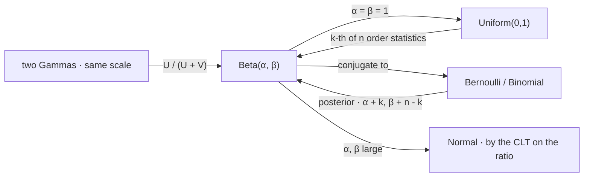

# Beta Distribution

The beta is the distribution of a probability. Every other law in this part describes an outcome; this one describes a parameter, which is why it is the first family here whose support — the unit interval — is a statement about what the variable *means* rather than about where it happens to fall. It is what a hit rate looks like before you are sure of it, and the honest answer to "is this strategy better than a coin flip" is a beta density rather than a number.

This page covers the density and the function that normalises it, the mean and the concentration parameter that separates location from confidence, the construction from two gammas, the conjugacy that makes it the posterior for a Bernoulli parameter, the fact that a uniform order statistic is beta, and the estimation of a hit rate when the sample is small. It does not build the gamma, which is [Gamma Distribution](13-gamma-distribution.md); it does not cover the single trial, which is [Bernoulli Distribution](01-bernoulli-distribution.md); and it does not develop Bayesian machinery beyond the one update, which is [Bayesian Updating](../part-16-bayesian-statistics/05-bayesian-updating.md).

The trading stake is the difference between a six-out-of-ten record and a three-hundred-and-forty-out-of-six-hundred one. Both report a hit rate near $57$–$60\%$, and a table that quotes only the percentage calls them the same result. [Bernoulli Distribution](01-bernoulli-distribution.md) showed that the sleeve's $329$ trips leave a $34\%$ hit rate uncertain to $\pm5$ percentage points; the last section does the job properly and finds that the ten-trade record leaves a $27\%$ chance the strategy is worse than a coin flip, while the six-hundred-trade record leaves one chance in two thousand.

## The Density on the Unit Interval

$X$ has a beta law with shape parameters $\alpha,\beta>0$ when

$$f_X(x)=\frac{x^{\alpha-1}(1-x)^{\beta-1}}{B(\alpha,\beta)},\qquad 0<x<1,\qquad B(\alpha,\beta)=\frac{\Gamma(\alpha)\Gamma(\beta)}{\Gamma(\alpha+\beta)}.$$

The kernel $x^{\alpha-1}(1-x)^{\beta-1}$ is a binomial likelihood in disguise, with $\alpha-1$ playing the part of a success count and $\beta-1$ a failure count — the observation the conjugacy section makes exact. The beta function $B$ is not an independent object but a ratio of gamma functions, which is why this page follows [Gamma Distribution](13-gamma-distribution.md) rather than standing alone.

$$\mathbb{E}[X]=\frac{\alpha}{\alpha+\beta},\qquad \mathrm{var}(X)=\frac{\alpha\beta}{(\alpha+\beta)^{2}(\alpha+\beta+1)}=\frac{\mu(1-\mu)}{\alpha+\beta+1}.$$

The second form of the variance is the more useful one. Writing $\mu=\alpha/(\alpha+\beta)$ for the mean and $\kappa=\alpha+\beta$ for the *concentration*, the variance is $\mu(1-\mu)/(\kappa+1)$ — a Bernoulli variance at the mean, divided by concentration. So $\mu$ says where the belief sits and $\kappa$ says how sharp it is, and the two are independent dials. A beta with $\mu=0.6$ and $\kappa=10$ and one with $\mu=0.6$ and $\kappa=1000$ agree entirely about the best guess and disagree completely about how much it is worth.

??? note "Proof that B(α, β) is a ratio of gamma functions, via a product of two gammas"
    Let $U\sim\mathrm{Gamma}(\alpha,1)$ and $V\sim\mathrm{Gamma}(\beta,1)$ be independent, and change variables to $X=U/(U+V)$ and $S=U+V$. The Jacobian of the map $(u,v)\mapsto(x,s)$ has magnitude $s$, so the joint density of $(X,S)$ is

    $$f(x,s)=\frac{(xs)^{\alpha-1}e^{-xs}}{\Gamma(\alpha)}\cdot\frac{\big(s(1-x)\big)^{\beta-1}e^{-s(1-x)}}{\Gamma(\beta)}\cdot s=\frac{x^{\alpha-1}(1-x)^{\beta-1}}{\Gamma(\alpha)\Gamma(\beta)}\,s^{\alpha+\beta-1}e^{-s}.$$

    The right-hand side factors into a function of $x$ alone times a function of $s$ alone, which establishes three things at once. $X$ and $S$ are independent; $S\sim\mathrm{Gamma}(\alpha+\beta,1)$, which is the shape-additivity of [Gamma Distribution](13-gamma-distribution.md) reappearing; and $X$ has density proportional to $x^{\alpha-1}(1-x)^{\beta-1}$. Integrating the $s$ part to $\Gamma(\alpha+\beta)$ fixes the constant, giving $B(\alpha,\beta)=\Gamma(\alpha)\Gamma(\beta)/\Gamma(\alpha+\beta)$.

    The independence of the ratio from the total is the load-bearing surprise here, and it is specific to the gamma. Two waiting times that share a scale carry no information in their sum about how the total was split, and none in the split about how large the total was. That is the same structural fact that makes [Chi-Square Distribution](15-chi-square-distribution.md) able to separate a sample mean from a sample variance, and it is why the $F$ ratio of [F Distribution](17-f-distribution.md) has a distribution free of the underlying scale.

## Conjugacy for a Bernoulli Parameter

Observe $n$ trials with $k$ successes and a beta prior on the success probability. The posterior is beta again:

$$P\sim\mathrm{Beta}(\alpha,\beta),\quad K\mid P\sim\mathrm{Binom}(n,P)\ \Longrightarrow\ P\mid K=k\ \sim\ \mathrm{Beta}(\alpha+k,\ \beta+n-k).$$

??? note "Proof of the update, and of what the prior parameters count"
    Posterior is proportional to prior times likelihood, dropping everything not involving $p$:

    $$p(p\mid k)\ \propto\ p^{\alpha-1}(1-p)^{\beta-1}\cdot\binom{n}{k}p^{k}(1-p)^{n-k}\ \propto\ p^{\alpha+k-1}(1-p)^{\beta+n-k-1}.$$

    That is the kernel of $\mathrm{Beta}(\alpha+k,\beta+n-k)$, and since a kernel determines a density there is no integral to do. The binomial coefficient, which depends on $n$ and $k$ but not on $p$, has vanished into the normalising constant — which is why the answer is the same whether the sampling was binomial or negative binomial, a point that separates Bayesian from frequentist inference more sharply than any philosophical argument.

    The update rule reads the parameters directly: $\alpha$ is a pseudo-count of prior successes and $\beta$ of prior failures, so $\mathrm{Beta}(\alpha,\beta)$ carries exactly as much information as $\alpha+\beta$ previously observed trials. $\mathrm{Beta}(1,1)$ is uniform and worth two trials' worth of nothing in particular; $\mathrm{Beta}(20,20)$ is worth forty trials centred on a coin flip and will not be moved by ten.

    The mechanism is the same one as in [Gamma Distribution](13-gamma-distribution.md): the likelihood, read as a function of the parameter, has the same functional form as the prior density. Conjugacy is not a deep property of these families so much as a coincidence of algebraic shape, and its practical value is that it turns inference into addition.

```python
import numpy as np
from scipy.stats import beta

print("  mean and concentration are independent dials")
print("      alpha   beta     mean   concentration      sd     95% width")
for a, b in ((6.0, 4.0), (60.0, 40.0), (600.0, 400.0), (1.0, 1.0), (0.5, 0.5)):
    d = beta(a, b)
    lo, hi = d.ppf([0.025, 0.975])
    print(f"    {a:7.1f} {b:6.1f} {a / (a + b):8.4f} {a + b:15.1f}"
          f" {d.std():9.5f} {hi - lo:11.4f}")
print("  the second variance form: mu(1-mu)/(kappa+1)")
for a, b in ((6.0, 4.0), (600.0, 400.0)):
    mu, kap = a / (a + b), a + b
    print(f"    Beta({a:5.1f},{b:5.1f})  var {beta(a, b).var():.8f}"
          f"   mu(1-mu)/(kappa+1) {mu * (1 - mu) / (kap + 1):.8f}")
# =>   mean and concentration are independent dials
#          alpha   beta     mean   concentration      sd     95% width
#            6.0    4.0   0.6000            10.0   0.14771      0.5637
#           60.0   40.0   0.6000           100.0   0.04875      0.1906
#          600.0  400.0   0.6000          1000.0   0.01548      0.0607
#            1.0    1.0   0.5000             2.0   0.28868      0.9500
#            0.5    0.5   0.5000             1.0   0.35355      0.9969
#      the second variance form: mu(1-mu)/(kappa+1)
#        Beta(  6.0,  4.0)  var 0.02181818   mu(1-mu)/(kappa+1) 0.02181818
#        Beta(600.0,400.0)  var 0.00023976   mu(1-mu)/(kappa+1) 0.00023976
```

The three rows sharing a mean of $0.6$ have concentrations differing by a factor of a hundred and interval widths differing by a factor of ten, which is the $\sqrt{\kappa}$ scaling. The last two rows are the two standard uninformative choices: $\mathrm{Beta}(1,1)$ is flat, and $\mathrm{Beta}(1/2,1/2)$ is the Jeffreys prior, which piles mass at both endpoints — a deliberate choice, on the grounds that a parameter near zero or one is harder to learn about and should be given more prior room.

## A Uniform Order Statistic Is Beta

There is a second, entirely non-Bayesian reason the family appears. If $U_1,\ldots,U_n$ are independent uniforms on $[0,1]$ and $U_{(k)}$ is the $k$-th smallest, then

$$U_{(k)}\sim\mathrm{Beta}(k,\ n-k+1).$$

??? note "Proof that the k-th order statistic of n uniforms is Beta(k, n-k+1)"
    Compute the density directly by asking what must happen for $U_{(k)}$ to lie in $[u,u+\mathrm{d}u]$. Exactly one of the $n$ observations falls in that interval, exactly $k-1$ fall below it, and the remaining $n-k$ fall above. Choosing which observations play which role gives a multinomial coefficient, and the probabilities are $u$, $\mathrm{d}u$, and $1-u$ respectively:

    $$f_{U_{(k)}}(u)=\frac{n!}{(k-1)!\,1!\,(n-k)!}\,u^{k-1}(1-u)^{n-k}.$$

    The coefficient is $n!/\big((k-1)!(n-k)!\big)$, which is exactly $1/B(k,n-k+1)$ by the gamma identity, so this is the $\mathrm{Beta}(k,n-k+1)$ density.

    Combined with the probability integral transform of [Continuous Uniform Distribution](09-continuous-uniform-distribution.md), this covers *every* continuous law: if $X$ has continuous distribution function $F$, then $F(X_{(k)})=U_{(k)}$ is beta, so the beta describes the position of any order statistic in probability space regardless of the underlying distribution. That is what makes it the right tool for a distribution-free confidence interval on a quantile — including a value-at-risk, which is a quantile and nothing else.

```python
import numpy as np
from scipy.stats import beta

n = 6410                                                       # 25 years of trading days
print(f"  where the empirical 1% quantile of {n} observations actually sits")
k = int(np.ceil(0.01 * n))
d = beta(k, n - k + 1)
lo, hi = d.ppf([0.025, 0.975])
print(f"    order statistic k = {k}:  mean {d.mean():.5f}"
      f"   95% interval [{lo:.5f}, {hi:.5f}]")
print(f"    as a spread around the nominal 1%: [{100 * lo:.3f}%, {100 * hi:.3f}%]")
print("      n        k     95% interval on the true tail probability")
for n_ in (250, 1000, 6410, 25_000):
    k_ = int(np.ceil(0.01 * n_))
    lo_, hi_ = beta(k_, n_ - k_ + 1).ppf([0.025, 0.975])
    print(f"    {n_:7d} {k_:6d}     [{100 * lo_:.3f}%, {100 * hi_:.3f}%]")
# =>   where the empirical 1% quantile of 6410 observations actually sits
#        order statistic k = 65:  mean 0.01014   95% interval [0.00783, 0.01273]
#        as a spread around the nominal 1%: [0.783%, 1.273%]
#          n        k     95% interval on the true tail probability
#            250      3     [0.248%, 2.860%]
#           1000     10     [0.481%, 1.702%]
#           6410     65     [0.783%, 1.273%]
#          25000    250     [0.880%, 1.127%]
```

An empirical $1\%$ value-at-risk estimated from one year of data is a quantile whose true tail probability lies somewhere between $0.25\%$ and $2.86\%$ — a factor of twelve, so the number labelled *one percent* could be delivering anything from a quarter of that to nearly three times it. Twenty-five years narrows the range only to $0.78\%$–$1.27\%$, and it takes a hundred years of daily data to get inside $\pm13\%$ of the nominal figure. The beta gives this without assuming anything at all about the return distribution, which is what makes it worth having: the interval is exact, distribution-free, and available from a single library call.

!!! note "The uncertainty in an empirical quantile is a beta interval and does not depend on the shape of the returns"
    This is unusually clean for a tail statistic. Everything else about a VaR estimate — the point value, its sensitivity to outliers, whether the tail is fat — depends on the law being estimated. The *coverage* does not: the position of the $k$-th order statistic in probability space is $\mathrm{Beta}(k,n-k+1)$ whatever the returns did, by the argument above. So a desk can report a distribution-free interval on the tail probability its VaR actually delivers, and the fact that this is rarely done is not because the calculation is hard.

## Estimating a Hit Rate Honestly

Now the trading stake.

```python
import numpy as np
from scipy.stats import beta

print("  posterior on a hit rate under a uniform Beta(1,1) prior")
print("      record        mean     95% interval       P(edge < 0.5)   P(> 0.55)")
for k, n in ((6, 10), (34, 60), (170, 300), (340, 600), (112, 329)):
    d = beta(1 + k, 1 + n - k)
    lo, hi = d.ppf([0.025, 0.975])
    print(f"    {k:4d}/{n:<5d} {d.mean():9.4f}   [{lo:.4f}, {hi:.4f}] {d.cdf(0.5):14.4f}"
          f" {d.sf(0.55):11.4f}")
# =>   posterior on a hit rate under a uniform Beta(1,1) prior
#          record        mean     95% interval       P(edge < 0.5)   P(> 0.55)
#           6/10       0.5833   [0.3079, 0.8325]         0.2744      0.6029
#          34/60       0.5645   [0.4406, 0.6845]         0.1528      0.5949
#         170/300      0.5662   [0.5100, 0.6216]         0.0105      0.7164
#         340/600      0.5664   [0.5267, 0.6058]         0.0005      0.7926
#         112/329      0.3414   [0.2913, 0.3933]         1.0000      0.0000
```

The first four records all report a $56.7\%$ to $60\%$ raw hit rate and they are not the same evidence. Ten trades leave $27\%$ of the posterior mass below a coin flip; sixty leave $15\%$; three hundred leave $1\%$; six hundred leave one part in two thousand. The interval width falls from $0.52$ to $0.08$ over the same span, which is the $\sqrt{n}$ rate and is the only thing separating the four rows. The last row is the book's own sleeve — $112$ wins in $329$ trips — and its posterior sits far below a half with near-certainty, which is exactly right and exactly uninformative about whether the sleeve makes money, for the reason [Bernoulli Distribution](01-bernoulli-distribution.md) gave: the hit rate was never the quantity that decided it.



The two round trips are the page in one picture. Beta to Bernoulli and back is conjugacy: the family is closed under the operation of seeing data, which is what makes the inference arithmetic. Beta to uniform and back is the order-statistic relation: the flat density is a beta, and picking out its $k$-th smallest draw returns a beta with different parameters. Neither loop leaves the family, and that is the whole reason it is convenient.

## What the Unit Interval Costs

There is a limitation worth stating, because the beta's convenience makes it easy to reach for where it does not belong.

A beta is unimodal for $\alpha,\beta>1$ and cannot represent a genuinely bimodal belief. If a strategy either works ($p\approx0.6$) or is broken ($p\approx0.4$) with nothing in between — a perfectly ordinary situation when a regime or an implementation bug is in question — the beta posterior will place its mass in the middle, at the one value the analyst is confident is *wrong*. Conjugacy has bought speed at the price of a shape assumption, and the assumption is invisible because the update never fails; it just returns a beta.

The related limitation is that conjugacy applies to independent trials, and [Binomial Distribution](02-binomial-distribution.md) showed that trade outcomes are not independent. A pairwise correlation of $0.05$ across $250$ trades reduces the effective sample to about nineteen, so a posterior computed as $\mathrm{Beta}(1+k,1+n-k)$ from correlated trades is roughly ten times too confident. The fix is to update with the effective count rather than the raw one, which costs nothing but requires knowing that the correction exists.

So the practical rule is to report the posterior rather than the point estimate, and to report the concentration rather than the interval when comparing records. A hit rate of $60\%$ is not a fact about a strategy; $\mathrm{Beta}(7,5)$ and $\mathrm{Beta}(341,261)$ are, and they are different facts. The first says almost nothing and the second says a great deal, and the raw percentage — which is all that appears on most tearsheets — is the one summary that cannot distinguish them.
