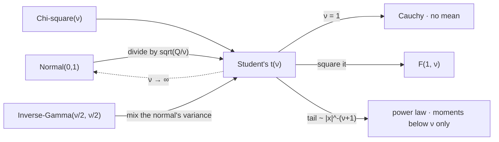

# Student's t Distribution

The $t$ is what a normal becomes when its variance is uncertain. That single sentence covers both of its apparently unrelated jobs: in sampling theory the variance is uncertain because it was estimated from the same small sample, and in return modelling it is uncertain because volatility genuinely moves. The same density serves both, and the parameter $\nu$ that indexes it is doing the same work in each — measuring how much the variance wanders.

This page covers the ratio definition, the density, the continuous scale mixture of normals that is the more useful construction, the exact order up to which the moments exist, the kurtosis a continuous mixture can reach that a two-regime one cannot, and what the fitted $\nu=2.65$ rules out. It does not build the chi-square in the denominator, which is [Chi-Square Distribution](15-chi-square-distribution.md); it does not cover the ratio of two chi-squares, which is [F Distribution](17-f-distribution.md); and it does not develop tail estimation, which is [Extreme Value Theory](../part-18-quant-finance-applications/14-extreme-value-theory.md).

The trading stake is two promises this book has made elsewhere. [Higher-Order Moments](../part-04-expectation-and-moments/03-higher-order-moments.md) found that forcing a two-regime story to reach the observed excess kurtosis of $11.41$ requires a turbulent state at $71\%$ annualised volatility fifteen percent of the time, which the data does not show, and named the repair as a *continuum* of regimes — this page. And [Returns and Their Distributions](../../part-03-statistics/02-returns-and-distributions.md) states that a $t$ has moments only up to order $\nu$, so $\nu<4$ has no finite kurtosis and $\nu<2$ no finite variance, and says the derivations are here. Both debts are paid below, and the second one turns out to undermine the way $\nu$ is usually estimated.

## The Ratio Definition

Let $Z\sim\mathcal{N}(0,1)$ and $Q\sim\chi^{2}_{\nu}$ be independent. Then

$$T=\frac{Z}{\sqrt{Q/\nu}}\ \sim\ t_{\nu}.$$

The numerator is a standardised quantity and the denominator is the square root of an independent variance estimate scaled to have mean one. So the $t$ is a normal divided by a noisy estimate of its own scale, and the extra spread relative to a normal is entirely attributable to that noise: sometimes the denominator comes in small, and a small denominator inflates the ratio.

$$f_T(x)=\frac{\Gamma\big(\frac{\nu+1}{2}\big)}{\sqrt{\nu\pi}\,\Gamma\big(\frac{\nu}{2}\big)}\Big(1+\frac{x^{2}}{\nu}\Big)^{-\frac{\nu+1}{2}}.$$

The tail behaviour is legible directly from that density: for large $\lvert x\rvert$ it decays like $\lvert x\rvert^{-(\nu+1)}$, a power law rather than the normal's $e^{-x^{2}/2}$. Everything distinctive about the family follows from that exponent.

??? note "Proof of the density from the ratio"
    Condition on $Q=q$. Given that, $T=Z\sqrt{\nu/q}$ is a scaled normal with standard deviation $\sqrt{\nu/q}$, so

    $$f_T(x)=\int_{0}^{\infty}\frac{1}{\sqrt{2\pi\nu/q}}e^{-x^{2}q/(2\nu)}\cdot\frac{q^{\nu/2-1}e^{-q/2}}{2^{\nu/2}\Gamma(\nu/2)}\,\mathrm{d}q,$$

    the second factor being the $\chi^{2}_{\nu}$ density from [Chi-Square Distribution](15-chi-square-distribution.md). Collecting powers of $q$ and the exponential,

    $$f_T(x)=\frac{1}{\sqrt{2\pi\nu}\,2^{\nu/2}\Gamma(\nu/2)}\int_{0}^{\infty}q^{(\nu-1)/2}\exp\Big(-\frac{q}{2}\Big(1+\frac{x^{2}}{\nu}\Big)\Big)\,\mathrm{d}q.$$

    The integral is a gamma integral with shape $(\nu+1)/2$ and rate $\tfrac12(1+x^{2}/\nu)$, evaluating to $\Gamma\big(\tfrac{\nu+1}{2}\big)\big[\tfrac12(1+x^{2}/\nu)\big]^{-(\nu+1)/2}$. Substituting and cancelling the powers of two gives the density above.

    Notice that the whole calculation was a marginalisation — integrating out the unknown scale. That is not an accident of technique; it is the next section's construction, performed before it was named. The $x$-dependence survives only through $(1+x^{2}/\nu)$, which is why the tail is a power law: the exponential in $x^{2}$ was integrated away against the chi-square, and what is left is algebraic.

## A Continuous Scale Mixture of Normals

Reverse the conditioning. Write $V=\nu/Q$, so that $T\mid V=v$ is $\mathcal{N}(0,v)$ and $V$ has an inverse-gamma law. The $t$ is then a normal whose *variance is itself random*:

$$T\mid V\sim\mathcal{N}(0,V),\qquad V\sim\text{Inv-Gamma}\big(\tfrac{\nu}{2},\tfrac{\nu}{2}\big).$$

This is the construction that matters for returns. A market with a continuously varying volatility — not two regimes but a continuum — produces exactly this, and the $t$ is what you get when the mixing law happens to be inverse gamma.

??? note "Proof that a normal with an inverse-gamma variance is Student's t, and why the mixing law must be inverse gamma"
    Marginalise the conditional normal over $V$:

    $$f_T(x)=\int_{0}^{\infty}\frac{1}{\sqrt{2\pi v}}e^{-x^{2}/2v}\,\pi(v)\,\mathrm{d}v.$$

    With $\pi$ the inverse-gamma density $\frac{(\nu/2)^{\nu/2}}{\Gamma(\nu/2)}v^{-\nu/2-1}e^{-\nu/(2v)}$, the exponents combine to $-\frac{1}{2v}(x^{2}+\nu)$ and the powers of $v$ to $v^{-(\nu+1)/2-1}$. Substituting $u=(x^{2}+\nu)/(2v)$ turns the integral into $\Gamma\big(\tfrac{\nu+1}{2}\big)\big[(x^{2}+\nu)/2\big]^{-(\nu+1)/2}$, and collecting constants reproduces the density of the previous section exactly.

    The inverse gamma is forced rather than chosen, and the reason is the same conjugacy that ran through [Gamma Distribution](13-gamma-distribution.md). The normal likelihood, viewed as a function of the variance, is $v^{-1/2}e^{-x^{2}/2v}$ — a negative power of $v$ times an exponential in $1/v$, which is precisely the inverse-gamma shape. Any other mixing law leaves an integral with no closed form, so the $t$ is not the most realistic scale mixture but the one that integrates.

    What this buys is a genuinely different reading of $\nu$. In the ratio definition $\nu$ is a count of degrees of freedom and ought to be an integer; here it is the shape of a continuous mixing law and can be any positive real. A fitted $\nu=2.65$ is meaningless under the first reading and perfectly sensible under the second, which is the same distinction [Negative Binomial Distribution](04-negative-binomial-distribution.md) drew between its two derivations.

```python
import numpy as np
from scipy.stats import t as tdist, kstest

rng = np.random.default_rng(107)
nu, n = 2.65, 500_000
z = rng.standard_normal(n)
q = rng.chisquare(nu, n)
ratio = z / np.sqrt(q / nu)                                    # Z / sqrt(Q/nu)
v = nu / rng.chisquare(nu, n)                                  # inverse gamma variance
mixture = rng.standard_normal(n) * np.sqrt(v)                  # N(0, V), V random
print(f"  two constructions of t({nu}), neither drawn from a t")
print("      route              q01        q25       q75        q99     KS vs t     p")
for name, x in (("ratio Z/sqrt(Q/v)", ratio), ("normal mixed over V", mixture)):
    ks = kstest(x, lambda a: tdist.cdf(a, nu))
    qs = np.quantile(x, [0.01, 0.25, 0.75, 0.99])
    print(f"    {name:19s} {qs[0]:9.4f} {qs[1]:9.4f} {qs[2]:9.4f} {qs[3]:9.4f}"
          f" {ks.statistic:10.5f} {ks.pvalue:7.3f}")
print(f"    exact t({nu}) quantiles"
      f" {'':6s}" + "".join(f"{tdist.ppf(p, nu):9.4f}" for p in (0.01, 0.25, 0.75, 0.99)))
# =>   two constructions of t(2.65), neither drawn from a t
#          route              q01        q25       q75        q99     KS vs t     p
#        ratio Z/sqrt(Q/v)     -5.1109   -0.7790    0.7747    5.0281    0.00101   0.686
#        normal mixed over V   -5.0768   -0.7800    0.7796    5.0707    0.00071   0.964
#        exact t(2.65) quantiles         -5.0569  -0.7781   0.7781   5.0569
```

Neither route draws a $t$ variate. One divides a normal by a chi-square and the other draws a variance first and a normal second, and both land on the same law — quantiles agreeing across the range and a Kolmogorov–Smirnov test finding nothing to report against the exact $t$. The second route is the one to keep in mind when reading a return series: it says that heavy tails and a randomly varying volatility are not two phenomena but one, described from different ends.

Running the same mixture with a vector in place of the scalar gives the multivariate $t$, which is the smallest change of assumption that gives a *joint* law any tail dependence at all — a normal has none at any correlation below one. [Multivariate Gaussian Distribution](../part-06-multivariate-probability/05-multivariate-gaussian.md) measures the difference and finds it invisible at the decile and a factor of $1.55$ deep in the tail, and [Conditional Gaussian Distributions](../part-06-multivariate-probability/06-conditional-gaussian.md) finds the limit of the repair: one shared mixing variable removes the wrong sign from the conditional correlation without producing the right one.

## Moments Exist Only Below ν

This is the second promised derivation, and it is the sharpest fact about the family.

$$\mathbb{E}\lvert T\rvert^{k}<\infty\iff k<\nu.$$

So a $t$ with $\nu<1$ has no mean, $\nu<2$ no variance, $\nu<3$ no skewness, and $\nu<4$ no kurtosis. Where they exist:

$$\mathrm{var}(T)=\frac{\nu}{\nu-2}\ (\nu>2),\qquad \text{excess kurtosis}=\frac{6}{\nu-4}\ (\nu>4).$$

??? note "Proof that E|T|^k is finite exactly when k is below ν"
    The density decays as $\lvert x\rvert^{-(\nu+1)}$, so for large $M$ the moment splits into a bounded piece and a tail:

    $$\mathbb{E}\lvert T\rvert^{k}=\underbrace{\int_{-M}^{M}\lvert x\rvert^{k}f_T(x)\,\mathrm{d}x}_{\text{finite, always}}+\ 2\int_{M}^{\infty}x^{k}f_T(x)\,\mathrm{d}x.$$

    The first piece is an integral of a continuous function over a compact interval and is finite for every $k$. In the second, substitute the tail behaviour $f_T(x)\approx c\,x^{-(\nu+1)}$ to get $2c\int_{M}^{\infty}x^{k-\nu-1}\,\mathrm{d}x$. A power integral $\int^{\infty}x^{p}\,\mathrm{d}x$ converges exactly when $p<-1$, so this converges exactly when $k-\nu-1<-1$, that is when $k<\nu$.

    The cutoff is therefore the tail exponent itself, and it is abrupt rather than gradual: at $k$ just below $\nu$ the moment is finite and at $k$ just above it is infinite, with nothing in between. Only the tail decides — every contribution from the bounded region is finite regardless — which is why no amount of well-behaved data near the centre can rescue a moment the tail has destroyed.

    This is the same argument [Higher-Order Moments](../part-04-expectation-and-moments/03-higher-order-moments.md) gives for a general power-law tail, specialised to the exact density rather than an asymptotic. The variance and kurtosis formulas above are what remain when the integral does converge, and each carries its condition in brackets for a reason: $\nu/(\nu-2)$ is not merely large near $\nu=2$, it is meaningless below it.

```python
import numpy as np
from scipy.stats import t as tdist

rng = np.random.default_rng(109)
nu = 2.65
x = np.abs(rng.standard_t(nu, 4_000_000))
print(f"  sample moments of |t({nu})|, which exist only for k < {nu}")
print("       k      n=10^4      n=10^5      n=10^6    n=4x10^6    exists?")
for k in (1, 2, 3, 4):
    p = x ** k
    row = "  ".join(f"{p[:m].mean():10.2f}" for m in (10_000, 100_000, 1_000_000, 4_000_000))
    print(f"    {k:3d}  {row}    {'yes' if k < nu else 'no':>6}")
print("  the cutoffs, by degrees of freedom")
print("      nu     mean   variance   skewness   kurtosis    var value   ex-kurt value")
for v in (1.0, 2.65, 3.5, 4.526, 8.0):
    ok = lambda k: "yes" if k < v else "no "
    var = f"{v / (v - 2):9.3f}" if v > 2 else "      inf"
    exk = f"{6 / (v - 4):13.3f}" if v > 4 else "          inf"
    print(f"    {v:5.2f}   {ok(1)}      {ok(2)}        {ok(3)}       {ok(4)}    {var} {exk}")
# =>   sample moments of |t(2.65)|, which exist only for k < 2.65
#           k      n=10^4      n=10^5      n=10^6    n=4x10^6    exists?
#          1        1.15        1.17        1.17        1.17       yes
#          2        3.71        5.53        4.08        4.06       yes
#          3       50.15      617.10      130.14      123.97        no
#          4     2126.36   187689.12    26033.84    25526.12        no
#      the cutoffs, by degrees of freedom
#          nu     mean   variance   skewness   kurtosis    var value   ex-kurt value
#         1.00   no       no         no        no           inf           inf
#         2.65   yes      yes        no        no         4.077           inf
#         3.50   yes      yes        yes       no         2.333           inf
#         4.53   yes      yes        yes       yes        1.792        11.407
#         8.00   yes      yes        yes       yes        1.333         1.500
```

The first four rows are the ladder being climbed until it ends. The mean settles and stays; the second row wobbles around a value it is genuinely converging to, since $2<2.65$; and the third and fourth do not converge to anything at all, jumping by large factors as the sample grows because that is what averaging toward an infinite expectation looks like. The ladder stops between the second and third rungs, exactly where $\nu=2.65$ puts it.

## Reaching a Kurtosis Two Regimes Cannot

Now the first promised debt. [Higher-Order Moments](../part-04-expectation-and-moments/03-higher-order-moments.md) showed that a two-regime normal mixture manufactures kurtosis through the *variance gap* between the regimes, and that reaching an excess kurtosis of $11.41$ demands a turbulent regime far more extreme than the data supports. A continuous mixture has no such difficulty, because the mixing law has a tail of its own.

```python
import numpy as np

print("  excess kurtosis reachable by a two-regime mixture vs a continuous one")
w, m1, s1 = 0.15, 0.0006, 0.008                                # the book's published regimes
print("      turbulent sd   annualized     two-regime excess kurtosis")
for s2 in (0.025, 0.035, 0.045, 0.060):
    m2 = -0.0015
    mu = w * m2 + (1 - w) * m1
    d1, d2 = m1 - mu, m2 - mu
    m_2 = (1 - w) * (d1 ** 2 + s1 ** 2) + w * (d2 ** 2 + s2 ** 2)
    m_4 = ((1 - w) * (d1 ** 4 + 6 * d1 ** 2 * s1 ** 2 + 3 * s1 ** 4)
           + w * (d2 ** 4 + 6 * d2 ** 2 * s2 ** 2 + 3 * s2 ** 4))
    print(f"    {s2:12.3f} {s2 * np.sqrt(252):12.1%} {m_4 / m_2 ** 2 - 3:26.2f}")
print("  a continuous scale mixture reaches any value it likes: 6/(nu-4)")
for target in (3.0, 6.0, 11.41, 30.0):
    print(f"    excess kurtosis {target:6.2f}  needs nu = {4 + 6 / target:.3f}")
# =>   excess kurtosis reachable by a two-regime mixture vs a continuous one
#          turbulent sd   annualized     two-regime excess kurtosis
#               0.025        39.7%                       5.50
#               0.035        55.6%                       9.10
#               0.045        71.4%                      11.47
#               0.060        95.2%                      13.53
#      a continuous scale mixture reaches any value it likes: 6/(nu-4)
#        excess kurtosis   3.00  needs nu = 6.000
#        excess kurtosis   6.00  needs nu = 5.000
#        excess kurtosis  11.41  needs nu = 4.526
#        excess kurtosis  30.00  needs nu = 4.200
```

The two-regime column climbs slowly and expensively. Getting to $11.41$ needs a turbulent daily volatility around $4.5\%$ — roughly $71\%$ annualised, present fifteen percent of the time — which is the figure Part IV called implausible. The continuous mixture reaches the same excess kurtosis at $\nu=4.526$, with no regime anywhere and nothing implausible about it: the mixing law simply has occasional large draws, and the heavy tail is a consequence rather than an assumption.

## What ν = 2.65 Rules Out

There is a tension in the two numbers this page has been reconciling, and it is the most useful thing on the page.

Moment-matching the observed excess kurtosis of $11.41$ returns $\nu=4.53$. Fitting the tail directly returns $\nu=2.65$. These are not close, and one of the two procedures is not entitled to an answer at all — because at $\nu=2.65$ the population kurtosis does not exist, so a sample kurtosis is not estimating it.

```python
import numpy as np
from scipy.stats import t as tdist

rng = np.random.default_rng(113)
truth, n = 2.65, 6410                                          # the fitted index, 25 years
print(f"  two ways to estimate nu from {n} draws of a genuine t({truth}), 400 repeats")
mm, ml = [], []
for _ in range(400):
    x = rng.standard_t(truth, n)
    g = ((x - x.mean()) ** 4).mean() / x.var() ** 2 - 3         # sample excess kurtosis
    mm.append(4 + 6 / g if g > 0 else np.nan)                   # moment match
    ml.append(tdist.fit(x, floc=0)[0])                          # maximum likelihood
mm, ml = np.array(mm), np.array(ml)
for name, est in (("moment matching", mm), ("maximum likelihood", ml)):
    print(f"    {name:19s} median {np.median(est):7.3f}"
          f"   5th-95th [{np.quantile(est, 0.05):6.3f}, {np.quantile(est, 0.95):7.3f}]"
          f"   spread {np.quantile(est, 0.95) - np.quantile(est, 0.05):7.3f}")
print(f"    the truth is {truth}")
# =>   two ways to estimate nu from 6410 draws of a genuine t(2.65), 400 repeats
#        moment matching     median   4.121   5th-95th [ 4.011,   4.342]   spread   0.332
#        maximum likelihood  median   2.649   5th-95th [ 2.502,   2.819]   spread   0.317
#        the truth is 2.65
```

Both estimators are handed data from a genuine $t(2.65)$ and only one of them finds it. Maximum likelihood lands on $2.649$ against a truth of $2.65$. Moment matching lands on $4.12$ — and the damning part is the spread column, which is *the same* for both: $0.33$ against $0.32$. The moment-based estimate is not noisy. It is precise, stable, reproducible, and wrong by more than half, which is a far worse failure than scatter would be, because nothing about the output announces it.

The direction is not accidental either. As $n$ grows the sample excess kurtosis of a $t$ with $\nu<4$ grows without bound, so the moment match $4+6/g$ is driven toward $4$ from above — for *any* true $\nu$ below $4$. A moment-matched degrees-of-freedom estimate on heavy-tailed data therefore converges, reliably and with shrinking error bars, on the boundary of the region where the method is defined. That is exactly what a fit reporting $\nu=4.53$ on real returns is doing, and it explains the tension this section opened with: the two numbers disagree because one of them was never estimating $\nu$.

!!! warning "Below ν = 4 the sample kurtosis is a sample-size statistic, so every moment-based calibration of a fat-tailed model is estimating the wrong thing"
    This is the concrete form of the general warning in [Higher-Order Moments](../part-04-expectation-and-moments/03-higher-order-moments.md), and it disposes of a whole class of procedure. Moment-matched simulation, Cornish–Fisher value-at-risk adjustments, and any screen with a kurtosis threshold all consume a fourth moment; on a law with $\nu=2.65$ that moment is infinite, so none of them is approximating anything. Worse, the number they return looks stable — the block above gives it error bars as tight as the likelihood estimate's — so the usual diagnostics pass. The signature to watch for is a fitted tail index sitting just above $4$, which is where this failure mode deposits every heavy-tailed series it is applied to. What works instead is likelihood — as the block above shows — or a method that parameterises the tail directly, which is [Extreme Value Theory](../part-18-quant-finance-applications/14-extreme-value-theory.md) and [Heavy-Tailed Returns](../part-18-quant-finance-applications/13-heavy-tailed-returns.md).



The two solid routes in from the left are the two constructions, and the dashed return arrow is the reassurance that nothing is given up by working in this family: as $\nu\to\infty$ the mixing variance concentrates and the $t$ becomes normal, so the normal is the $\nu=\infty$ member rather than a rival.

## One Density, Two Uncertainties

It is worth closing on why one distribution serves two purposes that look unrelated.

In sampling theory, $t$ arises because a mean has been standardised by an *estimated* standard deviation rather than a known one, and $\nu=n-1$ counts the degrees of freedom left after the mean consumed one — the missing degree of freedom of [Chi-Square Distribution](15-chi-square-distribution.md). The heavy tail is small-sample uncertainty about scale, and it disappears as $n$ grows, which is exactly right: with enough data the scale is known and the normal returns.

In return modelling, $\nu$ is not a sample size and does not grow with one. It is the shape of the mixing law, a property of the market, and collecting more data estimates it more precisely rather than making it larger. A fitted $\nu=2.65$ says the volatility varies enough that returns have no finite fourth moment, and that statement is as true of a century of data as of a year.

The practical rule follows from keeping those apart. When $\nu$ came from a sample size, the $t$ is a small-sample correction and the asymptotic normal answer is the target. When $\nu$ was estimated from data, it is a description of the market, the normal is not a target at all, and any procedure that would be exactly right in the limit of much data is exactly wrong here — because the limit does not exist.
