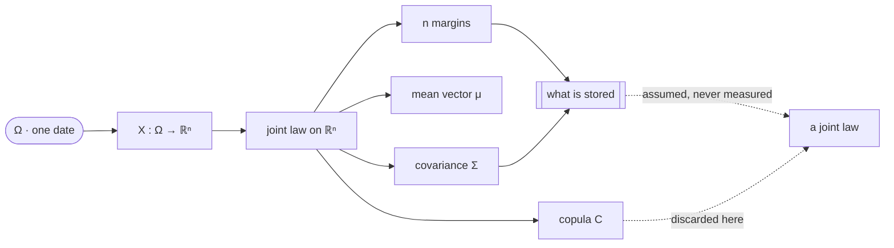

# Multivariate Random Variables

A random vector is one map into $\mathbb{R}^{n}$, not $n$ maps into the line, and every difficulty in this part follows from that being a much stronger statement than it sounds. Parts III and IV worked with two indexed scalars and refused to write a vector; the refusal was deliberate. The moment the coordinates are stacked they must be evaluated at the same $\omega$, and almost every failure a risk system has with dependence is a failure to hold $\omega$ fixed.

This page covers the random vector as a single map and the notation the rest of this part will use for it, the mean vector and the one property it has unconditionally, what a risk system stores against what a joint law contains, independence as an $n$-way factorization that pairs cannot certify, and the sample size an estimated joint density would actually need. It does not develop the algebra of vectors and matrices themselves, which is [Basic Linear Algebra Review](../part-01-mathematical-foundations/05-linear-algebra-review.md); it does not build the second-moment matrix, which is [Covariance Matrices](02-covariance-matrices.md); it does not repeat the two-variable joint law, which is [Joint Distributions](../part-03-random-variables/05-joint-distributions.md) and [Marginal Distributions](../part-03-random-variables/06-marginal-distributions.md); and it assumes no distribution, so the one family whose joint law really is two moments is [Multivariate Gaussian Distribution](05-multivariate-gaussian.md).

The trading stake is a sample size that nobody chose. [Probability and Random Variables](../../part-03-statistics/01-probability-and-random-variables.md) reports Pearson correlations of $-0.31$, $+0.05$ and $+0.16$ across SPY, TLT and GLD, computed on $5{,}184$ *common* days from 2004-11-19 — an intersection, not a sample, and shorter than any of the three histories it was cut from. Three price series are three random variables; one $5{,}184\times3$ matrix is a random vector, and the distance between those two objects is what the last section of this page is about.

## A Random Vector Is One Map, Not a List of Maps

A random vector on a probability space $(\Omega,\mathcal{F},\mathbf{P})$ is a single measurable map

$$X:\Omega\to\mathbb{R}^{n},\qquad X(\omega)=\big(X_1(\omega),\ldots,X_n(\omega)\big)^\top,$$

and the word doing the work is *single*. Each $X_i$ is a random variable in the sense of [Random Variables](../part-03-random-variables/01-random-variables.md), but the object of study is the map, and the map carries information that no list of its coordinates does: which values occur together. That information is what a joint distribution function records,

$$F_X(x)=\mathbf{P}\big(X_1\le x_1,\ldots,X_n\le x_n\big),\qquad x\in\mathbb{R}^{n},$$

where the inequality is read coordinatewise and the comma is a conjunction — the event is one event, holding at one $\omega$, not $n$ events collected afterwards. When a density exists it is a function on $\mathbb{R}^{n}$ whose integral over the lower orthant is $F_X$, and it inherits the same reading.

The notation below is fixed for the whole part, and the shapes are load-bearing: a great many errors in this material are shape errors wearing an economic disguise.

| Symbol | Shape | What it is |
|---|---|---|
| $X$ | $n\times1$ | the random vector; $X(\omega)$ is one draw, all coordinates at one $\omega$ |
| $x$ | $n\times1$ | a value it may take, so $\{X\le x\}$ is a single event |
| $\mu=\mathbb{E}[X]$ | $n\times1$ | the mean vector, defined coordinatewise |
| $\Sigma=\mathrm{cov}(X)$ | $n\times n$ | the covariance matrix, the subject of the next page |
| $R$ | $T\times N$ | realised returns; rows are dates, columns are assets |
| $w$ | $N\times1$ | portfolio weights, so $w^\top R_t$ is one day's portfolio return |
| $\mathbf{1}$ | $n\times1$ | the vector of ones, the only vector this part writes in bold |

Vectors are columns and are written in lowercase italics rather than bold, matrices in uppercase italics, and the transpose is $^\top$. The convention that $R$ is $T\times N$ rather than $N\times T$ is not arbitrary: it makes a row a *date*, which is the unit at which the same-$\omega$ requirement is enforced, and it is the layout `np.cov(R, rowvar=False)` expects.

## The Mean Vector Needs No Assumption at All

The first moment is defined one coordinate at a time, $\mu_i=\mathbb{E}[X_i]$, and it inherits the whole of linearity from the scalar case. For any $A\in\mathbb{R}^{m\times n}$ and any $b\in\mathbb{R}^{m}$,

$$\mathbb{E}[AX+b]=A\mu+b.$$

No hypothesis about dependence appears anywhere in that statement, and none is needed.

??? note "Proof that expectation commutes with every linear map, with no hypothesis on dependence"
    Write $Y=AX+b$, so that the $i$-th coordinate is the scalar random variable

    $$Y_i=\sum_{j=1}^{n}A_{ij}X_j+b_i.$$

    Expectation of a finite sum of scalars is the sum of the expectations, and expectation of a constant multiple is the multiple of the expectation — both established in [Expected Value](../part-04-expectation-and-moments/01-expected-value.md) for arbitrary integrable random variables. Applying them term by term,

    $$\mathbb{E}[Y_i]=\sum_{j=1}^{n}A_{ij}\mathbb{E}[X_j]+b_i=\sum_{j=1}^{n}A_{ij}\mu_j+b_i=(A\mu+b)_i,$$

    and since $i$ was arbitrary the vector identity follows. The only hypothesis used is that each $\mathbb{E}[X_j]$ exists.

    It is worth naming what was *not* used, because the contrast organises the rest of this part. Nothing about independence, nothing about the shape of any margin, nothing about the existence of a second moment, and nothing about the joint law beyond its coordinates having means. Linearity of expectation is blind to dependence, which is why a mean vector can be estimated one coordinate at a time, on whatever data each coordinate happens to have, and still be correct. The object of the next page has no such property: dependence is its entire content, and estimating it a piece at a time destroys it.

```python
import numpy as np

rng = np.random.default_rng(601)
mu = np.array([0.0004, 0.0002, 0.0006])                        # SPY, TLT, GLD scale
sd = np.array([0.011, 0.008, 0.014])
A = np.array([[1.0, 1.0, 1.0], [1.0, -1.0, 0.0], [0.6, 0.2, 0.2]])
b = np.array([-0.02, 0.0, 0.01])                               # a fee, a basis, a hurdle
T, rho = 2_000_000, 0.6
f = rng.standard_normal((T, 1))
e = rng.standard_normal((T, 3))
dep = mu + sd * (np.sqrt(rho) * f + np.sqrt(1 - rho) * e)      # one shared factor
ind = mu + sd * rng.standard_normal((T, 3))                    # identical margins, no factor
print("  the mean vector under two dependence structures with identical margins")
print("       system         A mu + b                     sample mean of AX + b        max err")
for name, X in (("one factor", dep), ("independent", ind)):
    lhs, rhs = A @ mu + b, (X @ A.T).mean(axis=0) + b
    print(f"  {name:>12s}  {lhs[0]:9.5f} {lhs[1]:9.5f} {lhs[2]:9.5f}"
          f"  {rhs[0]:9.5f} {rhs[1]:9.5f} {rhs[2]:9.5f}  {np.abs(lhs - rhs).max():9.2e}")
cd, ci = np.cov(dep, rowvar=False), np.cov(ind, rowvar=False)
off = ~np.eye(3, dtype=bool)
print(f"  margins agree:  max |sd(dep) - sd(indep)| {np.abs(np.sqrt(np.diag(cd)) - np.sqrt(np.diag(ci))).max():9.2e}")
print(f"  second moments do not:  mean pairwise correlation"
      f"  one factor {np.corrcoef(dep, rowvar=False)[off].mean():7.4f}"
      f"   independent {np.corrcoef(ind, rowvar=False)[off].mean():7.4f}")
print(f"  variance of the equal-sum row w = (1,1,1):"
      f"  one factor {A[0] @ cd @ A[0]:9.3e}   independent {A[0] @ ci @ A[0]:9.3e}"
      f"   ratio {(A[0] @ cd @ A[0]) / (A[0] @ ci @ A[0]):6.2f}")
# =>   the mean vector under two dependence structures with identical margins
#           system         A mu + b                     sample mean of AX + b        max err
#        one factor   -0.01880   0.00020   0.01040   -0.01877   0.00020   0.01041   2.66e-05
#       independent   -0.01880   0.00020   0.01040   -0.01878   0.00021   0.01041   1.85e-05
#      margins agree:  max |sd(dep) - sd(indep)|  4.42e-06
#      second moments do not:  mean pairwise correlation  one factor  0.6004   independent  0.0005
#      variance of the equal-sum row w = (1,1,1):  one factor 8.061e-04   independent 3.813e-04   ratio   2.11
```

Two systems, built to have the same three marginal laws to within $4.4\times10^{-6}$ in standard deviation, differ in nothing but which $\omega$ their coordinates share. The mean of the transformed vector lands on $A\mu+b$ under both, to within $2.7\times10^{-5}$ on two million draws, and the independent system is the control confirming the agreement is not an artefact of the factor structure. Every row of $A$ is reproduced: the equal-weight sum, the long–short spread, and the weighted blend, intercepts and all.

What separates the systems is the second moment, and it separates them completely. Mean pairwise correlation is $0.6004$ against $0.0005$, and the variance of the equal-weight sum is larger by a factor of $2.11$. A desk that estimated each asset's expected return on that asset's own history and then combined the estimates with $A$ would be right. A desk that estimated each asset's *volatility* on its own history and combined it the same way would be wrong by a factor it has no way of seeing, because the number it needed was never in the per-asset files.

!!! warning "Aligning several series on their common dates silently changes the sample that every risk number is then computed on"
    The $5{,}184$ common days are not a sample anybody selected; they are the intersection of three calendars, and the intersection is shorter than each series and differently distributed from all of them. Whatever was dropped — a market's holidays, a vendor's gaps, a listing that started late — was dropped by an operation that ran before any statistics were computed and that appears in no output. The tempting repair, estimating each pair on whatever days that pair happens to share, is worse rather than better: it produces a table whose entries come from different probability spaces, and [Covariance](../part-04-expectation-and-moments/04-covariance.md) already shows at $n=3$ that such a table need not be the covariance structure of anything at all. Non-synchronous closes are the same defect in continuous form, since a New York close and a Tokyo close carrying one calendar date are not one $\omega$.

## What a Risk System Stores Is Strictly Less Than What It Needs

A joint law on $\mathbb{R}^{N}$ is a function, and a function on $\mathbb{R}^{N}$ has no finite description. What a risk system holds instead is $N$ marginal descriptions and a table of $\binom{N}{2}$ pairwise numbers, so the gap between what is stored and what is needed is the gap between

$$N+\binom{N}{2}=\frac{N(N+1)}{2}\ \ \text{numbers}\qquad\text{and}\qquad\text{a law on }\mathbb{R}^{N},$$

and it is not a gap that more storage closes. [Marginal Distributions](../part-03-random-variables/06-marginal-distributions.md) names the missing object — the copula — and measures the cost at $n=2$, where two models with identical margins and identical correlation disagree about the joint $0.1\%$ tail by a factor of $5.67$. The block below asks what that factor becomes when nine assets have to fail together.

```python
import numpy as np
from scipy.stats import norm, t

rng = np.random.default_rng(607)
n, nu, T, rho = 9, 4, 400_000, 0.619                           # nine sectors, published rho


def draws(disp, heavy):
    L = np.linalg.cholesky((1 - disp) * np.eye(n) + disp)
    z = rng.standard_normal((T, n)) @ L.T
    if not heavy:
        return z                                               # normal margins already
    w = rng.chisquare(nu, (T, 1)) / nu
    return norm.ppf(t.cdf(z / np.sqrt(w), nu))                 # t copula, normal margins


off = ~np.eye(n, dtype=bool)
lo, hi = rho, 0.95                                             # calibrate the t copula to rho
for _ in range(12):
    mid = (lo + hi) / 2
    lo, hi = (mid, hi) if np.corrcoef(draws(mid, True), rowvar=False)[off].mean() < rho else (lo, mid)
print(f"  nine standard normal margins, mean pairwise correlation forced to {rho}")
print(f"  t{nu} copula dispersion calibrated to {(lo + hi) / 2:.4f}")
print("        model        mean rho   mean sd   mean exc kurt   all 9 < own 25%   all 9 < own 10%")
for name, x in (("gaussian", draws(rho, False)), (f"t{nu} copula", draws((lo + hi) / 2, True)),
                ("independent", rng.standard_normal((T, n)))):
    k = (((x - x.mean(0)) / x.std(0)) ** 4).mean(0) - 3
    q25, q10 = np.quantile(x, 0.25, axis=0), np.quantile(x, 0.10, axis=0)
    print(f"  {name:>13s} {np.corrcoef(x, rowvar=False)[off].mean():10.4f} {x.std(0).mean():9.4f}"
          f" {k.mean():14.4f} {(x < q25).all(axis=1).mean():17.3e} {(x < q10).all(axis=1).mean():17.3e}")
print(f"  exact under independence:{'':25s}{0.25 ** n:17.3e} {0.10 ** n:17.3e}")
# =>   nine standard normal margins, mean pairwise correlation forced to 0.619
#      t4 copula dispersion calibrated to 0.6266
#            model        mean rho   mean sd   mean exc kurt   all 9 < own 25%   all 9 < own 10%
#           gaussian     0.6196    1.0000        -0.0011         3.300e-02         5.305e-03
#          t4 copula     0.6185    0.9997        -0.0037         3.752e-02         9.007e-03
#        independent    -0.0000    0.9998        -0.0026         5.000e-06         0.000e+00
#      exact under independence:                                 3.815e-06         1.000e-09
```

Every per-asset diagnostic agrees. All nine margins are standard normal by construction in both models, with mean standard deviation $1.0000$ against $0.9997$ and mean excess kurtosis within $0.004$ of zero — a normality test run on any single column passes in both cases, because in both cases the column *is* normal. The mean pairwise correlation was forced to agree by calibrating the $t_4$ copula's dispersion to $0.6266$, and it does agree, at $0.6196$ against $0.6185$.

The joint tail does not agree, and the disagreement grows with depth. At the quartile the two models are within $14\%$ of each other; at the decile the $t_4$ copula puts all nine sectors below their own tenth percentile on $0.90\%$ of days against the Gaussian's $0.53\%$, a ratio of $1.70$. This is the nine-dimensional version of the $5.67\times$ that [Marginal Distributions](../part-03-random-variables/06-marginal-distributions.md) measured at $n=2$, and the shape of the pattern is the same: agreement where a model is validated, divergence where it is used.

The independent row is the control, and it is the one worth keeping. It has the same margins as the other two and a correlation of zero, and its joint decile probability is $10^{-9}$ — not observed once in four hundred thousand draws. Between independence and the Gaussian copula there is a factor of five million; between the Gaussian copula and the $t_4$ there is a factor of $1.7$. Both differences live entirely in the object that the per-asset files do not contain.



The two routes into the rightmost node are the point. The downward path from the law to the margins, the mean and the covariance is a set of theorems: each object is a well-defined functional of the joint law, and computing it loses information in a known way. The path back up is not a theorem. Reassembling a joint law from stored margins and a stored covariance requires a copula that was never measured, and the dashed edges mark where an assumption entered a calculation that will later be described as a measurement.

## Independence Is Not a Property You Can Check in Pairs

Independence of a random vector is the statement that its joint law factorizes completely,

$$F_X(x)=\prod_{i=1}^{n}F_{X_i}(x_i)\quad\text{for every }x\in\mathbb{R}^{n},$$

with the equivalent statements in terms of $f_X$ and $p_X$ established at $n=2$ by [Joint Distributions](../part-03-random-variables/05-joint-distributions.md). This is one constraint on a function of $n$ arguments. Pairwise independence is $\binom{n}{2}$ constraints on functions of two arguments, and the two are not the same requirement.

??? note "Proof that pairwise independence does not imply independence, in the smallest possible example"
    Let $X_1$ and $X_2$ be independent fair bits, each taking the values $0$ and $1$ with probability $\tfrac12$, and set $X_3=X_1\oplus X_2$, the parity. Then $X_3$ is also a fair bit: conditioned on either input it is the other input or its complement, and both are uniform on $\{0,1\}$.

    Take any pair. The pair $(X_1,X_2)$ is independent by construction. For $(X_1,X_3)$, each of the four value combinations arises from exactly one of the four equally likely $(X_1,X_2)$ outcomes, so

    $$\mathbf{P}(X_1=a,X_3=c)=\tfrac14=\tfrac12\cdot\tfrac12=\mathbf{P}(X_1=a)\,\mathbf{P}(X_3=c),$$

    and the same count settles $(X_2,X_3)$. All three pairs are independent.

    The triple is not. The outcomes of $(X_1,X_2,X_3)$ that occur are exactly those with $X_1\oplus X_2\oplus X_3=0$, so $\mathbf{P}(X_1=1,X_2=1,X_3=1)=0$ while the product of the three marginals is $\tfrac18$. Any two coordinates determine the third exactly, which is as far from independence as three binary variables can be.

    The hypothesis that fails is not one of the pairwise ones — every pairwise check passes, and would pass at any sample size. What fails is a constraint on the *joint* mass function that no pair can see, and the covariance matrix is no help either: each coordinate has variance $\tfrac14$ and every pair is uncorrelated, so the covariance matrix of this vector is exactly $\tfrac14 I$, a diagonal matrix belonging to a vector whose coordinates are deterministic functions of one another. This is the $n$-dimensional form of the converse that [Covariance](../part-04-expectation-and-moments/04-covariance.md) declined to give, and it is worth carrying forward: a diagonal covariance matrix certifies nothing. The one family in which it does certify independence is the subject of [Multivariate Gaussian Distribution](05-multivariate-gaussian.md), and there it is a theorem about the family rather than about diagonality.

!!! note "Every object in this part is one expectation over one probability space, which is why none of them can be assembled a piece at a time"
    A mean vector, a covariance matrix, a correlation matrix and a conditional law are all functionals of a single joint law, evaluated at one $\omega$ at a time. That is why the mean vector tolerates ragged assembly and nothing else does: it is the one functional that decomposes into $n$ separate one-dimensional integrals, so the pieces never have to meet. Every subsequent object on every subsequent page puts at least two coordinates inside one expectation, and the moment two coordinates share an integral they must share a sample. The practical form of this is a discipline rather than a theorem, and it is stated at the end of this page.

## Estimating a Joint Law Is Exponentially Hopeless

The natural response to the previous two sections is to stop assuming and start estimating: if the copula is the missing object, measure it. The obstacle is that the space it lives in is empty at any sample size a market has ever produced.

??? note "Proof that almost all of a high-dimensional cube lies within epsilon of its boundary"
    Let $X$ be uniform on the unit cube $[0,1]^{d}$ with independent coordinates, and fix $\varepsilon\in(0,\tfrac12)$. Call a point *interior* when every coordinate lies in $[\varepsilon,1-\varepsilon]$. Each coordinate satisfies that with probability $1-2\varepsilon$, and the coordinates are independent, so

    $$\mathbf{P}\big(X\in[\varepsilon,1-\varepsilon]^{d}\big)=(1-2\varepsilon)^{d},$$

    which decays geometrically in $d$. At $\varepsilon=0.05$ the interior holds $90\%$ of the mass in one dimension, $59\%$ in five, and about $0.0027\%$ in one hundred, so a shell of thickness one twentieth contains essentially the whole cube.

    Independence across coordinates is the hypothesis, and the interesting thing is the direction in which it is load-bearing. Dependence makes the situation *better*, not worse. A cloud in $\mathbb{R}^{d}$ generated by $k$ common factors occupies an effectively $k$-dimensional set however large $d$ is, and a sample only has to fill that set rather than the cube containing it. So the curse is real and finance is not defeated by it, and the reason is that returns are not independent across assets — the very structure that made the previous two sections difficult is what makes this one survivable. The object recording how few directions actually carry variance is the covariance matrix, and reading its spectrum for that purpose is [Correlation Matrices](03-correlation-matrices.md).

```python
import numpy as np

rng = np.random.default_rng(613)
T = 1_000                                                      # four years of daily data
print(f"  {T} points in the unit cube, as the number of coordinates grows")
print("      d   in [0.05,0.95]^d   exact 0.9^d    nearest/sqrt(d)   farthest/nearest")
for d in (1, 2, 5, 10, 20, 50, 100):
    x = rng.random((T, d))
    dist = np.sqrt(((x[:, None, :] - x[None, :, :]) ** 2).sum(axis=2))
    np.fill_diagonal(dist, np.inf)
    near, far = dist.min(axis=1), np.where(np.isinf(dist), -np.inf, dist).max(axis=1)
    print(f"  {d:5d} {((x > 0.05) & (x < 0.95)).all(axis=1).mean():17.3f} {0.9 ** d:13.3e}"
          f" {near.mean() / np.sqrt(d):18.4f} {(far / near).mean():18.2f}")
# =>   1000 points in the unit cube, as the number of coordinates grows
#          d   in [0.05,0.95]^d   exact 0.9^d    nearest/sqrt(d)   farthest/nearest
#          1             0.899     9.000e-01             0.0005           20926.05
#          2             0.795     8.100e-01             0.0111             104.06
#          5             0.595     5.905e-01             0.0792               9.05
#         10             0.337     3.487e-01             0.1592               3.86
#         20             0.110     1.216e-01             0.2321               2.40
#         50             0.003     5.154e-03             0.2995               1.69
#        100             0.000     2.656e-05             0.3322               1.44
```

The interior column tracks $(1-2\varepsilon)^{d}$ closely at every $d$, which is the proof restated as a count: with a thousand points and fifty coordinates, three are interior, and with a hundred coordinates, none are. The control is the $d=1$ row, where $89.9\%$ of points are interior against an exact $90\%$ and the geometry is the familiar one.

The last column is what matters for estimation. In one dimension the farthest of a thousand points is twenty thousand times as far as the nearest, so *near* and *far* are different words. By $d=50$ the ratio is $1.69$ and by $d=100$ it is $1.44$: every point is very nearly the same distance from every other point, and the mean nearest-neighbour distance has grown to a third of the cube's own scale. A density estimate at a query point is an average over that point's neighbours, and there are no neighbours — there is a shell of roughly equidistant strangers. This is why no amount of history estimates a nine-dimensional joint law nonparametrically, and why the rest of this part is about a *parameterization* of dependence rather than a measurement of it.

## One Omega at a Time

Everything on this page reduces to one requirement, stated once at the top and then violated in five different ways: the coordinates of a random vector are read at the same $\omega$. Every theorem in this part presumes it, and no formula checks it.

Operationally $\omega$ is a date, and the ways it goes wrong are unglamorous. Two exchanges close seven hours apart and the row carrying one date holds two different days. A vendor's series begins in 2004, and the intersection of three such series discards a decade nobody discussed. A pair of assets is missing on different days, and a pairwise-complete estimator quietly computes each entry of a matrix on its own sample. A stale print carries yesterday's value into today's row. Each of these produces numbers that look exactly like findings — a correlation that has fallen, a diversification benefit that has appeared — and each is an artefact of the row rather than the market.

The practical rule is to build the $T\times N$ matrix once, on one calendar, with one explicit policy for what a missing value means, and to compute every moment from that single object. The rule is cheap, it is checkable by printing one shape, and it is the only defence against a class of error that no downstream diagnostic detects, because every downstream diagnostic is computed from the same corrupted rows. Never estimate an entry of a covariance matrix on a sample that no other entry was estimated on.
