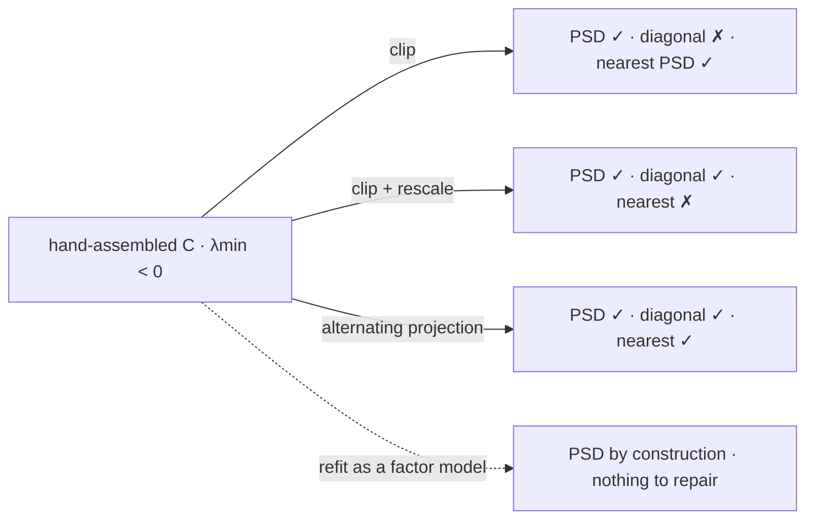

# Correlation Matrices

A correlation matrix is a covariance matrix with the units divided out and one extra constraint bolted on, and that constraint — a diagonal of exactly ones — turns out to do more work than the division. It makes the matrix far harder to repair than the covariance matrix it came from, and it makes the eigenvalues a fixed budget rather than a free quantity. The budget is the sharpest thing a correlation matrix has to say and the thing almost never said about it: a crisis cannot enlarge it, only concentrate it.

This page covers the standardization that turns $\Sigma$ into $C$ and the constraint it adds, the trace identity that makes the spectrum a budget of exactly $N$, the four diversification diagnostics that read that budget and disagree about it, the equicorrelation matrix whose spectrum is closed-form and whose common correlation cannot fall below $-1/(N-1)$, and why repairing a correlation matrix is a strictly harder problem than repairing a covariance matrix. It does not define a scalar correlation, prove its bound, or derive $N_{\text{eff}}$, which are [Correlation](../part-04-expectation-and-moments/05-correlation.md); it does not develop the spectral theorem or principal components, which are [Basic Linear Algebra Review](../part-01-mathematical-foundations/05-linear-algebra-review.md); it does not parameterize the dependence a correlation compresses, which is [Copulas](../part-18-quant-finance-applications/15-copulas.md); and it conditions on nothing, so what a crisis does to these numbers is [Conditional Gaussian Distributions](06-conditional-gaussian.md).

The trading stake is four numbers measured on one universe. [Risk Parity, Diversification, and Factors](../../part-08-portfolio-management/03-risk-parity-diversification-factors.md) reports nine sector ETFs as an effective rank of $3.62$, $1.03$ effective bets at equal weight, a mean pairwise correlation of $+0.619$, and a first principal component absorbing $66.6\%$ of the variance. Three of those four follow from the fourth and nothing else, and the first code block below produces them from $\rho=0.619$ alone, with no returns data of any kind.

## Dividing Out the Units Adds a Constraint

Writing $D=\mathrm{diag}(\Sigma)$ for the diagonal matrix of variances, the correlation matrix is

$$C=D^{-1/2}\,\Sigma\,D^{-1/2},\qquad C_{ij}=\frac{\Sigma_{ij}}{\sqrt{\Sigma_{ii}\Sigma_{jj}}},\qquad C_{ii}=1,$$

which is the scalar standardization of [Correlation](../part-04-expectation-and-moments/05-correlation.md) applied entrywise. It is also a congruence transformation, so it preserves positive semi-definiteness in both directions: $w^\top Cw=(D^{-1/2}w)^\top\Sigma(D^{-1/2}w)\ge0$, and the map is invertible whenever no variance is zero. A correlation matrix is therefore exactly a PSD matrix with unit diagonal.

That last sentence contains the whole difficulty. The set of PSD matrices is a convex cone, closed under addition, under non-negative scaling, and under the eigenvalue clipping that [Covariance Matrices](02-covariance-matrices.md) uses as its repair. The set of correlation matrices — the *elliptope* — is the intersection of that cone with $N$ affine constraints, and it is convex but not a cone: it is not closed under scaling, it is not closed under clipping, and the average of two correlation matrices is a correlation matrix only because the constraints happen to be linear. Every operation this part performs on a covariance matrix has to be re-examined here, and one of them will not survive.

## The Spectrum Is a Budget of Exactly N

Because the diagonal is all ones, the trace is fixed, and the trace is the sum of the eigenvalues:

$$\mathrm{tr}(C)=\sum_{i=1}^{N}C_{ii}=N=\sum_{i=1}^{N}\lambda_i.$$

This holds for every correlation matrix of every $N$ assets under every dependence structure, measured in any regime. There is no correlation matrix with a large spectrum and none with a small one. Whatever the market does, the eigenvalues sum to the number of assets, and the only thing that can change is how that total is spread across directions.

??? note "Proof that an equicorrelation matrix has exactly two eigenvalues, and that rho cannot fall below minus one over N minus one"
    Let $C=(1-\rho)I+\rho\,\mathbf{1}\mathbf{1}^\top$, the matrix with ones on the diagonal and $\rho$ everywhere else. The vector $\mathbf{1}$ satisfies $\mathbf{1}\mathbf{1}^\top\mathbf{1}=N\mathbf{1}$, so

    $$C\mathbf{1}=(1-\rho)\mathbf{1}+\rho N\mathbf{1}=\big(1+(N-1)\rho\big)\mathbf{1},$$

    making $\mathbf{1}$ an eigenvector with eigenvalue $\lambda_1=1+(N-1)\rho$. For any $v$ orthogonal to $\mathbf{1}$ the outer-product term annihilates it, $\mathbf{1}\mathbf{1}^\top v=0$, so $Cv=(1-\rho)v$ and the whole $(N-1)$-dimensional orthogonal complement is an eigenspace with $\lambda=1-\rho$. There are no other eigenvalues, and the trace check confirms it: $\big(1+(N-1)\rho\big)+(N-1)(1-\rho)=N$.

    Positive semi-definiteness requires both eigenvalues to be non-negative, so $\rho\le1$ from the second and

    $$\rho\ \ge\ -\frac{1}{N-1}$$

    from the first. At $N=2$ this is $\rho\ge-1$ and says nothing new; at $N=9$ it is $\rho\ge-0.125$; at $N=50$ it is $\rho\ge-0.0204$.

    The tighter floor comes from the *equicorrelation* hypothesis and not from Cauchy–Schwarz. The pairwise bound $\lvert\rho\rvert\le1$ of [Correlation](../part-04-expectation-and-moments/05-correlation.md) survives any number of variables and is never violated by any single entry here. What forces the floor is the demand that all $\binom{N}{2}$ pairs share one value, which is a constraint on the matrix rather than on any pair. Nine assets cannot all be pairwise correlated at $-0.2$, however much a book would like them to be, and the reason is arithmetic rather than economics.

!!! note "The trace of a correlation matrix is N whatever the correlations are, so diversification is a question about how a fixed budget is spread and never about its size"
    The eigenvalues of $C$ are the variances of the uncorrelated portfolios that the spectral theorem produces, rescaled so they sum to $N$. When the market is calm that budget is spread widely and there are many roughly equal directions; when it is not, one direction absorbs most of it and the rest collapse toward zero. Neither state has more total variance to allocate. This is why "correlations rose" and "the first principal component grew" are the same event described at different resolutions, and why the second description is the more useful one: a mean correlation is one number summarising $N$, while the spectrum is the $N$ numbers themselves, and the tail of the spectrum is where the directions a book believed it owned go to disappear.

## Four Diagnostics Read the Same Budget and Disagree

Given the budget, the natural question is how concentrated it is, and the literature offers at least four answers. Writing $p_i=\lambda_i/N$ for the normalised spectrum and $r_i$ for the share of a *portfolio's* variance carried by the $i$-th principal direction, they are the leading share $\lambda_1/N$; the effective rank $\exp(-\sum_ip_i\log p_i)$; the participation ratio $(\sum_i\lambda_i)^{2}/\sum_i\lambda_i^{2}$, which [Distributed Backtesting](../../advanced/09-distributed-backtesting.md) uses to find seventy-nine independent trials inside ten thousand parameter sweeps; and Meucci's effective number of bets $\exp(-\sum_ir_i\log r_i)$. Part IV's $N_{\text{eff}}=N/(1+(N-1)\rho)$ is a fifth, computed from the mean correlation rather than from the spectrum.

??? note "Proof that an equal-weight book on an equicorrelated universe holds exactly one effective bet"
    Meucci's count projects the weights onto the principal directions and takes the exponential entropy of the resulting risk shares. With $C=Q\Lambda Q^\top$ and weights $w$, the share carried by direction $i$ is $r_i=(q_i^\top w)^{2}\lambda_i/(w^\top Cw)$, and the count is $\exp(-\sum_ir_i\log r_i)$.

    Under equicorrelation the previous proof showed $\mathbf{1}$ is the top eigenvector. The equal-weight vector is $w=\mathbf{1}/N$, which is $\mathbf{1}$ rescaled, so $w$ *is* the top eigenvector. Every other eigenvector is orthogonal to $\mathbf{1}$ and therefore to $w$, giving $q_i^\top w=0$ for $i\ge2$. Hence $r=(1,0,\ldots,0)$, the entropy is $-1\log1=0$, and

    $$\mathrm{ENB}=\exp(0)=1$$

    exactly, for every $N\ge2$ and every admissible $\rho>0$ — the count does not depend on how large the correlation is, only on the alignment.

    The load-bearing hypothesis is that the weight vector is an eigenvector, which happens exactly under equicorrelation with equal weights and essentially never otherwise. When it fails, ENB and Part IV's $N_{\text{eff}}$ genuinely differ, and on this very matrix they differ by half: $1.00$ against $1.51$. That gap is not a disagreement between two definitions of the same quantity. $N_{\text{eff}}$ answers how many independent assets would reproduce this portfolio's *variance*, and ENB answers how many principal directions the portfolio's risk is *spread across*; the first is a statement about a number and the second about a decomposition. Report one of them without the other and the reader cannot tell which question was answered.

```python
import numpy as np

N, rho = 9, 0.619                                              # nine sector ETFs, published


def diagnostics(C, w):
    ev, Q = np.linalg.eigh(C)
    ev, Q = ev[::-1], Q[:, ::-1]
    p = ev / ev.sum()
    r = (Q.T @ w) ** 2 * ev                                    # risk in each principal direction
    r = r / r.sum()
    return (ev[0] / N, np.exp(-(p * np.log(p)).sum()), ev.sum() ** 2 / (ev ** 2).sum(),
            np.exp(-(r * np.log(np.maximum(r, 1e-300))).sum()), N / (1 + (N - 1) * C[0, 1]))


eq = np.ones(N) / N
print(f"  equicorrelated C at N = {N}, rho = {rho}:  trace {np.trace((1 - rho) * np.eye(N) + rho):.1f},"
      f"  eigenvalues {1 + (N - 1) * rho:.3f} once and {1 - rho:.3f} {N - 1} times")
print("      rho    PC1 share   effective rank   participation   Meucci ENB   Part IV N_eff")
for r in (0.0, 0.2, rho, 0.9):
    d = diagnostics((1 - r) * np.eye(N) + r, eq)
    print(f"  {r:7.3f} {d[0]:12.4f} {d[1]:16.4f} {d[2]:15.4f} {d[3]:12.4f} {d[4]:15.4f}")
print(f"  {'published':>7s} {0.666:12.4f} {3.62:16.4f} {'--':>15s} {1.03:12.4f} {1.51:15.4f}")
# =>   equicorrelated C at N = 9, rho = 0.619:  trace 9.0,  eigenvalues 5.952 once and 0.381 8 times
#          rho    PC1 share   effective rank   participation   Meucci ENB   Part IV N_eff
#        0.000       0.1111           9.0000          9.0000       9.0000          9.0000
#        0.200       0.2889           8.0034          6.8182       1.0000          3.4615
#        0.619       0.6613           3.8358          2.2139       1.0000          1.5121
#        0.900       0.9111           1.6238          1.2032       1.0000          1.0976
#      published       0.6660           3.6200              --       1.0300          1.5100
```

The $\rho=0.619$ row is the whole argument. One scalar, pushed through the closed-form spectrum of the previous proof, reproduces a first principal component of $66.13\%$ against the published $66.6\%$, an effective rank of $3.84$ against $3.62$, an effective bet count of $1.00$ against $1.03$, and a Part IV $N_{\text{eff}}$ of $1.512$ against $1.51$. No returns were loaded and no covariance was estimated. The published numbers were computed from twenty-five years of daily data on nine real sectors, and they are recovered to within a few percent by a matrix that contains one piece of information.

What that means is that the residual — the difference between $66.13\%$ and $66.6\%$, between $3.84$ and $3.62$ — is *all* the structure the nine sectors have beyond a single common correlation. It is not nothing, and it is not much. The control row at $\rho=0$ confirms the diagnostics are working rather than degenerate: nine eigenvalues of exactly $1$, a leading share of $11.1\%$, and effective rank, participation ratio and bet count all reading exactly $9.00$.

The four columns disagree, and they disagree by a lot. At $\rho=0.619$ the universe contains $3.84$ independent directions by the entropy measure and $2.21$ by the participation ratio, while the equal-weight portfolio built on it holds exactly $1.00$ bet and would be described as $1.51$ by the mean-correlation formula. Every one of those numbers is correctly computed. They differ because "how many bets" is four different questions, and the $\mathrm{ENB}=1.0000$ column — constant at every positive $\rho$ — shows why the portfolio-specific ones are the dangerous kind to quote alone: a book can hold one bet in a universe that offers four, and nothing about the universe's richness will fix that.

## Equicorrelation Bounds ρ From Below, and Not at -1

The floor derived above is easy to state and easy to forget, and forgetting it produces requests that no data can satisfy.

```python
import numpy as np

print("  the equicorrelation floor: how negative can every pair be at once")
print("      N    floor -1/(N-1)   lmin at floor   lmin 0.01 below   PSD below the floor")
for N in (2, 3, 5, 9, 20, 50):
    floor = -1 / (N - 1)
    at = np.linalg.eigvalsh((1 - floor) * np.eye(N) + floor)[0]
    below = np.linalg.eigvalsh((1 - (floor - 0.01)) * np.eye(N) + floor - 0.01)[0]
    print(f"  {N:5d} {floor:16.4f} {at:15.2e} {below:17.4f} {str(below >= -1e-12):>21s}")
N = 9
for r in (-0.20, -0.125, -0.10):
    C = (1 - r) * np.eye(N) + r
    w = np.ones(N)
    print(f"  N = 9 with every pair at {r:6.3f}:  lmin {np.linalg.eigvalsh(C)[0]:8.4f},"
          f"  variance of the equal-weight book {w @ C @ w / N ** 2:9.4f}")
# =>   the equicorrelation floor: how negative can every pair be at once
#          N    floor -1/(N-1)   lmin at floor   lmin 0.01 below   PSD below the floor
#          2          -1.0000        0.00e+00           -0.0100                 False
#          3          -0.5000       -5.55e-17           -0.0200                 False
#          5          -0.2500       -1.67e-16           -0.0400                 False
#          9          -0.1250        3.47e-17           -0.0800                 False
#         20          -0.0526       -5.55e-17           -0.1900                 False
#         50          -0.0204       -1.94e-16           -0.4900                 False
#      N = 9 with every pair at -0.200:  lmin  -0.6000,  variance of the equal-weight book   -0.0667
#      N = 9 with every pair at -0.125:  lmin   0.0000,  variance of the equal-weight book    0.0000
#      N = 9 with every pair at -0.100:  lmin   0.2000,  variance of the equal-weight book    0.0222
```

The floor is exact rather than asymptotic. At every $N$ the smallest eigenvalue at $\rho=-1/(N-1)$ is zero to machine precision, and one hundredth of a point below it the matrix is indefinite. The control is $N=2$, where the floor is $-1.0000$ and the constraint reduces to the familiar scalar bound; from three assets onward the multivariate bound is strictly tighter, and by fifty assets it forbids anything below $-0.02$.

The bottom three lines translate the arithmetic into a portfolio. A request for nine assets all pairwise correlated at $-0.2$ is a request for an equal-weight book with a variance of $-0.0667$, which is not a difficult portfolio to build but an impossible object to describe. At exactly $-0.125$ the variance is zero — the floor is attained by a book that is riskless, which is the correct reading of the bound: perfect mutual diversification is the boundary of the admissible set, not a point inside it. The diversification most books want is not scarce; past a certain point it is arithmetically unavailable, and that limit tightens as the universe widens.

## Repairing a Correlation Matrix Is Harder Than Repairing a Covariance Matrix

[Covariance Matrices](02-covariance-matrices.md) closes with three repairs and a proof that eigenvalue clipping is the nearest PSD matrix in Frobenius norm. That proof works by rotating into the eigenbasis, which is legitimate because the Frobenius norm is orthogonally invariant and the PSD constraint is too. The unit-diagonal constraint is neither, and the consequence is immediate.

??? note "Proof that clipping a negative eigenvalue raises the diagonal by exactly the mass it removed"
    Let $C=Q\Lambda Q^\top$ with $Q$ orthogonal, and let $\tilde C=Q\max(\Lambda,0)Q^\top$ be the clipped matrix. Writing $q_{ik}$ for the $i$-th component of the $k$-th eigenvector, the $i$-th diagonal entry of the original is $C_{ii}=\sum_k\lambda_kq_{ik}^{2}=1$, and of the clipped matrix is

    $$\tilde C_{ii}=\sum_k\max(\lambda_k,0)\,q_{ik}^{2}=1-\sum_{k:\lambda_k<0}\lambda_k q_{ik}^{2}\ \ge\ 1,$$

    with equality only when no negative eigenvector loads on asset $i$. Summing over $i$ and using $\sum_iq_{ik}^{2}=1$ gives $\mathrm{tr}(\tilde C)-N=-\sum_{k:\lambda_k<0}\lambda_k$: the total inflation of the diagonal equals exactly the negative eigenvalue mass that was removed.

    So clipping solves the wrong problem. It returns the nearest PSD matrix, and the nearest PSD matrix to a correlation matrix is not a correlation matrix — every asset's variance has quietly been raised, by an amount proportional to how much the offending direction loaded on it. Rescaling afterwards, $\tilde C\mapsto\tilde D^{-1/2}\tilde C\tilde D^{-1/2}$, restores the diagonal and preserves PSD-ness by congruence, so it produces a valid answer; it is simply no longer the nearest one, because the rescaling moved the matrix after the minimisation had finished. Recovering nearness requires alternating the two projections — onto the PSD cone, then onto the unit-diagonal affine set — with Dykstra's correction, and iterating. That extra iteration is the entire price of one linear constraint, and it is the reason a repair that is a closed form on the previous page is an algorithm on this one.

```python
import numpy as np

rng = np.random.default_rng(647)
C3 = np.array([[1.0, 0.9, 0.9], [0.9, 1.0, -0.9], [0.9, -0.9, 1.0]])   # from Part III
w = np.array([1.0, -1.0, -1.0])


def clip(A):
    ev, Q = np.linalg.eigh(A)
    return Q @ np.diag(np.maximum(ev, 0.0)) @ Q.T


def rescale(A):
    d = np.sqrt(np.diag(A))
    return A / np.outer(d, d)


def higham(A, iters=200):                                      # alternating projections
    Y, dS = A.copy(), np.zeros_like(A)
    for _ in range(iters):
        X = clip(Y - dS)
        dS = X - (Y - dS)
        Y = X.copy()
        np.fill_diagonal(Y, 1.0)
    return Y


def row(name, H, A, wv):
    print(f"  {name:>18s} {np.linalg.eigvalsh(H)[0]:10.4f} {np.abs(np.diag(H) - 1).max():16.4f}"
          f" {np.linalg.norm(H - A):17.4f} {wv @ H @ wv:22.4f}")


ev = np.linalg.eigvalsh(C3)
print(f"  the hand-set 3x3: eigenvalues {np.round(ev, 4)}, so the clip must add"
      f" {-ev[0]:.4f} to the diagonal in total")
print("            method       lmin    max |diag - 1|   ||C-hat - C||_F   var of w = (1,-1,-1)")
for name, H in (("original", C3), ("clip", clip(C3)), ("clip + rescale", rescale(clip(C3))),
                ("alternating proj", higham(C3))):
    row(name, H, C3, w)
print(f"  clip adds {np.trace(clip(C3)) - 3:.4f} to the trace, and the two repairs tie here")
B = rng.standard_normal((6, 3))
C6 = rescale(B @ B.T + np.diag(rng.random(6)))                 # a valid correlation matrix
C6[0, 4] = C6[4, 0] = -0.85                                    # one hand-set view, pasted in
C6[2, 5] = C6[5, 2] = 0.95
print(f"  a 6x6 with two views pasted in: lmin {np.linalg.eigvalsh(C6)[0]:.4f}")
print("            method       lmin    max |diag - 1|   ||C-hat - C||_F      var of w = 1/6")
for name, H in (("original", C6), ("clip", clip(C6)), ("clip + rescale", rescale(clip(C6))),
                ("alternating proj", higham(C6))):
    row(name, H, C6, np.ones(6) / 6)
# =>   the hand-set 3x3: eigenvalues [-0.8  1.9  1.9], so the clip must add 0.8000 to the diagonal in total
#                method       lmin    max |diag - 1|   ||C-hat - C||_F   var of w = (1,-1,-1)
#                original    -0.8000           0.0000            0.0000                -2.4000
#                    clip     0.0000           0.2667            0.8000                 0.0000
#          clip + rescale    -0.0000           0.0000            0.9798                 0.0000
#        alternating proj    -0.0000           0.0000            0.9798                -0.0000
#      clip adds 0.8000 to the trace, and the two repairs tie here
#      a 6x6 with two views pasted in: lmin -0.8213
#                method       lmin    max |diag - 1|   ||C-hat - C||_F      var of w = 1/6
#                original    -0.8213           0.0000            0.0000                 0.1455
#                    clip     0.0000           0.2922            0.8213                 0.1684
#          clip + rescale    -0.0000           0.0000            0.9807                 0.1534
#        alternating proj     0.0000           0.0000            0.9638                 0.1484
```

The first panel is the matrix [Joint Distributions](../part-03-random-variables/05-joint-distributions.md) exhibits, and the original row reproduces its published figures exactly: eigenvalues $[-0.8,\,1.9,\,1.9]$ and a portfolio variance of $-2.4000$ for $w=(1,-1,-1)$. Clipping removes the negative eigenvalue and inflates the diagonal by $0.2667$ in each entry, summing to $0.8000$ — precisely $\lvert\lambda_{\min}\rvert$, as the proof requires, and the identity is worth checking on sight because it is the cheapest available test that a repair has been applied. Rescaling restores the unit diagonal at a Frobenius cost of $0.9798$ against clipping's $0.8000$, and all three repairs price the offending portfolio at zero or above.

On this matrix clip-and-rescale and the alternating projection tie exactly, at $0.9798$. That is worth stating rather than hiding: the $3\times3$ example is symmetric enough that the cheap repair is already optimal, so the section has to work to show the two methods differ rather than assuming it. The second panel supplies a case that is not symmetric — a valid six-asset correlation matrix with two expert views pasted over it, driving $\lambda_{\min}$ to $-0.8213$ — and there the alternating projection reaches $0.9638$ against clip-and-rescale's $0.9807$. The gap is small, it is real, and it is the only thing the extra two hundred iterations buy.

The second panel also carries the more uncomfortable result. The broken $6\times6$ assigns the equal-weight portfolio a variance of $0.1455$, which is positive, unremarkable, and completely wrong: the matrix is not the correlation structure of anything, and a portfolio-level sanity check on *one* portfolio passed anyway. The three repairs move that number to $0.1684$, $0.1534$ and $0.1484$, a spread of thirteen percent in a risk estimate, decided entirely by which repair someone chose.

!!! warning "A correlation matrix repaired by clipping belongs to a set of assets whose volatilities were quietly changed"
    The clipped matrix in either panel is a perfectly good covariance matrix and is not a correlation matrix. If it is recombined with the *original* volatilities to rebuild $\Sigma=D^{1/2}\tilde CD^{1/2}$ — which is the natural next step, since the volatilities were never in doubt — every asset's variance has been inflated by the negative eigenvalue mass loading on it, here by $26.67\%$ and $29.22\%$, and the inflation appears nowhere except in the diagonal that nobody printed. The failure is silent in the worst way: the repaired matrix is admissible, every correlation is in range, the optimizer converges, and the book is sized against volatilities that no asset has. Print $\max_i\lvert\tilde C_{ii}-1\rvert$ after any repair, or use one that constrains the diagonal.



Three of the four routes take the broken matrix seriously and edit it; the dashed one declines. Production systems overwhelmingly take the second route, because it is four lines of code and returns something admissible, and the thing it silently gives up is the property that made the first route worth deriving. The fourth route is the one [Covariance Matrices](02-covariance-matrices.md) argues for, and its advantage here is sharper than it was there: a factor model has no diagonal to violate, because the diagonal is an output.

## Nine Tickers, One Bet

The correlation matrix is the object that says how many things a book owns, and the answer is almost never the number of positions. Nine sector ETFs are nine tickers, nine tickets, nine commission lines, and — at the correlation the market actually supplies — one bet. That is not a criticism of sector rotation so much as a description of what has to be true for it to be worth its costs.

The reason to read the spectrum rather than the average is that the spectrum says where the missing bets went. A mean correlation moving from $0.31$ to $0.92$ is a number rising; a leading eigenvalue moving from $43\%$ of the budget to $92\%$ of it is eight directions being emptied into one, which is the same event described in a way that names the casualty. And because the budget is fixed at $N$, there is never new risk in a crisis — only the same total, redistributed until the diversification a book was sized on has been reassigned to the direction it was hedging against.

The practical rule is to report the spectrum rather than the average correlation, and to report it for the regime you are afraid of rather than the one you are in. Alongside it report the diagonal of whatever matrix survived the last repair, and the smallest eigenvalue of whatever arrived before it. Do not describe a book by the number of positions it holds; describe it by the number its correlation matrix will admit to.
