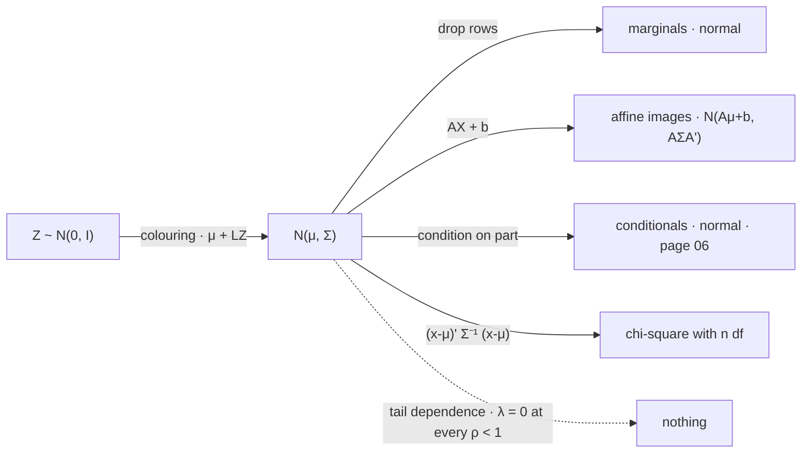

# Multivariate Gaussian Distribution

The multivariate normal is the only law whose entire dependence structure is a matrix of second moments, and that single property is both why every piece of portfolio machinery is built on it and the exact sense in which it is wrong about crises. The failure is not that the family underestimates joint extremes by some margin a recalibration could close. At every correlation short of one, a bivariate normal's asymptotic tail dependence is zero, and there is no parameter that could make it otherwise.

This page covers the density and the quadratic form in its exponent, the definition by linear combinations and why that is the one a portfolio needs, closure under affine maps and marginalization together with the fact that normal margins do not make a normal joint, the ellipsoidal level sets and the Mahalanobis distance whose square is chi-square, the sense in which uncorrelated jointly normal coordinates really are independent, and the tail dependence the family cannot produce at any correlation. It does not derive the univariate density, its moments or its generating function, which are [The Gaussian Distribution](../part-05-common-distributions/11-gaussian-distribution.md); it does not develop the spectral theorem or the Cholesky factor the level sets are drawn with, which are [Basic Linear Algebra Review](../part-01-mathematical-foundations/05-linear-algebra-review.md); it does not condition, which is [Conditional Gaussian Distributions](06-conditional-gaussian.md); and it does not build the replacement, which is [Copulas](../part-18-quant-finance-applications/14-copulas.md) and [Heavy-Tailed Returns](../part-18-quant-finance-applications/12-heavy-tailed-returns.md).

The trading stake is a measured tail dependence. [Drawdowns, Tail Risk, and Stress Testing](../../part-08-portfolio-management/05-drawdowns-tail-risk-stress-testing.md) reports $\lambda=0.66$ between SPY and EFA — given US equities in their worst decile, developed international equities are there too two thirds of the time — against $\lambda=0.09$ for SPY and TLT, below the $0.10$ that independence implies. A bivariate normal fitted to those same pairs has an asymptotic $\lambda$ of exactly zero, at both correlations and every one in between. The fifth section prices that gap, and finds it invisible at the decile where the number was measured.

## The Density Is One Quadratic Form Under an Exponential

When $\Sigma$ is positive definite, the density of $X\sim\mathcal{N}(\mu,\Sigma)$ on $\mathbb{R}^{n}$ is

$$f_X(x)=(2\pi)^{-n/2}\,(\det\Sigma)^{-1/2}\,\exp\Big(-\tfrac12(x-\mu)^\top\Sigma^{-1}(x-\mu)\Big).$$

Every factor has a provenance already established elsewhere. The $(2\pi)^{-n/2}$ is $n$ copies of the constant that [The Gaussian Distribution](../part-05-common-distributions/11-gaussian-distribution.md) obtains by squaring the Gaussian integral and passing to polar coordinates. The $(\det\Sigma)^{-1/2}$ is a Jacobian, in exactly the sense [Change of Variables](../part-03-random-variables/09-change-of-variables.md) means: the map that turns uncorrelated coordinates into correlated ones scales volume by $\det L$, and the density must fall by the same factor. And the quadratic form in the exponent is the squared length of the standardized vector, which is the $n$-dimensional replacement for $(x-\mu)^{2}/\sigma^{2}$.

??? note "Proof that the multivariate normal density is the coloring map and its Jacobian"
    Let $Z$ have $n$ independent standard normal coordinates. By independence its density is the product of $n$ univariate ones,

    $$f_Z(z)=\prod_{i=1}^{n}\frac{1}{\sqrt{2\pi}}e^{-z_i^{2}/2}=(2\pi)^{-n/2}\exp\big(-\tfrac12 z^\top z\big),$$

    since the exponents add to $-\tfrac12\sum_iz_i^{2}=-\tfrac12z^\top z$. Now let $\Sigma=LL^\top$ be a Cholesky factorization with $L$ invertible, and set $X=\mu+LZ$. [Linear Transformations](04-linear-transformations.md) gives its moments immediately: $\mathbb{E}[X]=\mu$ and $\mathrm{cov}(X)=L\,I\,L^\top=\Sigma$.

    For the density, the inverse map is $h(x)=L^{-1}(x-\mu)$ with constant Jacobian matrix $L^{-1}$, so the change-of-variables formula gives $f_X(x)=f_Z\big(L^{-1}(x-\mu)\big)\lvert\det L^{-1}\rvert$. Two substitutions finish it. The determinant is $\lvert\det L^{-1}\rvert=(\det L)^{-1}=(\det\Sigma)^{-1/2}$, because $\det\Sigma=\det L\det L^\top=(\det L)^{2}$. And the exponent becomes

    $$z^\top z=(x-\mu)^\top L^{-\top}L^{-1}(x-\mu)=(x-\mu)^\top(LL^\top)^{-1}(x-\mu)=(x-\mu)^\top\Sigma^{-1}(x-\mu).$$

    The load-bearing hypothesis is that $L$ is invertible, which requires $\Sigma$ to be positive *definite* rather than merely semi-definite. Where it is only semi-definite the law still exists — $\mu+LZ$ is a perfectly good random vector for any $L$ — and the density does not, because the distribution puts all its mass on a lower-dimensional subspace and has no density with respect to $n$-dimensional volume. That is not a pathology to be excluded by hypothesis. It is the ordinary case for a book of $N$ assets estimated on $T<N$ days, which [Basic Linear Algebra Review](../part-01-mathematical-foundations/05-linear-algebra-review.md) exhibits at rank $29$ from thirty observations of fifty assets, and it is why the definition of the next section is the one worth adopting.

## The Better Definition Says Every Portfolio Is Normal

The density is a construction, not a definition. The definition that survives the singular case, requires no inverse, and happens to be the one finance needs is this: $X$ is multivariate normal exactly when

$$a^\top X\ \text{is univariate normal for every}\ a\in\mathbb{R}^{n},$$

with the degenerate constant law counted as normal with variance zero. Equivalently, and often more usefully, its moment generating function is

$$M_X(t)=\mathbb{E}\big[e^{t^\top X}\big]=\exp\Big(t^\top\mu+\tfrac12\,t^\top\Sigma t\Big),$$

a quadratic in $t$ under an exponential, exactly as in the scalar case that [The Gaussian Distribution](../part-05-common-distributions/11-gaussian-distribution.md) derives by completing the square.

Both closures the family is used for now follow in a line each. For an affine map $Y=AX+b$, any linear combination $a^\top Y=(A^\top a)^\top X+a^\top b$ is a linear combination of $X$ plus a constant, hence normal, so $Y$ is multivariate normal; its parameters are $A\mu+b$ and $A\Sigma A^\top$ by the sandwich of [Linear Transformations](04-linear-transformations.md), with nothing further to prove. Marginalization is the special case where $A$ selects rows, so any sub-vector of a normal vector is normal with the corresponding sub-block of $\Sigma$ — drop the rows you do not want and drop the matching rows and columns.

!!! note "Every linear combination being normal is a strictly stronger statement than every coordinate being normal, and it is the one the family actually assumes"
    Taking $a$ to be the $i$-th standard basis vector recovers "each $X_i$ is normal", so the definition implies normal margins. The converse fails, and the next section exhibits a counterexample where both margins are exactly standard normal, the correlation is zero, and one coordinate is a deterministic function of the other. What the definition demands is that the uncountably many combinations $a^\top X$ are *all* normal, including combinations nobody will ever hold, and the ones that fail are typically not the coordinates but the diagonals. This matters operationally because it says where to test: running a normality test on each asset's returns tests $n$ of the conditions and none of the interesting ones, and the cheap improvement is to test a handful of portfolios — an equal-weight book, a long–short spread, the minimum-variance solution — because those are combinations the assumption is actually being used on.

## Marginals Stay Normal, and Normal Marginals Are Not Enough

The gap the note describes is not narrow or exotic. It can be made total.

```python
import numpy as np
from scipy.stats import kstest, spearmanr

rng = np.random.default_rng(677)
T = 2_000_000
X = rng.standard_normal(T)
S = rng.integers(0, 2, T) * 2 - 1                              # an independent fair sign
pairs = {"Y = S X": (X, S * X), "independent normals": (X, rng.standard_normal(T))}
print("  two joint laws with standard normal margins and zero correlation")
print("            pair    mean(Y)    sd(Y)   exc kurt   KS p   pearson   spearman"
      "   corr(|X|,|Y|)   P(both > 2)")
for name, (a, c) in pairs.items():
    print(f"  {name:>19s} {c.mean():9.4f} {c.std():8.4f}"
          f" {(((c - c.mean()) / c.std()) ** 4).mean() - 3:10.4f}"
          f" {kstest(c[:20000], 'norm').pvalue:6.2f}"
          f" {np.corrcoef(a, c)[0, 1]:9.4f} {spearmanr(a[:200000], c[:200000]).statistic:10.4f}"
          f" {np.corrcoef(np.abs(a), np.abs(c))[0, 1]:15.4f}"
          f" {((a > 2) & (c > 2)).mean():13.5f}")
print(f"  exact for independent standard normals:{'':55s}{(1 - 0.97725) ** 2:13.5f}")
print(f"  in the S X pair, |X| = |Y| on {np.mean(np.abs(np.abs(X) - np.abs(S * X)) < 1e-12):.1%} of draws")
# =>   two joint laws with standard normal margins and zero correlation
#                pair    mean(Y)    sd(Y)   exc kurt   KS p   pearson   spearman   corr(|X|,|Y|)   P(both > 2)
#                  Y = S X   -0.0008   0.9995     0.0008   0.17   -0.0024    -0.0020          1.0000       0.01130
#      independent normals    0.0014   1.0004    -0.0081   0.95    0.0021     0.0040          0.0001       0.00052
#      exact for independent standard normals:                                                             0.00052
#      in the S X pair, |X| = |Y| on 100.0% of draws
```

Take $X$ standard normal and $S$ an independent fair sign, and set $Y=SX$. Because $S$ is symmetric and independent, $Y$ is standard normal too, and the block confirms it on every marginal test available: mean $-0.0008$, standard deviation $0.9995$, excess kurtosis $0.0008$, and a Kolmogorov–Smirnov $p$-value of $0.17$ against the identical battery that the genuinely independent control passes at $0.95$. Both dependence summaries agree as well — Pearson $-0.0024$ and Spearman $-0.0020$, against $0.0021$ and $0.0040$ for the control.

The pair is nevertheless as dependent as two variables can be. $\lvert X\rvert=\lvert Y\rvert$ on $100.0\%$ of draws, the correlation of the absolute values is $1.0000$ against the control's $0.0001$, and the probability that both exceed two standard deviations is $0.01130$ against $0.00052$ — a factor of $21.7$, with the control landing exactly on the $(1-\Phi(2))^{2}=0.00052$ that independence requires.

So the ingredients of a normal joint law were all present and the joint law was not normal. Two standard normal margins, zero correlation, and a dependence structure under which the two variables always have the same magnitude: everything a per-asset diagnostic can see is identical to independence, and everything that matters for joint risk is a factor of twenty different. The one thing that fails is the definition of the previous section, and it fails visibly — the combination $a=(1,1)$ gives $X+Y$, which equals $2X$ half the time and $0$ the other half, a distribution with an atom at zero and no density at all.

## Axis-Aligned Ellipsoids Are Exactly Independence

The level sets of the density are the sets where the quadratic form is constant,

$$\big\{x:(x-\mu)^\top\Sigma^{-1}(x-\mu)=c\big\},$$

which are ellipsoids centred at $\mu$ with axes along the eigenvectors of $\Sigma$ and semi-axis lengths $\sqrt{c\lambda_i}$. Their volume is proportional to $\sqrt{\det\Sigma}$, the *generalized variance*, which collapses to zero exactly when some portfolio has no risk — the geometric statement of the rank deficiency the first proof declined to exclude.

??? note "Proof that uncorrelated jointly normal coordinates are independent"
    Suppose $X$ is multivariate normal with diagonal $\Sigma=\mathrm{diag}(\sigma_1^{2},\ldots,\sigma_n^{2})$, all strictly positive. Then $\det\Sigma=\prod_i\sigma_i^{2}$ and $\Sigma^{-1}=\mathrm{diag}(\sigma_i^{-2})$, so the quadratic form is a plain sum, $(x-\mu)^\top\Sigma^{-1}(x-\mu)=\sum_i(x_i-\mu_i)^{2}/\sigma_i^{2}$, and the density factorizes:

    $$f_X(x)=\prod_{i=1}^{n}\frac{1}{\sigma_i\sqrt{2\pi}}\exp\Big(-\frac{(x_i-\mu_i)^{2}}{2\sigma_i^{2}}\Big),$$

    a product of univariate normal densities, each of which is the marginal of $X_i$. Factorization of the joint density is the definition of independence, so the coordinates are independent. Geometrically the same statement is that the level ellipsoids are axis-aligned.

    Joint normality is the entire hypothesis and it is doing all of the work, as the previous section's counterexample shows: $X$ and $Y=SX$ have normal margins, zero covariance, a diagonal covariance matrix, and are about as far from independent as a pair can be. This is the exact converse that [Covariance](../part-04-expectation-and-moments/04-covariance.md) declined to give, and it is available here and essentially nowhere else — no other family in this book converts zero correlation into independence. It is also the single implication that [Conditional Gaussian Distributions](06-conditional-gaussian.md) rests on, so almost everything convenient about the Gaussian assumption traces back to this proof.

??? note "Proof that the squared Mahalanobis distance is chi-square with n degrees of freedom"
    With $\Sigma=LL^\top$ and $X=\mu+LZ$ as in the first proof, set $Z=L^{-1}(X-\mu)$, which has $n$ independent standard normal coordinates. Then

    $$d^{2}=(X-\mu)^\top\Sigma^{-1}(X-\mu)=Z^\top L^\top(LL^\top)^{-1}LZ=Z^\top Z=\sum_{i=1}^{n}Z_i^{2},$$

    a sum of $n$ independent squared standard normals, which [Chi-Square Distribution](../part-05-common-distributions/15-chi-square-distribution.md) identifies as $\chi^{2}_{n}$. The distribution depends on $n$ alone: it does not know the correlations, the volatilities, or which assets were involved.

    Two hypotheses are load-bearing and both fail in practice. The first is *joint* normality rather than normal margins — the counterexample above has normal margins and a $d^{2}$ that is not chi-square at all. The second is that $\Sigma$ is *known*. Substituting an estimate $\hat\Sigma$ turns the quadratic form into Hotelling's statistic, which is an $F$ distribution up to a constant, and whose tail is heavier than $\chi^{2}_{n}$ at the sample sizes a risk desk has — the same eigenvalue distortion that [Covariance Matrices](02-covariance-matrices.md) measures, arriving in a different disguise. A multivariate outlier screen that ignores either hypothesis is calibrated to a distribution it does not have.

```python
import numpy as np
from scipy.stats import chi2, multivariate_normal

rng = np.random.default_rng(673)
n, T, nu = 3, 400_000, 4
vol = np.array([0.192, 0.148, 0.176]) / np.sqrt(252)           # SPY, TLT, GLD, published
C = np.array([[1.0, -0.31, 0.05], [-0.31, 1.0, 0.16], [0.05, 0.16, 1.0]])
Sigma = np.outer(vol, vol) * C
mu = np.zeros(n)
Si = np.linalg.inv(Sigma)
print(f"  det Sigma {np.linalg.det(Sigma):.4e},  eigenvalues"
      f" {np.array2string(np.linalg.eigvalsh(Sigma), formatter={'float': lambda v: f'{v:.3e}'})}")
for x in (np.zeros(n), vol, -2 * vol):
    hand = np.exp(-0.5 * x @ Si @ x) / np.sqrt((2 * np.pi) ** n * np.linalg.det(Sigma))
    print(f"  hand-written density {hand:14.4f}   scipy {multivariate_normal(mu, Sigma).pdf(x):14.4f}")
L = np.linalg.cholesky(Sigma)
Zn = rng.standard_normal((T, n)) @ L.T
Zt = (rng.standard_normal((T, n)) / np.sqrt(rng.chisquare(nu, (T, 1)) / nu)
      * np.sqrt((nu - 2) / nu)) @ L.T
print("  squared Mahalanobis distance against chi-square with 3 degrees of freedom")
print("          q     chi2 quantile   gaussian draws   multivariate t4   t4 / chi2")
for q in (0.50, 0.90, 0.99, 0.999):
    dn = np.quantile((Zn @ Si * Zn).sum(axis=1), q)
    dt = np.quantile((Zt @ Si * Zt).sum(axis=1), q)
    print(f"  {q:9.3f} {chi2.ppf(q, n):15.4f} {dn:16.4f} {dt:17.4f} {dt / chi2.ppf(q, n):11.2f}")
for q in (0.90, 0.99, 0.999):
    c = chi2.ppf(q, n)
    print(f"  days flagged beyond the {q:.1%} chi-square cutoff:"
          f"  gaussian {((Zn @ Si * Zn).sum(axis=1) > c).mean():.4%}"
          f"   multivariate t4 {((Zt @ Si * Zt).sum(axis=1) > c).mean():.4%}")
# =>   det Sigma 1.3611e-12,  eigenvalues [6.524e-05 1.284e-04 1.625e-04]
#      hand-written density     54423.4679   scipy     54423.4679
#      hand-written density      9938.0247   scipy      9938.0247
#      hand-written density        60.5120   scipy        60.5120
#      squared Mahalanobis distance against chi-square with 3 degrees of freedom
#              q     chi2 quantile   gaussian draws   multivariate t4   t4 / chi2
#          0.500          2.3660           2.3658            1.4143        0.60
#          0.900          6.2514           6.2450            6.2835        1.01
#          0.990         11.3449          11.3406           25.0962        2.21
#          0.999         16.2662          16.0877           80.0316        4.92
#      days flagged beyond the 90.0% chi-square cutoff:  gaussian 9.9718%   multivariate t4 10.0742%
#      days flagged beyond the 99.0% chi-square cutoff:  gaussian 0.9957%   multivariate t4 3.9800%
#      days flagged beyond the 99.9% chi-square cutoff:  gaussian 0.0907%   multivariate t4 2.1823%
```

The first three lines check the formula rather than assume it: the hand-written density, assembled from $\det\Sigma$ and $\Sigma^{-1}$ exactly as the proof constructs it, agrees with `scipy` to every printed digit at three separate points, including a point two standard deviations out along each axis. The determinant $1.36\times10^{-12}$ and the three eigenvalues confirm the matrix is well inside the positive-definite cone, so the density exists.

The chi-square panel is the theorem measured. Simulated Gaussian draws with the published SPY/TLT/GLD correlation structure reproduce the $\chi^{2}_{3}$ quantiles to three decimal places at $q=0.50$, $0.90$ and $0.99$, and to two at $0.999$ where four hundred thousand draws leave only four hundred observations in the tail. Nothing about the correlations $-0.31$, $+0.05$ and $+0.16$ appears anywhere in the reference distribution, exactly as the proof requires.

The $t_4$ column is the control that matters, because it has the *same* $\Sigma$ by construction. At the median its distance is $1.41$ against $2.37$ — a heavy-tailed law is more concentrated in the middle, the same shoulders-for-tails trade [The Gaussian Distribution](../part-05-common-distributions/11-gaussian-distribution.md) finds in one dimension — and at $q=0.999$ it is $80.03$ against $16.27$, a factor of $4.92$. The last three lines convert that into an operating characteristic. An outlier screen calibrated on normality at the $99.9\%$ cutoff flags $0.0907\%$ of Gaussian days, which is the design point, and $2.1823\%$ of $t_4$ days from a world with identical volatilities and identical correlations. A screen built to raise one alarm in a thousand days raises twenty-two, and the reason is entirely the shape of the joint law.

## No Tail Dependence at Any ρ Below One

The sharpest statement the family admits concerns what happens far out, where risk management lives.

??? note "Proof that a Gaussian copula has zero tail dependence at every correlation below one"
    For standard bivariate normal $(X_1,X_2)$ with correlation $\rho<1$, the upper tail dependence coefficient is $\lambda=\lim_{t\to\infty}\mathbf{P}(X_2>t\mid X_1>t)$. Write the regression decomposition, which is legitimate here because [Linear Transformations](04-linear-transformations.md) and joint normality make it exact:

    $$X_2=\rho X_1+\sqrt{1-\rho^{2}}\,\varepsilon,\qquad \varepsilon\sim\mathcal{N}(0,1)\ \text{independent of}\ X_1.$$

    Then $\{X_2>t\}$ requires $\varepsilon>(t-\rho X_1)/\sqrt{1-\rho^{2}}$, and on the conditioning event $X_1>t$ the binding case is $X_1$ near $t$, giving the threshold $t(1-\rho)/\sqrt{1-\rho^{2}}=t\sqrt{(1-\rho)/(1+\rho)}$. A standard extreme-value computation turns this into

    $$\lambda=2\lim_{t\to\infty}\Phi\Big(-t\sqrt{\tfrac{1-\rho}{1+\rho}}\Big)=0\qquad\text{for every }\rho<1,$$

    since the argument diverges to $-\infty$ whenever $\rho<1$ strictly.

    The load-bearing hypothesis is only that $\rho<1$, and the point is what the conclusion does *not* depend on. The coefficient of $t$ is positive for every admissible correlation, so no value of $\rho$ produces tail dependence — the limit is zero at $\rho=0.1$ and zero at $\rho=0.999$, differing only in how slowly it gets there. This is the joint-law restatement of the structural complaint [The Gaussian Distribution](../part-05-common-distributions/11-gaussian-distribution.md) makes about the univariate family: with every moment pinned by $\mu$ and $\Sigma$, there is no free parameter with which to be wrong about the tail in a correctable way, and adding a dimension does not supply one. It also explains why the repair is a different copula rather than a different correlation, which is [Copulas](../part-18-quant-finance-applications/14-copulas.md).

```python
import numpy as np
from scipy.stats import norm, t

rng = np.random.default_rng(683)
T, rho, nu = 2_000_000, 0.872, 4                               # published SPY/EFA correlation
z = rng.standard_normal((T, 2)) @ np.array([[1.0, 0.0], [rho, np.sqrt(1 - rho ** 2)]]).T
u_g = norm.cdf(z)
u_t = t.cdf(z / np.sqrt(rng.chisquare(nu, (T, 1)) / nu), nu)
u_i = rng.random((T, 2))
print(f"  lower tail dependence at rho = {rho}: P(U2 < p | U1 < p) as p falls")
print("        p      gaussian copula   t4 copula   independent   t4 / gaussian")
for p in (0.10, 0.05, 0.01, 0.005, 0.001):
    r = []
    for u in (u_g, u_t, u_i):
        lo = u[:, 0] < p
        r.append((u[lo, 1] < p).mean())
    print(f"  {p:7.3f} {r[0]:17.4f} {r[1]:11.4f} {r[2]:13.4f} {r[1] / r[0]:15.2f}")
print(f"  the asymptotic limit: 2*Phi(-t*sqrt((1-rho)/(1+rho))) as t grows")
for tt in (2.0, 4.0, 8.0, 16.0):
    print(f"    t = {tt:5.1f}   2 Phi(-t sqrt((1-rho)/(1+rho))) ="
          f" {2 * norm.cdf(-tt * np.sqrt((1 - rho) / (1 + rho))):.3e}")
print(f"  measured on real data: SPY/EFA 0.66, SPY/EEM 0.61, SPY/TLT 0.09")
# =>   lower tail dependence at rho = 0.872: P(U2 < p | U1 < p) as p falls
#            p      gaussian copula   t4 copula   independent   t4 / gaussian
#        0.100            0.6485      0.6828        0.1007            1.05
#        0.050            0.5931      0.6517        0.0492            1.10
#        0.010            0.4894      0.6094        0.0106            1.25
#        0.005            0.4556      0.6080        0.0058            1.33
#        0.001            0.3825      0.5936        0.0005            1.55
#      the asymptotic limit: 2*Phi(-t*sqrt((1-rho)/(1+rho))) as t grows
#        t =   2.0   2 Phi(-t sqrt((1-rho)/(1+rho))) = 6.010e-01
#        t =   4.0   2 Phi(-t sqrt((1-rho)/(1+rho))) = 2.956e-01
#        t =   8.0   2 Phi(-t sqrt((1-rho)/(1+rho))) = 3.645e-02
#        t =  16.0   2 Phi(-t sqrt((1-rho)/(1+rho))) = 2.867e-05
#      measured on real data: SPY/EFA 0.66, SPY/EEM 0.61, SPY/TLT 0.09
```

Read the decile row first, because it is the one that should be uncomfortable. At $p=0.10$ the Gaussian copula delivers $0.6485$ — and the measured SPY/EFA figure is $0.66$. At the level where the number was reported, a Gaussian dependence structure fitted to the observed correlation of $0.872$ reproduces the observation almost exactly. Anyone validating the assumption at the decile would conclude it passes.

The columns then separate as $p$ falls. The Gaussian coefficient declines monotonically — $0.6485$, $0.5931$, $0.4894$, $0.4556$, $0.3825$ — while the $t_4$ copula's barely moves, $0.6828$ down to $0.5936$, and the ratio between them widens from $1.05$ to $1.55$. The independent control tracks $p$ itself in every row, $0.1007$ against $0.10$ and $0.0005$ against $0.001$, which confirms the estimator is measuring conditional probability correctly rather than manufacturing dependence.

The asymptotic panel says where the Gaussian column is going. The closed form of the proof evaluates to $0.601$ at two standard deviations, $0.296$ at four, $0.036$ at eight, and $2.9\times10^{-5}$ at sixteen — a decline that is slow enough to be invisible over the range any dataset covers and total in the limit. This is the whole difficulty in one table. The Gaussian assumption is not detectably wrong at the depth where dependence is usually measured, it is wrong by a factor of $1.5$ at the depth where capital is sized, and it is wrong by every factor there is at the depth where a fund fails.

!!! warning "A correlation matrix estimated on ordinary days and used in a crisis scenario is not conservative, because the model it belongs to says crises of that shape do not occur"
    The instinct when stressing a book is to raise the correlations and rerun, on the grounds that this is the pessimistic choice. Under a joint normal it is not pessimistic enough to be wrong in the right direction: whatever $\rho$ is substituted, the model still assigns asymptotic probability zero to the two assets failing together in the far tail, so the scenario being priced is a rescaling of an ordinary day rather than a crisis. The measured $\lambda=0.66$ for SPY and EFA is a statement no Gaussian model can make at any parameter value, and the honest responses are to change the dependence structure rather than its parameter — [Copulas](../part-18-quant-finance-applications/14-copulas.md) for the joint law and [Extreme Value Theory](../part-18-quant-finance-applications/13-extreme-value-theory.md) for the margins — or to stop quoting far-tail joint probabilities. Raising $\rho$ inside a Gaussian model changes the number and not the conclusion.



Every solid arrow is a closure, and the closures are the reason the family is used at all: a portfolio of jointly normal assets is normal, a factor decomposition of jointly normal assets is normal, a forecast conditioned on jointly normal observations is normal, and the outlier statistic has a reference distribution that does not depend on the correlations. No other family in this book offers even two of those. The single dashed arrow is the only place the diagram terminates, and it terminates at the one question a risk system exists to answer.

## Two Moments Is a Claim, Not a Convenience

It is worth being exact about what is being assumed, because the multivariate normal is usually adopted without anyone noticing that a claim was made.

The appeal is that $\Sigma$ is the whole model. Every joint probability, every conditional forecast, every level set is a function of $\mu$ and $\Sigma$ alone, which is what makes the family computable at all. But that is not an approximation awaiting refinement. It is an assertion that dependence has no structure beyond second moments — that once the correlations are specified there is nothing further to say about how the assets move together, in any regime, at any depth. Stated plainly, nobody would agree to it. Stated as a distributional assumption in a footnote, everybody does.

Concede what works, because a great deal does. Linear closure is what makes mean–variance optimization, factor models, and Kalman filtering computable rather than simulated, and none of the three has a non-Gaussian equivalent that runs at production speed on a real book. For the middle of the joint distribution — where turnover, hedge ratios, tracking error and capacity live — the fit is good and the convenience is decisive.

The practical rule is to split the question exactly as [The Gaussian Distribution](../part-05-common-distributions/11-gaussian-distribution.md) splits it, one dimension up. Use the multivariate normal wherever the answer is a *linear* function of the returns: a portfolio variance, a hedge ratio, a tracking error, a factor decomposition, a beta. Test the assumption on portfolios rather than on assets, because the assumption is about combinations and the margins were never the binding constraint. And do not use it for the probability that several things go wrong at once, nor attempt to repair that by raising the correlations, because the quantity that is wrong is not $\rho$.
