```mermaid
flowchart LR
    S0((0)) -->|"p"| S1((1))
    S1 -->|"q(1-p)"| S0
    S1 -->|"p(1-q)"| S2((2))
    S2 -->|"q(1-p)"| S1
    S2 -->|"p(1-q)"| Sd(("&#8943;"))
    Sd -->|"q(1-p)"| S2
    Sd -->|"p(1-q)"| S10((10))
    S10 -->|"q"| Sd
```

# Markov Chains

The arrival processes so far were memoryless because nothing was allowed to persist. A Markov chain is the first model in this part where the past genuinely matters — and the only one where it matters through a single channel, the current state, which is narrow enough to compute with and wide enough to describe a market that alternates between calm and turbulence. Whether a process "is Markov" is not a fact about the world; it is a claim about what you decided to call the state, and almost every failure of a fitted chain is a failure of that decision rather than of the mathematics.

This page covers the Markov property and the trajectory formula it collapses, the Chapman–Kolmogorov recursion and the two-state chain solved in closed form, the classification of states and the steady-state theorem together with the eigenvalue that sets its speed, the sampling error in an estimated transition matrix and what it does to a regime duration, and the geometric sojourn law that memorylessness forces on every chain whether or not the world obeys it. It does not let the state be unobserved, which is [Hidden Markov Models](07-hidden-markov-models.md); it does not run in continuous time, which is [Continuous-Time Markov Chains](06-continuous-time-markov-chains.md); it does not free the sojourn distribution, which is [Renewal Processes](04-renewal-processes.md); it derives no property of an estimator, which is [Part XI](../part-11-parameter-estimation/index.md); and it fits nothing to real returns, which is [Bayesian Methods and Hidden Markov Models](../../part-03-statistics/06-bayesian-methods-and-hmms.md).

The trading stake is the transition matrix the course actually fits. [Bayesian Methods and Hidden Markov Models](../../part-03-statistics/06-bayesian-methods-and-hmms.md) estimates a two-state regime chain on SPY and reports a calm state with $\mathbf{P}(\text{stay})=0.989$ and a stress state at $0.972$, concluding that "both states are *sticky*, with expected durations of a quarter and a month and a half respectively" and that "stickiness is what makes regimes more than a relabeling of good days and bad days." Every claim in that sentence is a claim about the diagonal of a matrix. The fourth section shows that on twenty-five years of daily data the diagonal is pinned only to within about $\pm0.0016$, which stretches that quarter to anywhere between roughly three and a half and five and a half months.

## The Markov Property Is a Claim About the State, Not About the Process

Consider a supermarket checkout counter. Chop time into small slots and suppose that during each slot, independently of everything else, a new customer joins the queue with probability $p$, and, if the queue is nonempty, the customer being served finishes and leaves with probability $q$. Let $X_n$ be the number of customers in the queue at the start of slot $n$, capped at $10$. For an interior state the queue grows by one with probability $p(1-q)$, shrinks by one with probability $q(1-p)$, and otherwise stays put; at the boundaries it can only grow from $0$ and only shrink from $10$.



Self-transitions are omitted; each state keeps whatever probability is left over. The modelling fact that matters is that to predict the queue one slot from now, the *current* queue length is all that is needed. How it got to five — a burst of arrivals a minute ago, or a slow accumulation over an hour — is irrelevant.

Formally, a **discrete-time finite-state Markov chain** consists of a finite state space $S=\{1,\ldots,m\}$, a sequence $X_0,X_1,\ldots$ taking values in $S$, and **transition probabilities** $p_{ij}=\mathbf{P}(X_{n+1}=j\mid X_n=i)$ assumed not to depend on $n$. They are collected in the $m\times m$ **transition matrix** $P=[p_{ij}]$, whose rows are probability distributions:

$$p_{ij}\geq0,\qquad \sum_{j=1}^{m}p_{ij}=1\quad\text{for every }i.$$

The **Markov property** is the statement that this one-step rule is the whole rule:

$$\mathbf{P}(X_{n+1}=j\mid X_n=i)=\mathbf{P}(X_{n+1}=j\mid X_n=i,X_{n-1},\ldots,X_0).$$

Read that carefully, because it does *not* say the future is independent of the past. $X_{n+1}$ and $X_{n-1}$ are in general strongly dependent. It says the dependence is entirely mediated by the present: once you condition on $X_n$, the earlier history carries no additional information. Together with an initial distribution $\pi_0$ it determines the probability of any finite trajectory.

??? note "Proof that one initial distribution and one matrix determine the law of every path"
    By the multiplication rule of [Conditional Probability](../part-02-probability-foundations/03-conditional-probability.md),

    $$\begin{align}
    \mathbf{P}(X_0=i_0,\ldots,X_n=i_n)
    &=\mathbf{P}(X_0=i_0)\prod_{k=1}^{n}\mathbf{P}(X_k=i_k\mid X_{k-1}=i_{k-1},\ldots,X_0=i_0)\\
    &=\pi_0(i_0)\,p_{i_0i_1}\,p_{i_1i_2}\cdots p_{i_{n-1}i_n},
    \end{align}$$

    where the second equality applies the Markov property to each conditional factor in turn. The chain rule holds for any sequence whatever; what the Markov property buys is that each factor depends on one symbol rather than on the entire prefix, so a law over $m^{n+1}$ paths is specified by $m$ initial numbers and $m^{2}$ transition numbers.

    The load-bearing hypothesis is that each conditional collapses to the last symbol, and it is spent once per factor. This is exactly the factorization [Conditional Distributions](../part-03-random-variables/07-conditional-distributions.md) calls "the structure that Markov chains is named after", and it is the reason the whole subject is tractable: without it the parameter count grows exponentially in the horizon and no finite sample can estimate anything.

!!! note "The Markov property is a modelling choice about the state, not a law the data either obeys or violates"
    Whether a process is Markov depends entirely on what you call the state. If tomorrow's queue depended on both today's length and yesterday's, then $X_n=(\text{today's length})$ would not be Markov — but $\tilde X_n=(\text{today's length},\text{yesterday's length})$ would be, at the cost of squaring the state space. The art is choosing a state rich enough to absorb the relevant history and small enough to estimate. That is precisely the move behind regime models: raw returns are not Markov in any useful way, so one *posits* a small hidden state that is, and the posit is the model. [Random Processes](01-random-processes.md) makes the general version of this point about what a process is; here it has a concrete price, which is the size of $P$.

## Everything Multi-Step Is a Matrix Power

Let $r_{ij}(n)=\mathbf{P}(X_n=j\mid X_0=i)$ be the probability of sitting in $j$ exactly $n$ transitions after starting in $i$. Conditioning on where the chain was one step earlier gives the **Chapman–Kolmogorov recursion**

$$r_{ij}(n)=\sum_{k=1}^{m}r_{ik}(n-1)\,p_{kj},\qquad r_{ij}(1)=p_{ij},$$

which in matrix form says $[r_{ij}(n)]=P^{n}$: multi-step transition probabilities are entries of matrix powers, and every dynamical question about the chain is a question about the spectrum of $P$. Splitting a path of length $n+s$ at time $n$ gives the general form $r_{ij}(n+s)=\sum_k r_{ik}(n)r_{kj}(s)$.

The two-state chain is worth solving exactly, because it is the skeleton of every calm/turbulent regime model in finance. With

$$P=\begin{pmatrix}1-a & a\\ b & 1-b\end{pmatrix},\qquad 0<a,b<1,$$

so that $a$ is the probability of leaving state $1$ and $b$ of leaving state $2$,

$$r_{11}(n)=\frac{b}{a+b}+\frac{a}{a+b}\,(1-a-b)^{n},\qquad
r_{21}(n)=\frac{b}{a+b}-\frac{b}{a+b}\,(1-a-b)^{n}.$$

??? note "Proof that the two-state chain forgets its start geometrically at rate one minus a minus b"
    Using the recursion with $r_{12}(n-1)=1-r_{11}(n-1)$,

    $$\begin{align}
    r_{11}(n)&=r_{11}(n-1)(1-a)+r_{12}(n-1)\,b\\
    &=r_{11}(n-1)(1-a)+\bigl(1-r_{11}(n-1)\bigr)b\\
    &=b+(1-a-b)\,r_{11}(n-1),
    \end{align}$$

    a linear first-order recursion. Its fixed point solves $x^{*}=b+(1-a-b)x^{*}$, giving $x^{*}=b/(a+b)$. The deviation $d_n=r_{11}(n)-x^{*}$ then satisfies $d_n=(1-a-b)d_{n-1}$, so $d_n=(1-a-b)^{n}d_0$ with $d_0=1-b/(a+b)=a/(a+b)$. The formula for $r_{21}(n)$ follows identically from $d_0=-b/(a+b)$.

    Two consequences are worth naming. Since $\lvert1-a-b\rvert<1$, both quantities converge to the *same* limit $b/(a+b)$: after enough transitions the chain has forgotten where it started. And the forgetting is geometric at rate $\lvert1-a-b\rvert$, which is exactly the second eigenvalue of $P$ — the first being $1$, with the stationary distribution as its left eigenvector.

    The load-bearing hypothesis is $0<a,b<1$, and it is spent in the claim $\lvert1-a-b\rvert<1$. Let either probability hit zero and the corresponding state becomes absorbing, the second eigenvalue becomes $1$, and the chain never forgets anything. **The gap between the two eigenvalues is the entire content of "the chain converges", and how fast it converges is that gap and nothing else.**

## Convergence Is Governed by One Eigenvalue

Not every chain settles down, and the taxonomy that says which ones do is short. State $j$ is **accessible** from $i$ if $r_{ij}(n)>0$ for some $n$; write $A(i)$ for the states accessible from $i$. State $i$ is **recurrent** if every state it can reach can reach it back, and **transient** otherwise — in which case each visit carries a fixed positive probability of escaping forever, so the chain visits $i$ only finitely many times. The state space of a finite chain therefore decomposes into one or more disjoint **recurrent classes** plus a possibly empty set of transient states: the chain spends a finite initial stretch among the transient states and then enters some recurrent class, never to leave. A class is **periodic** if its states split into $d\geq2$ groups the chain cycles through deterministically, and **aperiodic** otherwise; a single self-transition anywhere in the class is enough to guarantee aperiodicity.

With that vocabulary the central result is short. **If a finite chain has a single recurrent class and that class is aperiodic, then $\pi_j=\lim_{n\to\infty}r_{ij}(n)$ exists, does not depend on the starting state $i$, and is the unique solution of the balance equations**

$$\pi_j=\sum_{k=1}^{m}\pi_k\,p_{kj}\quad(j=1,\ldots,m),\qquad\sum_{k=1}^{m}\pi_k=1.$$

In matrix language $\pi=\pi P$: the stationary distribution is the left eigenvector of $P$ for eigenvalue $1$, normalized. Both hypotheses are load-bearing. With two absorbing states the limit exists but depends on the start, and the balance equations acquire multiple solutions. With $p_{12}=p_{21}=1$ the chain alternates and $r_{11}(n)$ reads $1,0,1,0,\ldots$ forever, even though the *time average* still converges to $\tfrac12$ — aperiodicity is precisely what upgrades convergence of averages into convergence of probabilities.

The stationary vector carries three readings that are constantly conflated: $\pi_j$ is the probability of finding the chain in $j$ at a distant fixed time, it is the long-run fraction of time spent in $j$, and its reciprocal $1/\pi_j$ is the mean number of steps between successive visits. The block below runs all of this on the course's own fitted matrix.

```python
import numpy as np

rng = np.random.default_rng(8051)
P = np.array([[0.989, 0.011], [0.028, 0.972]])                 # the course's fitted SPY chain
pi = np.array([P[1, 0], P[0, 1]]) / (P[0, 1] + P[1, 0])
lam2 = 1 - P[0, 1] - P[1, 0]
print(f"  the fitted regime chain: stationary calm {pi[0]:.4f}, second eigenvalue {lam2:.4f}")
print("        n    P(calm | calm)    P(calm | stress)    difference    lam2^n")
M = np.eye(2)
for n in range(1, 253):
    M = M @ P
    if n in (1, 5, 21, 63, 252):
        print(f"  {n:9d} {M[0, 0]:17.4f} {M[1, 0]:19.4f} {M[0, 0] - M[1, 0]:13.4f}"
              f" {lam2 ** n:9.4f}")
reps, steps = 200_000, 4_000
x = np.zeros(reps, dtype=bool)                                 # False is calm, True is stress
calm = np.zeros(reps)
for _ in range(steps):
    u = rng.random(reps)
    x = np.where(x, u > P[1, 0], u < P[0, 1])
    calm += ~x
print(f"  simulated long-run calm fraction {(calm / steps).mean():.4f} against pi {pi[0]:.4f}")
# =>   the fitted regime chain: stationary calm 0.7179, second eigenvalue 0.9610
#            n    P(calm | calm)    P(calm | stress)    difference    lam2^n
#              1            0.9890              0.0280        0.9610    0.9610
#              5            0.9491              0.1295        0.8196    0.8196
#             21            0.8403              0.4066        0.4337    0.4337
#             63            0.7410              0.6594        0.0816    0.0816
#            252            0.7180              0.7179        0.0000    0.0000
#      simulated long-run calm fraction 0.7197 against pi 0.7179
```

The two middle columns are the same question asked from opposite starting points, and they converge on each other: $0.9890$ against $0.0280$ after one day, $0.8403$ against $0.4066$ after a month, $0.7180$ against $0.7179$ after a year. The last two columns are the theorem's mechanism laid bare — **the difference between the two starting points equals $\lambda_2^{\,n}$ to four decimals at every horizon**, $0.9610$, $0.8196$, $0.4337$, $0.0816$, $0.0000$, because the proof above showed that difference *is* $\lambda_2^{\,n}$ with no approximation anywhere.

Read the third row as a trading statement. Twenty-one days after observing the market in a calm state, the probability it is still calm is $0.8403$; twenty-one days after observing stress, the probability it is calm is $0.4066$. That gap of $0.4337$ is the entire economic value of knowing today's regime at a one-month horizon, and it decays with a half-life of $\ln 2/\ln(1/0.9610)\approx17.4$ days. Persistence is what makes the state worth estimating and also what makes unconditional statistics slow to trust: the same $\lambda_2=0.9610$ that keeps information alive for weeks is the reason [Random Processes](01-random-processes.md)'s effective sample size for anything averaged over this chain is a small fraction of the calendar.

The stationary distribution puts calm at $0.7179$ and the simulated long-run fraction returns $0.7197$ over four thousand days across two hundred thousand paths. That is the unconditional base rate — the answer to "ignoring everything I currently know, how often is the market calm?" — and the filtered probabilities of [Hidden Markov Models](07-hidden-markov-models.md) are its conditional refinement, reverting to exactly this number as recent data ages out.

## The Number That Matters Most Is Estimated Worst

Everything above treated $P$ as known. It is not; it is estimated by counting transitions along a single path, and the quantity practitioners quote — the expected regime duration $1/(1-p_{ii})$ — is a hyperbolic function of a probability near one, which is the worst possible position from which to propagate error.

```python
import numpy as np

rng = np.random.default_rng(8053)
reps = 20_000
P = np.array([[0.989, 0.011], [0.028, 0.972]])
print(f"  estimating the calm state's persistence from one path, {reps} paths")
print("        T    mean p11-hat    sd    median duration    5%    95%    never exits")
x = np.zeros(reps, dtype=bool)
stay = np.zeros(reps)
visits = np.zeros(reps)
for t in range(1, 25_201):
    u = rng.random(reps)
    nxt = np.where(x, u > P[1, 0], u < P[0, 1])
    visits += ~x
    stay += (~x) & (~nxt)
    x = nxt
    if t in (252, 1_260, 6_300, 25_200):
        p = np.divide(stay, visits, out=np.zeros(reps), where=visits > 0)
        d = np.where(p < 1, 1 / (1 - np.minimum(p, 1 - 1e-12)), np.inf)
        ok = np.isfinite(d)
        print(f"  {t:9d} {p.mean():15.4f} {p.std(ddof=1):7.4f} {np.median(d[ok]):18.1f}"
              f" {np.quantile(d[ok], 0.05):7.1f} {np.quantile(d[ok], 0.95):8.1f}"
              f" {1 - ok.mean():13.4f}")
# =>   estimating the calm state's persistence from one path, 20000 paths
#            T    mean p11-hat    sd    median duration    5%    95%    never exits
#            252          0.9870  0.0125               89.0    32.2    242.0        0.0599
#           1260          0.9887  0.0036               90.9    56.6    166.2        0.0000
#           6300          0.9889  0.0016               90.8    72.6    116.2        0.0000
#          25200          0.9890  0.0008               90.8    81.2    102.4        0.0000
```

The estimator is well behaved in the ordinary sense. $\hat p_{11}$ averages $0.9870$, $0.9887$, $0.9889$, $0.9890$ against a truth of $0.9890$ — very nearly unbiased from one year onward — and its standard deviation falls like $1/\sqrt T$: $0.0125$, $0.0036$, $0.0016$, $0.0008$. Nothing here is broken.

The duration columns are the problem. At one year of daily data the standard deviation of $\hat p_{11}$ is $0.0125$, which is **larger than the true exit probability of $0.011$ that it is trying to resolve**, and the consequences are exactly what that implies: the estimated regime length runs from $32.2$ days at the fifth percentile to $242.0$ at the ninety-fifth, and in $5.99\%$ of one-year samples the chain never leaves the calm state at all, so $\hat p_{11}=1$ and the estimated duration is infinite. A one-year fit is capable of reporting a regime that never ends.

Even twenty-five years does not settle it. At $T=6{,}300$ the true duration of $90.9$ days is pinned to $[72.6,116.2]$, and the course's quoted "a quarter" is a point estimate whose honest interval runs from about three and a half trading months to five and a half. The reason is structural rather than a matter of collecting more data: the whole quantity is estimated from *exits*, and a persistent state by definition supplies very few of them. Twenty-five years contains roughly $4{,}500$ calm days and only about fifty calm-to-stress transitions, so the effective sample for the number everyone quotes is fifty, not $6{,}300$.

!!! warning "A persistent state starves the only statistic that measures its persistence, so the more confident the model looks the less data supports it"
    The diagonal of an estimated transition matrix is the most consequential number in a regime model and the least well determined, and the two facts have the same cause. Raising $p_{ii}$ makes the state stickier, which makes exits rarer, which makes $p_{ii}$ harder to estimate — so precision degrades exactly as the modelled effect strengthens. Two practical consequences follow. A fitted chain with a near-absorbing state, $p_{ii}\approx1$ with all exit probabilities near zero, is usually not a discovery about the market but an artifact of having observed no exits, and it should be read alongside the count of transitions rather than the count of days. And any duration, half-life or steady-state figure derived from $\hat P$ deserves the interval this block prints rather than the four significant figures the arithmetic offers, which is [Slutsky's Theorem](../part-07-asymptotic-theory/05-slutskys-theorem.md)'s complaint arriving in a new place.

## Memorylessness Forces Geometric Sojourns Whether or Not the World Agrees

Suppose the chain has just entered state $i$. Each subsequent step it stays with probability $p_{ii}$ and leaves with probability $1-p_{ii}$, independently, so the number of steps $T_i$ spent there is [geometric](../part-05-common-distributions/03-geometric-distribution.md):

$$\mathbf{P}(T_i=k)=p_{ii}^{\,k-1}(1-p_{ii}),\qquad \mathbb{E}[T_i]=\frac{1}{1-p_{ii}}.$$

This is not an empirical finding about regimes; it is *forced* by the Markov property. [Geometric Distribution](../part-05-common-distributions/03-geometric-distribution.md) puts it exactly right — a chain "whose transition probabilities do not depend on how long it has been in its current state cannot produce any other holding-time law." A Markov chain is structurally incapable of representing a regime that ages, and the following block measures what that costs when the world ages anyway.

```python
import numpy as np
from math import gamma

rng = np.random.default_rng(8057)
n, mean = 4_000_000, 91.0
print(f"  regime durations of mean {mean:.0f} days, then fitted by a Markov chain")
print("      weibull shape    mean duration    fitted p_ii    P(T > 182)    geometric says"
      "    ratio")
for k in (1.0, 1.5, 2.5, 4.0):
    t = (mean / gamma(1 + 1 / k)) * rng.weibull(k, n)
    p = 1 - 1 / t.mean()                                       # the moment-matched chain
    true, geo = (t > 2 * mean).mean(), p ** (2 * mean)
    print(f"  {k:17.1f} {t.mean():16.2f} {p:14.5f} {true:13.5f} {geo:16.5f}"
          f" {geo / max(true, 1e-12):9.1f}")
# =>   regime durations of mean 91 days, then fitted by a Markov chain
#          weibull shape    mean duration    fitted p_ii    P(T > 182)    geometric says    ratio
#                    1.0            91.01        0.98901       0.13518          0.13387       1.0
#                    1.5            90.99        0.98901       0.08826          0.13382       1.5
#                    2.5            91.02        0.98901       0.01509          0.13391       8.9
#                    4.0            91.01        0.98901       0.00002          0.13389    7875.7
```

The fit succeeds perfectly by the criterion anyone would apply. Every row has a mean duration of $91$ days, and every row produces the same fitted persistence $\hat p_{ii}=0.98901$ — because matching the mean sojourn is the only thing a one-parameter geometric law can do, and it does it exactly. A diagnostic that compares average regime lengths would pass all four rows.

The tail column is where the four rows stop being the same process. The true probability that a regime outlasts six months falls $0.13518$, $0.08826$, $0.01509$, $0.00002$ as the hazard steepens, while the fitted chain says $0.1339$ every time. At Weibull shape $4$ — a regime with a strongly increasing hazard, which is what "regimes get more fragile as they age" means formally — **the chain assigns $13\%$ probability to an event whose true probability is two in a hundred thousand, an overstatement by a factor of $7{,}876$.**

The direction is the dangerous one. A geometric law has the heaviest tail available at a given mean among these, so a Markov regime model systematically over-predicts long quiet stretches and under-predicts the arrival of a transition on schedule. A position sizer that reads "expected calm duration $91$ days" and infers "so a six-month calm run is unremarkable" has taken the mean from a fitted model and the tail from a distributional assumption nobody chose. Semi-Markov models, which attach an explicit sojourn distribution to each state and give up the one-step matrix, are the standard repair and cost a great deal of tractability.

## One Matrix, Two Numbers, and Everything They Do Not Contain

A Markov chain compresses history into a state and dynamics into a matrix, and the whole of its behaviour is read off two features of that matrix. The leading eigenvector is the stationary distribution and answers every unconditional question. The second eigenvalue is the mixing rate and answers every conditional one — how long knowledge of today's state remains worth having, which for the course's fitted chain is a half-life of about seventeen days.

What the matrix does not contain is anything about the shape of a sojourn, and that is not an omission to be patched but a theorem: memorylessness and a non-geometric holding time are incompatible. So a fitted chain will always reproduce a mean duration and will get the tail wrong by whatever margin the world's hazard function departs from flat, which the fifth section prices at nearly four orders of magnitude in a case that is not exotic.

And underneath both sits the estimation problem, which is the one that decides whether any of this is usable. The persistence parameter is estimated from exits, a persistent state produces few of them, and twenty-five years of daily data leaves the headline duration uncertain by a factor of about $1.3$ in each direction. The honest presentation of a regime model is therefore three numbers rather than one — the point estimate, the number of transitions it rests on, and the interval that implies — and the machinery for producing them when the state is not even observed is [Hidden Markov Models](07-hidden-markov-models.md), which adds an entire inference problem on top of everything on this page.
