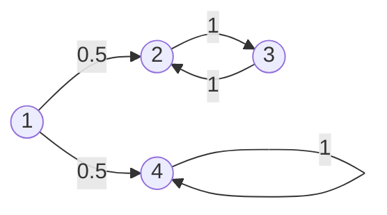

# Markov Chains

The [Bernoulli process](02-bernoulli-processes.md) and the [Poisson process](03-poisson-processes.md) are memoryless: nothing that happened in the past changes the distribution of what happens next. Markov chains are the next step up in generality — the future *is* allowed to depend on the past, but only through the **current state**. That single idea is enough to model systems that evolve with persistence: queues, inventories, and — the application this course cares about — [market regimes](../../part-01-foundations/06-market-regimes.md), where calm and turbulent periods each tend to persist.

This page builds the observable-chain machinery: the Markov property, transition matrices, $n$-step transition probabilities, the classification of states, and steady-state behavior. The extension to chains whose state is *not* observed — the exact situation of regime detection, where the market's state is hidden and all we see are returns — is developed in [Hidden Markov Models](07-hidden-markov-models.md).

## Checkout Counter

Consider a supermarket checkout counter. Chop time into small slots and suppose that during each slot, independently of everything else:

- a new customer joins the queue with probability $p$;
- if the queue is nonempty, the customer being served finishes and leaves with probability $q$.

Let $X_n$ be the number of customers in the queue at the start of slot $n$, and cap the queue at $10$ (arrivals are turned away when the queue is full). For an interior state $1\le i\le 9$, one slot later the queue has

- grown by one if there was an arrival and no departure: probability $p(1-q)$;
- shrunk by one if there was a departure and no arrival: probability $q(1-p)$;
- stayed the same otherwise: probability $pq+(1-p)(1-q)$.

At the boundaries, the queue can only grow from $0$ (probability $p$) and only shrink from $10$ (probability $q$).

```mermaid
flowchart LR
    S0((0)) -->|"p"| S1((1))
    S1 -->|"q(1-p)"| S0
    S1 -->|"p(1-q)"| S2((2))
    S2 -->|"q(1-p)"| S1
    S2 -->|"p(1-q)"| Sd(("&#8943;"))
    Sd -->|"q(1-p)"| S2
    Sd -->|"p(1-q)"| S10((10))
    S10 -->|"q"| Sd
```

Self-transitions are omitted from the diagram; each state keeps whatever probability is left over.

The crucial modeling fact: to predict the queue length one slot from now, the *current* queue length is all that matters. How the queue got to length $5$ — a burst of arrivals a minute ago, or a slow accumulation over an hour — is irrelevant. That is the Markov property, and everything below formalizes it.

## Definition

### Discrete-Time Finite State Markov Chains

A **discrete-time finite-state Markov chain** consists of:

- a finite **state space** $S=\{1,2,\ldots,m\}$;
- a sequence of random variables $X_0,X_1,X_2,\ldots$ taking values in $S$, where $X_n$ is the state after $n$ **transitions**;
- **transition probabilities** $p_{ij}$, the probability of moving to state $j$ given that the current state is $i$.

We assume the chain is **time-homogeneous**: $p_{ij}$ does not depend on $n$. The transition probabilities are collected in the $m\times m$ **transition matrix** $P=[p_{ij}]$, whose rows are probability distributions:

$$p_{ij}\ge 0,\qquad \sum_{j=1}^{m}p_{ij}=1\quad\text{for every }i.$$

A matrix with these two properties is called **row-stochastic**. Together with an **initial distribution** $\pi_0$, where $\pi_0(i)=\mathbf{P}(X_0=i)$, the transition matrix completely determines the probability of any finite trajectory:

$$\mathbf{P}(X_0=i_0,X_1=i_1,\ldots,X_n=i_n)=\pi_0(i_0)\,p_{i_0i_1}\,p_{i_1i_2}\cdots p_{i_{n-1}i_n}.$$

??? note "Proof"
    By the [multiplication rule](../part-02-probability-foundations/03-conditional-probability.md),

    $$\begin{align}
    \mathbf{P}(X_0=i_0,\ldots,X_n=i_n)
    &=\mathbf{P}(X_0=i_0)\prod_{k=1}^{n}\mathbf{P}(X_k=i_k\mid X_{k-1}=i_{k-1},\ldots,X_0=i_0)\\
    &=\pi_0(i_0)\prod_{k=1}^{n}p_{i_{k-1}i_k},
    \end{align}$$

    where the second equality applies the Markov property to each conditional factor.

### Markov Property

Given the current state, the past doesn't matter:

$$\begin{align}
p_{ij}&=\mathbf{P}(X_{n+1}=j\mid X_n=i)\\
&=\mathbf{P}(X_{n+1}=j\mid X_n=i,X_{n-1},\ldots,X_0).
\end{align}$$

Read this carefully — it does *not* say the future is independent of the past. $X_{n+1}$ and $X_{n-1}$ are in general strongly dependent. It says the dependence is entirely *mediated by the present*: once you condition on $X_n$, the earlier history carries no additional information about the future.

!!! note "The Markov property is a modeling choice, not a law of nature"
    Whether a process "is Markov" depends on what you call the state. If tomorrow's queue depended on both today's length and yesterday's, the process $X_n=(\text{today's length})$ would not be Markov — but the augmented process $\tilde X_n=(\text{today's length},\text{yesterday's length})$ would be. The art of Markov modeling is choosing a state rich enough to absorb all the relevant history. This is exactly the move behind regime models: raw returns are not Markov in any useful way, so we *posit* a small hidden state (the regime) that is.

## $n$-Step Transition Probabilities

Let

$$r_{ij}(n)=\mathbf{P}(X_n=j\mid X_0=i)$$

be the probability of being in state $j$ exactly $n$ transitions after starting in state $i$. By time-homogeneity this is also $\mathbf{P}(X_{s+n}=j\mid X_s=i)$ for any $s$. These satisfy the **Chapman–Kolmogorov recursion**: for $n\ge 2$,

$$r_{ij}(n)=\sum_{k=1}^{m}r_{ik}(n-1)\,p_{kj},\qquad r_{ij}(1)=p_{ij}.$$

??? note "Proof"
    Condition on the state after $n-1$ transitions. By the total probability theorem,

    $$\begin{align}
    r_{ij}(n)&=\mathbf{P}(X_n=j\mid X_0=i)\\
    &=\sum_{k=1}^{m}\mathbf{P}(X_{n-1}=k\mid X_0=i)\,\mathbf{P}(X_n=j\mid X_{n-1}=k,X_0=i)\\
    &=\sum_{k=1}^{m}r_{ik}(n-1)\,p_{kj},
    \end{align}$$

    where the last step uses the Markov property to drop the conditioning on $X_0$.

In matrix form the recursion says the matrix $[r_{ij}(n)]$ equals $P^n$: $n$-step transition probabilities are entries of the $n$-th power of the transition matrix. More generally, splitting a path of length $n+s$ at time $n$ gives the general Chapman–Kolmogorov equation

$$r_{ij}(n+s)=\sum_{k=1}^{m}r_{ik}(n)\,r_{kj}(s).$$

### A Two-State Chain, Solved Exactly

The two-state chain is worth solving in closed form because it is the skeleton of every calm/turbulent regime model. Let $S=\{1,2\}$ and

$$P=\begin{pmatrix}1-a & a\\ b & 1-b\end{pmatrix},\qquad 0<a,b<1,$$

so $a$ is the probability of leaving state $1$ and $b$ the probability of leaving state $2$. Then

$$r_{11}(n)=\frac{b}{a+b}+\frac{a}{a+b}\,(1-a-b)^n,\qquad
r_{21}(n)=\frac{b}{a+b}-\frac{b}{a+b}\,(1-a-b)^n.$$

??? note "Proof"
    Using the recursion with $r_{12}(n-1)=1-r_{11}(n-1)$,

    $$\begin{align}
    r_{11}(n)&=r_{11}(n-1)(1-a)+r_{12}(n-1)\,b\\
    &=r_{11}(n-1)(1-a)+\bigl(1-r_{11}(n-1)\bigr)b\\
    &=b+(1-a-b)\,r_{11}(n-1).
    \end{align}$$

    This is a linear first-order recursion. Its fixed point $x^{*}$ satisfies $x^{*}=b+(1-a-b)x^{*}$, giving $x^{*}=\frac{b}{a+b}$. The deviation $d_n=r_{11}(n)-x^{*}$ then satisfies $d_n=(1-a-b)\,d_{n-1}$, so $d_n=(1-a-b)^n d_0$ with $d_0=r_{11}(0)-x^{*}=1-\frac{b}{a+b}=\frac{a}{a+b}$. The formula for $r_{21}(n)$ follows the same way from $d_0=0-\frac{b}{a+b}$.

Two observations that anticipate the steady-state theory below:

1. **Convergence.** Since $|1-a-b|<1$, both $r_{11}(n)$ and $r_{21}(n)$ converge to the *same* limit $\frac{b}{a+b}$: after many transitions, the probability of being in state $1$ no longer depends on where the chain started. This limit is the **steady-state probability** of state $1$.
2. **Speed.** The initial condition is forgotten geometrically at rate $|1-a-b|^n$. For persistent regimes this is slow: with $a=b=0.02$, we get $1-a-b=0.96$, and the memory of the starting state halves only every $\ln 2/\ln(1/0.96)\approx 17$ steps. Persistence is precisely what makes the current regime worth estimating — the state you infer today still says a lot about next week.

## Recurrent and Transient States

Say that state $j$ is **accessible** from state $i$ if $r_{ij}(n)>0$ for some $n\ge 0$, and write $A(i)$ for the set of states accessible from $i$ (note $i\in A(i)$ always).

- State $i$ is **recurrent** if every state it can reach can reach it back: for every $j\in A(i)$, we have $i\in A(j)$. Starting from a recurrent state, the chain returns to it with probability $1$, and therefore returns infinitely often.
- State $i$ is **transient** otherwise: some $j\in A(i)$ offers no path back to $i$. Each visit to $i$ carries a fixed positive probability of escaping down such a path forever, so with probability $1$ the chain visits $i$ only finitely many times.

If $i$ is recurrent, the set $A(i)$ is called a **recurrent class**: all of its states are recurrent, they are all accessible from one another, and no state outside $A(i)$ is accessible from inside it — once the chain enters a recurrent class, it never leaves. This yields the **decomposition theorem**: the state space of a finite Markov chain splits into one or more disjoint recurrent classes plus a (possibly empty) set of transient states. Starting anywhere, the chain spends a finite initial stretch among transient states and then enters some recurrent class, where it remains forever.

Here state $1$ is transient (once it leaves, it never returns), $\{2,3\}$ is a recurrent class, and $\{4\}$ is an **absorbing** recurrent class. Which class the chain ends up in is random — it depends on the first coin flip out of state $1$ — so when there are multiple recurrent classes, long-run behavior depends on the starting state.

One more definition is needed for the steady-state theory. A recurrent class is **periodic** if its states can be partitioned into $d\ge 2$ groups $S_1,\ldots,S_d$ such that every transition moves the chain from $S_k$ to $S_{k+1}$ (with $S_{d+1}=S_1$): the chain cycles through the groups deterministically, and $r_{ii}(n)>0$ only when $n$ is a multiple of $d$. Otherwise the class is **aperiodic**. A convenient sufficient condition: if any state in the class has a self-transition ($p_{ii}>0$), the class is aperiodic.

!!! note "Why a trader should care about this taxonomy"
    An estimated regime transition matrix almost always has all entries strictly positive, which makes the whole state space a single aperiodic recurrent class — the "nice" case in which a unique steady state exists (see [Steady State Probabilities](#steady-state-probabilities) below). But the taxonomy also diagnoses pathological fits: an estimated chain with a near-absorbing state ($p_{ii}\approx 1$, all exit probabilities $\approx 0$) is claiming a regime the market enters and never leaves, which usually signals an overfit or degenerate model rather than a discovery.

## Steady State Probabilities

The two-state chain solved exactly above gave a strong hint. With leaving probabilities $a$ and $b$,

$$r_{11}(n)=\frac{b}{a+b}+\frac{a}{a+b}(1-a-b)^n\;\longrightarrow\;\frac{b}{a+b},$$

and $r_{21}(n)$ converges to the *same* limit: after many transitions, the probability of finding the chain in state $1$ no longer depends on where it started. The general result:

!!! abstract "Steady-State Convergence Theorem"
    Let $X_n$ be a finite-state Markov chain with a **single recurrent class** that is **aperiodic**. Then for every $j$, the limit

    $$\pi_j=\lim_{n\to\infty}r_{ij}(n)$$

    exists and is independent of the initial state $i$. The $\pi_j$ are the unique nonnegative solution of the **balance equations** together with normalization:

    $$\pi_j=\sum_{k=1}^{m}\pi_k\,p_{kj}\quad(j=1,\ldots,m),\qquad \sum_{k=1}^{m}\pi_k=1.$$

    Moreover $\pi_j=0$ for every transient state $j$ and $\pi_j>0$ for every recurrent state $j$.

The balance equations are easy to motivate: start from the Chapman–Kolmogorov recursion $r_{ij}(n)=\sum_k r_{ik}(n-1)\,p_{kj}$ and let $n\to\infty$ on both sides. If the limits exist, they must satisfy $\pi_j=\sum_k\pi_k p_{kj}$ — the hard part of the theorem (which we will not prove) is that the limits *do* exist under the stated conditions. In matrix language, the row vector $\pi=(\pi_1,\ldots,\pi_m)$ satisfies $\pi=\pi P$: the steady-state distribution is a left eigenvector of the transition matrix with eigenvalue $1$, normalized to sum to $1$. A distribution with this property is also called **stationary**: if $X_0\sim\pi$, then $X_n\sim\pi$ for all $n$ — the chain is in "statistical equilibrium" from the start.

For the two-state chain, the balance equation for state $1$ reads $\pi_1=\pi_1(1-a)+\pi_2 b$, i.e. $\pi_1 a=\pi_2 b$ — the long-run flow $1\to 2$ matches the flow $2\to 1$. With $\pi_1+\pi_2=1$,

$$\pi_1=\frac{b}{a+b},\qquad \pi_2=\frac{a}{a+b},$$

matching the limit computed directly above.

The steady-state probabilities carry three equivalent interpretations:

1. **Limiting probability**: $\pi_j$ is (approximately) the probability of finding the chain in state $j$ at a fixed faraway time, regardless of the start.
2. **Long-run fraction of time**: if $v_{ij}(n)$ counts visits to $j$ in the first $n$ transitions starting from $i$, then $v_{ij}(n)/n\to\pi_j$ with probability $1$. Likewise the long-run frequency of $j\to k$ transitions is $\pi_j p_{jk}$ — a fact we exploit twice below.
3. **Mean recurrence time**: the expected number of transitions between successive visits to $j$ is $t_j^{*}=1/\pi_j$. Rare states are rarely refreshed.

!!! note "Steady state as unconditional regime frequency"
    For a regime chain, $\pi$ answers "ignoring all current information, what fraction of the time does the market spend in each regime?" A two-state fit with $a=\mathbf{P}(\text{calm}\to\text{turbulent})=0.02$ and $b=\mathbf{P}(\text{turbulent}\to\text{calm})=0.10$ gives $\pi=(5/6,\,1/6)$: calm five days out of six. The filtered probability of [Hidden Markov Models](07-hidden-markov-models.md) is the *conditional* refinement of this unconditional base rate — with no recent data, your best guess reverts to $\pi$.

### Why the Conditions Matter

Both hypotheses of the theorem are load-bearing.

- **Multiple recurrent classes**: with two absorbing states, $r_{ij}(n)$ still converges but the limit depends on the start — a chain absorbed in class $A$ never reports statistics of class $B$. Balance equations then have multiple solutions.
- **Periodicity**: take $p_{12}=p_{21}=1$. Then $r_{11}(n)$ alternates $1,0,1,0,\ldots$ and never converges, even though the time-average fraction of visits still converges to $\tfrac12$. Aperiodicity is what upgrades convergence of *averages* to convergence of *probabilities*.

### Birth–Death Chains and the Checkout Counter

A **birth–death chain** is one whose transitions move at most one step: from state $i$, up with probability $b_i$, down with probability $d_i$, staying put otherwise (the checkout counter above is exactly this). For such chains the balance equations collapse to a one-line **local balance** relation:

$$\pi_i\,b_i=\pi_{i+1}\,d_{i+1},\qquad i=0,1,\ldots,m-1.$$

??? note "Proof"
    Consider the "cut" between states $\{0,\ldots,i\}$ and $\{i+1,\ldots,m\}$. Because the chain moves one step at a time, every crossing left-to-right is an $i\to i+1$ transition and every crossing right-to-left is an $i+1\to i$ transition. Crossings must alternate — the chain cannot cross the cut rightward twice without crossing back in between — so in $n$ transitions the numbers of crossings in the two directions differ by at most $1$. Dividing by $n$ and letting $n\to\infty$, the long-run frequencies of the two transition types are equal. By interpretation 2 above these frequencies are $\pi_i b_i$ and $\pi_{i+1}d_{i+1}$.

Iterating local balance gives an explicit product formula, up to the normalizing constant:

$$\pi_i=\pi_0\prod_{k=0}^{i-1}\frac{b_k}{d_{k+1}},\qquad \sum_{i=0}^{m}\pi_i=1.$$

For the checkout counter, every interior ratio is

$$\rho=\frac{p(1-q)}{q(1-p)},$$

so the steady-state probabilities scale geometrically in $\rho$ (with small corrections at the two boundary states). The single number $\rho$ — arrival pressure over service pressure — governs congestion: if $\rho<1$ the distribution piles up near an empty queue; if $\rho>1$ it piles up at capacity; if $\rho=1$ it is (nearly) uniform.

### Sojourn Times: How Long Does a Regime Last?

Suppose the chain has just entered state $i$. Each subsequent step, independently, it stays with probability $p_{ii}$ and leaves with probability $1-p_{ii}$ (to *some* other state). The number of steps $T_i$ spent in state $i$ before leaving is therefore [geometric](../part-05-common-distributions/03-geometric-distribution.md) with parameter $1-p_{ii}$:

$$\mathbf{P}(T_i=k)=p_{ii}^{\,k-1}(1-p_{ii}),\qquad \mathbb{E}[T_i]=\frac{1}{1-p_{ii}}.$$

This turns the diagonal of an estimated transition matrix directly into regime persistence:

| $p_{ii}$ | Expected duration |
|---|---|
| $0.90$ | $10$ days |
| $0.98$ | $50$ days |
| $0.995$ | $200$ days |

!!! warning "Geometric durations are an assumption, not a finding"
    The geometric law is *forced by the Markov property*: memorylessness means the regime's remaining lifetime never depends on how long it has already lasted. Real regimes may age — a two-year-old calm period may genuinely be more fragile than a two-month-old one — and a fitted HMM cannot represent that. This is a known limitation to keep in mind when interpreting fitted models (semi-Markov models relax it, at a cost in complexity).

### Speed of Convergence

How fast is steady state reached? In the two-state chain the answer was exact: the deviation decays like $(1-a-b)^n$, and $1-a-b$ is precisely the second eigenvalue of $P$. This generalizes: for a chain satisfying the convergence theorem, $r_{ij}(n)$ approaches $\pi_j$ geometrically at a rate governed by the second-largest eigenvalue modulus of $P$. Persistent regimes (diagonal entries near $1$) mean a second eigenvalue near $1$ and slow **mixing** — which cuts both ways. It makes unconditional long-run statistics slow to trust, but it is exactly why *conditional* inference pays: a state that decays slowly is a state worth estimating.

## Where This Goes Next

The machinery here assumed the state is observable. In the regime problem it is not — the state must be inferred from noisy emissions, which is the subject of [Hidden Markov Models](07-hidden-markov-models.md). The full application to real return data is taken up in [Bayesian Methods and Hidden Markov Models](../../part-03-statistics/06-bayesian-methods-and-hmms.md), with the motivating market context in [Market Regimes](../../part-01-foundations/06-market-regimes.md).
