# Hidden Markov Models

This page assumes the chain machinery of [Markov Chains](05-markov-chains.md). In the checkout counter there, the state is observable — you can count the queue. In the regime problem, it is not. Nobody publishes today's regime; we see returns, which are noisy *emissions* from whatever state the market occupies. The formal object for this situation is the Hidden Markov Model.

## Definition

A **Hidden Markov Model** consists of two coupled processes:

- a **hidden state chain** $X_0,X_1,\ldots,X_T$: a Markov chain on $S=\{1,\ldots,m\}$ with transition matrix $P=[p_{ij}]$ and initial distribution $\pi_0$, exactly as before — except that $X_n$ is never observed;
- an **observation process** $Y_0,Y_1,\ldots,Y_T$: at each time $n$, the current state emits an observation drawn from a state-specific **emission distribution** with density (or PMF) $f_i(y)$ when $X_n=i$.

The coupling assumption: *conditioned on the entire hidden path, the observations are independent, and each depends only on the concurrent state*:

$$p(y_0,y_1,\ldots,y_T\mid x_0,x_1,\ldots,x_T)=\prod_{n=0}^{T}f_{x_n}(y_n).$$

The model is parameterized by $\lambda=(\pi_0,P,\{f_i\})$. For regime detection on returns, the standard choice is **Gaussian emissions**: state $i$ generates returns from a [normal distribution](../part-05-common-distributions/16-gaussian-distribution.md) with state-specific mean and variance,

$$f_i(y)=\frac{1}{\sqrt{2\pi\sigma_i^2}}\exp\!\left(-\frac{(y-\mu_i)^2}{2\sigma_i^2}\right).$$

A two-state Gaussian HMM already captures the essential regime phenomenology: a persistent low-volatility state and a persistent high-volatility state, each with its own mean return.

```mermaid
flowchart LR
    X0(("X&#8320;")) --> X1(("X&#8321;")) --> X2(("X&#8322;")) --> Xd["&#8943;"]
    X0 --> Y0(["Y&#8320;"])
    X1 --> Y1(["Y&#8321;"])
    X2 --> Y2(["Y&#8322;"])
```

The dependency structure: the hidden chain (circles) evolves on its own; each observation (rounded boxes) hangs off its state. All statistical dependence between observations at different times flows *through* the hidden chain — that is what makes the computations below tractable.

## The Joint Likelihood

Combining the trajectory formula for the chain with the emission factorization gives the complete joint density of states and observations:

$$p(x_{0:T},y_{0:T})=\pi_0(x_0)\,f_{x_0}(y_0)\prod_{n=1}^{T}p_{x_{n-1}x_n}\,f_{x_n}(y_n),$$

where $x_{0:T}$ abbreviates $(x_0,\ldots,x_T)$. Every HMM computation is some manipulation of this one expression: summing it over paths, maximizing it over paths, or maximizing its expectation over parameters.

## The Three Computational Problems

| Problem | Question | Algorithm |
|---|---|---|
| Evaluation | What is the likelihood $p(y_{0:T};\lambda)$ of the observed data? | Forward algorithm |
| Inference | Which state is the chain in? — filtered $\mathbf{P}(X_n=i\mid y_{0:n})$, smoothed $\mathbf{P}(X_n=i\mid y_{0:T})$, and the most likely path | Forward (filtering); forward–backward (smoothing); Viterbi (best path) |
| Learning | Which parameters $\lambda=(\pi_0,P,\{f_i\})$ best explain the data? | Baum–Welch (EM) |

All three are developed below on this page.

## The Forward Algorithm

The evaluation problem looks innocent: to get $p(y_{0:T})$, just sum the joint likelihood over all hidden paths,

$$p(y_{0:T})=\sum_{x_0=1}^{m}\cdots\sum_{x_T=1}^{m}\pi_0(x_0)\,f_{x_0}(y_0)\prod_{n=1}^{T}p_{x_{n-1}x_n}\,f_{x_n}(y_n).$$

But there are $m^{T+1}$ paths. For a modest three-state model on one year of daily returns ($m=3$, $T=251$), that is $3^{252}\approx 10^{120}$ terms — the sum is unusable as written. The forward algorithm computes it exactly in $O(m^2T)$ operations by pushing the sums inside the product.

Define the **forward variable**

$$\alpha_n(i)=p(y_{0:n},X_n=i),$$

the joint density of the observations up to time $n$ *and* the event that the chain is currently in state $i$. It satisfies:

**Initialization.**

$$\alpha_0(i)=\pi_0(i)\,f_i(y_0),\qquad i=1,\ldots,m.$$

**Recursion.** For $n=0,1,\ldots,T-1$,

$$\alpha_{n+1}(j)=\left[\sum_{i=1}^{m}\alpha_n(i)\,p_{ij}\right]f_j(y_{n+1}),\qquad j=1,\ldots,m.$$

**Termination.**

$$p(y_{0:T})=\sum_{i=1}^{m}\alpha_T(i).$$

??? note "Proof of the recursion"
    Two conditional-independence facts follow from the joint likelihood by summing out the unwanted variables: given $X_n=i$, the next state is independent of the observation history, $\mathbf{P}(X_{n+1}=j\mid X_n=i,\,y_{0:n})=p_{ij}$; and given $X_{n+1}=j$, the new observation is independent of everything earlier, $p(y_{n+1}\mid X_{n+1}=j,\,X_n=i,\,y_{0:n})=f_j(y_{n+1})$. Then, decomposing over the state at time $n$,

    $$\begin{align}
    \alpha_{n+1}(j)&=p(y_{0:n+1},X_{n+1}=j)\\
    &=\sum_{i=1}^{m}p(y_{0:n},X_n=i,X_{n+1}=j,y_{n+1})\\
    &=\sum_{i=1}^{m}p(y_{0:n},X_n=i)\;\mathbf{P}(X_{n+1}=j\mid X_n=i,y_{0:n})\;p(y_{n+1}\mid X_{n+1}=j,X_n=i,y_{0:n})\\
    &=\sum_{i=1}^{m}\alpha_n(i)\,p_{ij}\,f_j(y_{n+1})\\
    &=\left[\sum_{i=1}^{m}\alpha_n(i)\,p_{ij}\right]f_j(y_{n+1}).
    \end{align}$$

    The termination formula is the total probability theorem: $p(y_{0:T})=\sum_i p(y_{0:T},X_T=i)=\sum_i\alpha_T(i)$.

Each time step costs $m$ multiplications for each of $m$ states, so the full pass is $O(m^2T)$: for the three-state, one-year example, a few thousand multiplications instead of $10^{120}$ terms. The structural reason this works is the Markov property itself — $\alpha_n$ is a *sufficient summary* of the entire history $y_{0:n}$ for everything the future can ask, so the computation never needs to look back.

## Filtering: Which State Is the Chain in Now?

The forward variables deliver, as a free by-product, the answer to the question the regime lesson actually poses in real time. By the definition of conditional probability,

$$\mathbf{P}(X_n=i\mid y_{0:n})=\frac{p(y_{0:n},X_n=i)}{p(y_{0:n})}=\frac{\alpha_n(i)}{\sum_{j=1}^{m}\alpha_n(j)}.$$

This is the **filtered state probability**: the posterior distribution over the current hidden state given all data observed *so far*. Unwinding one step of the recursion shows that filtering is exactly sequential [Bayesian inference](../part-16-bayesian-statistics/01-bayesian-framework.md):

$$\underbrace{\mathbf{P}(X_{n+1}=j\mid y_{0:n})}_{\text{predict: propagate through }P}=\sum_{i=1}^{m}\mathbf{P}(X_n=i\mid y_{0:n})\,p_{ij},$$

$$\underbrace{\mathbf{P}(X_{n+1}=j\mid y_{0:n+1})}_{\text{update: reweight by the new data}}\propto\mathbf{P}(X_{n+1}=j\mid y_{0:n})\,f_j(y_{n+1}).$$

Each day: push yesterday's posterior through the transition matrix (the *prior* for today), multiply by the likelihood of today's observation under each state, normalize. This predict–update cycle runs in $O(m^2)$ per new observation, making it directly usable in a live trading system.

!!! note "Filtering is the tradeable quantity"
    $\mathbf{P}(X_n=i\mid y_{0:n})$ uses only information available at time $n$ — it can drive a real-time decision without lookahead. Its retrospective cousin, the *smoothed* probability $\mathbf{P}(X_n=i\mid y_{0:T})$, uses the whole sample including the future, and is therefore for historical analysis only. The distinction, and the backward recursion that computes the smoothed version, are developed below — confusing the two is a classic source of lookahead bias in regime-switching backtests.

The forward pass answered "what is the likelihood?" and "what state now?". Three questions remain: how to infer states retrospectively (smoothing), how to recover the single most likely hidden path (decoding), and how to estimate the parameters from data alone (learning).

## The Backward Algorithm

Define the **backward variable** as the density of the *future* observations given the current state:

$$\beta_n(i)=p(y_{n+1:T}\mid X_n=i),\qquad \beta_T(i)=1.$$

It satisfies a mirror-image recursion, run from $T$ down to $0$: for $n=T-1,\ldots,0$,

$$\beta_n(i)=\sum_{j=1}^{m}p_{ij}\,f_j(y_{n+1})\,\beta_{n+1}(j).$$

??? note "Proof"
    Condition on the next state:

    $$\begin{align}
    \beta_n(i)&=p(y_{n+1:T}\mid X_n=i)\\
    &=\sum_{j=1}^{m}\mathbf{P}(X_{n+1}=j\mid X_n=i)\;p(y_{n+1},y_{n+2:T}\mid X_{n+1}=j)\\
    &=\sum_{j=1}^{m}p_{ij}\;f_j(y_{n+1})\;p(y_{n+2:T}\mid X_{n+1}=j)\\
    &=\sum_{j=1}^{m}p_{ij}\,f_j(y_{n+1})\,\beta_{n+1}(j).
    \end{align}$$

    The middle steps use the HMM conditional-independence structure: given $X_{n+1}=j$, the observation $y_{n+1}$ has density $f_j$ and is independent of the later observations, which themselves depend only on $X_{n+1}$.

Like the forward pass, the backward pass costs $O(m^2T)$. As a consistency check, $p(y_{0:T})=\sum_i\pi_0(i)f_i(y_0)\beta_0(i)$ — the same number the forward pass produces at termination.

## Smoothing: the Forward–Backward Algorithm

The **smoothed** state probability conditions on the *entire* sample:

$$\gamma_n(i)=\mathbf{P}(X_n=i\mid y_{0:T})=\frac{\alpha_n(i)\,\beta_n(i)}{\displaystyle\sum_{j=1}^{m}\alpha_n(j)\,\beta_n(j)}.$$

??? note "Proof"
    The key identity is $p(y_{0:T},X_n=i)=\alpha_n(i)\,\beta_n(i)$:

    $$\begin{align}
    p(y_{0:T},X_n=i)&=p(y_{0:n},X_n=i)\;p(y_{n+1:T}\mid X_n=i,y_{0:n})\\
    &=\alpha_n(i)\,\beta_n(i),
    \end{align}$$

    where the second factor drops the conditioning on $y_{0:n}$ because, given $X_n=i$, future observations are independent of past ones (they are generated by the future of the chain, which is conditionally independent of the past given the present). Dividing by $p(y_{0:T})=\sum_j\alpha_n(j)\beta_n(j)$ gives $\gamma_n(i)$.

Intuitively, $\alpha_n(i)$ scores state $i$ by how well it explains the past, $\beta_n(i)$ by how well it sets up the future, and smoothing multiplies the two. Smoothed probabilities are sharper than filtered ones — a spike of volatility that, in real time, was ambiguous ("noise or new regime?") is resolved by seeing what came after.

!!! warning "Filtering vs smoothing: the lookahead trap"
    $\gamma_n(i)$ conditions on $y_{n+1:T}$ — data that did not exist at time $n$. Smoothed regime labels are the right tool for *historical analysis* ("how did the strategy perform in each regime?") and for parameter estimation below. They are the wrong input for a *backtest of a regime-switching rule*: trading at time $n$ on $\gamma_n$ silently imports the future and produces regime timing no live system can reproduce. Backtests must use the filtered probabilities $\mathbf{P}(X_n=i\mid y_{0:n})$ from the filtering section above.

## Decoding: the Viterbi Algorithm

Smoothing answers state questions one time-point at a time. A different question is: what is the single most likely *sequence* of hidden states,

$$\hat x_{0:T}=\arg\max_{x_{0:T}}\ \mathbf{P}(X_{0:T}=x_{0:T}\mid y_{0:T})=\arg\max_{x_{0:T}}\ p(x_{0:T},y_{0:T})\,?$$

(The two argmaxes agree because the conditional and the joint differ by the factor $p(y_{0:T})$, which does not involve $x_{0:T}$.) This is *not* the same as picking $\arg\max_i\gamma_n(i)$ at each $n$: the pointwise-best sequence ignores transition probabilities and can even be an impossible path — if $p_{ij}=0$, the pointwise labels may still demand an $i\to j$ step. Maximizing over $m^{T+1}$ paths looks as hopeless as the evaluation problem did, and it is cured by the same trick: dynamic programming, with $\max$ replacing $\sum$. Define

$$\delta_n(j)=\max_{x_{0:n-1}}\ p(x_{0:n-1},X_n=j,y_{0:n}),$$

the probability of the best partial path ending in state $j$ at time $n$.

**Initialization.** $\delta_0(i)=\pi_0(i)f_i(y_0)$.

**Recursion.** For $n=0,\ldots,T-1$,

$$\delta_{n+1}(j)=\Bigl[\max_{1\le i\le m}\ \delta_n(i)\,p_{ij}\Bigr]f_j(y_{n+1}),\qquad
\psi_{n+1}(j)=\arg\max_{1\le i\le m}\ \delta_n(i)\,p_{ij}.$$

**Termination and backtracking.** $\hat x_T=\arg\max_j\delta_T(j)$, then $\hat x_n=\psi_{n+1}(\hat x_{n+1})$ for $n=T-1,\ldots,0$.

??? note "Proof of the recursion"
    Using the joint likelihood factorization, a path ending $(\ldots,X_n=i,X_{n+1}=j)$ has probability [best path to $i$ at $n$] $\times\,p_{ij}f_j(y_{n+1})$, and the maximum over all paths to $j$ at $n+1$ splits over the intermediate state:

    $$\begin{align}
    \delta_{n+1}(j)&=\max_{x_{0:n}}\ p(x_{0:n},X_{n+1}=j,y_{0:n+1})\\
    &=\max_{1\le i\le m}\ \Bigl[\max_{x_{0:n-1}}p(x_{0:n-1},X_n=i,y_{0:n})\Bigr]p_{ij}\,f_j(y_{n+1})\\
    &=\Bigl[\max_i\ \delta_n(i)\,p_{ij}\Bigr]f_j(y_{n+1}).
    \end{align}$$

    The interchange in the second line is the principle of optimality: the best path through $X_n=i$ must begin with the best path *to* $X_n=i$, since the remaining factors do not depend on $x_{0:n-1}$.

The cost is $O(m^2T)$, the same as the forward pass. In practice Viterbi is always run on logarithms — products of thousands of small numbers underflow — which turns the recursion into $\log\delta_{n+1}(j)=\max_i[\log\delta_n(i)+\log p_{ij}]+\log f_j(y_{n+1})$, a max-plus recursion that is numerically bulletproof. Viterbi paths are the standard way to paint historical regime labels on a price chart; the smoothed $\gamma$'s are the right object when you need *probabilities* rather than a single label.

## Learning: the Baum–Welch Algorithm

Everything so far assumed the parameters $\lambda=(\pi_0,P,\{f_i\})$ were known. In practice nothing is known: from returns alone we must estimate the transition matrix, each regime's mean and variance, and the initial distribution. Maximum likelihood asks for

$$\hat\lambda=\arg\max_\lambda\ \log p(y_{0:T};\lambda)=\arg\max_\lambda\ \log\!\!\sum_{x_{0:T}}p(x_{0:T},y_{0:T};\lambda),$$

and the log-of-a-sum over $m^{T+1}$ paths has no closed-form maximizer. Baum–Welch is the **Expectation–Maximization (EM)** algorithm specialized to HMMs: it alternates between inferring the hidden states given current parameters, and re-estimating parameters given that soft inference.

The pivot is the **complete-data log-likelihood** — what we could maximize easily if the path were visible:

$$\log p(x_{0:T},y_{0:T};\lambda)=\log\pi_0(x_0)+\sum_{n=1}^{T}\log p_{x_{n-1}x_n}+\sum_{n=0}^{T}\log f_{x_n}(y_n).$$

It splits into three pieces touching disjoint parameter blocks ($\pi_0$, $P$, emissions) — the reason the M-step below decouples so cleanly.

**E-step.** Given current parameters $\lambda^{(k)}$, take the expectation of the complete-data log-likelihood over the hidden path's posterior. Because the expression above is linear in the indicators $\mathbf{1}\{x_n=i\}$ and $\mathbf{1}\{x_{n-1}=i,x_n=j\}$, the expectation needs only two families of posterior quantities: the smoothed state probabilities $\gamma_n(i)$ from the forward–backward pass, and the **smoothed transition probabilities**

$$\xi_n(i,j)=\mathbf{P}(X_n=i,X_{n+1}=j\mid y_{0:T})
=\frac{\alpha_n(i)\,p_{ij}\,f_j(y_{n+1})\,\beta_{n+1}(j)}{p(y_{0:T})}.$$

??? note "Proof of the $\xi$ formula"
    Factor the event along the timeline:

    $$\begin{align}
    p(X_n=i,X_{n+1}=j,y_{0:T})
    &=\underbrace{p(y_{0:n},X_n=i)}_{\alpha_n(i)}\;
    \underbrace{\mathbf{P}(X_{n+1}=j\mid X_n=i)}_{p_{ij}}\;
    \underbrace{p(y_{n+1}\mid X_{n+1}=j)}_{f_j(y_{n+1})}\;
    \underbrace{p(y_{n+2:T}\mid X_{n+1}=j)}_{\beta_{n+1}(j)},
    \end{align}$$

    each conditioning dropping exactly the variables that the HMM structure makes irrelevant. Divide by $p(y_{0:T})$. Consistency check: $\sum_{j}\xi_n(i,j)=\gamma_n(i)$.

The expected complete-data log-likelihood (the "Q-function") becomes

$$Q(\lambda,\lambda^{(k)})=\sum_{i=1}^{m}\gamma_0(i)\log\pi_0(i)
+\sum_{n=0}^{T-1}\sum_{i=1}^{m}\sum_{j=1}^{m}\xi_n(i,j)\log p_{ij}
+\sum_{n=0}^{T}\sum_{i=1}^{m}\gamma_n(i)\log f_i(y_n),$$

where all $\gamma$'s and $\xi$'s are computed under $\lambda^{(k)}$.

**M-step.** Maximize $Q$ over $\lambda$. The three blocks separate, and each maximization has a closed form:

$$\hat\pi_0(i)=\gamma_0(i),\qquad
\hat p_{ij}=\frac{\displaystyle\sum_{n=0}^{T-1}\xi_n(i,j)}{\displaystyle\sum_{n=0}^{T-1}\gamma_n(i)},$$

and, for Gaussian emissions $f_i(y)=\mathcal{N}(y;\mu_i,\sigma_i^2)$,

$$\hat\mu_i=\frac{\displaystyle\sum_{n=0}^{T}\gamma_n(i)\,y_n}{\displaystyle\sum_{n=0}^{T}\gamma_n(i)},\qquad
\hat\sigma_i^2=\frac{\displaystyle\sum_{n=0}^{T}\gamma_n(i)\,(y_n-\hat\mu_i)^2}{\displaystyle\sum_{n=0}^{T}\gamma_n(i)}.$$

Every update is a **soft-count** version of the obvious estimator: $\hat p_{ij}$ is "expected number of $i\to j$ transitions over expected number of visits to $i$"; $\hat\mu_i$ and $\hat\sigma_i^2$ are the sample mean and variance of the data, with each observation weighted by the posterior probability that state $i$ generated it. If the path were actually observed, the $\gamma$'s and $\xi$'s would be $0/1$ indicators and these would reduce to ordinary empirical frequencies and moments.

??? note "Derivation of the transition update"
    Maximize the middle block of $Q$ over row $i$ of $P$ subject to $\sum_j p_{ij}=1$. With Lagrange multiplier $\eta$,

    $$\frac{\partial}{\partial p_{ij}}\left[\sum_{n=0}^{T-1}\xi_n(i,j)\log p_{ij}+\eta\Bigl(1-\sum_{j'}p_{ij'}\Bigr)\right]
    =\frac{\sum_{n}\xi_n(i,j)}{p_{ij}}-\eta=0,$$

    so $p_{ij}\propto\sum_n\xi_n(i,j)$. Normalizing the row and using $\sum_j\xi_n(i,j)=\gamma_n(i)$ gives the stated formula. The update for $\hat\pi_0$ is the same argument applied to the first block (with $\gamma_0$ in place of the $\xi$-sums).

??? note "Derivation of the Gaussian updates"
    The emission block for state $i$ is

    $$\sum_{n=0}^{T}\gamma_n(i)\left[-\tfrac12\log(2\pi\sigma_i^2)-\frac{(y_n-\mu_i)^2}{2\sigma_i^2}\right].$$

    Setting the $\mu_i$-derivative to zero: $\sum_n\gamma_n(i)(y_n-\mu_i)/\sigma_i^2=0$, which gives the weighted mean $\hat\mu_i$. Setting the $\sigma_i^2$-derivative to zero:

    $$\sum_{n}\gamma_n(i)\left[-\frac{1}{2\sigma_i^2}+\frac{(y_n-\hat\mu_i)^2}{2\sigma_i^4}\right]=0
    \;\Longrightarrow\;
    \hat\sigma_i^2=\frac{\sum_n\gamma_n(i)(y_n-\hat\mu_i)^2}{\sum_n\gamma_n(i)}.$$

**The algorithm.** Initialize $\lambda^{(0)}$; repeat {E-step: forward–backward under $\lambda^{(k)}$ to get $\gamma,\xi$; M-step: closed-form updates to get $\lambda^{(k+1)}$} until the log-likelihood stops improving. Each iteration costs $O(m^2T)$.

Why does alternating these two steps climb the *actual* likelihood, which is not what the M-step maximizes? This is the EM monotonicity guarantee:

$$\log p(y_{0:T};\lambda^{(k+1)})\ \ge\ \log p(y_{0:T};\lambda^{(k)}),$$

with equality only at a stationary point.

??? note "Proof of monotonicity"
    Write $\lambda'=\lambda^{(k)}$ and let $q(x)=p(x_{0:T}\mid y_{0:T};\lambda')$ be the current posterior over paths. For any $\lambda$, since $p(x,y;\lambda)=p(y;\lambda)\,p(x\mid y;\lambda)$,

    $$\log p(y;\lambda)=\underbrace{\mathbb{E}_q\bigl[\log p(x,y;\lambda)\bigr]}_{Q(\lambda,\lambda')}-\underbrace{\mathbb{E}_q\bigl[\log p(x\mid y;\lambda)\bigr]}_{H(\lambda,\lambda')},$$

    where the expectation over $q$ leaves $\log p(y;\lambda)$ untouched because it does not depend on $x$. Subtracting the same identity at $\lambda=\lambda'$:

    $$\log p(y;\lambda)-\log p(y;\lambda')=\bigl[Q(\lambda,\lambda')-Q(\lambda',\lambda')\bigr]-\bigl[H(\lambda,\lambda')-H(\lambda',\lambda')\bigr].$$

    The second bracket is nonpositive by Jensen's inequality:

    $$H(\lambda,\lambda')-H(\lambda',\lambda')=\mathbb{E}_q\!\left[\log\frac{p(x\mid y;\lambda)}{q(x)}\right]
    \le\log\ \mathbb{E}_q\!\left[\frac{p(x\mid y;\lambda)}{q(x)}\right]=\log 1=0.$$

    So any $\lambda$ with $Q(\lambda,\lambda')\ge Q(\lambda',\lambda')$ — in particular the M-step maximizer — satisfies $\log p(y;\lambda)\ge\log p(y;\lambda')$.

!!! warning "What EM does not guarantee"
    Monotone ascent, yes; the global maximum, no. The HMM likelihood surface is multimodal, and Baum–Welch converges to a local maximum that depends on the initialization. Standard practice: run from several starting points (e.g. states initialized by sorting observations into volatility buckets, or by k-means on rolling volatility) and keep the best likelihood. Watch for two failure modes: **degenerate solutions**, where a state collapses onto a handful of observations and $\hat\sigma_i^2\to 0$ sends the likelihood to infinity (cured by a variance floor or a prior), and **label switching** — the likelihood is invariant to permuting the states, so "state 1" means nothing until you impose a convention, such as ordering states by $\hat\sigma_i$.

## Numerical Scaling

The forward variable $\alpha_n(i)$ is a joint density of $n+1$ observations: it shrinks (or grows) geometrically in $n$ and underflows double-precision arithmetic within a few hundred steps. The standard fix normalizes at every step: set $\tilde\alpha_0(j)=\pi_0(j)f_j(y_0)$ and, for $n\ge 1$,

$$\tilde\alpha_n(j)=\Bigl[\sum_i\hat\alpha_{n-1}(i)\,p_{ij}\Bigr]f_j(y_n),\qquad
c_n=\sum_j\tilde\alpha_n(j),\qquad
\hat\alpha_n(j)=\frac{\tilde\alpha_n(j)}{c_n}.$$ Then the normalized variables are exactly the filtered probabilities, the scale factors are one-step predictive densities, and the log-likelihood is recovered as a sum:

$$\hat\alpha_n(j)=\mathbf{P}(X_n=j\mid y_{0:n}),\qquad
c_n=p(y_n\mid y_{0:n-1}),\qquad
\log p(y_{0:T})=\sum_{n=0}^{T}\log c_n.$$

??? note "Proof"
    By induction on $n$: assume $\hat\alpha_{n-1}(i)=\mathbf{P}(X_{n-1}=i\mid y_{0:n-1})$ and $\prod_{k<n}c_k=p(y_{0:n-1})$ (both hold at $n=1$, since $c_0=\sum_j\pi_0(j)f_j(y_0)=p(y_0)$). Then $\tilde\alpha_n(j)=\alpha_n(j)/p(y_{0:n-1})$, because the unscaled recursion is linear and the inductive hypothesis says we have divided through by $p(y_{0:n-1})$. Summing over $j$: $c_n=p(y_{0:n})/p(y_{0:n-1})=p(y_n\mid y_{0:n-1})$, and dividing gives $\hat\alpha_n(j)=\alpha_n(j)/p(y_{0:n})=\mathbf{P}(X_n=j\mid y_{0:n})$. The product of the $c$'s telescopes to $p(y_{0:T})$.

The backward variables are rescaled by the same constants $c_n$, which cancel in the ratios defining $\gamma$ and $\xi$, so forward–backward and Baum–Welch run unchanged on the scaled quantities. The identity $\log p(y_{0:T})=\sum_n\log c_n$ has a bonus interpretation: the log-likelihood is a sum of *one-step-ahead predictive* log-densities, i.e. exactly a walk-forward evaluation of the model's next-day forecasts — the quantity you would want for comparing models anyway. (The alternative to scaling is to run everything in log-space with the log-sum-exp trick; Viterbi, which uses only products and maxima, needs plain logarithms and no scaling at all.)

## Choosing the Number of States

The number of hidden states $m$ is not estimated by Baum–Welch — it is chosen by the modeler, and the likelihood alone cannot choose it, since more states never fit worse. A Gaussian HMM with $m$ states has

$$k=\underbrace{(m-1)}_{\pi_0}+\underbrace{m(m-1)}_{P}+\underbrace{2m}_{\mu_i,\sigma_i^2}=m^2+2m-1$$

free parameters ($7$ for $m=2$, $14$ for $m=3$, $23$ for $m=4$). The standard penalized criteria,

$$\mathrm{AIC}=-2\log\hat L+2k,\qquad \mathrm{BIC}=-2\log\hat L+k\log(T+1),$$

trade fit against complexity (smaller is better); BIC penalizes harder and typically selects fewer states. A more honest criterion for trading use is out-of-sample one-step predictive log-likelihood — fit on one span, evaluate $\sum\log c_n$ on the next — since predictive performance is what a live system experiences. On daily financial returns, two or three states usually suffice; beyond that, extra states tend to fit noise, split existing regimes into near-duplicates (aggravating label switching), and destabilize the estimated transition matrix.

## From Machinery to Markets

A two-state Gaussian HMM fitted to daily equity-index returns reliably recovers the same structure (numbers below are representative orders of magnitude, not estimates to reuse):

| | State 1 ("calm") | State 2 ("turbulent") |
|---|---|---|
| Mean $\hat\mu_i$ (daily) | small positive ($\sim+0.05\%$) | negative ($\sim-0.1\%$) |
| Volatility $\hat\sigma_i$ (daily) | $\sim 0.6$–$0.8\%$ | $\sim 1.5$–$2.5\%$ |
| Persistence $\hat p_{ii}$ | $0.98$–$0.99$ | $0.90$–$0.96$ |
| Steady-state $\pi_i$ | $\sim 0.8$–$0.9$ | $\sim 0.1$–$0.2$ |

Every row is one of the objects built here and in [Markov Chains](05-markov-chains.md): the emission parameters separate the regimes by volatility (and, weakly, by mean); the diagonal of $P$ gives expected durations of months and weeks respectively via $1/(1-p_{ii})$; the stationary distribution gives unconditional regime frequencies; and the filtered probability $\mathbf{P}(X_n=\text{turbulent}\mid y_{0:n})$ is a real-time, lookahead-free regime signal that can gate position sizing.

Keep the model's honest limitations in view: the regimes are constructs of a fitted model, not observable facts; sojourn times are forced to be geometric; parameters are assumed constant while markets drift; and Gaussian emissions understate tails *within* a regime (Student-$t$ emissions are a common upgrade — much of the unconditional fat-tailedness of returns is, however, already generated by the mixture of regimes itself). These trade-offs, and the full application to real return data — fitting, state-count selection, regime-conditional performance analysis, and regime-aware sizing — are taken up in [Bayesian Methods and Hidden Markov Models](../../part-03-statistics/06-bayesian-methods-and-hmms.md), with the motivating market context in [Market Regimes](../../part-01-foundations/06-market-regimes.md).
