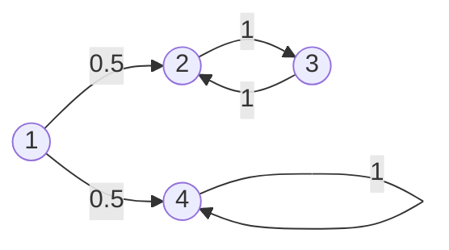

# Markov Processes I

The [Bernoulli process](38-bernoulli-process.md) and the [Poisson process](41-poisson-process.md) are memoryless: nothing that happened in the past changes the distribution of what happens next. Markov processes are the next step up in generality — the future *is* allowed to depend on the past, but only through the **current state**. That single idea is enough to model systems that evolve with persistence: queues, inventories, and — the application this course cares about — [market regimes](../../part-01-foundations/06-market-regimes.md), where calm and turbulent periods each tend to persist.

This page builds the machinery in two stages. First, ordinary Markov chains, where the state is observed: the Markov property, transition matrices, $n$-step transition probabilities, and the classification of states. Second, **Hidden Markov Models (HMMs)**, where the chain itself is *not* observed and must be inferred from noisy emissions — the exact situation of regime detection, where the market's state is hidden and all we see are returns. This page covers the HMM definition, the forward algorithm, and filtering; [Markov Processes II](43-markov-processes-2.md) covers steady-state behavior, smoothing, decoding, and parameter estimation.

## Checkout Counter

Consider a supermarket checkout counter. Chop time into small slots and suppose that during each slot, independently of everything else:

- a new customer joins the queue with probability $p$;
- if the queue is nonempty, the customer being served finishes and leaves with probability $q$.

Let $X_n$ be the number of customers in the queue at the start of slot $n$, and cap the queue at $10$ (arrivals are turned away when the queue is full). For an interior state $1\le i\le 9$, one slot later the queue has

- grown by one if there was an arrival and no departure: probability $p(1-q)$;
- shrunk by one if there was a departure and no arrival: probability $q(1-p)$;
- stayed the same otherwise: probability $pq+(1-p)(1-q)$.

At the boundaries, the queue can only grow from $0$ (probability $p$) and only shrink from $10$ (probability $q$).

```mermaid
flowchart LR
    S0((0)) -->|"p"| S1((1))
    S1 -->|"q(1-p)"| S0
    S1 -->|"p(1-q)"| S2((2))
    S2 -->|"q(1-p)"| S1
    S2 -->|"p(1-q)"| Sd(("&#8943;"))
    Sd -->|"q(1-p)"| S2
    Sd -->|"p(1-q)"| S10((10))
    S10 -->|"q"| Sd
```

Self-transitions are omitted from the diagram; each state keeps whatever probability is left over.

The crucial modeling fact: to predict the queue length one slot from now, the *current* queue length is all that matters. How the queue got to length $5$ — a burst of arrivals a minute ago, or a slow accumulation over an hour — is irrelevant. That is the Markov property, and everything below formalizes it.

## Definition

### Discrete-Time Finite State Markov Chains

A **discrete-time finite-state Markov chain** consists of:

- a finite **state space** $S=\{1,2,\ldots,m\}$;
- a sequence of random variables $X_0,X_1,X_2,\ldots$ taking values in $S$, where $X_n$ is the state after $n$ **transitions**;
- **transition probabilities** $p_{ij}$, the probability of moving to state $j$ given that the current state is $i$.

We assume the chain is **time-homogeneous**: $p_{ij}$ does not depend on $n$. The transition probabilities are collected in the $m\times m$ **transition matrix** $P=[p_{ij}]$, whose rows are probability distributions:

$$p_{ij}\ge 0,\qquad \sum_{j=1}^{m}p_{ij}=1\quad\text{for every }i.$$

A matrix with these two properties is called **row-stochastic**. Together with an **initial distribution** $\pi_0$, where $\pi_0(i)=\mathbf{P}(X_0=i)$, the transition matrix completely determines the probability of any finite trajectory:

$$\mathbf{P}(X_0=i_0,X_1=i_1,\ldots,X_n=i_n)=\pi_0(i_0)\,p_{i_0i_1}\,p_{i_1i_2}\cdots p_{i_{n-1}i_n}.$$

??? note "Proof"
    By the [multiplication rule](08-definition-conditional.md),

    $$\begin{align}
    \mathbf{P}(X_0=i_0,\ldots,X_n=i_n)
    &=\mathbf{P}(X_0=i_0)\prod_{k=1}^{n}\mathbf{P}(X_k=i_k\mid X_{k-1}=i_{k-1},\ldots,X_0=i_0)\\
    &=\pi_0(i_0)\prod_{k=1}^{n}p_{i_{k-1}i_k},
    \end{align}$$

    where the second equality applies the Markov property to each conditional factor.

### Markov Property

Given the current state, the past doesn't matter:

$$\begin{align}
p_{ij}&=\mathbf{P}(X_{n+1}=j\mid X_n=i)\\
&=\mathbf{P}(X_{n+1}=j\mid X_n=i,X_{n-1},\ldots,X_0).
\end{align}$$

Read this carefully — it does *not* say the future is independent of the past. $X_{n+1}$ and $X_{n-1}$ are in general strongly dependent. It says the dependence is entirely *mediated by the present*: once you condition on $X_n$, the earlier history carries no additional information about the future.

!!! note "The Markov property is a modeling choice, not a law of nature"
    Whether a process "is Markov" depends on what you call the state. If tomorrow's queue depended on both today's length and yesterday's, the process $X_n=(\text{today's length})$ would not be Markov — but the augmented process $\tilde X_n=(\text{today's length},\text{yesterday's length})$ would be. The art of Markov modeling is choosing a state rich enough to absorb all the relevant history. This is exactly the move behind regime models: raw returns are not Markov in any useful way, so we *posit* a small hidden state (the regime) that is.

## $n$-Step Transition Probabilities

Let

$$r_{ij}(n)=\mathbf{P}(X_n=j\mid X_0=i)$$

be the probability of being in state $j$ exactly $n$ transitions after starting in state $i$. By time-homogeneity this is also $\mathbf{P}(X_{s+n}=j\mid X_s=i)$ for any $s$. These satisfy the **Chapman–Kolmogorov recursion**: for $n\ge 2$,

$$r_{ij}(n)=\sum_{k=1}^{m}r_{ik}(n-1)\,p_{kj},\qquad r_{ij}(1)=p_{ij}.$$

??? note "Proof"
    Condition on the state after $n-1$ transitions. By the total probability theorem,

    $$\begin{align}
    r_{ij}(n)&=\mathbf{P}(X_n=j\mid X_0=i)\\
    &=\sum_{k=1}^{m}\mathbf{P}(X_{n-1}=k\mid X_0=i)\,\mathbf{P}(X_n=j\mid X_{n-1}=k,X_0=i)\\
    &=\sum_{k=1}^{m}r_{ik}(n-1)\,p_{kj},
    \end{align}$$

    where the last step uses the Markov property to drop the conditioning on $X_0$.

In matrix form the recursion says the matrix $[r_{ij}(n)]$ equals $P^n$: $n$-step transition probabilities are entries of the $n$-th power of the transition matrix. More generally, splitting a path of length $n+s$ at time $n$ gives the general Chapman–Kolmogorov equation

$$r_{ij}(n+s)=\sum_{k=1}^{m}r_{ik}(n)\,r_{kj}(s).$$

### A Two-State Chain, Solved Exactly

The two-state chain is worth solving in closed form because it is the skeleton of every calm/turbulent regime model. Let $S=\{1,2\}$ and

$$P=\begin{pmatrix}1-a & a\\ b & 1-b\end{pmatrix},\qquad 0<a,b<1,$$

so $a$ is the probability of leaving state $1$ and $b$ the probability of leaving state $2$. Then

$$r_{11}(n)=\frac{b}{a+b}+\frac{a}{a+b}\,(1-a-b)^n,\qquad
r_{21}(n)=\frac{b}{a+b}-\frac{b}{a+b}\,(1-a-b)^n.$$

??? note "Proof"
    Using the recursion with $r_{12}(n-1)=1-r_{11}(n-1)$,

    $$\begin{align}
    r_{11}(n)&=r_{11}(n-1)(1-a)+r_{12}(n-1)\,b\\
    &=r_{11}(n-1)(1-a)+\bigl(1-r_{11}(n-1)\bigr)b\\
    &=b+(1-a-b)\,r_{11}(n-1).
    \end{align}$$

    This is a linear first-order recursion. Its fixed point $x^{*}$ satisfies $x^{*}=b+(1-a-b)x^{*}$, giving $x^{*}=\frac{b}{a+b}$. The deviation $d_n=r_{11}(n)-x^{*}$ then satisfies $d_n=(1-a-b)\,d_{n-1}$, so $d_n=(1-a-b)^n d_0$ with $d_0=r_{11}(0)-x^{*}=1-\frac{b}{a+b}=\frac{a}{a+b}$. The formula for $r_{21}(n)$ follows the same way from $d_0=0-\frac{b}{a+b}$.

Two observations that anticipate everything in [Markov Processes II](43-markov-processes-2.md):

1. **Convergence.** Since $|1-a-b|<1$, both $r_{11}(n)$ and $r_{21}(n)$ converge to the *same* limit $\frac{b}{a+b}$: after many transitions, the probability of being in state $1$ no longer depends on where the chain started. This limit is the **steady-state probability** of state $1$.
2. **Speed.** The initial condition is forgotten geometrically at rate $|1-a-b|^n$. For persistent regimes this is slow: with $a=b=0.02$, we get $1-a-b=0.96$, and the memory of the starting state halves only every $\ln 2/\ln(1/0.96)\approx 17$ steps. Persistence is precisely what makes the current regime worth estimating — the state you infer today still says a lot about next week.

## Recurrent and Transient States

Say that state $j$ is **accessible** from state $i$ if $r_{ij}(n)>0$ for some $n\ge 0$, and write $A(i)$ for the set of states accessible from $i$ (note $i\in A(i)$ always).

- State $i$ is **recurrent** if every state it can reach can reach it back: for every $j\in A(i)$, we have $i\in A(j)$. Starting from a recurrent state, the chain returns to it with probability $1$, and therefore returns infinitely often.
- State $i$ is **transient** otherwise: some $j\in A(i)$ offers no path back to $i$. Each visit to $i$ carries a fixed positive probability of escaping down such a path forever, so with probability $1$ the chain visits $i$ only finitely many times.

If $i$ is recurrent, the set $A(i)$ is called a **recurrent class**: all of its states are recurrent, they are all accessible from one another, and no state outside $A(i)$ is accessible from inside it — once the chain enters a recurrent class, it never leaves. This yields the **decomposition theorem**: the state space of a finite Markov chain splits into one or more disjoint recurrent classes plus a (possibly empty) set of transient states. Starting anywhere, the chain spends a finite initial stretch among transient states and then enters some recurrent class, where it remains forever.

Here state $1$ is transient (once it leaves, it never returns), $\{2,3\}$ is a recurrent class, and $\{4\}$ is an **absorbing** recurrent class. Which class the chain ends up in is random — it depends on the first coin flip out of state $1$ — so when there are multiple recurrent classes, long-run behavior depends on the starting state.

One more definition is needed for the steady-state theory. A recurrent class is **periodic** if its states can be partitioned into $d\ge 2$ groups $S_1,\ldots,S_d$ such that every transition moves the chain from $S_k$ to $S_{k+1}$ (with $S_{d+1}=S_1$): the chain cycles through the groups deterministically, and $r_{ii}(n)>0$ only when $n$ is a multiple of $d$. Otherwise the class is **aperiodic**. A convenient sufficient condition: if any state in the class has a self-transition ($p_{ii}>0$), the class is aperiodic.

!!! note "Why a trader should care about this taxonomy"
    An estimated regime transition matrix almost always has all entries strictly positive, which makes the whole state space a single aperiodic recurrent class — the "nice" case in which a unique steady state exists ([Markov Processes II](43-markov-processes-2.md)). But the taxonomy also diagnoses pathological fits: an estimated chain with a near-absorbing state ($p_{ii}\approx 1$, all exit probabilities $\approx 0$) is claiming a regime the market enters and never leaves, which usually signals an overfit or degenerate model rather than a discovery.

## Hidden Markov Models

In the checkout counter, the state is observable — you can count the queue. In the regime problem, it is not. Nobody publishes today's regime; we see returns, which are noisy *emissions* from whatever state the market occupies. The formal object for this situation is the Hidden Markov Model.

### Definition

A **Hidden Markov Model** consists of two coupled processes:

- a **hidden state chain** $X_0,X_1,\ldots,X_T$: a Markov chain on $S=\{1,\ldots,m\}$ with transition matrix $P=[p_{ij}]$ and initial distribution $\pi_0$, exactly as above — except that $X_n$ is never observed;
- an **observation process** $Y_0,Y_1,\ldots,Y_T$: at each time $n$, the current state emits an observation drawn from a state-specific **emission distribution** with density (or PMF) $f_i(y)$ when $X_n=i$.

The coupling assumption: *conditioned on the entire hidden path, the observations are independent, and each depends only on the concurrent state*:

$$p(y_0,y_1,\ldots,y_T\mid x_0,x_1,\ldots,x_T)=\prod_{n=0}^{T}f_{x_n}(y_n).$$

The model is parameterized by $\lambda=(\pi_0,P,\{f_i\})$. For regime detection on returns, the standard choice is **Gaussian emissions**: state $i$ generates returns from a [normal distribution](28-gaussian-distribution.md) with state-specific mean and variance,

$$f_i(y)=\frac{1}{\sqrt{2\pi\sigma_i^2}}\exp\!\left(-\frac{(y-\mu_i)^2}{2\sigma_i^2}\right).$$

A two-state Gaussian HMM already captures the essential regime phenomenology: a persistent low-volatility state and a persistent high-volatility state, each with its own mean return.

```mermaid
flowchart LR
    X0(("X&#8320;")) --> X1(("X&#8321;")) --> X2(("X&#8322;")) --> Xd["&#8943;"]
    X0 --> Y0(["Y&#8320;"])
    X1 --> Y1(["Y&#8321;"])
    X2 --> Y2(["Y&#8322;"])
```

The dependency structure: the hidden chain (circles) evolves on its own; each observation (rounded boxes) hangs off its state. All statistical dependence between observations at different times flows *through* the hidden chain — that is what makes the computations below tractable.

### The Joint Likelihood

Combining the trajectory formula for the chain with the emission factorization gives the complete joint density of states and observations:

$$p(x_{0:T},y_{0:T})=\pi_0(x_0)\,f_{x_0}(y_0)\prod_{n=1}^{T}p_{x_{n-1}x_n}\,f_{x_n}(y_n),$$

where $x_{0:T}$ abbreviates $(x_0,\ldots,x_T)$. Every HMM computation is some manipulation of this one expression: summing it over paths, maximizing it over paths, or maximizing its expectation over parameters.

### The Three Computational Problems

| Problem | Question | Algorithm | Covered in |
|---|---|---|---|
| Evaluation | What is the likelihood $p(y_{0:T};\lambda)$ of the observed data? | Forward algorithm | this page |
| Inference | Which state is the chain in? — filtered $\mathbf{P}(X_n=i\mid y_{0:n})$, smoothed $\mathbf{P}(X_n=i\mid y_{0:T})$, and the most likely path | Forward (filtering); forward–backward (smoothing); Viterbi (best path) | filtering here; the rest in [Part II](43-markov-processes-2.md) |
| Learning | Which parameters $\lambda=(\pi_0,P,\{f_i\})$ best explain the data? | Baum–Welch (EM) | [Part II](43-markov-processes-2.md) |

### The Forward Algorithm

The evaluation problem looks innocent: to get $p(y_{0:T})$, just sum the joint likelihood over all hidden paths,

$$p(y_{0:T})=\sum_{x_0=1}^{m}\cdots\sum_{x_T=1}^{m}\pi_0(x_0)\,f_{x_0}(y_0)\prod_{n=1}^{T}p_{x_{n-1}x_n}\,f_{x_n}(y_n).$$

But there are $m^{T+1}$ paths. For a modest three-state model on one year of daily returns ($m=3$, $T=251$), that is $3^{252}\approx 10^{120}$ terms — the sum is unusable as written. The forward algorithm computes it exactly in $O(m^2T)$ operations by pushing the sums inside the product.

Define the **forward variable**

$$\alpha_n(i)=p(y_{0:n},X_n=i),$$

the joint density of the observations up to time $n$ *and* the event that the chain is currently in state $i$. It satisfies:

**Initialization.**

$$\alpha_0(i)=\pi_0(i)\,f_i(y_0),\qquad i=1,\ldots,m.$$

**Recursion.** For $n=0,1,\ldots,T-1$,

$$\alpha_{n+1}(j)=\left[\sum_{i=1}^{m}\alpha_n(i)\,p_{ij}\right]f_j(y_{n+1}),\qquad j=1,\ldots,m.$$

**Termination.**

$$p(y_{0:T})=\sum_{i=1}^{m}\alpha_T(i).$$

??? note "Proof of the recursion"
    Two conditional-independence facts follow from the joint likelihood by summing out the unwanted variables: given $X_n=i$, the next state is independent of the observation history, $\mathbf{P}(X_{n+1}=j\mid X_n=i,\,y_{0:n})=p_{ij}$; and given $X_{n+1}=j$, the new observation is independent of everything earlier, $p(y_{n+1}\mid X_{n+1}=j,\,X_n=i,\,y_{0:n})=f_j(y_{n+1})$. Then, decomposing over the state at time $n$,

    $$\begin{align}
    \alpha_{n+1}(j)&=p(y_{0:n+1},X_{n+1}=j)\\
    &=\sum_{i=1}^{m}p(y_{0:n},X_n=i,X_{n+1}=j,y_{n+1})\\
    &=\sum_{i=1}^{m}p(y_{0:n},X_n=i)\;\mathbf{P}(X_{n+1}=j\mid X_n=i,y_{0:n})\;p(y_{n+1}\mid X_{n+1}=j,X_n=i,y_{0:n})\\
    &=\sum_{i=1}^{m}\alpha_n(i)\,p_{ij}\,f_j(y_{n+1})\\
    &=\left[\sum_{i=1}^{m}\alpha_n(i)\,p_{ij}\right]f_j(y_{n+1}).
    \end{align}$$

    The termination formula is the total probability theorem: $p(y_{0:T})=\sum_i p(y_{0:T},X_T=i)=\sum_i\alpha_T(i)$.

Each time step costs $m$ multiplications for each of $m$ states, so the full pass is $O(m^2T)$: for the three-state, one-year example, a few thousand multiplications instead of $10^{120}$ terms. The structural reason this works is the Markov property itself — $\alpha_n$ is a *sufficient summary* of the entire history $y_{0:n}$ for everything the future can ask, so the computation never needs to look back.

### Filtering: Which State Is the Chain in Now?

The forward variables deliver, as a free by-product, the answer to the question the regime lesson actually poses in real time. By the definition of conditional probability,

$$\mathbf{P}(X_n=i\mid y_{0:n})=\frac{p(y_{0:n},X_n=i)}{p(y_{0:n})}=\frac{\alpha_n(i)}{\sum_{j=1}^{m}\alpha_n(j)}.$$

This is the **filtered state probability**: the posterior distribution over the current hidden state given all data observed *so far*. Unwinding one step of the recursion shows that filtering is exactly sequential [Bayesian inference](32-bayesian-inference-framework.md):

$$\underbrace{\mathbf{P}(X_{n+1}=j\mid y_{0:n})}_{\text{predict: propagate through }P}=\sum_{i=1}^{m}\mathbf{P}(X_n=i\mid y_{0:n})\,p_{ij},$$

$$\underbrace{\mathbf{P}(X_{n+1}=j\mid y_{0:n+1})}_{\text{update: reweight by the new data}}\propto\mathbf{P}(X_{n+1}=j\mid y_{0:n})\,f_j(y_{n+1}).$$

Each day: push yesterday's posterior through the transition matrix (the *prior* for today), multiply by the likelihood of today's observation under each state, normalize. This predict–update cycle runs in $O(m^2)$ per new observation, making it directly usable in a live trading system.

!!! note "Filtering is the tradeable quantity"
    $\mathbf{P}(X_n=i\mid y_{0:n})$ uses only information available at time $n$ — it can drive a real-time decision without lookahead. Its retrospective cousin, the *smoothed* probability $\mathbf{P}(X_n=i\mid y_{0:T})$, uses the whole sample including the future, and is therefore for historical analysis only. The distinction, and the backward recursion that computes the smoothed version, are developed in [Markov Processes II](43-markov-processes-2.md) — confusing the two is a classic source of lookahead bias in regime-switching backtests.

## Where This Goes Next

Three questions remain open. Where does the chain settle in the long run — the steady-state probabilities previewed by the two-state example? How do we infer the hidden states *retrospectively*, both pointwise (smoothing) and as a single best path (Viterbi)? And where do the parameters $\lambda=(\pi_0,P,\{\mu_i,\sigma_i^2\})$ come from in the first place (Baum–Welch)? All three are taken up in [Markov Processes II](43-markov-processes-2.md), and the machinery is applied to real return data in [Bayesian Methods and Hidden Markov Models](../../part-03-statistics/06-bayesian-methods-and-hmms.md).
