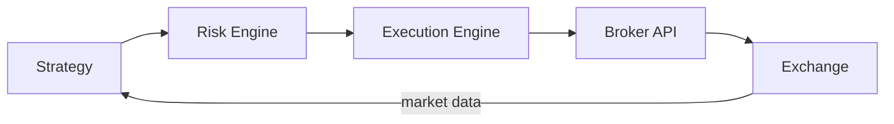

# What Is Algorithmic Trading?

Ask ten people what algorithmic trading is and you will get some mixture of "computers trading at light speed," "AI predicting the market," and "bots." All three miss the point. Algorithmic trading is not primarily about speed, prediction, or automation. It is about *process*: making trading decisions through explicit, testable rules rather than in-the-moment judgment. The computer is incidental — a systematic strategy executed by hand off a spreadsheet is still systematic, and a human clicking buy on gut feel through a fancy terminal is still discretionary. What separates a professional quantitative operation from a hobbyist is not the codebase. It is that every decision the system makes was specified, tested, and risk-limited before the market ever saw it.

This lesson draws the map: the kinds of trading that exist, how a professional operation is organized, and — most importantly — what it actually means to have an edge.

## Systematic, discretionary, and the gray zone

There are three broad modes of trading, and the boundaries matter more than the labels.

**Discretionary trading** means a human makes each trade decision. The trader may use quantitative inputs — screens, models, dashboards — but the final call is judgment. Most of the money in global markets is still run this way.

**Systematic trading** means rules make the decisions. Entry, exit, and position size are functions of data, specified in advance. Humans design, validate, and supervise the system; they do not override individual trades. When a systematic trader intervenes, it is at the level of the *system* — turning a strategy off, cutting its capital — not at the level of a single position.

**Automated-discretionary trading** sits between. A human decides *what* to do — "buy two million shares of this name over the day" — and machines decide *how*: slicing the order, timing child orders, choosing venues. Nearly every institutional desk works this way today; execution algorithms handle the mechanics of decisions humans still make.

"Algorithmic," then, implies a defined process. It does not imply high frequency — many fully systematic funds hold positions for months. It does not imply machine learning — plenty of profitable systems are linear regressions or simpler. And it does not imply the absence of humans. It implies that human intelligence was applied *before* the trade, where it can be tested, rather than during the trade, where it cannot.

## Anatomy of a professional operation

Professional quantitative firms converge on the same functional structure, because each function exists to catch a specific class of failure.

**Research** generates hypotheses: candidate sources of return, expressed precisely enough to test. Its failure mode is producing noise dressed as signal.

**Validation** exists precisely because of that failure mode. Backtesting, out-of-sample testing, and independent review sit between an idea and capital. At serious firms, the person who found the signal is not the final judge of whether it is real — researchers grading their own homework is how firms blow up slowly.

**Execution** converts target positions into actual fills. A strategy that earns 8% a year before costs and pays 9% in spread, impact, and fees is not a strategy; it is a donation. Execution research — how to trade, not what to trade — is a discipline in its own right.

**Risk** operates independently of the strategies it constrains. Position limits, exposure limits, drawdown triggers, kill switches. The premise is blunt: every strategy will eventually behave in a way its designer did not anticipate, and something outside the strategy must be empowered to stop it.

**Operations** keeps the machine honest: data pipelines, position reconciliation against the broker, monitoring, incident response. Unglamorous, and the source of a remarkable fraction of real-world losses. A strategy that is right about the market but wrong about its own positions is still wrong.

Solo traders do not escape this structure — they just hold all five jobs at once, and the ones they neglect are where they get hurt.

## What an edge actually is

An edge is a positive expected return, after all costs, arising from an identifiable mechanism. That last clause is the professional's filter. "It backtests well" is not a mechanism. If you cannot say *who* is on the losing side and *why they keep showing up*, you should assume you have found noise. Edges come in four broad flavors.

**Statistical** edges are persistent patterns in returns exploitable through diversification and repetition. Example: cross-sectional momentum — stocks that outperformed over the past year tend, on average, to keep outperforming over the next few months. The per-name effect is weak; applied across a thousand names it becomes a portfolio.

**Structural** edges come from market mechanics and rules. Example: index rebalancing. When a stock is added to a major index, passive funds *must* buy it near the effective close, largely irrespective of price. Traders who position ahead of that mandated, predictable flow are paid by a counterparty whose rules forbid patience.

**Informational** edges come from knowing something earlier or measuring it better. Example: parsing satellite imagery of retailer parking lots to estimate quarterly sales before earnings. Legal informational edges are expensive to build and decay quickly once the data becomes a product anyone can buy.

**Behavioral** edges come from systematic mistakes by other participants. Example: post-earnings-announcement drift — prices continue moving in the direction of an earnings surprise for weeks, because investors update too slowly. The counterparty is human psychology, which has proven durably slow to patch.

Two properties hold for every edge: it has a counterparty, and it decays. Someone is transferring money to you, and either they eventually stop or competitors compete the transfer away. Edge is a perishable inventory, which is why research is a continuous function, not a phase.

## The pipeline you will build

Every live systematic operation, from a two-person shop to a major fund, reduces to the same pipeline: a strategy proposes trades, a risk engine vetoes or resizes them, an execution engine works them into the market, and a broker interface carries them to the exchange — with market data flowing back to close the loop.

Note the ordering. Risk sits *between* strategy and execution — no order reaches the market without passing it. That placement is a design decision you will implement yourself, not just read about.

!!! note "You will build this"
    This exact pipeline — strategy, risk engine, execution engine, broker API — is what you will construct, component by component, in [Part VI: Live Trading Infrastructure](../part-06-live-infrastructure/index.md). Everything before then builds the judgment needed to fill in each box responsibly.

!!! abstract "Key takeaways"
    - Algorithmic trading is defined by explicit, pre-specified, testable decision rules — not by speed, machine learning, or the absence of humans.
    - Systematic traders intervene at the level of the system, never the individual trade; automated-discretionary desks automate the *how* while humans decide the *what*.
    - Professional operations separate research, validation, execution, risk, and operations because each function exists to catch a distinct failure mode.
    - An edge is positive expected return after costs with an identifiable mechanism — statistical, structural, informational, or behavioral.
    - Every edge has a counterparty and a decay path; if you cannot name who loses and why they persist, assume you found noise.
    - The core production pipeline is Strategy → Risk → Execution → Broker → Exchange, with risk deliberately placed before the market.

## Where this goes next

Every edge has a counterparty — so the obvious next question is: who, exactly, is out there? [Lesson 2](02-types-of-market-participants.md) surveys the market's cast of characters, what each of them wants, and why some of them are willing, even happy, to take the losing side of your trades.
