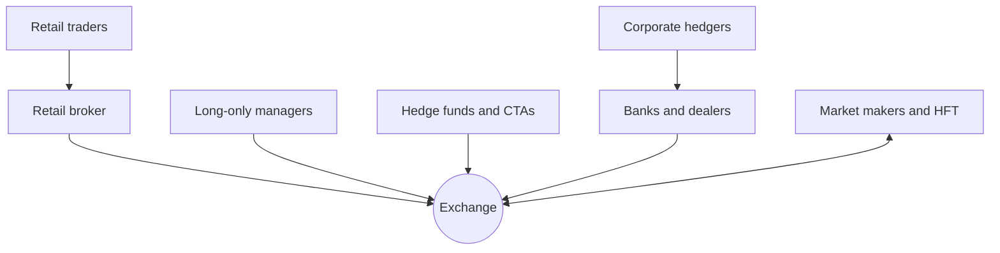

# Types of Market Participants

Every fill has a counterparty. When your buy order executes, someone sold to you at that exact price and moment — and they had reasons. Retail traders rarely think about who that someone is. Professionals think about little else, because the identity and motives of your counterparty determine whether your fill was a gift or a trap. A market is not an abstraction that pays you for being right; it is a specific set of institutions and people, each optimizing something, and your profit is always a line item in someone else's accounting. This lesson introduces the cast.

## The cast of characters

**Market makers** quote two-sided prices — a bid and an ask — continuously, aiming to buy at the bid, sell at the ask, and capture the spread while holding inventory as briefly as possible. Their business is volume times spread minus adverse selection. On many venues they hold formal obligations (and receive rebates or fee discounts) for maintaining quotes.

**High-frequency trading firms** are defined by speed rather than by a single strategy. Many act as market makers; others run latency arbitrage — reacting to a price change on one venue before slower participants' quotes on another venue adjust — or short-horizon statistical signals. Holding periods run from microseconds to minutes. HFT is a *speed class*; market making is a *role*; the overlap is large but not total.

**Hedge funds and CTAs** run absolute-return strategies with leverage and shorting: equity long/short, statistical arbitrage, global macro, and managed-futures trend following (the CTA staple). Horizons range from days to quarters. These firms are, broadly, your direct competition — the participants explicitly hunting the same edges you are.

**Long-only asset managers** — mutual funds, index funds, pension managers — control the largest pool of capital. Their objective is exposure and benchmark tracking, not per-trade profit. An index fund buying a rebalanced constituent at the close does not care that it is paying up; its mandate measures tracking error, not execution alpha.

**Banks and dealers** intermediate: they make markets in bonds, FX, and derivatives, facilitate client flow, and run financing businesses (prime brokerage, securities lending). Post-2008 regulation pushed them from proprietary risk-taking toward flow intermediation — they earn the toll, mostly, rather than the bet.

**Corporate hedgers** use markets to shed risk from real operations: an airline locking in jet fuel, an exporter selling forward foreign revenue, a farmer selling futures on an unharvested crop. They are structurally willing to pay — hedging is insurance, and insurance has a premium.

**Retail traders** are individuals trading their own accounts. Individually small, collectively significant — and, in aggregate, a persistent source of predictable flow: momentum-chasing, lottery-like option buying, and panic selling near lows.

| Participant | Primary objective | Typical horizon |
|---|---|---|
| Market makers | Capture spread, minimize inventory risk | Seconds to minutes |
| HFT firms | Speed-based capture of tiny, reliable edges | Microseconds to minutes |
| Hedge funds / CTAs | Absolute return from identified edges | Days to quarters |
| Long-only managers | Exposure, benchmark tracking | Months to decades |
| Banks / dealers | Intermediation fees, client flow | Varies; risk held briefly |
| Corporate hedgers | Risk reduction for a real business | Contract horizon |
| Retail | Returns, entertainment, conviction | Minutes to years |

## Liquidity providers and liquidity takers

Cut the cast a different way and there are only two sides: those who post resting orders and wait (**liquidity providers**), and those who cross the spread to trade *now* (**liquidity takers**).

The economics are symmetric and unforgiving. Suppose a stock is bid \$99.98, offered \$100.00. A taker who buys pays \$100.00 against a mid of \$99.99 — one cent of cost per share, the price of immediacy. The maker who sold earns that cent *if* the price stays put. The spread is therefore a fee flowing from the impatient to the patient. Many venues reinforce this with maker-taker pricing: rebates for resting orders that fill, fees for orders that take.

The catch — developed properly in the next lesson — is that the maker's cent is not free. Resting orders get filled most eagerly by counterparties who know something. The provider earns the spread from uninformed flow and pays out to informed flow; the taker pays the spread but chooses the moment. Every strategy you ever run will live somewhere on this provider–taker axis, and its cost model depends entirely on where.

## Who is on the other side, and why might they be willing to lose?

Here is the question that separates professional strategy design from curve-fitting: *who is on the other side of my trade, and why might they be willing — or forced — to lose?*

Relative to fair value, trading is zero-sum: your positive expectation is someone else's negative expectation. That sounds damning until you notice that many participants are not playing your game. The hedger is buying insurance. The index fund is buying tracking. The retail option buyer is buying a lottery ticket. The dealer unwinding inventory is buying sleep. All of them rationally accept negative trading expectation in exchange for something they value more — and their acceptance is the revenue line of every durable strategy.

Every strategy family, examined honestly, is a transfer from an identifiable payer:

- **Market making** transfers from impatient takers, who pay the spread for immediacy.
- **Trend following** has historically transferred from hedgers and mechanical rebalancers, who trade against trends by construction.
- **Statistical arbitrage** transfers from noise traders and from institutional flows that push prices off fair value for non-informational reasons.
- **Index-rebalance strategies** transfer from passive mandates that must trade at known times regardless of price.
- **Volatility selling** transfers from buyers of insurance and lottery tickets — until the insured event occurs.

If you cannot complete the sentence "this strategy makes money because ______ is systematically willing to pay for ______," you do not yet have a strategy. You have a backtest.

## The map

The flows tie together around the venue itself. Market makers and HFT firms stand at the exchange continuously, quoting both sides; everyone else arrives episodically and mostly takes.

Read the arrows as order flow. The double-headed arrow is the tell: market makers and HFT firms are *always there*, absorbing whatever the episodic participants bring — for a price.

!!! abstract "Key takeaways"
    - Markets are populated by specific institutions with specific objectives; your counterparty's motive determines whether your fill is favorable.
    - Market making is a role, HFT is a speed class; hedge funds and CTAs are your direct competition for edges.
    - Liquidity takers pay the spread for immediacy; liquidity providers earn it, net of losses to better-informed counterparties.
    - Many large participants — hedgers, index funds, retail — rationally accept negative trading expectation because they are buying insurance, tracking, or entertainment.
    - Every durable strategy is a transfer from an identifiable payer; if you cannot name the payer and their reason, you have a backtest, not an edge.

## Where this goes next

You now know who is trading. Next you need to know *how* their intentions collide: the limit order book, order types, matching engines, and the adverse-selection logic that governs every fill. That machinery — and the first course deliverable, the order-flow diagram — is [Lesson 3](03-market-microstructure.md).
