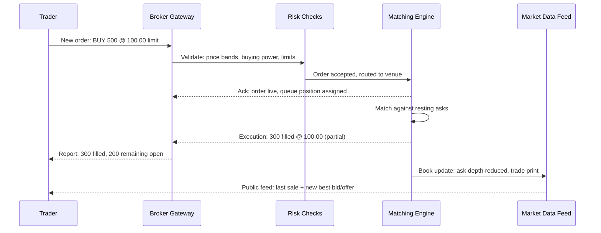

# Market Microstructure

Prices do not move because of some abstract force of supply and demand. They move because specific orders arrive at a specific data structure — the limit order book — and a matching engine processes them in a specific sequence. Microstructure is the study of that machinery, and it is where trading intuition either gets built or gets faked. A researcher who understands the book knows why their backtest's assumed fills are optimistic, why their limit orders fill exactly when they wish they hadn't, and why "the spread" is the most honest price in finance. This lesson builds that understanding and distills it into the first of the course's key diagrams: the order-flow diagram.

## The limit order book

At any moment, a venue's order book for a symbol is two sorted queues of resting limit orders: **bids** (offers to buy, sorted by price descending) and **asks** (offers to sell, sorted ascending). Here is a stylized book:

| Bid size | Bid price | Ask price | Ask size |
|---:|---:|---:|---:|
| 1,200 | 99.98 | 100.00 | 900 |
| 2,500 | 99.97 | 100.01 | 1,800 |
| 3,100 | 99.96 | 100.02 | 2,600 |
| 1,800 | 99.95 | 100.03 | 3,400 |
| 4,000 | 99.94 | 100.04 | 2,900 |

The highest bid (\$99.98) and lowest ask (\$100.00) form the **best bid and offer**; the gap between them is the **spread** (2 cents here); their average is the **mid** (\$99.99). The sizes at each level are **depth** — how much can trade at each price before the book moves. A 10,000-share market buy here would sweep through \$100.00, \$100.01, \$100.02, and into \$100.03: the average fill degrades with size. That degradation, not the quoted spread, is the real cost of trading size, and no price chart shows it.

Within each price level, orders queue by arrival time: **price-time priority**. Better prices trade first; at the same price, first-come-first-served. Queue position is genuinely valuable — an order at the front of the \$99.98 bid gets filled by routine flow, while an order at the back gets filled mainly when the whole level is about to be run over. Sophisticated firms model queue position explicitly.

## Order types and what they signal

Order types are not interface conveniences; each one is a distinct bargain with the book, and each leaks information.

- **Market order** — trade immediately at whatever prices the book offers. You pay the spread (and beyond, for size) in exchange for certainty. Signals urgency, and urgency correlates with information — which is exactly why counterparties price it in.
- **Limit order** — rest at a stated price or better. You avoid paying the spread but accept two risks: non-execution (price runs away without filling you) and adverse selection (you fill precisely when someone informed wanted your price).
- **Stop order** — dormant until price touches a trigger, then becomes a market (or limit) order. Stops demand liquidity at the worst possible moment — when price is already moving — and clustered stops at obvious levels are visible fuel for short bursts of momentum.
- **IOC (immediate-or-cancel)** — execute whatever is available now, cancel the rest. Never rests. The workhorse of smart order routers probing multiple venues.
- **FOK (fill-or-kill)** — execute the entire quantity immediately or nothing. Used when a partial position is worse than none.
- **Iceberg** — display only a slice of the true size, replenishing as slices fill. Hides intent, but imperfectly: repeated refills at one price are a detectable signature, and detection algorithms hunt for exactly that.

## The matching engine and the auctions

The **matching engine** is the venue's core: a deterministic program that processes incoming messages — new orders, cancels, modifications — strictly one at a time, in arrival order, against the book. Determinism is the point. Given the same message sequence, the engine produces the same trades, always. There is no negotiation and no simultaneity; "my order and yours arrived at the same time" is not a sentence a matching engine understands.

Continuous matching is bookended by **auctions**. Before the open and at the close, the venue accumulates orders and computes a single price that maximizes executable volume; all crossing orders trade at that one price. The **closing auction** matters most: index funds are benchmarked to the closing price, so they concentrate their mandatory trading there, making the close the deepest liquidity event of the day — routinely 5–10% of daily volume in large stocks, in a single print.

## Adverse selection: the spread is compensation, not friction

Novices treat the spread as friction — an annoying toll. It is better understood as an insurance premium, and the insurer is the market maker.

Consider a maker quoting a 2-cent spread, earning the half-spread $s/2$ = 1 cent whenever an *uninformed* trader crosses. But some fraction $p$ of arriving counterparties are *informed* — they trade because they know the price is about to move, and the maker's fill becomes an instant loss averaging $\ell$. The maker's expected profit per share is

$$
\mathbb{E}[\text{PnL}] = (1-p)\,\frac{s}{2} \;-\; p\,\ell ,
$$

which is only non-negative when the spread satisfies $s \ge 2p\ell/(1-p)$. This is the core insight of classical microstructure theory: **the spread is exactly the price at which providing liquidity to a partially informed crowd breaks even.** More informed flow or higher volatility (bigger $p$ or $\ell$) forces wider spreads — which is why spreads blow out around news, and why "tight spread" is a statement about how little the market fears the next arrival.

The implication for you is uncomfortable and essential: **when your limit order fills, ask why.** Fills are not random. Your resting bid executes most readily when someone with better information or a broader view of flow decided your price was worth hitting. Every backtest that assumes limit orders fill whenever price touches them is quietly assuming away adverse selection — and it is the single most common way paper profits vanish in production.

## The order-flow diagram

Here is the first of those key diagrams — the path of a single order through the system, including a partial fill and the broadcast back out. Study it until every arrow is obvious; several of these hops reappear when Part VI examines live trading architecture.

Two details deserve attention. First, risk checks sit *before* the matching engine — no order reaches the market unexamined, a structure you met in lesson 1 and will see again in Part VI. Second, there are two information paths back: the **private** execution report (only you learn your fill details immediately) and the **public** market data feed (everyone sees the trade print and the changed book). The gap between what you know privately and what the market knows publicly is measured in microseconds — and entire business models live inside it.

!!! abstract "Key takeaways"
    - The limit order book is two price-sorted queues; spread, depth, and price-time priority jointly determine what any trade actually costs.
    - Trading size sweeps multiple levels — average fill price degrades with quantity, a cost invisible on price charts.
    - Every order type is a bargain: market orders buy certainty with the spread, limit orders earn the spread but bear non-execution and adverse-selection risk.
    - Matching engines are deterministic and sequential; opening and closing auctions concentrate liquidity at single prices, with the close as the day's largest event.
    - The spread is the break-even premium for quoting against partially informed flow: $s \ge 2p\ell/(1-p)$ — compensation, not friction.
    - When your limit order fills, ask why; backtests that ignore adverse selection systematically overstate profits.

## Where this goes next

You now understand one venue's machinery. But no real market is one venue — it is a fragmented web of exchanges, ECNs, dark pools, and wholesalers, stitched together by regulation and routing. [Lesson 4](04-exchanges-brokers-ecns.md) maps that web and adds two more key diagrams: the market-structure diagram and the trade-lifecycle diagram.
